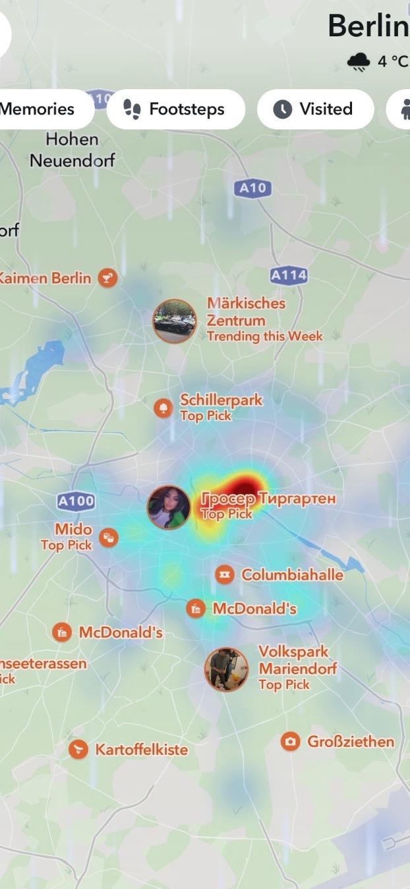
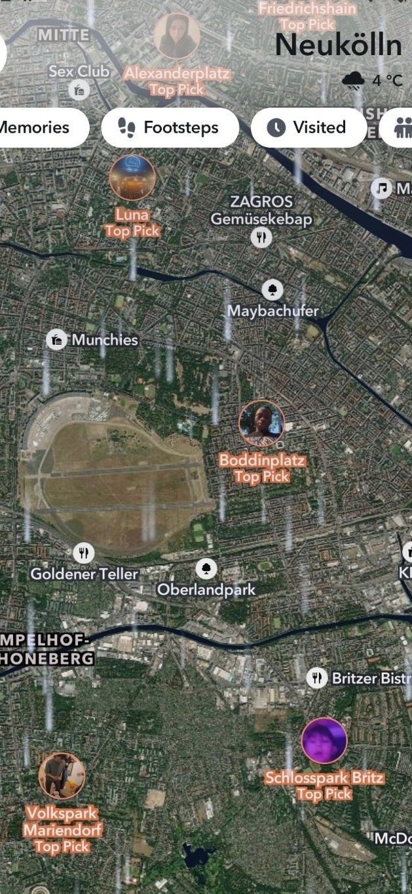

# Snap Map

## URL

[https://map.snapchat.com/](https://map.snapchat.com)

## Description

<figure><figcaption></figcaption></figure>

Snap Map is a feature within [Snapchat](https://www.snapchat.com/) that displays publicly shared Snaps on an interactive map. When a user posts a Story to "Our Story", Snapchat geotags that content so it appears as a hotspot on the map. The intensity of the hotspot reflects posting volume - warmer colours indicate higher activity. Clicking a hotspot opens the associated public Snaps for that location.

Snap Map is only accessible via the Snapchat mobile app. Visiting map.snapchat.com on desktop redirects to snapchat.com and does not load the map. Mobile version supports keyword search, zoom-based exploration, and browsing of user-generated photos and videos. Available layers include My Places, Footsteps (locations the user has previously visited), themed event views, and Promoted Places (commercially sponsored business locations). Investigators should be aware that Promoted Places hotspots appear alongside organic user content and can inflate apparent activity in commercial areas.

For open source research purposes, Snap Map is most useful for monitoring real-time situations - protests, natural disasters, armed conflict, or large public gatherings - by accessing short clips posted by people on the ground. It has been used by investigators and journalists to gather firsthand visual evidence from areas that are otherwise difficult to access, including during the [2023 conflict in Gaza](https://techcrunch.com/2023/11/03/snapchat-snap-map-israel-hamas-war-gaza-palestine/).

Each public Snap on the map is linked to the Snapchat account that posted it. Clicking through to a post allows investigators to view the poster's public profile, which may include their username, bio, and other publicly visible content - making Snap Map a useful entry point for human network investigations tied to a specific location.

Certain venues such as museums, universities, and restaurants are automatically surfaced on the map. Users can also create Geo Stories, allowing multiple people in the same area to contribute to a shared location-tagged story - these can be particularly valuable for monitoring localised events with multiple contributors.

### Comparison of Snap Map Views

The images below demonstrate two different visualization modes within Snap Map.

The left image shows the standard map view focused on Neukölln, Berlin. Individual public Snaps and curated "Top Picks" appear as location-based markers, allowing investigators to examine user-generated content at district level. The filter tabs visible at the top - Footsteps and Visited - reflect newer navigation layers tied to the user's own history rather than public content.

The right image shows the heatmap view at city scale. Activity is aggregated into colour-coded intensity zones, with the warmest area centred around Tiergarten. Location labels include both Top Pick and Trending this Week markers. Note that commercial locations such as McDonald's appear as Promoted Places alongside organic user content - investigators should factor this in when interpreting hotspot activity.

Together, the two views support both granular location analysis and broader pattern detection across a city.

<figure><figcaption>
Snap Map standard view showing individual public Snaps and “Top Picks” in Neukölln, a district of Berlin.
</figcaption></figure> <figure><figcaption>
Snap Map heatmap view illustrating overall user activity intensity across Berlin.
</figcaption></figure>

## How to use

1. Open Snap Map on the Snapchat app by tapping the map icon on the action bar.
2. Orient yourself using the heatmap view first - warmer colour clusters indicate areas of higher posting activity. This is useful for identifying where content is concentrated before zooming in.
3. Switch to standard view by zooming into an area of interest. Individual Snaps and location markers will appear, labelled as Top Picks, Trending this Week, or Geo Stories depending on the content type.
4. Filter by keyword using the search bar to narrow results to a specific event, place name, or topic. Note that there is no date or time filter - results reflect recent posts only.
5. Click on a hotspot to view the associated public Snaps for that location. Content appears as short photos or videos posted by users in or near that area.
6. Follow through to the poster's profile by tapping on an individual Snap. The public profile may include the username, bio, and other publicly visible posts - useful as a starting point for further account investigation.
7. Archive what you find immediately using a screenshot or a third-party archiving tool. Most Snaps disappear within 24 hours and there is no native export function.

### Cost

* [x] Free
* [ ] Partially Free
* [ ] Paid

## Level of difficulty

<table><thead><tr><th data-type="rating" data-max="5"></th></tr></thead><tbody><tr><td>2</td></tr></tbody></table>

## Requirements

* A Snapchat account with a verified email or phone number is required. There is no functional web or desktop version - map.snapchat.com redirects to snapchat.com on desktop browsers.

## Limitations

* **Data availability varies:** Content appears only where users have recently posted; rural or restricted areas may be sparse. Snap Map activity broadly reflects Snapchat's [overall user distribution](https://datareportal.com/essential-snapchat-stats), which is largest in India, the US, and parts of the Middle East and Europe.
* **Limited filtering:** Search is keyword-based only. There is no way to sort by date, time, or specific username unless you are friends with that user, making targeted searches difficult.
* **Temporary posts:** Snaps posted to Snap Map may be visible for [varying amounts of time](https://help.snapchat.com/hc/en-us/articles/7012271195796-How-do-I-submit-a-Snap-to-Snap-Map) - from a day or two to potentially much longer. There is no guarantee content will still be available when you return to it. Archive anything relevant immediately.
* **Commercial content mixed with organic posts:** Promoted Places surfaces brand locations and sponsored content directly on the map alongside user-generated Snaps, which can distort activity signals in commercial areas.
* **Possible inaccuracies:** User-generated posts may carry incorrect or spoofed location tags, and content may lack sufficient context to allow researchers to verify the location independently.
* **No built-in archive:** There is no native export or save function. Investigators should capture references - screenshots, URLs, or use of a third-party archiving tool - while viewing, as content may disappear within hours.
* **Country availability:** Snap Map may be restricted in [certain jurisdictions](https://www.aljazeera.com/news/2025/12/5/russia-continues-tech-crackdown-by-blocking-snapchat-facetime-access) and availability is subject to change.

## Similar Tools

The following tools also allow investigators to discover and analyse user-generated, location-tagged content across other platforms:

* [**Instagram Location Search**](https://bellingcat.gitbook.io/toolkit/more/all-tools/instagram-location-search) - searches for geotagged posts on Instagram near specified coordinates, useful for finding user-generated content from a specific location across a different platform.
* [**Strava**](https://bellingcat.gitbook.io/toolkit/more/all-tools/strava) - surfaces user-generated GPS activity tracks publicly shared on the platform, which can reveal movement patterns tied to specific locations.

## Ethical Considerations

* Public Snaps often reveal exact locations, daily routines, and identifiable details about individuals who may not fully understand their content is publicly visible. Investigators should handle this data with care and avoid any use that could enable doxxing or harassment.
* Content from public gatherings, protests, or crisis situations may include minors, people in vulnerable circumstances, or graphic and sensitive material. Exercise particular caution when sharing or publishing such content.
* Ghost Mode prevents friends from seeing a user's location on the map, but Snapchat continues to process location data internally per its [privacy policy](https://values.snap.com/privacy/privacy-policy). Investigators should not assume that a user in Ghost Mode has no location footprint within the platform.

## Guides and articles

* Sung, Morgan: People are turning to Snap Map for firsthand perspectives from Gaza, [https://techcrunch.com/2023/11/03/snapchat-snap-map-israel-hamas-war-gaza-palestine/](https://techcrunch.com/2023/11/03/snapchat-snap-map-israel-hamas-war-gaza-palestine/).
* Citizen Evidence Lab: How to Use Snapchat to Monitor Breaking Events, [https://citizenevidence.org/2019/12/10/how-to-use-snapchat-to-monitor-breaking-events/](https://citizenevidence.org/2019/12/10/how-to-use-snapchat-to-monitor-breaking-events/) .
* Matthews, R. et al: Exploitation of Snapchat's Snap Map as a Surveillance Tool, Forensic Science International: Digital Investigation, 2021, [https://dfrws.org/wp-content/uploads/2021/03/FSIDI301112\_proof.pdf](https://dfrws.org/wp-content/uploads/2021/03/FSIDI301112_proof.pdf) .

## Tool provider

Snapchat, Snap Inc., USA

## Advertising Trackers

* [ ] This tool has not been checked for advertising trackers yet.
* [x] This tool uses tracking cookies. Use with caution.
* [ ] This tool does not appear to use tracking cookies.

| Page maintainer |
| --------------- |
| tsvetelina      |
