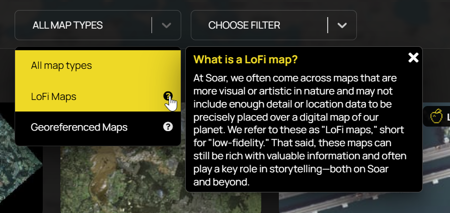
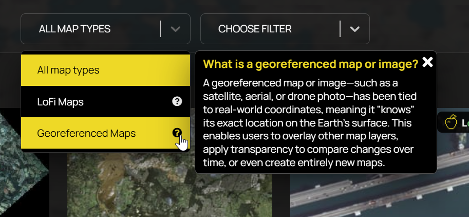

# Soar

## URL



## Description

\[Insert graphic of gif showing overlay of candidate Soar map over OSM background and increasing transparency to show perfect fit of Georeferenced map]

<mark style="color:$info;">Soar is primarily a comprehensive digital atlas where users can discover, explore, navigate, and upload diverse maps and imagery. But it also functions as both a GIS exploration/navigation tool and a social platform for the global cartography community. The platform also enables satellite acquisition, user uploads, and visualization through its "Stoary" and GIFs feature for creating multi-slide map narratives with community-driven content sharing.</mark>

<mark style="color:$info;">The main features are: DISCOVER, MAPS, SATELLITE, BOOKMARKS, UPLOAD</mark>&#x20;

<mark style="color:$danger;">**NOTE: NOT ALL MAPS HAVE TRANSPARENCY FEATURE**</mark>&#x20;

<mark style="color:$info;">NOTE: Based on our tests, the category "geo-referenced maps" mostly has the transparency feature. However, this feature cannot be used on "lo-fi" maps.</mark>&#x20;

<mark style="color:$danger;">**NOTE: Check base data is OSM**</mark>

<mark style="color:$danger;">**NOTE: Afton discovered some very high resolution 8cm per pixel maps from sources like EU on Soar**</mark>

<mark style="color:$danger;">**TEST is it the LoFi maps which don't have transparency by definition? TEST: Do all Georeferenced maps have transparency feature?**</mark>

<mark style="color:$danger;">**TEST: Does LoFi mean "Soar didn't fit over OSM" and Georeferenced mean "Soar did fit over OSM"? See LoFi defined Christian Triebert Crimean Bridge damage map**</mark>

<mark style="color:$danger;">**AMAZING FEATURE: TEST Does Soar AUTOFIT all Georeferenced maps over the basic OSM background by scaling and orientating them? Norte de Chile old map is a really good example.**</mark>

The Soar platform provides a number of services: <mark style="color:$danger;">**QUESTION: What is the difference between the features "Maps" and "Discover"? Is it actually just two routes to the same database, Maps being searched by location and Discover doing searching by topic and type? Afton's research shows different priorities in the search algorithms: TEST The Discover section offers no geo co-ordinates  input location but its search algorithm prioritises newly added material and regular contributors of content.**</mark>

1. A large database of maps and imagery displaying&#x20;

* a wide variety of geographically distributed information,e.g. weather, maritime tides, distribution of dust and ash, soil moisture, population, radar, ...&#x20;
* different time modalities, e.g. static maps created over a long time period stretching back to  <mark style="color:$danger;">**1800 (looking for read date of oldest),**</mark> maps displaying real-time information feeds, animated gif maps displaying a sequence of changing information over time

These Soar database entries are searchable by : <mark style="color:$danger;">**Need to test what other search keys apart from Location can be used - there are filters in**</mark>&#x20;

### <mark style="color:$info;">Defining Soar's Atlas - What is it?</mark>&#x20;

\ <mark style="color:$info;">Soar hosts about 1,043,975 maps \[define what types]. The data comes from, but is not limited to:</mark>&#x20;

<mark style="color:$info;">1. Individuals (example https://soar.earth/profile/Warmapper and https://soar.earth/profile/spacefromspace)</mark>

<mark style="color:$info;">2. Organizations (https://soar.earth/profile/UN or https://soar.earth/profile/EU)</mark>

<mark style="color:$info;">3. Government agency (https://soar.earth/profile/USGS)</mark>&#x20;

<mark style="color:$info;">4. Other satellite image providers (https://soar.earth/profile/Umbra)</mark> \

<mark style="color:$info;">Categories or types of maps are: \[list]</mark>

\
&#xNAN;_<mark style="color:$info;">(The more I think about it, the clearer it becomes that) Soar is both a tool for working on geospatial data and a space for creative/custom map-making. When entering the Soar landing page, it offers users two main ways to engage with its atlas. Each reflects a different approach and a purpose. Do you want to use it like Google Earth /Sentinel Hub? Or do you want visually compelling map content?</mark>_\

<mark style="color:$info;">The</mark> <mark style="color:$info;"></mark><mark style="color:$info;">**Discover**</mark> <mark style="color:$info;"></mark><mark style="color:$info;">section leans more into visual storytelling. This takes you</mark> <mark style="color:$info;"></mark><mark style="color:$info;">**directly**</mark> <mark style="color:$info;"></mark><mark style="color:$info;">to the atlas' user-uploaded maps,imagery etc.  It is a collection of both georeferenced maps and what Soar calls "LoFi" maps, which are designed for data visualization and artistic expression, rather than geographic precision.  For georeferenced maps, you can use a transparency slider to adjust how much of the basemap underneath shows through. This helps compare features or blend historical and current views. LoFi maps don't offer this, since they are not spatially aligned, but stand out for their design and narrative focus.</mark>  \ <mark style="color:$info;">GIFS</mark>\

<mark style="color:$info;">The</mark> <mark style="color:$info;"></mark><mark style="color:$info;">**Maps**</mark> <mark style="color:$info;"></mark><mark style="color:$info;">section works like a traditional GIS interface. You can search by coordinates, view satellite imagery, and layer your own georeferenced maps over basemaps. It is ideal for users who need accuracy and spatial detail. Zooming in or out triggers a dynamic sidebar to the left with related user-uploaded maps from Soar's Atlas, adding a curated browsing experience to the more technical side of the platform. The Maps takes you</mark> <mark style="color:$info;"></mark><mark style="color:$info;">**indirectly**</mark> <mark style="color:$info;"></mark><mark style="color:$info;">to the Atlas of user-uploaded maps, imagery.</mark>  \

<mark style="color:$info;">There is, however, a crossover between these two sections. Features like the Atlas appearing on both and the transparency tool help bridge them. But that being said, the platform seems to lean slightly more toward showcasing its Atlas and visual content than emphasizing traditional mapping workflows. However, it does so in a way that still supports both audiences.</mark>&#x20;

\ <mark style="color:$info;">Quote from the creator: "Soar could become as ubiquitous as Google Maps but with more context and community." (https://www.popsci.com/technology/soar-online-atlas-open-source-intelligence/)</mark>&#x20;

### <mark style="color:$info;">MAPS</mark>

<mark style="color:$info;">The default view is a zoomed-out satellite imagery of the Earth in the middle. To the left is a sidebar with a list of maps, to the right is a search box, zoom in, zoom out, and</mark> [<mark style="color:$info;">box zoom.</mark>](#user-content-fn-1)[^1]&#x20;

<mark style="color:$info;">**LEFT SIDEBAR**</mark>

<mark style="color:$info;">On the left is a sidebar with a list of user-uploaded maps.</mark>&#x20;

_<mark style="color:$info;">Filtering:</mark>_ <mark style="color:$info;"></mark><mark style="color:$info;">This list can be filtered as: Agriculture, Climate, Culture, Demographics, Earth Art, Economic, Environment, Geology, History, Imagery, Marine/Nautical, Politics, Radar, Elevation/Topography, Transport, Urban.</mark>&#x20;

<mark style="color:$info;">**User view 1: Zoomed-out.**</mark> <mark style="color:$info;"></mark><mark style="color:$info;">This will show maps organized according to what is featured by the tool provider, followed by new uploads.</mark>&#x20;

<mark style="color:$info;">Map results can also be filtered as above.</mark>&#x20;

<mark style="color:$info;">**User view 2: Zoomed-in on a specific location.**</mark> <mark style="color:$info;"></mark><mark style="color:$info;">This will show maps (all types) available related to that area in particular or the neighboring region (i.e, zooming in on Algeria, gave us a list of maps, first showing Algeria Soviet National Map, followed by aerial imagery of Spain, and conflict map in Libya);</mark> &#x20;

<mark style="color:$info;">Map results can also be filtered as above.</mark>&#x20;

<mark style="color:$info;">**ON THE RIGHT:**</mark>

<mark style="color:$info;">**Search box -**</mark> <mark style="color:$info;"></mark><mark style="color:$info;">Input: coordinates, city names, Country, neighborhoods, some famous landmarks, but not specific addresses (house number street name + city)  (what are these location data called? gazetteer? reference data? address locator?)</mark>

<mark style="color:$info;">**Zoom options -**</mark> <mark style="color:$info;"></mark> <mark style="color:$info;"></mark><mark style="color:$info;">zoom in, zoom out, and</mark> [<mark style="color:$info;">box zoom.</mark>](#user-content-fn-1)[^1]&#x20;

<mark style="color:$info;">**BOTTOM RIGHT:**</mark>

<mark style="color:$info;">Basemaps: OpenStreetMaps, Open Elevation, Satellite, Hybrid, White Base, Dark Base, White Blank, Dark Blank</mark>

<mark style="color:$info;">Satellite Paths: Day/night, Sentinel 1A, Sentinel 2A, Sentinel 1B, Sentinel 2B, Landsat 8, International Space Station</mark>&#x20;

<mark style="color:$info;">**BOTTOM CENTER:**</mark>&#x20;

<mark style="color:$info;">"Create a Map" or a "Stoary" (See below for detailed description of this feature).</mark>&#x20;

### <mark style="color:$info;">DISCOVER</mark>

<mark style="color:$danger;">**Discover section for 2 Map Types:**</mark>&#x20;

[<mark style="color:$danger;">**LoFi**</mark>](#user-content-fn-2)[^2] <mark style="color:$danger;">**and Georeferenced (use Soar definitions of these two terms - i.e. either fits over a geo world map or not), which we should probably define (I can't right now) and then about 15 categorisations (Afton finds categorisation to be arbitrary - TEST RESULT: one map can be categorised under more than one heading - test):**</mark>**&#x20;**<mark style="color:$info;">**Are GIFs part of georeferenced maps? (they have the transparency slider on most of them, and the search results in the Discover section include, lofi, standard maps, and GIFs)**</mark>&#x20;

<mark style="color:$info;">(Afton's try at definition --Feel free to rephrase!)</mark>&#x20;

<mark style="color:$info;">**LoFi Maps**</mark> <mark style="color:$info;"></mark><mark style="color:$info;">- short for "low-fidelity". According to a June 25, 2025 Newsletter (mailing list) - these maps focus more on visual appeal than technical accuracy. In other words, these are image files that can't be layered on top of standard geographic basemaps like OSM due to the lack of necessary data to position them on a map accurately. Users may still zoom in and pan around, but it's best to treat them as standalone images that can't be integrated with geographic layers.</mark>&#x20;

<mark style="color:$info;">Users cannot use the transparency slider for LoFi maps.</mark>&#x20;

<figure><figcaption>
<mark style="color:$info;">for reference only (we dont have to keep it in the final description)</mark> 
</figcaption></figure>

**(The verbatim from the newsletter: "**<mark style="color:$info;">At Soar, we often come across maps that are more visual or artistic in nature. These are what we call LoFi Maps - short for low-fidelity. Put simply, LoFi Maps are maps that don't include the data that places them over the base map. Instead, they're viewable as a standard image which you can zoom into, pan around, and explore, just without the base map.")</mark>

<mark style="color:$info;">**Georeferenced Maps -**</mark> <mark style="color:$info;"></mark><mark style="color:$info;">maps or images (whether satellite, aerial, or drone capture) that contain specific Earth coordinates and allow for precise geographic positioning. These coordinate-linking allows for layering additional map data on top or making transparency adjustments.</mark>&#x20;

<figure><figcaption></figcaption></figure>

* location (Maps Section designed for this)&#x20;
* **category (Discover Section designed for this)**

<figure><figcaption></figcaption></figure>

<figure><figcaption></figcaption></figure>

<figure><figcaption></figcaption></figure>

* georeference - i.e. can it scale to fit over a modern scientifically derived world map? (Discover section filters by this)

One of Soar's most immediately valuable features is the ability to overlay imagery and maps in layers and the adjust transparency. <mark style="color:$danger;">**TEST**</mark> <mark style="color:$danger;">**Need to test can we adjust the relative scale of the maps to get them to fit over one another in the same location?? Which of the two maps can we rescale? One or both? Or is the interaction with the satellite imagery different in these two modes of Map and Discover?**</mark>

Another very valuable feature is that Soar inserts connective links between maps which cover the same area. <mark style="color:$danger;">**TEST. Need to check this carefully and either bin or provide an example see**</mark> [<mark style="color:$danger;">**https://opengislab.com/blog/2021/7/11/exploring-a-digital-atlas-of-maps-and-imagery-on-soarearth**</mark>](https://opengislab.com/blog/2021/7/11/exploring-a-digital-atlas-of-maps-and-imagery-on-soarearth)

<mark style="color:$danger;">**NB Note that Soar puts labels over Thumbnail maps to give information as to format, but these formats don't correspond exactly to the filters offered by Soar - labels include "GIF", "REAL TIME", "DAILY", POPULAR", "NEW", "LoFi (which IS one of the filterable categories)**</mark>

2.  An interface supporting access to satellite imagery for areas of interest and timeframes specified by the user, offering both free and charged data:

    1. Sentinel-2 : Medium resolution, free
    2. NASA : Low resolution, free
    3. Pics from Space, charged [https://www.picsfromspace.com/](https://www.picsfromspace.com/) <mark style="color:$danger;">**Need to research this, needs login. Does it only provide SkyMap50 high resolution imagery? Looks like yes - See**</mark> [<mark style="color:$danger;">**https://spymesat.com/skymap.html**</mark>](https://spymesat.com/skymap.html) <mark style="color:$danger;">**"**</mark>_<mark style="color:$warning;">**Launched in 2018 (01 & 02) and 2018 (03 & 04) from the Taiyuan Satellite Launch Center in China, the four syn-synchronous satellites operate at an altitude of 500km and can monitor daily any location on the Earth at 50cm per pixel image resolution. At this zoom level, ground features such as individual trees, fences, cars and trucks can be all seen...**</mark><mark style="color:$warning;">SkyMap50 archival imagery orders can take between 2 to 5 working days to process and is available only in GeoTIFF format"</mark>_

    _&#x61;_&#x6E;d providing the ability to combine sequential satellite images into an animated gif.

Here's an uploaded gif map example of a wildfire [https://soar.earth/maps/oceania-judbarra-national-park-wildfire-australia-august-2025-136339?basemap=Hybrid\&pos=-16.199419136431956%2C130.41824000000003%2C9.99](https://soar.earth/maps/oceania-judbarra-national-park-wildfire-australia-august-2025-136339?basemap=Hybrid\&pos=-16.199419136431956%2C130.41824000000003%2C9.99)

<mark style="color:$danger;">**We thought we might illustrate a stoary**</mark>**&#x20;**<mark style="color:$info;">**(I think maybe we tested the GIF feature for Evergreen instead of a Stoary?)**</mark>**&#x20;**<mark style="color:$danger;">**with the Evergreen Ship incident,stuck in the Suez canal 23-29/3/21**</mark>

3. The facility to upload and share user maps (Formats are Georeferenced maps=GeoTIFF, ECW and JP2, LoFi Map formats = PNG and JPEG and create geographical media (called Stoaries <mark style="color:$danger;">**need to check the exact definition of a Stoary - is it a set of digital pages which can include gif animation? Stoaries - you can annotate a map (TEST maybe only an OSB background map, not a Soar upload**</mark>**&#x20;**<mark style="color:$info;">**(Tested and it looks like you can annotate a Soar upload (see my attempt at explaining the step below)**</mark><mark style="color:$danger;">**) and it will allow you to add the coordinates of a map pin in any chosen metric system. You can add photos or video to locations**</mark> to communicate complex information, e.g. changes over time.

<mark style="color:$danger;">**NB There are quite a few things which don't actually export to GeoJSON format when you export**</mark>

<figure><figcaption>
<mark style="color:$danger;">Dont necessarily intend this to be in the finished entry, just showing it here</mark>
</figcaption></figure>

### <mark style="color:$info;">"Stoary": What is it?</mark>

_<mark style="color:$info;">(Post on X:</mark>_ [_<mark style="color:$info;">https://x.com/Soar\_Earth/status/1825483446816223415</mark>_](https://x.com/Soar_Earth/status/1825483446816223415)_<mark style="color:$info;">, but I believe this is similar to "ESRI StoryMaps")</mark>_
\ <mark style="color:$info;">Based on our tests, a Stoary seems to be a visualization feature of the Soar platform that allows storytelling based on maps or imagery. Rather than using static imagery or a map screenshot, users can use</mark> <mark style="color:$info;"></mark><mark style="color:$info;">**pages**</mark> <mark style="color:$info;"></mark><mark style="color:$info;">of maps/imagery to add context, descriptions, icons, and additional multimedia. This helps walk readers through a story arc tied to a place or several places.</mark>&#x20;

<mark style="color:$info;">It allows creators to combine text, imagery, user-uploaded maps, and geospatial layers.</mark>&#x20;

<mark style="color:$info;">Each page of a "Stoary" is scene-based. The user can choose a location/view and add context.</mark>&#x20;

<mark style="color:$info;">Soar's step-by-step guide to creating a Stoary is found</mark> [<mark style="color:$info;">here</mark>](https://www.youtube.com/watch?v=G97wi-zaTfM)<mark style="color:$info;">.</mark>&#x20;

<mark style="color:$info;">**Stoary Features:**</mark>

1. <mark style="color:$info;">Pages of maps/imagery — This feature is helpful if, for instance, users are following one event in different locations (i.e., St. Patrick’s Day Parades worldwide. One can track it in cities like Dublin, Boston, and New York, and visualize that.</mark> &#x20;
   1. <mark style="color:$info;">Each page of a Stoary can use a basemap (OSM, Satellite, etc) provided</mark>
   2.  <mark style="color:$info;">Can use user-uploaded Soar maps! (screenshot below)</mark>

       <mark style="color:$info;">NOTE: If using a Soar uploaded map for your Stoary, the transparency feature can be used.</mark>&#x20;

<figure><figcaption></figcaption></figure>

<figure><figcaption></figcaption></figure>

2. <mark style="color:$info;">Annotation (especially the coordinates feature)</mark>

<mark style="color:$danger;">\[Insert screenshot graphic of the location co-ordinates feature for annotating maps in Stoary section.]</mark>

3. <mark style="color:$info;">Photo Overlay - overlay photos from news or stock sites (with attribution), or social media, which can be good for corroboration.</mark>
4. <mark style="color:$info;">Sharing and Exporting</mark>&#x20;

To demonstrate the visualization capability of a "Stoary", we used the feature below using information [from a 2024 investigation by Bellingcat](https://www.bellingcat.com/news/2024/12/18/ukraine-outraged-at-yemen-grain-shipment-from-occupied-crimea/). NOTE: This is for demonstration purposes only.&#x20;



<mark style="color:$info;">(We don't have to include this demo if we don't think it is that helpful.)</mark>&#x20;

## The Interface <mark style="color:$danger;">is weird in my view, seems to have changed over time and old versions look better, need to c</mark>heck



Location

Location and time



Maps

Satellite imagery



Looking for a map

Looking for satellite imagery

Triangulating a problem by overlaying two data sources and using transparency



Input text name of location OR

Geographical co-ordinates OR

Point and click at a location on a map



<mark style="color:$danger;">**We need to detail the tools for measurement, annotation and sharing, and link to the Toolkit QGIS entry**</mark>

&#x20;  1\. On-Map Tools: <mark style="color:$danger;">**graphics helpful here**</mark>

&#x20; Area Measurement: Calculate area in km².

&#x20; Ruler: Measure linear distances in km.

&#x20; KML Import: Import KML files for overlay and AOI definition.

&#x20; Text, Arrow, Circle, Square tools for annotations.

&#x20; Latitude/Longitude display.

2\. QGIS Plugin (for advanced users): <mark style="color:$info;">**TO TEST**</mark>

* Direct export of QGIS maps and images to Soar.
* Browse and load Soar's public catalog into QGIS projects.
* Batch upload functionality.

Source: [Soar.Earth Digital Atlas QGIS Plugin - North Road](https://north-road.com/2023/08/24/soar-earth-digital-atlas-qgis-plugin/)

3\. Collaboration Features: <mark style="color:$info;">The pin feature and embed maps are not features that are available anymore. So this must be outdated. I will strike through for now instead of delete.</mark>&#x20;

* "<mark style="color:$info;">P</mark>~~<mark style="color:$info;">in" feature to save and overlay layers.</mark>~~
* ~~<mark style="color:$info;">Annotations visible in embedded maps for collaborative context.</mark>~~

[~~<mark style="color:$info;">https://about.soar.earth/blog-pages/soar-earth-launches-interactive-maps-on-any-website-with-new-embedded-map-tool</mark>~~](https://about.soar.earth/blog-pages/soar-earth-launches-interactive-maps-on-any-website-with-new-embedded-map-tool)

## Cost

* [x] Free
* [x] Partially Free
* [ ] Paid

\[\[Pricing or subscription information, if relevant.]]

## Level of difficulty

<table><thead><tr><th data-type="rating" data-max="5"></th></tr></thead><tbody><tr><td>1</td></tr></tbody></table>

Difficulty Level and Learning Curve:

Overall: For a casual user exploring maps, the difficulty is moderate <mark style="color:$info;">(?)</mark>. For an investigator requiring precise data or intending to contribute advanced imagery, the difficulty is high <mark style="color:$info;">(?)</mark>, requiring some understanding of geospatial data principles or reliance on integrated GIS tools.

## Requirements

<mark style="color:$info;">Account sign up / Email Address</mark>

<mark style="color:$info;">Modern browser - There are definitely moments where loading maps and zooming in for details can cause the browser to freeze.</mark>&#x20;

## Limitations

<mark style="color:$danger;">**Do we move some of the content above from the Level of Difficulty section?**</mark>**&#x20;**<mark style="color:$info;">**Yes, I have moved some**</mark>

* <mark style="color:$info;">Some Satellite images that are high quality - can take long to load when zooming in and out (i.e.</mark> [<mark style="color:$info;">https://soar.earth/maps/world-cloud-properties-western-hemisphere-last-10-minutes-132716?pos=-26.623553540465934%2C-23.02786284286767%2C3.69</mark>](https://soar.earth/maps/world-cloud-properties-western-hemisphere-last-10-minutes-132716?pos=-26.623553540465934%2C-23.02786284286767%2C3.69)<mark style="color:$info;">)</mark>&#x20;
* <mark style="color:$info;">Confusing user interface</mark>
*   <mark style="color:$info;">Stoaries are very difficult to edit. Going to the "page" of the map you want to edit does not take you to that location. Instead, you have to re-input the location or coordinates in the search bar.</mark> &#x20;

    <mark style="color:$info;">Use a browser that does not go into "efficiency mode," as this can freeze the Soar and the Stoary interface consistently.</mark>&#x20;
* <mark style="color:$info;">Intermediate to Advanced Use: The difficulty level increases for more advanced functionalities. Some of them are:</mark>

&#x20;  <mark style="color:$info;">- Uploading and Georeferencing: While the process is streamlined,</mark> [<mark style="color:$info;">users uploading their own maps or imagery need to ensure proper georeferencing and rectification. The platform has strict guidelines for alignment, which may require some prior knowledge or learning on the user's part,</mark>](https://about.soar.earth/help) <mark style="color:$info;">especially if their original data lacks precise georeferencing.</mark> [<mark style="color:$info;">The QGIS plugin helps with this process,</mark> ](https://north-road.com/2023/08/24/soar-earth-digital-atlas-qgis-plugin/)<mark style="color:$info;">however this may be limited to for GIS-savvy users and may mean a higher barrier for those without GIS software experience.</mark>&#x20;

## Ethical Considerations

A. Data Verification and Accuracy:

* Cross-reference Soar.earth imagery with other sources (e.g., commercial satellite providers, ground reports) to ensure accuracy
* Understand the limitations of satellite imagery (e.g., cloud cover, revisit times, resolution).
* Source: [Help - Soar (on real-time imagery limitations)](https://about.soar.earth/help)

B. Privacy / Consent:

* Be mindful of privacy implications when analyzing high-resolution imagery, particularly concerning private property or individuals.
* Adhere to ethical guidelines regarding data collection and dissemination.

C. Misinformation and Disinformation:

* Be aware that user-generated content, while valuable, may not always be authoritative. Always verify the source and context of shared maps/imagery.

## Guides and articles <mark style="color:$danger;">Soar seems to have good YouTube videos? need to find more</mark>

[Exploring a Digital Atlas of Maps and Imagery on Soar.Earth - open.gis.lab](https://opengislab.com/blog/2021/7/11/exploring-a-digital-atlas-of-maps-and-imagery-on-soarearth), [Soar Tutorials - YouTube](https://www.google.com/search?q=https://www.youtube.com/playlist%3Flist%3DPL44e5M4E2bX-x1Q-y3d2f-1h9zV5r3jP5)

[Exploring a Digital Atlas of Maps and Imagery on Soar.Earth from Open.gis.lab](https://opengislab.com/blog/2021/7/11/exploring-a-digital-atlas-of-maps-and-imagery-on-soarearth)

<mark style="color:$info;">Possible Use Case:</mark> [<mark style="color:$info;">https://x.com/Soar\_Earth/status/1037937241979412481</mark>](https://x.com/Soar_Earth/status/1037937241979412481)&#x20;

##

## Similar Tools

Similar for creating Stoaries, seeing satellite imagery...

For satellite image combination into animated gif, compare with integrated Sentinel functionality, also ezgif free online tool,...

<mark style="color:$info;">Gif-creating tools on the toolkit include:</mark>

1. <mark style="color:$info;">Sentinel Hub Playground (</mark>[<mark style="color:$info;">https://bellingcat.gitbook.io/toolkit/more/all-tools/sentinal-hub-playground</mark>](https://bellingcat.gitbook.io/toolkit/more/all-tools/sentinal-hub-playground)<mark style="color:$info;">)</mark>&#x20;
2. <mark style="color:$info;">Nasa Worldview (</mark>[<mark style="color:$info;">https://bellingcat.gitbook.io/toolkit/more/all-tools/nasa-worldview</mark>](https://bellingcat.gitbook.io/toolkit/more/all-tools/nasa-worldview)<mark style="color:$info;">)</mark>

<mark style="color:$info;">Free online tool, EZgif (</mark>[<mark style="color:$info;">https://ezgif.com/</mark>](https://ezgif.com/)<mark style="color:$info;">)</mark>&#x20;

## Tool provider

Soar, Perth, Australia<mark style="color:$danger;">**?**</mark>

## Advertising Trackers

* [ ] This tool has not been checked for advertising trackers yet.
* [x] This tool uses tracking cookies. Use with caution.
* [ ] This tool does not appear to use tracking cookies.

| Page maintainer                                             |
| ----------------------------------------------------------- |
| Afton 14/9/25 16:12 GMT and Sophie Tedling 2/9/25 20:15 GMT |
|                                                             |

[^1]: using your cursor to draw a box and the map zooms in on that area of interest

[^2]: Another terms is schematic
