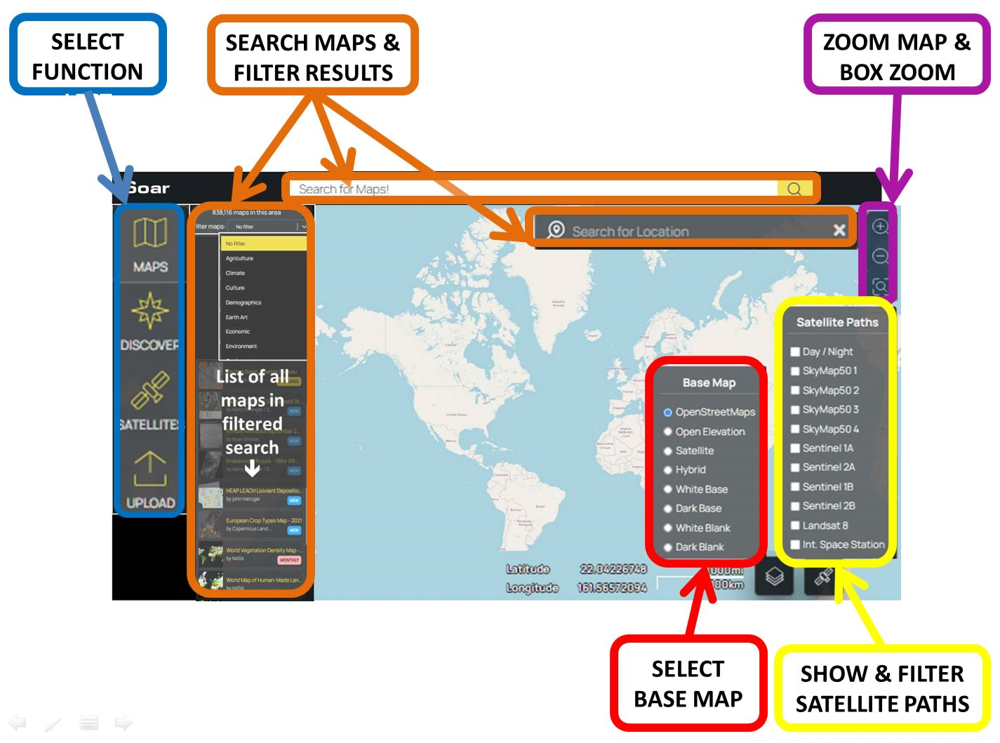
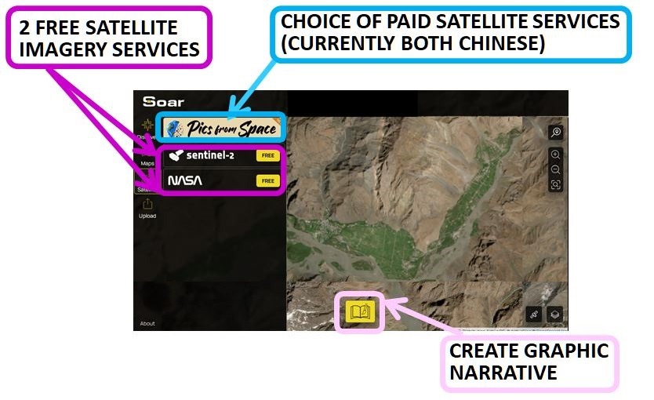
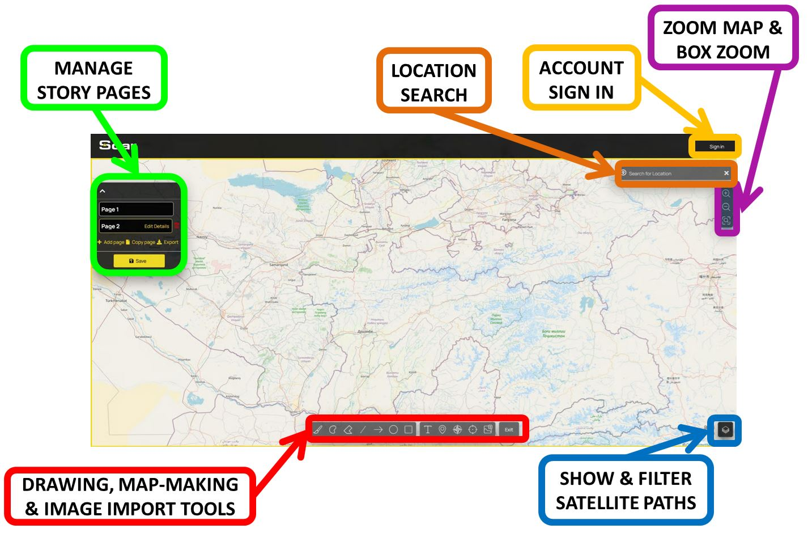

# Soar

## URL

[https://soaratlas.com/discover](https://soaratlas.com/discover)

## Description

<figure><figcaption>
<strong>SEARCHING FOR MAPS FOR A GIVEN LOCATION, VIEWING OVERLAY ON OPENSTREETMAP AND SATELLITE DATA USING GEOREFERENCED TRANSPARENCY FEATURE, SELECTING APPROPRIATE SATELLITES PASSING OVERHEAD</strong>
</figcaption></figure>


The Tajikistan National Mosaic map was chosen from the database because it was made many decades ago by the Soviet military (as part of a much larger project) before the break up of the Soviet Union. The skill and survey manpower which were employed in its creation mean that it contains some of the most valuable information which is available today on such remote regions. Soar provides a wealth of maps made in the past, which is a useful reminder of their value, as well as an important resource for Open Source researchers.


Soar is described as a Digital Atlas containing over a million maps. Its main functions are:

* **Map Database access**

Provision of [read and write access](#user-content-fn-1)[^1] to a large and growing searchable database of maps from all geographies, indexed in many dimensions, such as resolution, georeference status,  topical interest category[^2]. These include maps animated to show change over time and drone imagery, as well as satellite imagery.

* **Selection and acquisition of Satellite Imagery**

Selection and acquisition of satellite imagery from a range of providers, both free and purchased. Available satellite paths can be displayed and filtered over any map of interest, so that users can direct their search for relevant satellite imagery to the appropriate satellite service, date and time.

* **Narrative Creation and Data Sharing**

Provision of online visualisation features allowing the creation of multi-image narratives, and the facility to upload and share user imagery, including narrative formats.

These constitute some of the major tasks which Open Source researchers undertake during investigations, making Soar **a multi-purpose platform for OSINV**.


Note that some satellite imagery maps in the Soar database are of very high quality, i.e. 8cm per pixel resolution, making them particularly valuable resources.


### The Soar Interface


The Discover and Maps sections of the Soar interface are in fact just different routes to the same information - the maps database. Discover is centred around searching information by category, whilst Maps is centred around searching for information by location.


<figure><figcaption>
<strong>COMPARISON OF THE MAP AND DISCOVERY MODES OFFERED BY SOAR</strong>
</figcaption></figure>



**SOAR DATA SOURCES**

Data sources for Soar's million maps include:&#x20;

1\. **Individuals** (example https://soar.earth/profile/Warmapper and https://soar.earth/profile/spacefromspace)

**2. Organizations** (https://soar.earth/profile/UN or https://soar.earth/profile/EU)

**3. Government agency** (https://soar.earth/profile/USGS)&#x20;

**4. Other satellite image providers** (https://soar.earth/profile/Umbra)&#x20;



**SOAR MAP INFORMATION TYPES**

The database includes:

* a wide variety of geographically distributed information,e.g. weather, maritime tides, distribution of dust and ash, soil moisture, population, radar, ...&#x20;
* different time modalities, e.g. static maps created over a long time period stretching back at the time of writing (Oct 25) to at least 1572, maps displaying real-time information feeds, animated gif maps displaying a sequence of changing information over time.



Soar maps are searchable by features including location, map category, indexing tags, uploading username, georeference[^3] status,...

Soar groups maps under a developing framework of categories. <em>Click the arrow to see some typical Soar categories as at October 25...</em>

Agriculture\
Climate\
Conflict Zone\
Culture\
Demographics\
Earth Art\
Economic\
Environment\
Geology\
History\
Imagery\
Marine/Nautical\
Politics\
Radar\
Spaceport\
Elevation/Topography\
Transport\
Urban

Soar's repository of over a million maps covers diverse locations, topics and timeframes. <em><strong>Click the arrow to see Soar maps demonstrating the variety of content...</strong></em>

<table data-view="cards"><thead><tr><th></th><th></th><th data-hidden data-card-cover data-type="image">Cover image</th></tr></thead><tbody><tr><td><a href="https://soaratlas.com/maps/16958?pos=39.94681663720949%2C67.28800356363985%2C6.29"><strong>Russian Map dated 1776</strong></a></td><td>Despite its age, this map is georeferenced to fit over a modern OpenStreetMap  worldmap. </td><td><a href=".gitbook/assets/russia1776.JPG">russia1776.JPG</a></td></tr><tr><td><a href="https://soaratlas.com/maps/asia-construction-timelapse-of-wenchang-space-launch-site-china-135903?basemap=Satellite&#x26;pos=19.616924298644264%2C110.92303733295931%2C13.83"><strong>Construction Timelapse of Wenchang Space Launch Site, China</strong></a></td><td>This animated GIF of satellite imagery shows the construction of a Chinese spaceport.</td><td><a href=".gitbook/assets/wenchanglaunchchina.JPG">wenchanglaunchchina.JPG</a></td></tr><tr><td><a href="https://soaratlas.com/maps/global-world-sea-surface-temperature-last-24-hrs-1-2-15100?basemap=Satellite&#x26;pos=8.56359579134514%2C-21.14956646078772%2C2.5">World Sea Surface Temperatures, Last 24 hours from NASA</a></td><td>This data feed map shows sea temperatures in degrees Centrigrate updates daily.</td><td><a href=".gitbook/assets/nasaworldseatemps.JPG">nasaworldseatemps.JPG</a></td></tr></tbody></table>

### **Navigating the Interface to the Soar Map Database**

The Soar interface has been regularly updated and redesigned since its launch.&#x20;

#### **At Database Level**

**T**he Soar interface provides lists of maps relating to a given location, ways to filter them, a selection of base world map views, and a filterable selection of satellite paths.

<figure><figcaption>
<strong>THE SOAR INTERFACE WHEN SEARCHING FOR MAPS</strong>
</figcaption></figure>

When working from a location, users can:



### Define

Enter a name or co-ordinates, Zoom to a region and select an exact bounding box location with the box zoom function.



### View

View and filter the maps presented by Soar around this specific location



### Select

Select a map and, if available, change Transparency to inspect the overlay of the georeferenced map against the base map, comparing features



### Compare

Change the base map to inspect against OpenStreetMap, OpenElevation, Satellite and Hybrid views



### Find Satellite Imagery

Open and filter satellite paths to establish which could provide imagery of the region

Invoke SATELLITE mode to find historic imagery or to commission immediate satellite imagery of the specifc location (both free and paid offered)



### Create and Share A Narrative

Invoke STOARY mode to create narrative content

Invoke UPLOAD mode to add content to the Soar database



#### **At Map Level**

**T**he Soar interface offers data on the account which posted the map, the facility to read and post comments, the set of tags describing the map, and the ability to adjust the map transparency against the base map underlay, and a tool to create graphic narratives.

<figure><figcaption>
<strong>THE SOAR INTERFACE WHEN VIEWING A SELECTED MAP FROM THE DATABASE</strong>
</figcaption></figure>


Note that Soar categorises maps as either Georeferences or LoFi as per the definitions below:




**LOFI MAPS - NOT GEOREFERENCED**

Can't be linked to real-world co-ordinates

These are image files which can't be layered on top of standard geographic basemaps like OSM, due to the lack of necessary data to position them on a map accurately. Users may still zoom in and pan around using Soar, but it's best to treat them as standalone images that can't be integrated with geographic layers.&#x20;

<figure><figcaption></figcaption></figure>



**GEOREFERENCED MAPS**

Has been linked to real-world co-ordinates

These are maps or images (whether satellite, aerial, or drone capture) which contain specific Earth coordinates and allow for precise geographic positioning. This coordinate-linking allows for layering additional map data on top or making transparency adjustments.&#x20;

<figure><figcaption></figcaption></figure>




The transparency slider is not available for LoFi maps.&#x20;


#### At Satellite Level

<figure><figcaption></figcaption></figure>

The Soar satellite interface supports access to satellite imagery for areas of interest and timeframes specified by the user, offering both free and charged data:

1. Sentinel-2 : Medium resolution, free
2. NASA : Low resolution, free
3. Pics from Space, a charged service at [https://www.picsfromspace.com/](https://www.picsfromspace.com/), which offers charged data from two [Chinese satellite services](#user-content-fn-4)[^4], including the ability to commission new satellite imagery according to user specification. &#x20;

_&#x61;_&#x6E;d providing the ability to combine sequential satellite images into an animated gif via the Sentinel interface.

Here's an uploaded [gif map example of a wildfire](https://soar.earth/maps/oceania-judbarra-national-park-wildfire-australia-august-2025-136339?basemap=Hybrid\&pos=-16.199419136431956%2C130.41824000000003%2C9.99)

### Soar User Data: Input, Output and Use Cases



* Location&#x20;
* Map filtering properties, e.g Map category, Map format, Map indexing tags
* Satellite filtering properties
* Animated satellite GIF sequence properties
* Media for graphical narrative creation



* Maps
* Satellite imagery
* Animated GIFs of satellite imagery
* Graphic Narratives



* Looking for a map
* Looking for satellite imagery
* Triangulating a problem by overlaying two data sources and using transparency
* Creating an animated GIF to display satellite imagery changing over time
* Communicating and sharing a narrative in graphical format



* Input text name of location OR
* Geographical co-ordinates OR
* Point and click at a location on a map
* Media content for upload to the Soar platform must comply with the following formats:&#x20;
  * Georeferenced maps=GeoTIFF, ECW and JP
  * LoFi Map formats = PNG and JPEG and create geographical media

NB Location can be input as co-ordinates or a location name in MAPS section, but only as location name in DISCOVERY section



Sophie completed to here - >

***

### **AFTON TO RESEARCH THE VALIDITY OF THE SKYMAP 50 SATELLITE DATA SOURCE, AND WHETHER THIS SITE COULD BE LINKED TO DISINFORMATION.**

### <mark style="color:$primary;">NARRATIVES (INTERFACE) and upload - Afton</mark>&#x20;

<mark style="color:$danger;">**\[We thought we might illustrate a stoary**</mark>**&#x20;**<mark style="color:$info;">**(I think maybe we tested the GIF feature for Evergreen instead of a Stoary?)**</mark>**&#x20;**<mark style="color:$danger;">**with the Evergreen Ship incident,stuck in the Suez canal 23-29/3/21**</mark>

GREAT SO&#x20;

* WE CAN USE THE EVERGREEN ANIMATED GIF EXAMPLE FOR GIF FEATURE
* WE CAN USE TAJIKISTAN FOR THE STOARY FEATURE(Tajikistan inscriptions visible from satellite.]

3. The facility to upload and share user maps (Formats are Georeferenced maps=GeoTIFF, ECW and JP2, LoFi Map formats = PNG and JPEG and create geographical media (called Stoaries <mark style="color:$danger;">**need to check the exact definition of a Stoary - is it a set of digital pages which can include gif animation? Stoaries - you can annotate a map (TEST maybe only an OSB background map, not a Soar upload**</mark>**&#x20;**<mark style="color:$info;">**(Tested and it looks like you can annotate a Soar upload (see my attempt at explaining the step below)**</mark><mark style="color:$danger;">**) and it will allow you to add the coordinates of a map pin in any chosen metric system. You can add photos or video to locations**</mark> to communicate complex information, e.g. changes over time.

### <mark style="color:$primary;">Maybe a Hint? Definitely a limitation!</mark>


There are quite a few elements which don't actually export to GeoJSON format from Soar



### <mark style="color:$primary;">Is there a separate item about making animated GIFS? Is that just Satellite site functionality, passed through?</mark>

### <mark style="color:$info;">"Stoary": What is it?</mark>

_<mark style="color:$info;">(Post on X:</mark>_ [_<mark style="color:$info;">https://x.com/Soar\_Earth/status/1825483446816223415</mark>_](https://x.com/Soar_Earth/status/1825483446816223415)_<mark style="color:$info;">, but I believe this is similar to "ESRI StoryMaps")</mark>_
\ <mark style="color:$info;">Based on our tests, a Stoary seems to be a visualization feature of the Soar platform that allows storytelling based on maps or imagery. Rather than using static imagery or a map screenshot, users can use</mark> <mark style="color:$info;"></mark><mark style="color:$info;">**pages**</mark> <mark style="color:$info;"></mark><mark style="color:$info;">of maps/imagery to add context, descriptions, icons, and additional multimedia. This helps walk readers through a story arc tied to a place or several places.</mark>&#x20;

<mark style="color:$info;">It allows creators to combine text, imagery, user-uploaded maps, and geospatial layers.</mark>&#x20;

<mark style="color:$info;">Each page of a "Stoary" is scene-based. The user can choose a location/view and add context.</mark>&#x20;

<mark style="color:$info;">Soar's step-by-step guide to creating a Stoary is found</mark> [<mark style="color:$info;">here</mark>](https://www.youtube.com/watch?v=G97wi-zaTfM)<mark style="color:$info;">.</mark>&#x20;

<mark style="color:$info;">**Stoary Features:**</mark>

1. <mark style="color:$info;">Pages of maps/imagery — This feature is helpful if, for instance, users are following one event in different locations (i.e., St. Patrick’s Day Parades worldwide. One can track it in cities like Dublin, Boston, and New York, and visualize that.</mark> &#x20;
   1. <mark style="color:$info;">Each page of a Stoary can use a basemap (OSM, Satellite, etc) provided</mark>
   2.  <mark style="color:$info;">Can use user-uploaded Soar maps! (screenshot below)</mark>

       <mark style="color:$info;">NOTE: If using a Soar uploaded map for your Stoary, the transparency feature can be used. YES!!</mark>

<figure><figcaption></figcaption></figure>

<figure><figcaption></figcaption></figure>

2. <mark style="color:$info;">Annotation (especially the coordinates feature)</mark>

<mark style="color:$danger;">\[Insert screenshot graphic of the location co-ordinates feature for annotating maps in Stoary section.]</mark>

3. <mark style="color:$info;">Photo Overlay - overlay photos from news or stock sites (with attribution), or social media, which can be good for corroboration.</mark>
4. <mark style="color:$info;">Sharing and Exporting</mark>&#x20;

To demonstrate the visualization capability of a "Stoary", we used the feature below using information [from a 2024 investigation by Bellingcat](https://www.bellingcat.com/news/2024/12/18/ukraine-outraged-at-yemen-grain-shipment-from-occupied-crimea/). NOTE: This is for demonstration purposes only.&#x20;

#### A**t Narrative Creation Level**

<figure><figcaption>
<strong>THE SOAR INTERFACE FOR NARRATIVE CREATION OF 'STOARIES' SHOWING PAGE MANAGEMENT MENU AND ANNOTATION TOOLS</strong>
</figcaption></figure>

&#x20;  1\. **On-Map Tools for Drawing, Map-making and Image Import include:**

* Area Measurement: Calculate area in km².
* Ruler: Measure linear distances in km.
* KML Import: Import KML files for overlay and AOI definition.
* Text, Arrow, Circle, Square tools for annotations.
* Latitude/Longitude display.

2\. **QGIS Plugin (for advanced users) provides:** <mark style="color:$info;">**TO TEST !! AFTON TO TEST AGAIN!! THEN SOPHIE ADD TO INTERFACE**</mark>

* Direct export of QGIS maps and images to Soar.
* Browse and load Soar's public catalog into QGIS projects.
* Batch upload functionality.

Source: [Soar.Earth Digital Atlas QGIS Plugin - North Road](https://north-road.com/2023/08/24/soar-earth-digital-atlas-qgis-plugin/)

## Cost

* [ ] Free
* [x] Partially Free
* [ ] Paid

## Level of difficulty

<table><thead><tr><th data-type="rating" data-max="5"></th></tr></thead><tbody><tr><td>1</td></tr></tbody></table>

Difficulty Level and Learning Curve:

Overall: For a casual user exploring maps, the difficulty is moderate. For an investigator requiring precise data or intending to contribute advanced imagery, the difficulty is high, requiring some understanding of geospatial data principles or reliance on integrated GIS tools.

## Requirements

* Account sign up / Email Address
* Modern browser - This will avoid 'freezing' where loading maps and zooming in for details can cause the browser to stop working.

## Limitations

* Some maps are georeferenced, some are not (usually old ones)
* Some Satellite images that are high quality - can take long to load when zooming in and out (i.e. [https://soar.earth/maps/world-cloud-properties-western-hemisphere-last-10-minutes-132716?pos=-26.623553540465934%2C-23.02786284286767%2C3.69](https://soar.earth/maps/world-cloud-properties-western-hemisphere-last-10-minutes-132716?pos=-26.623553540465934%2C-23.02786284286767%2C3.69))&#x20;
* Confusing user interface
*   Stoaries are very difficult to edit. Going to the "page" of the map you want to edit does not take you to that location. Instead, you have to re-input the location or coordinates in the search bar. &#x20;

    Use a browser that does not go into "efficiency mode," as this can freeze the Soar and the Stoary interface consistently.&#x20;
* Soar puts labels over Thumbnail maps to give information as to format, but these formats don't correspond exactly to the filters offered by Soar - labels include "GIF", "REAL TIME", "DAILY", POPULAR", "NEW", "LoFi (which IS one of the filterable categories).
* Intermediate to Advanced Use: The difficulty level increases for more advanced functionalities. Some of them are:


Uploading and Georeferencing: While the process is streamlined, [users uploading their own maps or imagery need to ensure proper georeferencing and rectification. The platform has strict guidelines for alignment, which may require some prior knowledge or learning on the user's part,](https://about.soar.earth/help) especially if their original data lacks precise georeferencing. [The QGIS plugin helps with this process, ](https://north-road.com/2023/08/24/soar-earth-digital-atlas-qgis-plugin/)however this may be limited to for GIS-savvy users and may mean a higher barrier for those without GIS software experience.&#x20;


## Ethical Considerations

A. Data Verification and Accuracy:

* Cross-reference Soar.earth imagery with other sources (e.g., commercial satellite providers, ground reports) to ensure accuracy
* Understand the limitations of satellite imagery (e.g., cloud cover, revisit times, resolution).
* Source: [Help - Soar (on real-time imagery limitations)](https://about.soar.earth/help)

B. Privacy / Consent:

* Be mindful of privacy implications when analyzing high-resolution imagery, particularly concerning private property or individuals.
* Adhere to ethical guidelines regarding data collection and dissemination.

C. Misinformation and Disinformation:

* Be aware that user-generated content, while valuable, may not always be authoritative. Always verify the source and context of shared maps/imagery.

## Guides and articles&#x20;

[Exploring a Digital Atlas of Maps and Imagery on Soar.Earth - open.gis.lab](https://opengislab.com/blog/2021/7/11/exploring-a-digital-atlas-of-maps-and-imagery-on-soarearth), [Soar Tutorials - YouTube](https://www.google.com/search?q=https://www.youtube.com/playlist%3Flist%3DPL44e5M4E2bX-x1Q-y3d2f-1h9zV5r3jP5)

[Exploring a Digital Atlas of Maps and Imagery on Soar.Earth from Open.gis.lab](https://opengislab.com/blog/2021/7/11/exploring-a-digital-atlas-of-maps-and-imagery-on-soarearth)

<mark style="color:$info;">Possible Use Case:</mark> [<mark style="color:$info;">https://x.com/Soar\_Earth/status/1037937241979412481</mark>](https://x.com/Soar_Earth/status/1037937241979412481)&#x20;

## Similar Tools

Similar for creating Stoaries, seeing satellite imagery...

For satellite image combination into animated gif, compare with integrated Sentinel functionality, also ezgif free online tool,...

<mark style="color:$info;">Gif-creating tools on the toolkit include:</mark>

1. <mark style="color:$info;">Sentinel Hub Playground (</mark>[<mark style="color:$info;">https://bellingcat.gitbook.io/toolkit/more/all-tools/sentinal-hub-playground</mark>](https://bellingcat.gitbook.io/toolkit/more/all-tools/sentinal-hub-playground)<mark style="color:$info;">)</mark>&#x20;
2. <mark style="color:$info;">Nasa Worldview (</mark>[<mark style="color:$info;">https://bellingcat.gitbook.io/toolkit/more/all-tools/nasa-worldview</mark>](https://bellingcat.gitbook.io/toolkit/more/all-tools/nasa-worldview)<mark style="color:$info;">)</mark>

## Tool provider

Soar, Perth, Australia

## Advertising Trackers

* [ ] This tool has not been checked for advertising trackers yet.
* [x] This tool uses tracking cookies. Use with caution.
* [ ] This tool does not appear to use tracking cookies.

Soar tranparently volunteers the identities of the cookies used on the site. <em>Click the arrow for more information...</em>

<figure><figcaption></figcaption></figure>

| Page maintainer                             |
| ------------------------------------------- |
| Afton and Sophie Tedling 02/11/25 00:34 GMT |
|                                             |

[^1]: Soar allows users to view maps in the database, and also make their own annotated copies of those maps. Users can upload their own maps to be added to the database

[^2]: The set of categories offered by Soar varies over time, but includes topics as wide as Conflict, Vintage and Spaceport

[^3]: Maps can be categorised as to whether or not they can be [georeferenced](https://en.wikipedia.org/wiki/Georeferencing)

[^4]: "_**Launched in 2018 (01 & 02) and 2018 (03 & 04) from the Taiyuan Satellite Launch Center in China, the four syn-synchronous satellites operate at an altitude of 500km and can monitor daily any location on the Earth at 50cm per pixel image resolution. At this zoom level, ground features such as individual trees, fences, cars and trucks can be all seen...**&#x53;kyMap50 archival imagery orders can take between 2 to 5 working days to process and is available only in GeoTIFF format" Soar website_
