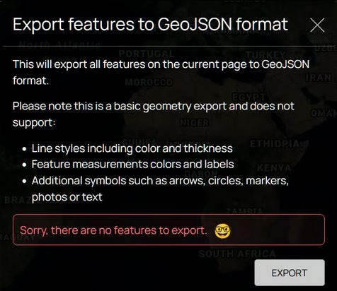

# Soar

## URL

[https://soaratlas.com/discover](https://soaratlas.com/discover)

## Description

<figure><figcaption>
<strong>SEARCHING FOR MAPS FOR A GIVEN LOCATION, VIEWING OVERLAY ON OPENSTREETMAP AND SATELLITE DATA USING GEOREFERENCED TRANSPARENCY FEATURE, SELECTING APPROPRIATE SATELLITES PASSING OVERHEAD</strong>
</figcaption></figure>


The Tajikistan National Mosaic map was chosen from the database because it was made many decades ago by the Soviet military (as part of a much larger project) before the break up of the Soviet Union. The skill and survey manpower which were employed in its creation mean that it contains some of the most valuable information which is available today on such remote regions. Soar provides a wealth of maps made in the past, which is a useful reminder of their value, as well as an important resource for Open Source researchers.


Soar is described as a Digital Atlas containing over a million maps. Its main functions are:

* **Map Database access**

Provision of [read and write access](#user-content-fn-1)[^1] to a large and growing searchable database of maps from all geographies, indexed in many dimensions, such as resolution, georeference status,  topical interest category[^2]. These include maps animated to show change over time and drone imagery, as well as satellite imagery.

* **Selection and acquisition of Satellite Imagery**

Selection and acquisition of satellite imagery from a range of providers, both free and purchased. Available satellite paths can be displayed and filtered over any map of interest, so that users can direct their search for relevant satellite imagery to the appropriate satellite service, date and time.

* **Narrative Creation and Data Sharing**

Provision of online visualisation features allowing the creation of multi-image narratives, and the facility to upload and share user imagery, including narrative formats.

These constitute some of the major tasks which Open Source researchers undertake during investigations, making Soar **a multi-purpose platform for OSINV**.


Note that some satellite imagery maps in the Soar database are of very high quality, i.e. 8cm per pixel resolution, making them particularly valuable resources. Such imagery is expensive to obtain if specifically purchased or commissioned.



**DATA ORIGINS:**&#x20;

**Soar offers free satellite imagery from the Sentinel (European-owned) and  NASA (US-owned) services, which are relatively low resolution. The paid satellite imagery options offered at higher resolution are Jilin-1 satellite (Chinese-owned) services.**&#x20;

**There are locations for which no imagery and a 'restricted' message is returned by some of these  services,  e.g. these messages from Chinese-owned services re:requests for imagery for areas in Taiwan & Mongolia.**

**It is always advisable to consider any potential conflicts of interest between the suppliers of geographical data and the investigative locations for which researchers are requesting imagery. Cross-checking of satellite data from multiple sources may not always be possible, either because of lack availability at comparable resolutions, or high prices attached to images required for confirmation.**

Note that Soar does not provide dates for the satellite base layer it provides from OpenStreetMap, which could affect the usefulness of Soar's map overlay facility.


### The Soar Interface


The Discover and Maps sections of the Soar interface are in fact just different routes to the same information - the maps database. Discover is centred around searching information by category, whilst Maps is centred around searching for information by location.


<figure><figcaption>
<strong>COMPARISON OF THE MAP AND DISCOVERY MODES OFFERED BY SOAR</strong>
</figcaption></figure>



**SOAR DATA SOURCES**

Data sources for Soar's million maps include:&#x20;

1\. **Individuals** (example https://soar.earth/profile/Warmapper and https://soar.earth/profile/spacefromspace)

**2. Organizations** (https://soar.earth/profile/UN or https://soar.earth/profile/EU)

**3. Government agency** (https://soar.earth/profile/USGS)&#x20;

**4. Other satellite image providers** (https://soar.earth/profile/Umbra)&#x20;



**SOAR MAP INFORMATION TYPES**

The database includes:

* a wide variety of geographically distributed information,e.g. weather, maritime tides, distribution of dust and ash, soil moisture, population, radar, ...&#x20;
* different time modalities, e.g. static maps created over a long time period stretching back at the time of writing (Oct 25) to at least 1572, maps displaying real-time information feeds, animated gif maps displaying a sequence of changing information over time.



Soar maps are searchable by features including location, map category, indexing tags, uploading username, georeference[^3] status,...

Soar groups maps under a developing framework of categories. <em><mark style="color:blue;"><strong>Click the arrow to see some typical Soar categories as at October 25...</strong></mark></em>

<table data-view="cards"><thead><tr><th></th></tr></thead><tbody><tr><td>Agriculture</td></tr><tr><td>Climate</td></tr><tr><td>Conflict Zone</td></tr><tr><td>Culture</td></tr><tr><td>Demographics</td></tr><tr><td>Earth Art</td></tr><tr><td>Economic</td></tr><tr><td>Environment</td></tr><tr><td>Geology</td></tr><tr><td>History</td></tr><tr><td>Imagery</td></tr><tr><td>Marine/Nautical</td></tr><tr><td>Politics</td></tr><tr><td>Radar</td></tr><tr><td>Spaceport</td></tr><tr><td>Elevation/Topography</td></tr><tr><td>Transport</td></tr><tr><td>Urban</td></tr></tbody></table>

***

Soar's repository of over a million maps covers diverse locations, topics and timeframes. <em><mark style="color:blue;"><strong>Click the arrow to see Soar map examples demonstrating the variety of content...</strong></mark></em>

<table data-view="cards"><thead><tr><th></th><th></th><th data-hidden data-card-cover data-type="image">Cover image</th></tr></thead><tbody><tr><td><a href="https://soaratlas.com/maps/16958?pos=39.94681663720949%2C67.28800356363985%2C6.29"><strong>Russian Map dated 1776</strong></a></td><td>Despite its age, this map is georeferenced to fit over a modern OpenStreetMap  worldmap. </td><td><a href=".gitbook/assets/russia1776.JPG">russia1776.JPG</a></td></tr><tr><td><a href="https://soaratlas.com/maps/asia-construction-timelapse-of-wenchang-space-launch-site-china-135903?basemap=Satellite&#x26;pos=19.616924298644264%2C110.92303733295931%2C13.83"><strong>Construction Timelapse of Wenchang Space Launch Site, China</strong></a></td><td>This animated GIF of satellite imagery shows the construction of a Chinese spaceport.</td><td><a href=".gitbook/assets/ezgif-18f0d12cf6dc6a.gif">ezgif-18f0d12cf6dc6a.gif</a></td></tr><tr><td><a href="https://soaratlas.com/maps/global-world-sea-surface-temperature-last-24-hrs-1-2-15100?basemap=Satellite&#x26;pos=8.56359579134514%2C-21.14956646078772%2C2.5"><strong>World Sea Surface Temperatures, Last 24 hours from NASA</strong></a></td><td>This data feed map shows sea temperatures in degrees Centrigrade and usually updates daily.</td><td><a href=".gitbook/assets/nasaworldseatemps.JPG">nasaworldseatemps.JPG</a></td></tr></tbody></table>

### Soar User Data: Input, Output and Use Cases



What types of data can the user give Soar?

* Location&#x20;
* Map filtering properties, e.g Map category, Map format, Map indexing tags
* Satellite filtering properties
* Animated satellite GIF sequence properties
* Media for graphical narrative creation



What types of output does Soar give users?

* Maps
* Satellite imagery
* Animated GIFs of satellite imagery (Sentinel images only, processed via the Sentinel site)
* Graphic Narratives



Why might a user approach Soar?

* Looking for a map
* Looking for satellite imagery
* Triangulating a problem by overlaying two data sources and using transparency
* Creating an animated GIF to display satellite imagery changing over time
* Communicating and sharing a narrative in graphical formatInput text name of location OR



What different options does the user have for data input to Soar?

* Text name of a location OR
* Geographical co-ordinates of the location OR
* Point and click at a location on a map
* Define an Area of Interest by drawing a bounding box rectangle on the base map with the mouse.
* Media content for upload to the Soar platform must comply with the following formats:&#x20;
  * Georeferenced maps=GeoTIFF, ECW and JP
  * LoFi Map formats = PNG and JPEG and create geographical media

NB Location can be input as co-ordinates or a location name in MAPS section, but only as location name in DISCOVERY section




&#x20;There are quite a few elements which, in practice, don't actually export to GeoJSON format from Soar.  GeoJSON export is described as a 'basic geometry' export'.


### **Navigating the Interface to the Soar Map Database**

The Soar interface has been regularly updated and redesigned since its launch. The Interface offers 4 main views: 1) Database Query, 2) Map Inspection, 3) Satellite Image Acquisition & 4) Narrative Creation

#### **VIEW ONE: At Database Query Level**

**T**he Soar interface provides lists of maps relating to a given location, ways to filter them, a selection of base world map views, and a filterable selection of satellite paths.

<figure><figcaption>
<strong>THE SOAR INTERFACE WHEN SEARCHING FOR MAPS</strong>
</figcaption></figure>

When working from a location, users can:



### Define

Enter a name or co-ordinates, Zoom to a region and select an exact bounding box location with the box zoom function.



### View

View and filter the maps presented by Soar around this specific location



### Select

Select a map and, if available, change Transparency to inspect the overlay of the georeferenced map against the base map, comparing features



### Compare

Change the base map to inspect against OpenStreetMap, OpenElevation, Satellite and Hybrid views



### Find Satellite Imagery

Open and filter satellite paths to establish which could provide imagery of the region

Invoke SATELLITE mode to find historic imagery or to commission immediate satellite imagery of the specifc location (both free and paid offered)



### Create and Share A Narrative

Invoke STOARY mode to create narrative content

Invoke UPLOAD mode to add content to the Soar database



#### **VIEW TWO: At Map Inspection Level**

**T**he Soar interface offers data on the account which posted the map, the facility to read and post comments, the set of tags describing the map, and the ability to adjust the map transparency against the base map underlay, and a tool to create graphic narratives.

<figure><figcaption>
<strong>SOAR MAP VIEW SHOWING SHARE &#x26; COMMENT, PIN &#x26; BOOKMARK &#x26; TRANPARENCY SLIDER FEATURES</strong>
</figcaption></figure>


Note that Soar categorises maps as either Georeferences or LoFi as per the definitions below:



{% column width="50%" %}
**LOFI MAPS - NOT GEOREFERENCED**

Can't be linked to real-world co-ordinates

These are image files which can't be layered on top of standard geographic basemaps like OSM, due to the lack of necessary data to position them on a map accurately. Users may still zoom in and pan around using Soar, but it's best to treat them as standalone images that can't be integrated with geographic layers.&#x20;

<figure><figcaption></figcaption></figure>


{% column width="50%" %}
**GEOREFERENCED MAPS**

Has been linked to real-world co-ordinates

These are maps or images (whether satellite, aerial, or drone capture) which contain specific Earth coordinates and allow for precise geographic positioning. This coordinate-linking allows for layering additional map data on top or making transparency adjustments.&#x20;

<figure><figcaption></figcaption></figure>




The transparency slider is not available for LoFi maps.&#x20;


#### VIEW THREE: At Satellite Image Acquisition Level

<figure><figcaption>
<strong>SOAR'S SATELLITE IMAGERY ACQUISITION INTERFACE, OFFERING FREE LOWER RESOLUTION IMAGERY FROM SENTINEL-2 AND NASA SERVICES AND PAID HIGH RESOLUTION IMAGERY FROM TWO CHINESE SATELLITE SERVICES</strong>
</figcaption></figure>

The Soar satellite imagery interface supports access to satellite imagery for areas of interest and timeframes specified by the user, offering both free and charged data:

1. Sentinel-2 : Medium resolution, free images from European satellites at 10m/pixel resolution upwards
2. NASA : Low resolution, free imagery from US government satellites at 30m/pixel resolution
3. Pics from Space, a charged service at [https://www.picsfromspace.com/](https://www.picsfromspace.com/), which offers two charged data services from [Chinese satellite](#user-content-fn-4)[^4]s, including the ability to commission new satellite imagery according to user specification.&#x20;

_&#x61;_&#x6E;d providing the ability to combine sequential satellite images into an animated gif via the Sentinel interface. This GIF map uploaded to Soar is [an example about a wildfire](https://soaratlas.com/maps/oceania-judbarra-national-park-wildfire-australia-august-2025-136339?basemap=Hybrid\&pos=-16.199419136431956%2C130.41824000000003%2C9.99).


**BROWSER ISSUE:** The picsfromspace.com platform to which Soar connects users ordering paid satellite imagery does not function properly using the Firefox browser, since the basemap used to select a location is not visible in Firefox, though it works in Chrome browser.


#### VIEW FOUR: A**t Narrative Creation Level**

**Narrative Creation Use Case**

Rather than using static imagery or a map screenshot, users can use pages of maps/imagery to add context, descriptions, icons, and additional multimedia. This helps walk readers through a story arc tied to a place or several places.

<figure><figcaption>
<strong>THE SOAR INTERFACE FOR NARRATIVE CREATION OF 'STOARIES' SHOWING PAGE MANAGEMENT MENU AND ANNOTATION TOOLS</strong>
</figcaption></figure>

&#x20;  1\. **On-Map Tools for Drawing, Map-making and Image Import include:**

* Area Measurement: Calculate area in km².
* Ruler: Measure linear distances in km.
* KML Import: Import KML files for overlay and AOI definition.
* Text, Arrow, Circle, Square tools for annotations.
* Latitude/Longitude display.

2. **Page Management Tools**

When creating a narrative, each page of Soar's 'Stoary' represents a distinct location/view where users can add context.

<figure><figcaption></figcaption></figure>

Soar's step-by-step guide to creating a Stoary is found here: [Soar's Step-by-Step Guide on YouTube](https://youtu.be/G97wi-zaTfM?si=5d4vcSnTD4l_RgNj).

#### Narrative Creation Demonstration

Research conducted by Bellingcat Volunteer Community members on Tajikistan is used below to demonstrate and compare narrative creation using

**1) Soar's 'Stoary' Function**

<h4 align="center">🗺️ Interactive Soar Atlas Map</h4>

<em><mark style="color:blue;"><strong>Click the image</strong></mark><strong> to explore the visualization created to test this feature.</strong></em> 

**OUTPUT: What Soar Produces**

* Interactive slide presentation (not a video): View the actual Soar narrative output based on our tests here: [Stoary Demonstration for Soar](https://soaratlas.com/draw/2523)


IMPORTANT: SOAR only produces slides, not videos.

This is for demonstration purposes only and does not constitute an investigation.


2\) Google Earth Web's Narrative Creation Function

<figure><figcaption>
<em><strong>GOOGLE EARTH WEB FUNCTIONALITY: INTERACTIVE MAP WITH OVERLAID IMAGERY AND TEXT</strong></em>
</figcaption></figure>



<mark style="color:$danger;">Alternative Presentation</mark>&#x20;



1. 
SOAR'S "STOARY" FUNCTIONALITY

<em><mark style="color:blue;"><strong>Click the image</strong></mark><strong> </strong><strong>to explore the visualization created to test this feature</strong></em>

**OUTPUT: What Soar Produces**

* Interactive slide presentation (not a video): View the actual Soar narrative output based  [Stoary Demonstration for Soar](https://soaratlas.com/draw/2523), which is based on our testing.



2. GOOGLE EARTH WEB FUNCTIONALITY

<figure><figcaption></figcaption></figure>

<em><mark style="color:blue;"><strong>Click the 'Open' button below</strong></mark><strong> </strong><strong>to compare the visualization created to test this feature</strong></em>

What Google Earth Web Produces

Interactive map (not video or slide show)





#### **Soar QGIS Plugin (for advanced users) provides:**&#x20;

[_QGIS (Quantum Geographic Information System)_](https://bellingcat.gitbook.io/toolkit/more/all-tools/qgis) is a free and open-source geographic information system (GIS) software. It lets users create, view, edit, and analyze maps. It lets users layer different types of geographic information, like satellite imagery, roads, boundaries, and other points of interest, to create custom maps. &#x20;

For Soar users, QGIS can be a complementary tool. While Soar hosts maps and imagery online, QGIS enables users to download them for offline analysis, combine them with other data sources, perform measurements, and create maps with multiple data layers.&#x20;

The workflow also goes both ways. Users can process and enhance imagery in QGIS, then export the results back to Soar.&#x20;

**Soar QGIS Plugin features are:**&#x20;

<table data-view="cards"><thead><tr><th></th><th></th></tr></thead><tbody><tr><td><strong>Direct export of QGIS maps and images to Soar</strong></td><td>This allows publishing QGIS projects directly to Soar without intermediate file conversions.</td></tr><tr><td><strong>Browse and load Soar's public catalog into QGIS projects</strong></td><td>This allows access to Soar's entire repository of public maps and imagery as layers within QGIS projects for analysis and mapping.</td></tr><tr><td><strong>Batch upload functionality</strong> </td><td>This allows uploading an entire folder of <a data-footnote-ref href="#user-content-fn-5">raster</a> data to Soar via the plugin. </td></tr></tbody></table>

Follow the step-by-step instructions for installing and using the Soar Maps QGIS plugin here: [Soar QGIS Plugin Step-By-Step Instruction](https://north-road.com/2023/08/24/soar-earth-digital-atlas-qgis-plugin/)

## Cost

* [ ] Free
* [x] Partially Free
* [ ] Paid

## Level of difficulty

<table><thead><tr><th data-type="rating" data-max="5"></th></tr></thead><tbody><tr><td>1</td></tr></tbody></table>

Overall: For a casual user exploring maps, the difficulty is moderate. For an investigator requiring precise data or intending to contribute advanced imagery, the difficulty is high, requiring some understanding of geospatial data principles or reliance on integrated GIS tools.

## Requirements

1. Account sign up / Email Address: Users need to create an account to save maps, upload images and access all features on Soar. Users can still explore some public maps, but the ability to upload, bookmark, purchase imagery will not be possible.&#x20;
2. &#x20;Modern up-to-date browser - This will avoid 'freezing' where loading maps and zooming in for details can cause the browser to stop working. Soar displays detailed, high-resolution maps and interactive features and older browsers may not be able to handle some of these features.&#x20;

## Limitations

*   Soar's satellite imagery basemap doesn’t display the date when the image was captured.

    This is a limitation if doing any kind of time-sensitive or verification work. Without the date,\
    users can’t be sure whether:

    * A building, road, or structure actually existed at that time,
    * The image is recent or years old,
    * Environmental changes (like floods, fires, or deforestation) happened before or after that snapshot.
* Some maps are georeferenced, some are not (usually old ones), so they are not always comparable using the Transparency slider.
* If many users are accessing a particular Soar map, the feed may be rate limited and so load very slowly or not at all, in which case an information message like the one below will be displayed

<figure><figcaption></figcaption></figure>

* Some Satellite images that are high quality - can take long to load when zooming in and out (i.e. [https://soar.earth/maps/world-cloud-properties-western-hemisphere-last-10-minutes-132716?pos=-26.623553540465934%2C-23.02786284286767%2C3.69](https://soar.earth/maps/world-cloud-properties-western-hemisphere-last-10-minutes-132716?pos=-26.623553540465934%2C-23.02786284286767%2C3.69))&#x20;
* The user interface comprises multiple complex views which can be hard to navigate for beginners.
*   "Stoaries" are difficult to edit. Going to the "page" of the map you want to edit does not take you to that location. Instead, you have to re-input the location or coordinates in the search bar. &#x20;

    Use a browser that does not enter "efficiency mode," as this can freeze the Soar and Stoary interfaces. &#x20;
* Soar puts labels over Thumbnail maps to give information as to format, but these formats don't correspond exactly to the filters offered by Soar - labels include "GIF", "REAL TIME", "DAILY", POPULAR", "NEW", "LoFi (which IS one of the filterable categories).


Uploading and Georeferencing: While the process is streamlined, [users uploading their own maps or imagery need to ensure proper georeferencing and rectification. The platform has strict guidelines for alignment, which may require some prior knowledge or learning on the user's part,](https://about.soar.earth/help) especially if their original data lacks precise georeferencing. [The QGIS plugin helps with this process, ](https://north-road.com/2023/08/24/soar-earth-digital-atlas-qgis-plugin/)however this may be limited to for GIS-savvy users and may mean a higher barrier for those without GIS software experience.&#x20;


## Ethical Considerations

A. Data Verification and Accuracy:

* Cross-reference Soar.earth imagery with other sources (e.g., commercial satellite providers, ground reports) to ensure accuracy
* Understand the limitations of satellite imagery (e.g., cloud cover, revisit times, resolution).
* Source: [Help - Soar (on real-time imagery limitations)](https://about.soar.earth/help)

B. Privacy / Consent:

* Be mindful of privacy implications when analyzing high-resolution imagery, particularly concerning private property or individuals.
* Adhere to ethical guidelines regarding data collection and dissemination.

C. Misinformation and Disinformation:

* Be aware that user-generated content, while valuable, may not always be authoritative. Always verify the source and context of shared maps/imagery.

## Guides and articles&#x20;

[Exploring a Digital Atlas of Maps and Imagery on Soar.Earth - open.gis.lab](https://opengislab.com/blog/2021/7/11/exploring-a-digital-atlas-of-maps-and-imagery-on-soarearth), [Soar Tutorials - YouTube](https://www.google.com/search?q=https://www.youtube.com/playlist%3Flist%3DPL44e5M4E2bX-x1Q-y3d2f-1h9zV5r3jP5)

[Exploring a Digital Atlas of Maps and Imagery on Soar.Earth from Open.gis.lab](https://opengislab.com/blog/2021/7/11/exploring-a-digital-atlas-of-maps-and-imagery-on-soarearth)

## Similar Tools

<mark style="color:yellow;">Breaking down Soar functionality to find similar tools:</mark>

<mark style="color:yellow;">For databases of map imagery</mark>

<mark style="color:yellow;">For databases of Satellite imagery</mark>

<mark style="color:yellow;">For Satellite imagery purchase/commissioning</mark>

**For geographic narrative creation**

1. [Datawrapper's ](https://bellingcat.gitbook.io/toolkit/more/all-tools/datawrapper#url)[Locator Map](https://academy.datawrapper.de/article/161-how-to-create-a-locator-map)

Both Datawrapper's Locator Map Function and Soar's Stoary/Narrative Feature are similar because they both let users create interactive, story-driven maps directly in a browser without coding. They can both turn geographic information into visual narratives that are easy to share. However, there are some features that are different. <mark style="color:blue;">Click on the expandables below</mark> to see the list of similar and distinct features between the two.&#x20;





For satellite image combination into animated gif display format, Soar provides a portal for users to access the tools to do this (1) via the functionality of the Sentinel website (2) via the functionality of the NASA Worldview website.

2. Google Earth Web

Google Earth Web has developed into an access-controlled online collaborative platform which produces map-based displays capable of communicating a narrative using pop-up text and imagery.&#x20;

## Tool provider

Soar, Perth, Australia

## Advertising Trackers

* [ ] This tool has not been checked for advertising trackers yet.
* [x] This tool uses tracking cookies. Use with caution.
* [ ] This tool does not appear to use tracking cookies.

Soar transparently volunteers the identities of the cookies used on the site. <em><mark style="color:blue;"><strong>Click the arrow for more information...</strong></mark></em>

<figure><figcaption></figcaption></figure>

| Page maintainer                            |
| ------------------------------------------ |
| Afton and Sophie Tedling 06/11/25 22:34GMT |
|                                            |

[^1]: Soar allows users to view maps in the database, and also make their own annotated copies of those maps. Users can upload their own maps to be added to the database

[^2]: The set of categories offered by Soar varies over time, but includes topics as wide as Conflict, Vintage and Spaceport

[^3]: Maps can be categorised as to whether or not they can be [georeferenced](https://en.wikipedia.org/wiki/Georeferencing)

[^4]: "_Launched in 2018 (01 & 02) and 2018 (03 & 04) from the Taiyuan Satellite Launch Center in China, the four synchronous satellites operate at an altitude of 500km and can monitor daily any location on the Earth at 50cm per pixel image resolution. At this zoom level, ground features such as individual trees, fences, cars and trucks can be all seen" (_[_https://www.spymesat.com/skymap.html_](https://www.spymesat.com/skymap.html)_)_&#x20;

    _"SkyMap50 archival imagery orders can take between 2 to 5 working days to process and is available only in GeoTIFF format" (_[_https://about.soaratlas.com/help#Satellite-Imagery_](https://about.soaratlas.com/help#Satellite-Imagery)_)_

[^5]: **Raster layers** are one of the two main data types in QGIS (the other being vector), consisting of a grid of pixels where each pixel has a value - like a digital photograph but for geographic data, commonly used for satellite imagery, elevation models, or heat maps. In QGIS, you can stack multiple raster layers on top of each other with different transparency levels to compare things like land use changes over time or overlay terrain data with aerial photos.
