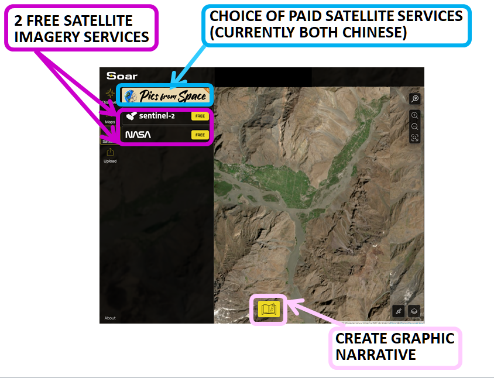

# Soar

## URL

[https://soar.earth/](https://soar.earth/)

## Description

\[Insert graphic of gif showing overlay of candidate Soar map over OSM background and increasing transparency to show perfect fit of Georeferenced map]

<mark style="color:$danger;">**NOTE: NOT ALL MAPS HAVE TRANSPARENCY FEATURE**</mark>&#x20;

<mark style="color:$danger;">**NOTE: Check base data is OSM**</mark>

<mark style="color:$danger;">**NOTE: Afton discovered some very high resolution 8cm per pixel maps from sources like EU on Soar**</mark>

<mark style="color:$danger;">**TEST is it the LoFi maps which don't have transparency by definition? TEST: Do all Georeferenced maps have transparency feature?**</mark>

<mark style="color:$danger;">**TEST: Does LoFi mean "Soar didn't fit over OSM" and Georeferenced mean "Soar did fit over OSM"? See LoFi defined Christian Triebert Crimean Bridge damage map**</mark>

<mark style="color:$danger;">**AMAZING FEATURE: TEST Does Soar AUTOFIT all Georeferenced maps over the basic OSM background by scaling and orientating them? Norte de Chile old map is a really good example.**</mark>

The Soar platform provides a number of services: <mark style="color:$danger;">**QUESTION: What is the difference between the features "Maps" and "Discover"? Is it actually just two routes to the same database, Maps being searched by location and Discover doing searching by topic and type? Afton's research shows different priorities in the search algorithms: TEST The Discover section offers no geo co-ordinates  input location but its search algorithm prioritises newly added material and regular contributors of content.**</mark>

1. A large database of maps and imagery displaying&#x20;

* a wide variety of geographically distributed information,e.g. weather, maritime tides, distribution of dust and ash, soil moisture, population, radar, ...&#x20;
* different time modalities, e.g. static maps created over a long time period stretching back to  <mark style="color:$danger;">**1800 (looking for read date of oldest),**</mark> maps displaying real time information feeds, animated gif maps displaying a sequence of changing information over time

These Soar database entries are searchable by : <mark style="color:$danger;">**Need to test what other search keys apart from Location can be used - there are filters in Discover section for 2 Map Types:**</mark> [<mark style="color:$danger;">**LoFi**</mark>](#user-content-fn-1)[^1] <mark style="color:$danger;">**and Georeferenced (use Soar definitions of these two terms - i.e. either fits over a geo world map or not), which we should probably define (I can't right now) and then about 15 categorisations (Afton finds categorisation to be arbitrary - TEST RESULT: one map can be categorised under more than one heading - test):**</mark>

* location (Maps Section designed for this)&#x20;
* **category (Discover Section designed for this)**

<figure><figcaption></figcaption></figure>

<figure><figcaption></figcaption></figure>

<figure><figcaption></figcaption></figure>

* georeference - i.e. can it scale to fit over a modern scientifically derived world map? (Discover section filters by this)

One of Soar's most immediately valuable features is the ability to overlay imagery and maps in layers and the adjust transparency. <mark style="color:$danger;">**TEST**</mark> <mark style="color:$danger;">**Need to test can we adjust the relative scale of the maps to get them to fit over one another in the same location?? Which of the two maps can we rescale? One or both? Or is the interaction with the satellite imagery different in these two modes of Map and Discover?**</mark>

Another very valuable feature is that Soar inserts connective links between maps which cover the same area. <mark style="color:$danger;">**TEST. Need to check this carefully and either bin or provide an example see**</mark> [<mark style="color:$danger;">**https://opengislab.com/blog/2021/7/11/exploring-a-digital-atlas-of-maps-and-imagery-on-soarearth**</mark>](https://opengislab.com/blog/2021/7/11/exploring-a-digital-atlas-of-maps-and-imagery-on-soarearth)

<mark style="color:$danger;">**NB Note that Soar puts labels over Thumbnail maps to give information as to format, but these formats don't correspond exactly to the filters offered by Soar - labels include "GIF", "REAL TIME", "DAILY", POPULAR", "NEW", "LoFi (which IS one of the filterable categories)**</mark>

2.  An interface supporting access to satellite imagery for areas of interest and timeframes specified by the user, offering both free and charged data:

    1. Sentinel-2 : Medium resolution, free
    2. NASA : Low resolution, free
    3. Pics from Space, charged [https://www.picsfromspace.com/](https://www.picsfromspace.com/) <mark style="color:$danger;">**Need to research this, needs login. Does it only provide SkyMap50 high resolution imagery? Looks like yes - See**</mark> [<mark style="color:$danger;">**https://spymesat.com/skymap.html**</mark>](https://spymesat.com/skymap.html) <mark style="color:$danger;">**"**</mark>_<mark style="color:$warning;">**Launched in 2018 (01 & 02) and 2018 (03 & 04) from the Taiyuan Satellite Launch Center in China, the four syn-synchronous satellites operate at an altitude of 500km and can monitor daily any location on the Earth at 50cm per pixel image resolution. At this zoom level, ground features such as individual trees, fences, cars and trucks can be all seen...**</mark><mark style="color:$warning;">SkyMap50 archival imagery orders can take between 2 to 5 working days to process and is available only in GeoTIFF format"</mark>_

    _&#x61;_&#x6E;d providing the ability to combine sequential satellite images into an animated gif.

Here's an uploaded gif map example of a wildfire [https://soar.earth/maps/oceania-judbarra-national-park-wildfire-australia-august-2025-136339?basemap=Hybrid\&pos=-16.199419136431956%2C130.41824000000003%2C9.99](https://soar.earth/maps/oceania-judbarra-national-park-wildfire-australia-august-2025-136339?basemap=Hybrid\&pos=-16.199419136431956%2C130.41824000000003%2C9.99)

<mark style="color:$danger;">**We thought we might illustrate a stoary with the Evergreen Ship incident,stuck in the Suez canal 23-29/3/21**</mark>

3. The facility to upload and share user maps (Formats are Georeferenced maps=GeoTIFF, ECW and JP2, LoFi Map formats = PNG and JPEG and create geographical media (called Stoaries <mark style="color:$danger;">**need to check the exact definition of a Stoary - is it a set of digital pages which can include gif animation? Stoaries - you can annotate a map (TEST maybe only an OSB background map, not a Soar upload) and it will allow you to add the coordinates of a map pin in any chosen metric system. You can add photos or video to locations**</mark> to communicate complex information, e.g. changes over time.

\[Insert screenshot graphic of the location co-ordinates feature for annotating maps in Stoary section.]

<mark style="color:$danger;">**NB There are quite a few things which don't actually export to GeoJSON format when you export**</mark>

<figure><figcaption>
<mark style="color:$danger;">Dont necessarily intend this to be in the finished entry, just showing it here</mark>
</figcaption></figure>

## The Interface <mark style="color:$danger;">is weird in my view, seems to have changed over time and old versions look better, need to c</mark>heck



Location

Location and time



Maps

Satellite imagery



Looking for a map

Looking for satellite imagery

Triangulating a problem by overlaying two data sources and using transparency



Input text name of location OR

Geographical co-ordinates OR

Point and click at a location on a map



<mark style="color:$danger;">**We need to detail the tools for measurement, annotation and sharing, and link to the Toolkit QGIS entry**</mark>

&#x20;  1\. On-Map Tools: <mark style="color:$danger;">**graphics helpful here**</mark>

&#x20; Area Measurement: Calculate area in km².

&#x20; Ruler: Measure linear distances in km.

&#x20; KML Import: Import KML files for overlay and AOI definition.

&#x20; Text, Arrow, Circle, Square tools for annotations.

&#x20; Latitude/Longitude display.

2\. QGIS Plugin (for advanced users):

* Direct export of QGIS maps and images to Soar.
* Browse and load Soar's public catalog into QGIS projects.
* Batch upload functionality.

Source: [Soar.Earth Digital Atlas QGIS Plugin - North Road](https://north-road.com/2023/08/24/soar-earth-digital-atlas-qgis-plugin/)

3\. Collaboration Features: <mark style="color:$info;">The pin feature and embed maps are not a feature that is available anymore, I was looking for it for about an hour but cannot find it. So this must be outdated. I will strike through for now instead of delete.</mark>&#x20;

* "<mark style="color:$info;">P</mark>~~<mark style="color:$info;">in" feature to save and overlay layers.</mark>~~
* ~~<mark style="color:$info;">Annotations visible in embedded maps for collaborative context.</mark>~~

[~~<mark style="color:$info;">https://about.soar.earth/blog-pages/soar-earth-launches-interactive-maps-on-any-website-with-new-embedded-map-tool</mark>~~](https://about.soar.earth/blog-pages/soar-earth-launches-interactive-maps-on-any-website-with-new-embedded-map-tool)

## Cost

* [x] Free
* [x] Partially Free
* [ ] Paid

\[\[Pricing or subscription information, if relevant.]]

## Level of difficulty

<table><thead><tr><th data-type="rating" data-max="5"></th></tr></thead><tbody><tr><td>1</td></tr></tbody></table>

Some Satellite images that are high quality - can take long to load when zooming in and out (i.e. [https://soar.earth/maps/world-cloud-properties-western-hemisphere-last-10-minutes-132716?pos=-26.623553540465934%2C-23.02786284286767%2C3.69](https://soar.earth/maps/world-cloud-properties-western-hemisphere-last-10-minutes-132716?pos=-26.623553540465934%2C-23.02786284286767%2C3.69))&#x20;

Difficulty Level and Learning Curve:

Overall: For a casual user exploring maps, the difficulty is low. For an investigator requiring precise data or intending to contribute advanced imagery, the difficulty is moderate, requiring some understanding of geospatial data principles or reliance on integrated GIS tools.

* General User Interface: Soar.earth is generally designed to be user-friendly for basic exploration and viewing of maps and imagery. Many reviews and promotional materials highlight its intuitive interface, with features like a transparency slider and easy navigation. Basic functions such as account registration, Browse maps, and simple satellite searches are quick and easy to learn.
* Intermediate to Advanced Use: The difficulty level increases for more advanced functionalities such as:
* Uploading and Georeferencing: While the process is streamlined, users uploading their own maps or drone imagery need to ensure proper georeferencing and rectification. The platform has strict guidelines for alignment, which may require some prior knowledge or learning on the user's part, especially if their original data lacks precise georeferencing. The QGIS plugin simplifies this for GIS-savvy users but implies a higher barrier for those without GIS software experience.
* Source: [Soar.Earth Upload Guide](https://about.soar.earth/documents/Soar.Earth-Upload-Guide_2021_landscape2.pdf), [Soar.Earth Digital Atlas QGIS Plugin - North Road](https://north-road.com/2023/08/24/soar-earth-digital-atlas-qgis-plugin/)
* Effective Satellite Data Selection: Understanding the nuances between Landsat, Sentinel, and SkyMap50 (e.g., resolution, revisit times, cost implications) to select the most appropriate imagery for a specific investigative objective requires a degree of familiarity with remote sensing concepts.
* Source: [How to choose satellite imagery on Soar](https://about.soar.earth/blog-pages/how-to-choose-satellite-imagery-on-soar)
* Data Analysis Beyond Basic Visualization: While Soar provides basic tools like measurement and annotation, complex spatial analysis typically requires exporting data to dedicated GIS software (like QGIS), indicating that Soar serves more as a data repository and visualization tool than a comprehensive analytical suite.

## Requirements

\[\[Information on the requirement for using a tool, for instance, API key, e-mail address etc.]]

## Limitations

<mark style="color:$danger;">**Do we move some of the content above from the Level of Difficulty section?**</mark>

## Ethical Considerations

A. Data Verification and Accuracy:

* Cross-reference Soar.earth imagery with other sources (e.g., commercial satellite providers, ground reports) to ensure accuracy
* Understand the limitations of satellite imagery (e.g., cloud cover, revisit times, resolution).
* Source: [Help - Soar (on real-time imagery limitations)](https://about.soar.earth/help)

B. Privacy / Consent:

* Be mindful of privacy implications when analyzing high-resolution imagery, particularly concerning private property or individuals.
* Adhere to ethical guidelines regarding data collection and dissemination.

C. Misinformation and Disinformation:

* Be aware that user-generated content, while valuable, may not always be authoritative. Always verify the source and context of shared maps/imagery.
* Utilize critical thinking to assess the intent and reliability of uploaded data.

D. Responsible Sharing:

* Ensure that any shared analysis or imagery respects privacy, security, and ethical considerations.
* Consider the potential impact of disseminated information.

## Guides and articles <mark style="color:$danger;">Soar seems to have good YouTube videos? need to find more</mark>

[Exploring a Digital Atlas of Maps and Imagery on Soar.Earth - open.gis.lab](https://opengislab.com/blog/2021/7/11/exploring-a-digital-atlas-of-maps-and-imagery-on-soarearth), [Soar Tutorials - YouTube](https://www.google.com/search?q=https://www.youtube.com/playlist%3Flist%3DPL44e5M4E2bX-x1Q-y3d2f-1h9zV5r3jP5)

[Exploring a Digital Atlas of Maps and Imagery on Soar.Earth from Open.gis.lab](https://opengislab.com/blog/2021/7/11/exploring-a-digital-atlas-of-maps-and-imagery-on-soarearth)

## Similar Tools

Similar for creating Stoaries, seeing satellite imagery...

For satellite image combination into animated gif, compare with integrated Sentinel functionality, also ezgif free online tool,...

## Tool provider

Soar, Perth, Australia<mark style="color:$danger;">**?**</mark>

## Advertising Trackers

* [ ] This tool has not been checked for advertising trackers yet.
* [x] This tool uses tracking cookies. Use with caution.
* [ ] This tool does not appear to use tracking cookies.

| Page maintainer                                            |
| ---------------------------------------------------------- |
| Afton 2/9/25 21:39 GMT and Sophie Tedling 2/9/25 20:15 GMT |
|                                                            |

[^1]: Another terms is schematic
