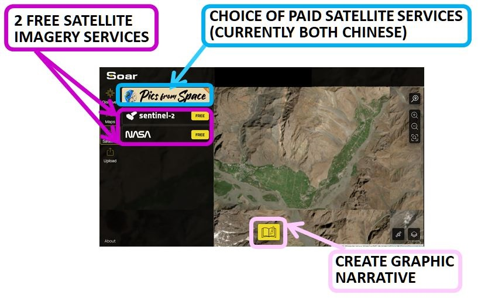

# Draft Material for ReUse

## Soar

<h4 align="center">🗺️ Interactive Soar Atlas Map</h4>

<em><mark style="color:blue;"><strong>Click the image</strong></mark><strong> to explore the visualization created to test this feature.</strong></em> 

Soar is a platform sharing a growing database of over a million entries (maps, satellite, aerial & radar imagery), access to imagery from statellite providers, and tools to create geographic narratives

Soar is a database of over a million diverse maps & images , on a platform where users can explore, upload, share and interact with a vast collection of content (including satellite, aerial & radar).

## URL

[https://soaratlas.com/discover](https://soaratlas.com/discover)

## Description

<figure><figcaption></figcaption></figure>

Soar is described as a Digital Atlas containing over a million maps. Its main functions are:

* **Map Database access**

Provision of [read and write access](#user-content-fn-1)[^1] to a large and growing searchable database of maps from all geographies, indexed in many dimensions, such as resolution, georeference status,  topical interest category. These include maps animated to show change over time and drone imagery, as well as satellite imagery.

* **Selection and acquisition of Satellite Imagery**

Selection and acquisition of satellite imagery from a range of providers, both free and purchased. Available satellite paths can be displayed and filtered over any map of interest, so that users can direct their search for relevant satellite imagery to the appropriate satellite service, date and time.

* **Narrative Creation**

Provision of online visualisation features allowing the creation of multi-image narratives.&#x20;

These functions constitute some of the major tasks which Open Source researchers undertake during investigations, making Soar **a multi-purpose platform for OSINV.**


Note that some satellite imagery maps in the Soar database are of very high quality, i.e. 8cm per pixel resolution, making them particularly valuable resources when they cover a researcher's region of interest.


### The Soar Interface


The Discover and Maps sections of the Soar interface are in fact just different routes to the same information - the maps database. Discover is centred around searching information by category, whilst Maps is centred around searching for information by location.


<figure><figcaption></figcaption></figure>

#### Navigating the Interface to the Soar Map Database

<figure><figcaption></figcaption></figure>

When working from a location, users can:

* Enter a name or co-ordinates, Zoom to a region and select an exact bounding box location.
* View and filter the maps presented by Soar around this specific location
* Select a map and, if available, change Transparency to inspect the overlay of the georeferenced map against the base map, comparing features
* Change the base map to inspect against OpenStreetMap, OpenElevation, Satellite and Hybrid views
* Open and filter satellite paths to establish which could provide imagery of the region
* Invoke SATELLITE mode to find historic imagery or to commission immediate satellite imagery of the specifc location (both free and paid offered)
* Invoke STOARY mode to create narrative content
* Invoke UPLOAD mode to add content to the Soar database
*
* iew and filter the maps presented by Soar around this specific location
* Select a map and, if available, change Transparency to inspect the overlay of the georeferenced map against the base map, comparing features
* Change the base map to inspect against OpenStreetMap, OpenElevation, Satellite and Hybrid views
* Open and filter satellite paths to establish which could provide imagery of the region
* Invoke SATELLITE mode to find historic imagery or to commission immediate satellite imagery of the specifc location (both free and paid offered)
* Invoke STOARY mode to create narrative content
* Invoke UPLOAD mode to add content to the Soar database

#### At Satellite Level

<figure><figcaption></figcaption></figure>

The Soar satellite interface supports access to satellite imagery for areas of interest and timeframes specified by the user, offering both free and charged data:

1. Sentinel-2 : Medium resolution, free
2. NASA : Low resolution, free
3. Pics from Space, a charged service at [https://www.picsfromspace.com/](https://www.picsfromspace.com/), which offers charged data from two [Chinese satellite services](#user-content-fn-2)[^2], including the ability to commission new satellite imagery according to user specification. &#x20;

_&#x61;_&#x6E;d providing the ability to combine sequential satellite images into an animated gif via the Sentinel interface.

Here's an uploaded [gif map example of a wildfire](https://soar.earth/maps/oceania-judbarra-national-park-wildfire-australia-august-2025-136339?basemap=Hybrid\&pos=-16.199419136431956%2C130.41824000000003%2C9.99)

### Soar Data: Input, Output and Use Cases



* Location&#x20;
* Map filtering properties, e.g Map category, Map format, Map indexing tags
* Satellite filtering properties
* Animated satellite GIF sequence properties
* Media for graphical narrative creation



### <mark style="color:$primary;">Maybe a Hint? Definitely a limitation!</mark>


There are quite a few elements which don't actually export to GeoJSON format from Soar



### <mark style="color:$primary;">Is there a separate item about making animated GIFS? Is that just Satellite site functionality, passed through?</mark>

#### A**t Narrative Creation Level**

<figure><figcaption></figcaption></figure>

&#x20;  1\. **On-Map Tools for Drawing, Map-making and Image Import include:**

* Area Measurement: Calculate area in km².
* Ruler: Measure linear distances in km.
* KML Import: Import KML files for overlay and AOI definition.
* Text, Arrow, Circle, Square tools for annotations.
* Latitude/Longitude display.

2\. **QGIS Plugin (for advanced users) provides:** <mark style="color:$info;">**TO TEST !! AFTON TO TEST AGAIN!! THEN SOPHIE ADD TO INTERFACE**</mark>

* Direct export of QGIS maps and images to Soar.
* Browse and load Soar's public catalog into QGIS projects.
* Batch upload functionality.

Source: [Soar.Earth Digital Atlas QGIS Plugin - North Road](https://north-road.com/2023/08/24/soar-earth-digital-atlas-qgis-plugin/)

Soar groups maps under a developing framework of categories. <em>Click the arrow to see some typical Soar categories as at October 25...</em>

Agriculture\
Climate\
Conflict Zone\
Culture\
Demographics\
Earth Art\
Economic\
Environment\
Geology\
History\
Imagery\
Marine/Nautical\
Politics\
Radar\
Spaceport\
Elevation/Topography\
Transport\
Urban

Soar's repository of over a million maps covers diverse locations, topics and timeframes. <em><strong>Click the arrow to see Soar map example</strong></em>

<table data-view="cards"><thead><tr><th></th><th></th><th data-hidden data-card-cover data-type="image">Cover image</th></tr></thead><tbody><tr><td><a href="https://soaratlas.com/maps/16958?pos=39.94681663720949%2C67.28800356363985%2C6.29"><strong>Russian Map dated 1776</strong></a></td><td>Despite its age, this map is georeferenced to fit over a modern OpenStreetMap  worldmap. </td><td><a href=".gitbook/assets/russia1776.JPG">russia1776.JPG</a></td></tr><tr><td><a href="https://soaratlas.com/maps/asia-construction-timelapse-of-wenchang-space-launch-site-china-135903?basemap=Satellite&#x26;pos=19.616924298644264%2C110.92303733295931%2C13.83"><strong>Construction Timelapse of Wenchang Space Launch Site, China</strong></a></td><td>This animated GIF of satellite imagery shows the construction of a Chinese spaceport.</td><td><a href=".gitbook/assets/wenchanglaunchchina.JPG">wenchanglaunchchina.JPG</a></td></tr><tr><td><a href="https://soaratlas.com/maps/global-world-sea-surface-temperature-last-24-hrs-1-2-15100?basemap=Satellite&#x26;pos=8.56359579134514%2C-21.14956646078772%2C2.5"><strong>World Sea Surface Temperatures, Last 24 hours from NASA</strong></a></td><td>This data feed map shows sea temperatures in degrees Centrigrade and usually updates daily.</td><td><a href=".gitbook/assets/nasaworldseatemps.JPG">nasaworldseatemps.JPG</a></td></tr></tbody></table>

[^1]: Soar allows users to view maps in the database, and also make their own annotated copies of those maps. Users can upload their own maps to be added to the database

[^2]: "_**Launched in 2018 (01 & 02) and 2018 (03 & 04) from the Taiyuan Satellite Launch Center in China, the four syn-synchronous satellites operate at an altitude of 500km and can monitor daily any location on the Earth at 50cm per pixel image resolution. At this zoom level, ground features such as individual trees, fences, cars and trucks can be all seen...**&#x53;kyMap50 archival imagery orders can take between 2 to 5 working days to process and is available only in GeoTIFF format" Soar website_
