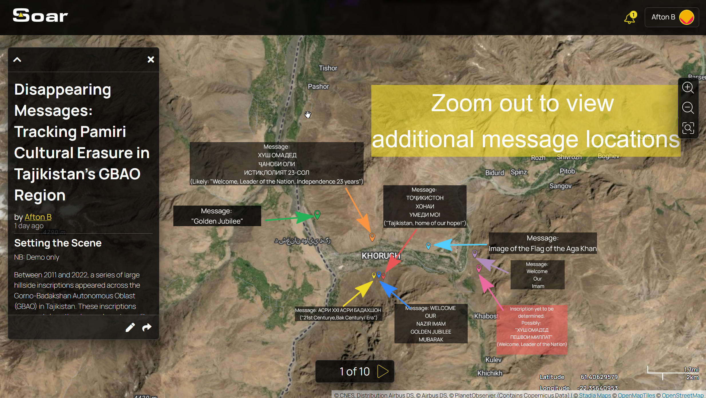

# Page 1AftonSharingTest

2. **Page Management Tools**

<figure><figcaption></figcaption></figure>

Soar's step-by-step guide to creating a Stoary is found [here](https://youtu.be/G97wi-zaTfM?si=5d4vcSnTD4l_RgNj).

We utilized research conducted by Bellingcat Volunteer Community members on Tajikistan to demonstrate narrative creation on Soar's 'Stoary.'

**OUTPUT: What Soar Produces**

* Interactive slide presentation (not a video): View the actual Soar narrative output based on our tests here: [https://soaratlas.com/draw/2523](https://soaratlas.com/draw/2523)




NOTE: This is for demonstration purposes only and does not constitute an investigation.


<figure><figcaption></figcaption></figure>

<figure><figcaption></figcaption></figure>

<h4 align="center">testing embed:</h4>

#### 🗺️ Interactive Soar Atlas Map

> Click the image above to view the full interactive visualization on Soar Atlas.

<h4 align="center">🗺️ Interactive Soar Atlas Map</h4>

<em>Click the image to explore the live Soar Atlas visualization</em>

