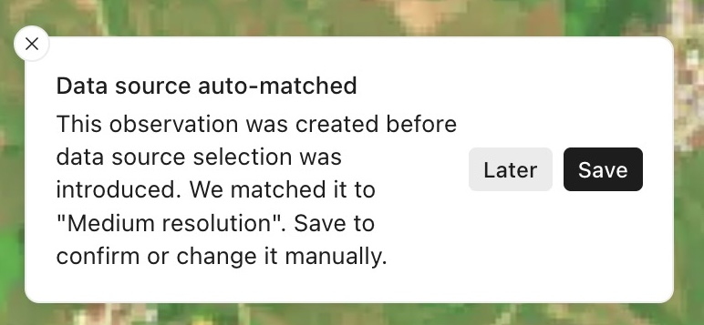
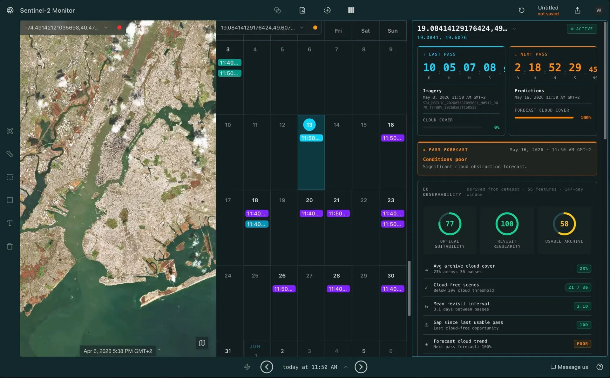
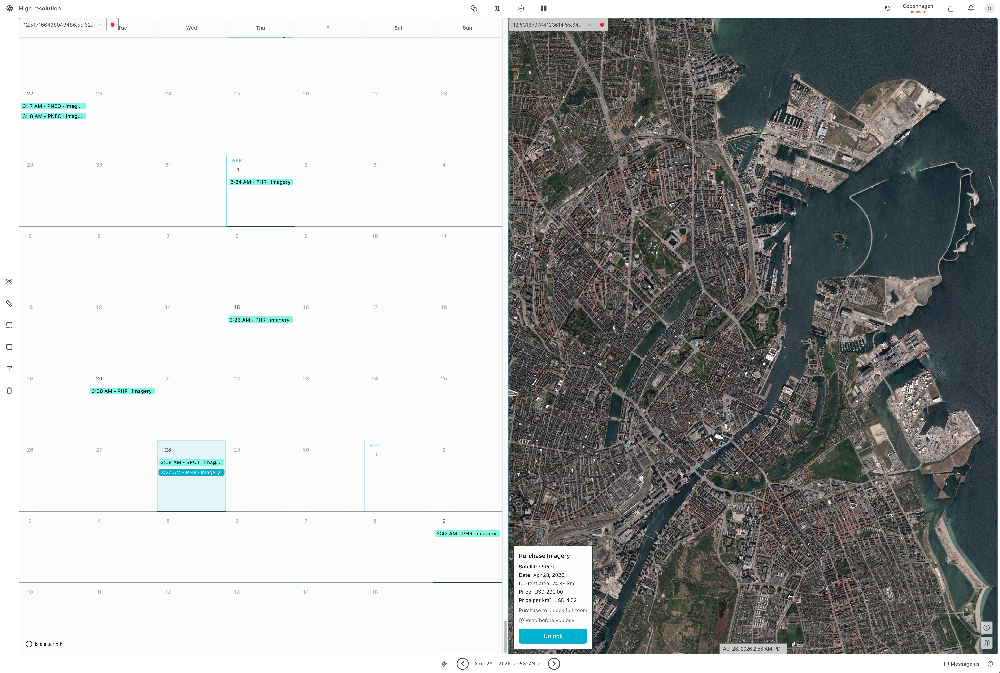

# Obsearth (formerly Spectator Earth)

## URL

[https://obsearth.com/](https://obsearth.com/)

## Description

Obsearth is a web-based interface for Earth observation that helps users track satellites, discover imagery, and explore archives. It focuses on scene acquisition planning - i.e. how, where and when to obtain optimal satellite imagery relevant to supporting an investigation.

Obsearth - released 22 Jun 2026 - is a reimagining of the Spectator Earth app that preceded it. As per [https://obsearth.com/migration](https://obsearth.com/migration), workflow focus has been changed. “Observations now work differently, including a move from explicit scene selection to timestamp-based selection.”

The main data sources are Sentinel, Landsat, commercial VHR imagery, and operator-supplied acquisition plans.

Some functionality and imagery is free. Advanced functions and higher resolution imagery are available for purchase.

### Migration from Spectator Earth

[Migration details](https://obsearth.com/migration)

When loading a saved observation that was created in Spectator Earth, a [data source](#user-content-fn-1)[^1] is automatically assigned.

<figure><figcaption></figcaption></figure>

## Features

* Tracking satellites and finding imagery.
* Browsing past and future scenes.
* Comparing images in split view mode.
* Viewing metadata and analytics.
* API for automation-friendly workflows.

**Past and future data access**\
Review historical captures and quickly inspect upcoming opportunities.

**Split view for scene comparison**\
Place scenes and locations side by side to compare algorithms, patterns, and changes.

**Meta analytics**\
Quickly assess area of interest with weather predictions and archive data analytics.

<figure><figcaption></figcaption></figure>

## Datasets

[Acquisition plans](#user-content-fn-2)[^2] show where and when satellites are scheduled to capture imagery.

Satellite sources include:

* [Sentinel-2 (ESA Copernicus)](https://dataspace.copernicus.eu/data-collections/copernicus-sentinel-missions/sentinel-2)
* [Sentinel-1 (ESA Copernicus)](https://dataspace.copernicus.eu/data-collections/copernicus-sentinel-missions/sentinel-1)
* [Landsat (USGS / NASA)](https://science.nasa.gov/mission/landsat/)

Available lens presets:

* Medium resolution -- 6 sat.imagery, predictions, clouds ≤ 100%
* High resolution -- 6 sat.commercial-imagery
* Sentinel-2 Imagery -- 3 sat.imagery
* Landsat Imagery -- 3 sat.imagery
* Copernicus Constellation -- 9 sat.trajectory, position
* Copernicus Acquisition Plans -- 7 sat.acquisition
* Mixed resolution -- 12 sat.imagery, commercial-imagery, clouds ≤ 20%
* Landsat monitor -- 3 sat.acquisition, imagery, predictions, clouds ≤ 100%
* Landsat Orbits -- 3 sat.trajectory, position
* Medium resolution, Clear Sky -- 6 sat.imagery, clouds ≤ 20%
* Sentinel-1 Acquisition Plans -- 3 sat.acquisition
* Sentinel-1 Mission -- 4 sat.acquisition, overpass, trajectory, position
* Sentinel-2 and Landsat Acquisition Plans -- 6 sat.acquisition
* Sentinel-2 monitor -- 3 sat.acquisition, imagery, trajectory, predictions, clouds ≤ 100%
* Sentinel-2 Orbits -- 3 sat.trajectory, position
* Sentinel-2 Pass Forecast -- 3 sat.overpass, trajectory, position

Obsearth aggregates acquisition plans from multiple open satellite programs and displays them on an interactive map. Once you navigate to an area of interest you can view archived[^3] or scheduled[^4] captures.

The split view shown below is an example of a satellite overpass schedule for a given location side-by-side with imagery of that location from a specified overpass.

<figure><figcaption>
Example of a split view showing a satellite overpass schedule for a given location side-by-side with imagery of that location from a specified overpass.
</figcaption></figure>

## API[^5]

* Explore all the functionalities programmatically
* Automate your workflow
* Integrate information from Obsearth into your application
* API access is available with the [Pro plan](https://obsearth.com/pricing/)

[API Documentation](https://api.spectator.earth/)

## Cost

* [ ] Free
* [x] Partially Free
* [ ] Paid

Some functionality and imagery is free. Advanced functions and higher resolution imagery are available for purchase.

You can browse limited data and use some app features without paying. Paid options are mainly for advanced features and commercial high-resolution imagery access.


Discounted access is offered for academic and non-profit research use. To apply, submit a request via the "apply for discount" link on the [pricing page](https://obsearth.com/pricing).


[Plans and pricing](https://obsearth.com/pricing/)

## Level of difficulty

<table><thead><tr><th data-type="rating" data-max="5"></th></tr></thead><tbody><tr><td>3</td></tr></tbody></table>

As of writing, documentation is sparse for this new release - hence the 3 stars. Subject to change when/if documentation is forthcoming.

## Requirements

Obsearth is web-based and will run in any modern browser on any OS. An internet connection is required.

Without registering, you can use the default lens configuration ("Medium resolution"), switch between Calendar and Map views, and browse archival imagery. For all functionality beyond that, you need to register and log in.

The app appears to be computer resource and bandwidth heavy, but more testing is needed.

## Limitations

At this early stage, just days after the app's release, several factors combine to limit use. It's heavy on computer resources and bandwidth, has non-intuitive UI in some places, includes sparse data for some locations, and most importantly, lacks substantial documentation. In addition, some functions are locked in the free version.

## Ethical Considerations

**Privacy Concerns:** Remote sensing technologies can capture detailed images from space or high altitude, potentially compromising individual privacy. Researchers must balance the public interest with the rights to privacy.

**Accuracy and Misinterpretation:** Ensuring the accurate representation of data is critical. Misinterpretation of remote sensing data can lead to misinformation, shaping public opinion based on incorrect premises. Each dataset may have different standards for accuracy.

## Guides and articles

Just two days into the release of Obsearth - only a video "Tour" button on the interface and an FAQs section serve as documentation or guides as yet.

## Tool provider

Obsearth Limited (Scotland) / Spectator sp. z o.o. (Poland)

## Similar tools

Copernicus Browser

## Advertising Trackers

* [ ] This tool has not been checked for advertising trackers yet.
* [x] This tool uses tracking cookies. Use with caution.
* [ ] This tool does not appear to use tracking cookies.

| Page maintainer                        |
| -------------------------------------- |
| Bellingcat Team. Updated Gregg 25/6/25 |
|                                        |

[^1]: Data sources are selected from a list of options in the "lens" in Obsearth. Refer to the Datasets section below for details.

[^2]: How, where and when to obtain optimal satellite imagery relevant to supporting an investigation.

[^3]: Imagery already captured (i.e. from an overpass in the past).

[^4]: Imagery from a future overpass  that you have specified for capture.

[^5]: Application Programming Interface
