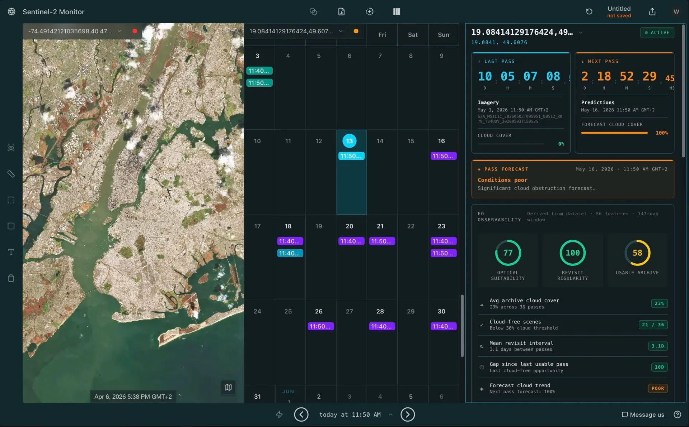
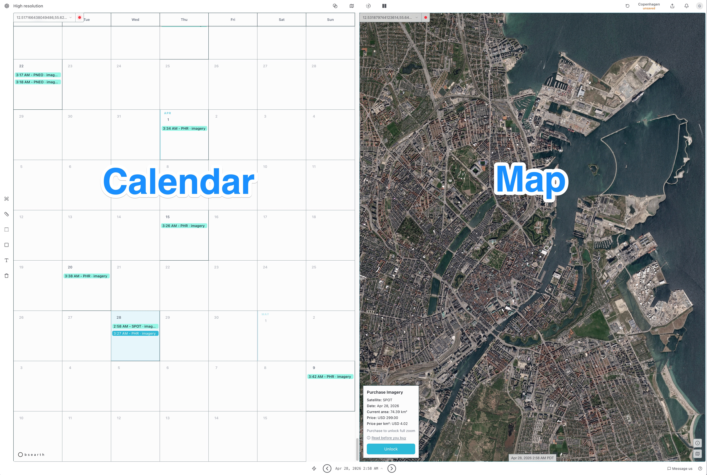
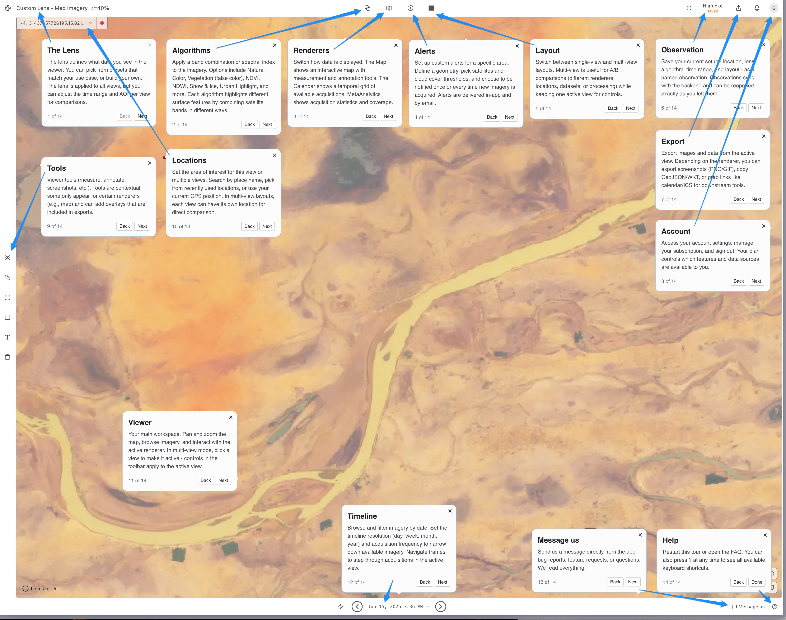

# Obsearth (formerly Spectator Earth)

## URL

[https://obsearth.com/](https://obsearth.com/)

## Description

Obsearth is a web-based interface for Earth observation that helps users track satellites, discover imagery, and explore archives. It focuses on scene acquisition planning - i.e. where, when and how to obtain optimal satellite imagery relevant to supporting an investigation.

**Where:** Identify your area of interest, zoom to the region, and use Obsearth to find satellite imagery relevant to that location.

**When:** Review available scenes over time, compare historical imagery, and use any upcoming satellite coverage information as a guide for when new imagery may become available.

**How:** Document observations, compare scenes, and build a time-based record that supports your OSINV analysis, while using future collection details for planning.

The main data sources are Sentinel, Landsat, commercial VHR imagery, and operator-supplied acquisition plans.

Some functionality and imagery is free. Advanced functions and higher resolution imagery are available for purchase.

Obsearth was released 22 Jun 2026 as a rebuild of the Spectator Earth app that preceded it. As per [https://obsearth.com/migration](https://obsearth.com/migration), workflow focus has been changed. Rather than selecting a satellite scene or image product and attaching an observation to it, you now start by selecting a date and time and associating relevant imagery or satellite data. This approach better accommodates time-based comparisons.&#x20;

When loading a saved observation that was created in Spectator Earth, a [data source](#user-content-fn-1)[^1] is automatically assigned. Refer to [Migration details](https://obsearth.com/migration).

## Features

**Tracking satellites and finding imagery**

Quickly assess your area of interest using weather forecasts and analysis of archived imagery via meta analytics.

**Browsing historical imagery and upcoming satellite overpasses**

Search older imagery by date range and move through earlier images using observation/image filters. Browse satellite overpass schedules for a given location to anticipate future image opportunities.

**Comparing images in split view mode**

Place scenes and locations side by side on the screen to compare different analysis methods, identify patterns, and track changes over time.

**Application Programming Interface (**[**API**](https://dev.to/icornea/what-are-apis-a-beginners-guide-with-examples-4ok8)**)**

Utilize an API for automation-friendly workflows.

<figure><figcaption>
Split view mode showing map, calendar and meta analytics (which includes overpass schedule and cloud cover data)
</figcaption></figure>

### Datasets

[Acquisition plans](#user-content-fn-2)[^2] show where and when satellites are scheduled to capture imagery.

Satellite sources include:

* **Sentinel-2 (ESA Copernicus)** - A multispectral optical-imaging mission that provides high-resolution imagery for monitoring land, vegetation, soil, inland waters, and coastal areas. [Read more.](https://dataspace.copernicus.eu/data-collections/copernicus-sentinel-missions/sentinel-2)
* **Sentinel-1 (ESA Copernicus)** - A C-band synthetic-aperture radar mission that captures day-and-night, all-weather imagery, making it useful for monitoring land, water, ice, and surface change despite cloud cover. [Read more.](https://dataspace.copernicus.eu/data-collections/copernicus-sentinel-missions/sentinel-1)
* **Landsat (USGS / NASA)** - A long-running Earth-observation program that provides a continuous record of land-surface change using optical, near-infrared, shortwave-infrared, and thermal-infrared data. [Read more.](https://science.nasa.gov/mission/landsat/)

In Obsearth, “lens presets” let you apply saved view settings to scenes for consistent comparison across locations and dates. The stock lens presets are:

<table data-search="false"><thead><tr><th width="218.65863037109375">Lens Preset</th><th width="216.3858642578125">Obsearth's Summary*</th><th>Example Use Case</th></tr></thead><tbody><tr><td>Medium resolution</td><td>
6 sat.imagery, predictions, clouds 

≤ 100%
</td><td>General scene review, broad-area change detection, or quick context on an area of interest.</td></tr><tr><td>High resolution</td><td>6 sat.commercial-imagery</td><td>Detailed inspection of a site where finer visual detail matters, especially for commercial imagery.</td></tr><tr><td>Sentinel-2 Imagery</td><td>3 sat.imagery</td><td>Multispectral analysis of land cover, vegetation, water, burn scars, or environmental change.</td></tr><tr><td>Landsat Imagery</td><td>3 sat.imagery</td><td>Longer-term historical comparison and broad environmental monitoring.</td></tr><tr><td>Copernicus Constellation</td><td>9 sat.trajectory, position</td><td>Orbit and position awareness for Copernicus satellites when planning imagery-based analysis.</td></tr><tr><td>Copernicus Acquisition Plans</td><td>7 sat.acquisition</td><td>Anticipating likely coverage windows and potential future acquisitions.</td></tr><tr><td>Mixed resolution</td><td>12 sat.imagery, commercial-imagery, clouds ≤ 20%</td><td>Combining different imagery sources for a broader investigative workflow.</td></tr><tr><td>Landsat monitor</td><td>3 sat.acquisition, imagery, predictions, clouds ≤ 100%</td><td>Tracking Landsat availability and using it for recurring environmental or land-change review.</td></tr><tr><td>Landsat Orbits</td><td>3 sat.trajectory, position</td><td>Understanding Landsat satellite position and pass geometry.</td></tr><tr><td>Medium resolution, Clear Sky</td><td>
6 sat.imagery, clouds 

≤ 20%
</td><td>Searching for more usable scenes when cloud contamination is a concern.</td></tr><tr><td>Sentinel-1 Acquisition Plans</td><td>3 sat.acquisition</td><td>Planning radar-based coverage, especially when optical imagery may be limited.</td></tr><tr><td>Sentinel-1 Mission</td><td>4 sat.acquisition, overpass, trajectory, position</td><td>Reviewing Sentinel-1 orbit, overpass, and acquisition context for radar analysis.</td></tr><tr><td>Sentinel-2 and Landsat Acquisition Plans</td><td>6 sat.acquisition</td><td>Comparing future coverage opportunities across Sentinel-2 and Landsat missions.</td></tr><tr><td>Sentinel-2 monitor</td><td>
3 sat.acquisition, imagery, trajectory, predictions, clouds 

≤ 100%
</td><td>Monitoring Sentinel-2 availability and using it for recurring imagery review.</td></tr><tr><td>Sentinel-2 Orbits</td><td>3 sat.trajectory, position</td><td>Understanding Sentinel-2 position and orbit geometry.</td></tr><tr><td>Sentinel-2 Pass Forecast</td><td>3 sat.overpass, trajectory, position</td><td>Estimating when Sentinel-2 may next cover an area of interest.</td></tr></tbody></table>

\* Numbers in summaries refer to the number imagery sources/layers included. The tag tells you what kind of satellite information the preset is centered on: imagery for visual scenes, acquisition for planned collection windows, commercial-imagery for paid/vendor imagery, and trajectory/position for orbit geometry and where the satellite is in space.

### Split View Mode

Obsearth aggregates acquisition history and plans from multiple open satellite programs and displays them on an interactive map. Once you navigate to an area of interest you can view archived[^3] or scheduled[^4] captures.

The split view shown below is an example of a satellite overpass schedule for a given location side-by-side with imagery of that location from a specified overpass.

<figure><figcaption>
Example of a split view showing a satellite overpass schedule for a given location side-by-side with imagery of that location from a specified overpass.
</figcaption></figure>

### [API (Application Programming Interface)](https://dev.to/icornea/what-are-apis-a-beginners-guide-with-examples-4ok8)

The API can be used to interact programmatically with some of the web app’s capabilities. For example, you can:

* Search for data
* Request images in a specified resolution
* Track satellite passes

API access is only available via the paid account type called the [Pro Plan](https://obsearth.com/pricing/).

Comprehensive API documentation is available from Obsearth's developers at [API Documentation](https://api.spectator.earth/).

## Cost

* [ ] Free
* [x] Partially Free
* [ ] Paid

Some functionality and imagery is free. Advanced functions and higher resolution imagery are available for purchase.

You can browse limited data and use some app features without paying. Paid options are mainly for advanced features and commercial high-resolution imagery access.

You can find information about plans and pricing [here](https://obsearth.com/pricing/).


Discounted access is offered for academic and non-profit research use. To apply, submit a request via the "apply for discount" link on the [pricing page](https://obsearth.com/pricing).


## Level of difficulty

<table><thead><tr><th data-type="rating" data-max="5"></th></tr></thead><tbody><tr><td>2</td></tr></tbody></table>

As of writing, documentation consists only of a "tour" of the user interface and a set of FAQs. The level of difficulty is thus subject to change when/if a robust set of documentation is forthcoming.

## Requirements

Obsearth is web-based and will run in any modern browser on any OS. An internet connection is required.

Without registering, you can use the default lens configuration ("Medium resolution"), switch between Calendar and Map views, and browse archival imagery. For all functionality beyond that, you need to register and log in.

The app appears to be computer resource and bandwidth heavy, but more testing is needed.

## Limitations

At this early stage, just days after the app's release, several factors combine to limit use. It's heavy on computer resources and bandwidth, has non-intuitive UI in some places, includes sparse data for some locations, and most importantly, lacks substantial documentation. In addition, some functions are locked in the free version.

## Ethical Considerations

**Privacy Concerns:** Remote sensing technologies can capture detailed images from space or high altitude, potentially compromising individual privacy. Researchers must balance the public interest with the rights to privacy.

**Accuracy and Misinterpretation:** Ensuring the accurate representation of data is critical. Misinterpretation of remote sensing data can lead to misinformation, shaping public opinion based on incorrect premises. Each dataset may have different standards for accuracy.

## Guides and articles

Just a few days into the release of Obsearth, the only documentation that exists is an interactive "Tour" of the user interface (accessed via the help button at lower right) and an [FAQ page](https://obsearth.com/faq?q=).

<figure><figcaption>
Aggregate view of the "tour" of the user interface.
</figcaption></figure>

## Tool provider

Obsearth Limited (Scotland) / Spectator sp. z o.o. (Poland)

## Similar tools

[SpyMeSat](https://www.spymesat.com/) is similar to Obsearth in that they are both built around overpass awareness and imagery access workflows.

[Copernicus Browser](https://bellingcat.gitbook.io/toolkit/more/all-tools/sentinal-hub-playground) and [EOSDA LandViewer](http://eos.com/landviewer) are access platforms for Earth-observation data but they emphasize data access, processing, and analysis rather than overpass planning and acquisition of future imagery.

## Advertising Trackers

* [ ] This tool has not been checked for advertising trackers yet.
* [x] This tool uses tracking cookies. Use with caution.
* [ ] This tool does not appear to use tracking cookies.

| Page maintainer                                                      |
| -------------------------------------------------------------------- |
| Bellingcat Volunteer Team. Updated by Gregg Butensky on 06 Aug 2026. |
|                                                                      |

[^1]: Data sources are selected from a list of options in the "lens" in Obsearth. Refer to the Datasets section below for details.

[^2]: How, where and when to obtain optimal satellite imagery relevant to supporting an investigation.

[^3]: Imagery already captured (i.e. from an overpass in the past).

[^4]: Imagery from a future overpass  that you have specified for capture.
