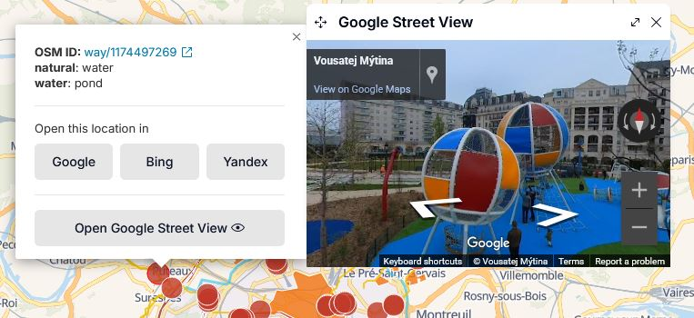
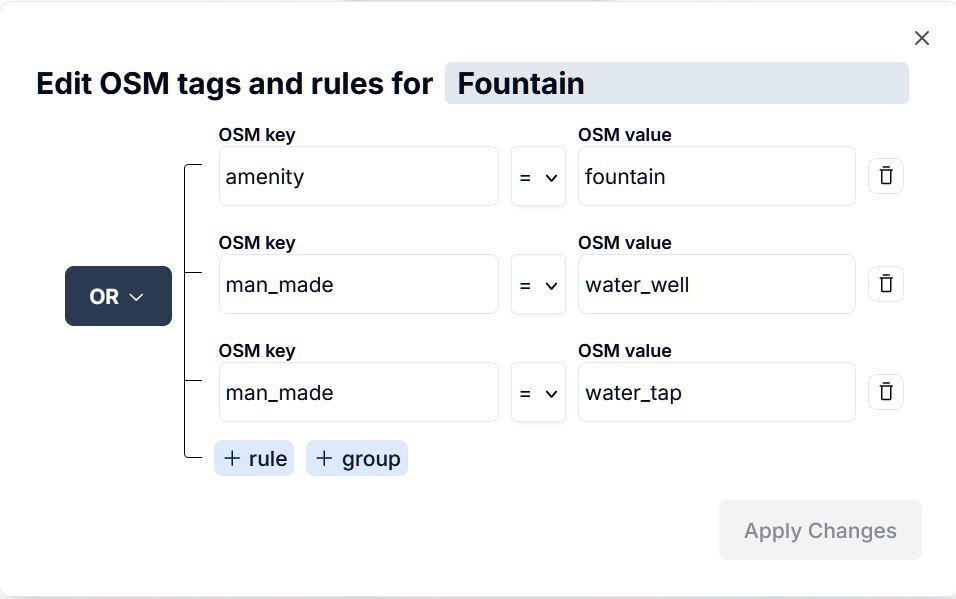
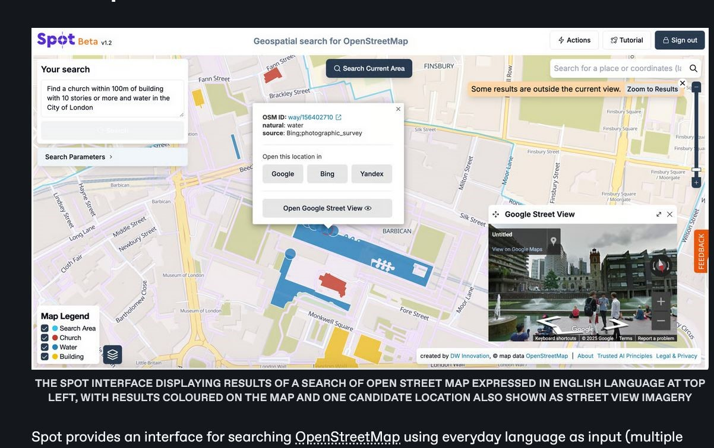
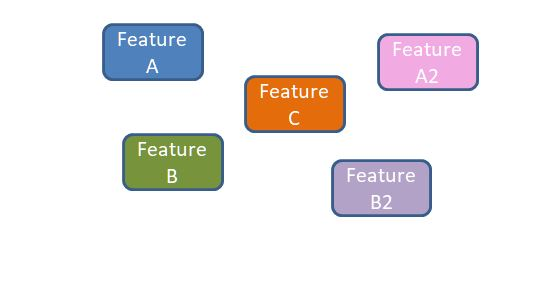
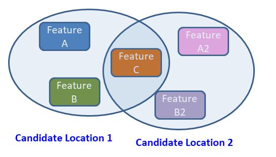
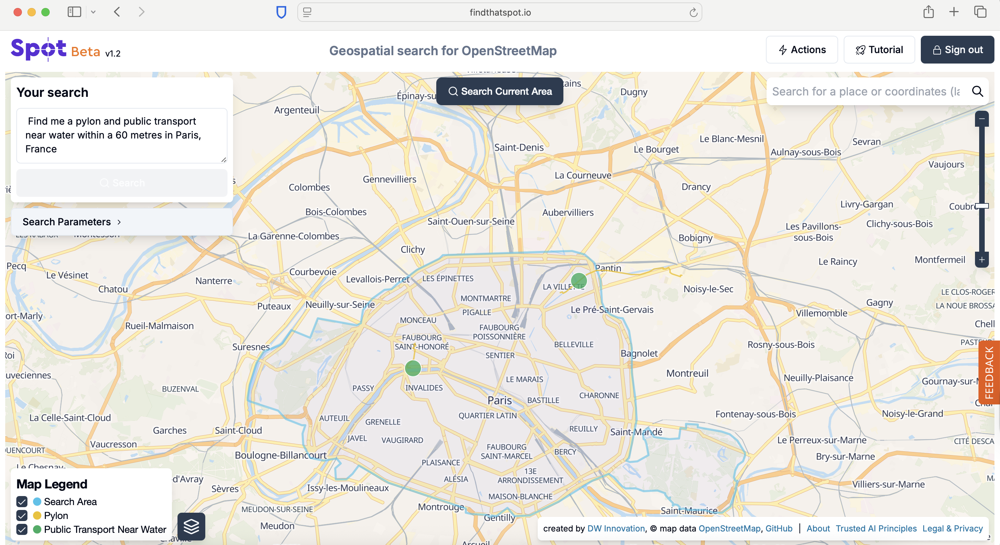

# Spot

## URL

[https://www.findthatspot.io](https://www.findthatspot.io/)

## Description

<figure><figcaption>
<strong>THE SPOT INTERFACE DISPLAYING RESULTS OF A SEARCH OF OPEN STREET MAP EXPRESSED IN ENGLISH LANGUAGE AT TOP LEFT, WITH RESULTS COLOURED ON THE MAP AND ONE CANDIDATE LOCATION ALSO SHOWN AS STREET VIEW IMAGERY</strong>
</figcaption></figure>

Spot provides an interface for searching OpenStreetMap[^1] using everyday language as input (our testing shows that multiple languages are supported in addition to English, but these are not specified by the Spot authors).

<a href="https://www.openstreetmap.org/about">OpenStreetMap</a> (OSM) labels a very large number of both natural and man-made features, e.g. buildings, infrastructure, bodies of water. <em>Click the arrow for more on OSM</em>...

These features are labelled according to [OSM's own detailed classification system](https://wiki.openstreetmap.org/wiki/Map_features), e.g. town hall, lake, pylon, railway, ... and they can be used as search terms to express users' search criteria.&#x20;

Spot is one amongst [a range of OSM search](#user-content-fn-2)[^2] tools which exists to allow users to query OpenStreetMap.&#x20;

<mark style="color:$primary;">**Query-Building Methods:**</mark> These tools all run a search of OpenStreetMap in the same way, but they use different methods to build the user's search query:&#x20;

* some involve writing the query in a formal language, e.g.[ OverpassTurbo](https://bellingcat.gitbook.io/toolkit/more/all-tools/overpass-turbo)&#x20;
* some use a graphical interface to build the query, e.g. [Bellingcat OpenStreetmap Search](https://bellingcat.gitbook.io/toolkit/more/all-tools/openstreetmap-search-tool)
* Spot is characterised by the use of [natural language](#user-content-fn-3)[^3] to express the users' search query, and this is a relatively new approach.&#x20;

<mark style="color:$primary;">**Location Descriptors:**</mark> The Spot user can describe a location search in terms of :

1. groupings of OSM map features, e.g. a pharmacy AND[^4] a traffic light
2. their relative distance from one another, e.g. within 70m of one another
3. the location of a geographical search area, e.g. in Cologne

e.g. Enter "_**Find a pharmacy and a traffic light and a bus stop and a bridge within 70m in Cologne**_" and, in response, Spot will return a map showing those candidate groups of features whenever they meet the user's distance criteria within the given geographical search area.&#x20;

#### **A Common OSINV Use Case for Spot...**



...involves the user describing an image which they want to geolocate, and using Spot to generate and visually inspect potential solution locations around a particular geographic region like a named city.  This example on the right from a social media platform shows a fountain and a tower block and a church labelled as being in London, UK. Features in the image are shown next to items providing scale, e.g. trees, and help estimate the distance between them.



<figure><figcaption></figcaption></figure>





<figure><figcaption></figcaption></figure>



So the user can write a natural language query like "Find a church within 100m of a building with 10 stories or more and water in the City of London" and Spot returns a map of the City of London, with all the churches which have tower blocks and water within 100m (see on the left). See Spot's [Output Result Map](./#spots-output-result-map) below to learn how to use Spot to check these locations using StreetView photography.



### What Spot Does

Spot works in 4 stages, from natural language input to streetview comparison of outputs.&#x20;

<table><thead><tr><th width="109.66668701171875">STEP</th><th>PROCESS</th><th>DESCRIPTION</th></tr></thead><tbody><tr><td><strong>1) Natural Language Query Input</strong></td><td>Spot takes natural language prompts as input from the user, i.e. sentences written in everyday language, and converts these sentences into query language code with a formal structure (which is displayed to the user in a separate box in the interface) called <a href="https://wiki.openstreetmap.org/wiki/Overpass_API/Overpass_QL">Overpass Query Language</a>.</td><td>
<figure><figcaption></figcaption></figure>
</td></tr><tr><td><strong>2) Run Overpass Query on the OpenStreetMap Database</strong></td><td>Spot uses the query  language code to perform a search of OpenStreetMap (by building an Overpass query and running it with the <a href="https://wiki.openstreetmap.org/wiki/Overpass_API">Overpass API</a>).</td><td>This stage of the Spot service uses exactly the same process as the other OSM search tools.</td></tr><tr><td><strong>3) Display Solution Features on a Map</strong></td><td>Spot displays all the features which satisfy the user's input search on a map. </td><td>

Spot does not sort and group features which relate to different candidate location solutions, so if there is more than one potential solution (which is often the case):
<ul><li> the existence of multiple candidate location solutions may not be apparent to the user</li><li>the number of candidate location solutions may well not to be apparent to the user</li><li>which discovered features belong to which proposed candidate locations may not be to discernible to the user</li></ul></td></tr><tr><td><strong>4) Offer A Choice of StreetView Options for Each Solution Feature</strong></td><td>For each feature marked on the output map, Spot offers the user the option to open the location in any one of the largest three mapping services (<a href="https://bellingcat.gitbook.io/toolkit/more/all-tools/google-maps">Google</a>, <a href="https://bellingcat.gitbook.io/toolkit/more/all-tools/yandex-maps">Yandex</a>, and <a href="https://bellingcat.gitbook.io/toolkit/more/all-tools/bing-maps">Bing</a>) and additionally provides the option to directly view Google's <a data-footnote-ref href="#user-content-fn-5">street view</a> information (mainly user-supplied ground-level photography) of the location, which is invaluable for geolocation purposes.</td><td>
<figure><figcaption></figcaption></figure>
</td></tr></tbody></table>


**USE OF 'AI' TECHNOLOGY IN SPOT IS LIMITED TO CONVERTING THE LANGUAGE OF THE SEARCH QUERY INTO CODE, I.E. STAGE 1 ONLY**

* **Limited AI Used:** Spot's use of AI is limited to conversion of the user's natural language search into the formal Overpass Query Language which can be used to query OpenStreetMap. This conversion is done using a [Large Language Model](https://en.wikipedia.org/wiki/Large_language_model) or LLM. The Overpass query is run by Spot via the [Overpass API](https://wiki.openstreetmap.org/wiki/Overpass_API) in exactly the same way as all the other OSM interface tools.&#x20;
* **Search Is Not Using AI:** The quality and speed of the search is not impacted by the Large Language Model AI technology in Spot.&#x20;
* **AI Uses Most of the Search Time:** N.B. Tests run by these authors on city searches in August and December 2025 suggest that between 72% and 94% of the time Spot takes to complete a search is used to run the Natural Language to Overpass Query Language conversion, NOT the Overpass query of OpenStreetMap itself.&#x20;


## The Interface



Spot's landing page includes a modal window (a pop-up) where example queries are continuously typed out word by word to guide the user on what their input should look like.



<figure><figcaption></figcaption></figure>



The Spot interface uses text boxes for input data, set over a background map for result display, and an additional Street View pop up window.

<figure><figcaption>
<strong>THE SPOT INTERFACE</strong>
</figcaption></figure>



**THE SEARCH PARAMETERS SUBWINDOW**

Here, you can edit the OSM tags assigned to each feature. OSM tags define features of map [elements](https://taginfo.openstreetmap.org/about) which “add meaning to geographic objects.”&#x20;

According to the [TagInfo site](https://taginfo.openstreetmap.org/about) for OSM tags, “there is no fixed list of those tags. New tags can be invented and used as needed. Everybody can come up with a new tag and add it to new or existing objects.”

A tag is made of two [items](https://wiki.openstreetmap.org/wiki/Tags): a key and a value. A key describes the category or type of feature. A [value](https://wiki.openstreetmap.org/wiki/Tags#Keys_and_values) “provides detail for the key-specified feature." For example, an OSM key, “waterway”, can have multiple values that define this key. Some of them include a stream, ditch, river, drain, canal, and dam, among others. These can be adjusted depending on the needs of the search.

This feature is similar to [Bellingcat’s OpenStreetMap](https://bellingcat.gitbook.io/toolkit/more/all-tools/openstreetmap-search-tool) search tool, which uses a custom setting for adding features, enabling adjustments via the OSM key and value.



**SEARCH PARAMETERS EDITING SCHEM**A

<figure><figcaption></figcaption></figure>



To confirm which result matches our required location, one must sift through all the available possibilities on the map.&#x20;

### Data Input, Output and Formats



<figure><figcaption></figcaption></figure>

Natural language description of a location to be found - includes entities at the location, their relative proximity and the geographic search area.

OR

Overpass Turbo query search parameters - references entities with the appropriate OSM tags, describes their relative proximity with distances and provides the geographic search area.&#x20;

Spot provides the facility to edit the search parameters, once input via the natural language text input box. The editing window is shown below:

<figure><figcaption>
<strong>SPOT'S QUERY PARAMETER EDITING WINDOW PROVIDES DIRECT ACCESS TO THE STRUCTURE AND PROPERTIES OF THE QUERY, ENTITY BY ENTITY. THIS WINDOW PROVIDES EDITING FOR THE ENTITY 'FOUNTAIN'</strong>
</figcaption></figure>




<figure><figcaption></figcaption></figure>

Location map marking all features in candidate solutions which satisfy the search criteria, but not marking those groups individually, giving the number of candidate solutions for the search, or providing an approximate location for viewpoints which could include them all.

Note that Spot very clearly marks the overall search area for the query on its output map, and includes it in the map legend, which avoids confusion.&#x20;



* Geolocation of photograph/video imagery
* Determination of the purpose, nature or further details of an entity seen in an image at a known location, e.g. the tall building is a place of worship.



NB Locations can be input as Proper Place Names, or Geographic co-ordinates.

Enter a natural language sentence in the search box

OR

Use the search parameters box to adjust existing search features and their relative distances via a part text, part graphic subwindow.

<figure><figcaption></figcaption></figure> <figure><figcaption></figcaption></figure>





The user can input the location part of the search in two ways, and these often return different results:

1\) Enter the location in the search box on the top right hand of the screen - the search will be conducted on a rectangle centred around a point representing the location

2\) Enter the location in natural language as part of the text query entered into the "Your search" box in the top left of the screen - the search will look for a polygon of geographic map boundaries and search within that.

The natural language query method (number 2) generally provides a smaller search space, which is beneficial for researchers.


### Spot’s Output Result Map&#x20;


{% column width="50%" %}

Using the City of London example mentioned above, “Find a church within 100m of a building with 10 stories or more and water in the City of London.”...


{% column width="50%" %}
<figure><figcaption></figcaption></figure>



...the Spot output map displays all the features (churches, water, 10 storey buildings) which fit the search criteria, see below:

<figure><figcaption>
<strong>THE NUMBER AND EXTENT OF THOSE LOCATIONS MEETING THE 3 SEARCH CRITERIA OF CHURCH, 10+ STOREY BUILDING AND WATER WITHIN THE CITY OF LONDON (BOUNDED IN TURQUOISE) ARE NOT OBVIOUS FROM SPOT OUTPUT. WHEN SPOT RETURNS MORE THAN ONE CANDIDATE LOCATION, THIS MAKES THE USE OF STREETVIEW IMAGERY FOR CONFIRMATION/ELIMINATION OF POTENTIAL GEOLOCATIONS A SIGNIFICANT WORKLOAD.</strong>
</figcaption></figure>

Clicking on a specific feature from one of the results shows its details, including a link to its OSM ID. This link opens a new tab to its location on the OpenStreetMap website, where you can find this feature (entity) and explore further. In this case, clicking on the church (highlighted in red) indicates that it's called "St-Giles-without-Cripplegate", its “denomination” is “Anglican” and was “rebuilt” in “1906.” Click on the OSM ID link for more details.



Cicking on a particular feature pops up...

<figure><figcaption></figcaption></figure>



...ID and detail output from OpenStreetMap

<figure><figcaption></figcaption></figure>



Spot does **not** directly identify specific _**locations**_ which meet the input search criteria (unlike other tools, e.g. Bellingcat OpenStreetMap Search). Instead, it identifies all those _**features**_ which belong to any and all locations which meet the search criteria, and draws them together on the same map. Therefore if there is more than one candidate location which meets the search criteria, it may not be possible to distinguish one from another, particularly if they are geographically close.


{% column width="50%" %}
**SPOT'S OUTPUT MAP DISPLAYS CANDIDATE FEATURES, NOT LOCATIONS**

Spot delivers a map marked with all the features (Spot calls them Entities) which meet the search criteria, but not the actual associated locations. \[Where there is only one candidate location, this is not an issue]. In queries with multiple solution locations, the single map without associations between features and candidate locations makes comparison with StreetView photography more difficult.

<figure><figcaption></figcaption></figure>

EXAMPLE OUTPUT WHERE FEATURES ARE MARKED ON THE MAP, BUT NOT GROUPED INTO SOLUTION LOCATIONS


{% column width="50%" %}
**CANDIDATE LOCATIONS MAPPED TO GROUPED FEATURES**

If the features which meet the search criteria are grouped into candidate locations, this makes examination of multiple candidate locations (and cross-checking with other imagery) possible. Bellingcat OSM Search tool delivers this type of result, with a separate map for each candidate location. Spot does not output specific locations,or map them to located image features.

<figure><figcaption></figcaption></figure>

EXAMPLE OUTPUT WHERE FEATURES ARE GROUPED INTO SOLUTION LOCATIONS



For example, if there are multiple solution locations meeting the search criteria, Spot's output map may not allow the user to identify how many different solution locations there are, or their exact boundaries.  This could lead to extended time taken to check the options against StreetView maps and other forms of confirmation.

A very useful and original time-saving feature in Spot, is the option to view any feature listed on the map legend using a variety of mapping services: Google Maps, Bing, and Yandex. Most importantly, direct access to Google StreeView is provided to support location verification through multiple mapping services. See example insert picture labelled Google Street View in the right hand image below.

Spot source imagery and Google StreetView can be compared side by side on screen:


{% column width="41.66666666666667%" %}
<figure><figcaption></figcaption></figure>


{% column width="58.33333333333333%" %}
<figure><figcaption></figcaption></figure>



### Cost

* [x] Free
* [ ] Partially Free
* [ ] Paid

Only sign up is required to use the tool.

## Level of difficulty

<table><thead><tr><th data-type="rating" data-max="5"></th></tr></thead><tbody><tr><td>2</td></tr></tbody></table>

## Requirements

Any web browser and a sign-up through GitHub or Google are required to use the tool.

## Limitations


All tools which query OpenStreetMap share the limitations which the structure of the OpenStreetMap tagging scheme imposes. Knowledge of the relationship between different but connected tagging categories is needed to perform efficient searches where one tag is deemed to be a subset of another, e.g. if the stream tag is a subset of river tag, if the river tag is a subset of the water tag. Searching with the tag 'stream' will return a smaller set of results than 'river', and likewise 'river' will return a smaller set of results than 'water'. Knowing which tag to use for a search affects the number and quality of search results returned, and therefore the speed of the overall search.


1. The format of Spot's output is imprecise relative to other tools which clearly group the features supporting each different solution location proposed in response to the user's query e.g. [Bellingcat OpenStreetMap Search](https://bellingcat.gitbook.io/toolkit/more/all-tools/openstreetmap-search-tool). Spot puts all the features supporting each solution location onto the same output map, without counting the number of different solution locations and indicating the supporting features for each one. So Spot does **not** answer the question "How many different locations satisfy my criteria in the given search area? "
2. Spot's valuable integrated street view access operates at the location of each feature on the solution map. Given that usually all the features mentioned in a query will be visible in the source image which is being geolocated, the view **at** a feature location is not likely to be a match. e.g. street view imagery taken at the central co-ordinates of the Eiffel Tower is unlikely to include images where the Eiffel Tower is clearly visible.
3. When we tested the tool, Spot sometimes gave us errors (as at testing on 25/10/25), as shown below. Sometimes refreshing the browser and/or slightly rephrasing the query may overcome issues:

<figure><figcaption></figcaption></figure> <figure><figcaption></figcaption></figure> <figure><figcaption></figcaption></figure> <figure><figcaption></figcaption></figure>

&#x20; &#x20;

4.  Behaviour of the LLM which converts the natural language to Overpass Turbo query language does not always produce identical results for the same query and very small (apparently semantically identical) changes in the input text can yield different solution results. Note in the example below that the particular phrasing of the query has resulted in Spot identifying two, rather than three, search features. The three relevant features are 1 "pylon", 2 "public transport" and 3 "water" but spot has only recognised two: "pylon" and "public transport near water".  See how this is shown in the Map Legend - this is very likely to affect the results returned.

    <figure><figcaption></figcaption></figure>
5. Our own tests showed that some queries may take time to get minutes to retrieve results, since search time increases with the size of the search area, the number of search terms involved and the complexity of the logical combinations of search terms used in the query.
6. Spot is based on crowdsourced OpenStreet Map Data. Anything not found in OSM’s database will not be returned in results (but this does not mean that other results do not exist, they might just not have been added to OSM).&#x20;
7. Results may not always be accurate and should be double-checked against other mapping tools like Google Maps, Yandex Maps, Bing Maps, including street-view photography.&#x20;

## **Ethical Considerations**

1. Spot’s Trusted AI principles page (see expandable reference below) states that “The user prompts that are entered in the Spot application are being used to re-train the model on real user queries to improve the user relevance of the AI model.” Furthermore, the same page says, “User control -- no publicly anonymous available access but certain monitoring of users will be done via login functionality.” Therefore, entering any information in the query or users’ login credentials may potentially end up revealing information about the individual or the investigation to the SPOT team.
2. In their Legal & Privacy Statement (see expandable reference below), the tool provider says that the data collected is usually kept for 30 days, after which it is deleted. However, it also reiterates that “under exceptional circumstances, we need them for a longer period for the above-mentioned purposes. In such a case, we erase the data as soon as they're no longer required.”
3. Spot also uses third-party services like [Nominatim](https://nominatim.org/), [Maptiler](https://www.maptiler.com/), [Mapbox](https://www.mapbox.com/), [Versatiles](https://versatiles.org/), [OSM Tiles](https://openmaptiles.org/), [Google Street View](https://www.google.com/streetview/) and [MongoDB](https://www.mongodb.com/) to make the application work when a user enters a search prompt. Make sure to check their Legal & Privacy Statement to understand how the data is processed.

Legal and Privacy statement provided on the Spot Website. <em>(Click the arrow for more detail...)</em>

<figure><figcaption></figcaption></figure>

Trusted AI Principles provided on the Spot Website. <em>(Click the arrow for more detail...)</em>

<figure><figcaption></figcaption></figure>

###

## Guides and articles

Spot offers a introductory tutorial on how to use the tool on its website:



There is also a more detailed video on Prompting:



And a video on viewing and interpreting Spot results:



## Similar Tools

* [Bellingcat OpenStreetMap Search](https://bellingcat.gitbook.io/toolkit/more/all-tools/openstreetmap-search-tool)
* [Overpass Turbo](https://bellingcat.gitbook.io/toolkit/more/all-tools/overpass-turbo)
* [EarthKi](https://earthkit.app/sift)[t](https://earthkit.ecmwf.int/)

| Similar Tool to Spot                                                                                              |                                                                                                                                                                                                                                                                                                                                                            |   |
| ----------------------------------------------------------------------------------------------------------------- | ---------------------------------------------------------------------------------------------------------------------------------------------------------------------------------------------------------------------------------------------------------------------------------------------------------------------------------------------------------- | - |
| [Bellingcat OpenStreetMap Search](https://bellingcat.gitbook.io/toolkit/more/all-tools/openstreetmap-search-tool) | Bellingcat OpenStreetMap search provides a graphical interface  to support the user in building a query of OpenStreetMap data, in the formhelping users geolocate an image. The user interface allows one to search for structures and objects within a specified maximum distance from each other, as visible in a photo. It is a simplified version of…. |   |
| [Overpass Turbo](https://bellingcat.gitbook.io/toolkit/more/all-tools/overpass-turbo)                             | Overpass Turbo provides an interface for conducting complex queries on the OpenStreetMap (to be continued                                                                                                                                                                                                                                                  |   |
| [EarthKi](https://earthkit.app/sift)[t](https://earthkit.ecmwf.int/)                                              | Need to add this link to the tool entry                                                                                                                                                                                                                                                                                                                    |   |

## Tool provider

The tool was developed by [DW Innovation](https://innovation.dw.com/about), Germany.&#x20;

## Advertising Trackers

* [ ] This tool has not been checked for advertising trackers yet.
* [ ] This tool uses tracking cookies. Use with caution.
* [x] This tool uses cookieless tracking.&#x20;
* [ ] This tool does not appear to use tracking cookies.

The tool uses “cookieless tracking”. Although the “tracking” feature can be disabled on the “[Legal & Privacy Statement](./#legal-and-privacy-statement-provided-on-the-spot-website-click-the-arrow-for-more-detail)” page, users may want to consider taking precautions, such as using VPNs and browser extensions, to block tracking and prevent the potential revealing of their location.

| Page maintainer                  |
| -------------------------------- |
| Sophie Tedling and Anisa Shabir  |
|                                  |

[^1]: [Open Street Map](https://app.gitbook.com/o/WQpOq5ZFue4N6m65QCJq/s/TSRCKcxTTIGI6g9ZTkHy/) is a free, open map database of the world, which is updated and maintained by a community of volunteer contributors.

[^2]: e.g. Overpass Turbo, Bellingcat OSM Search, GeoGuessr GPT, GeoSpy, EarthKit,...

[^3]: i.e. human conversational language

[^4]: AND is a [logical operator](https://www.w3schools.com/programming/prog_operators_logical.php) here, like OR.

[^5]: Street view photographs are taken at ground level (as opposed to satellite view imagery, taken from above), giving a view of what a human would see at a location by looking around.
