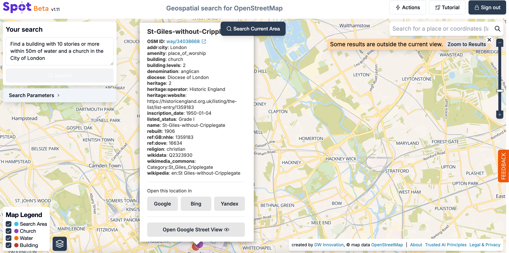

# Spot

## URL

[https://www.findthatspot.io](https://www.findthatspot.io/)

## Description

Spot provides an interface for searching OpenStreetMap[^1] using everyday language as input (multiple languages are supported in addition to English).

<a href="https://www.openstreetmap.org/about">OpenStreetMap</a> (OSM) labels a very large number of both natural and man-made features, e.g. buildings, infrastructure, bodies of water. <em>Click the arrow for more on OSM</em>...

These features are labelled according to [OSM's own detailed classification system](https://wiki.openstreetmap.org/wiki/Map_features), e.g. town hall, lake, pylon, railway, ... and they can be used as search terms to express users' search criteria. An example Spot user search might be "_**Find a car park near a cafe and a marina within 80m in the Hague**_"

Spot is one amongst [a range of OSM search tools](./#similar-tools) which exists to allow users to query OpenStreetMap. These tools all run a search of OpenStreetMap in the same way, but they use different methods to build the user's search query: some involve writing in a formal language, some use a graphical interface. Spot is characterised by the use of [natural language](#user-content-fn-2)[^2] to express the users' search query, and this is a relatively new approach.&#x20;

The Spot user can describe a location search in terms of :

* groupings of OSM map features, e.g. a pharmacy AND[^3] a traffic light
* their relative distance from one another, e.g. within 70m of one another
* the location of a geographical search area, e.g. in Cologne

e.g. Enter "_**Find a pharmacy and a traffic light and a bus stop and a bridge within 70m in Cologne**_" and, in response, Spot will return a map showing those candidate groups of features whenever they meet the user's distance criteria within the given geographical search area.&#x20;

**A common OSINV use case** involves the user describing an image or video frame which they want to geolocate, and using Spot to generate and visually inspect potential solution locations around a particular geographic region like a named city.&#x20;

### What Spot Does

Spot works in 4 stages, from natural language input to streetview comparison of outputs.&#x20;

<table><thead><tr><th width="200" align="center">STAGE</th><th width="298" align="center">ACTION</th><th align="center">INTERFACE FEATURE</th></tr></thead><tbody><tr><td align="center"><h3>1. Natural Language </h3><h3>Query Input</h3></td><td align="center">Spot takes natural language prompts as input from the user, i.e. sentences written in everyday language, and converts these sentences into query language  code with a formal structure (which is displayed to the user in a separate box in the interface) called <a href="https://wiki.openstreetmap.org/wiki/Overpass_API/Overpass_QL">Overpass Query Language</a>.</td><td align="center">
<figure><figcaption></figcaption></figure>
</td></tr><tr><td align="center"><h3>2. Run Overpass </h3><h3>Query on the </h3><h3>OpenStreetMap </h3><h3>Database</h3></td><td align="center">Spot  uses the query  language code to perform a search of OpenStreetMap (by building an Overpass query and running it with the <a href="https://wiki.openstreetmap.org/wiki/Overpass_API">Overpass API</a>).</td><td align="center">
<figure><figcaption></figcaption></figure>
</td></tr><tr><td align="center"><h3>3. Dipslay All </h3><h3>Solution Features </h3><h3>on A Map</h3></td><td align="center">Spot displays all the features which satisfy the user's input search on a map. It does not sort features which relate to different candidate location solutions, so if there is more than one potential solution this may not be apparent.</td><td align="center">
<figure><figcaption></figcaption></figure>
</td></tr><tr><td align="center"><h3>4. Offer A Choice of </h3><h3>Streetview Options </h3><h3>for Each Solution </h3><h3>Feature</h3></td><td align="center">For each feature marked on the output map, Spot offers the user the option to open a <a data-footnote-ref href="#user-content-fn-4">street view</a> window within the tool, using data from a choice of three of the largest providers of street view photography (Google, Yandex, and Bing).</td><td align="center">
<figure><figcaption></figcaption></figure>
</td></tr></tbody></table>

***

Spot works in 4 stages, from natural language input to streetview comparison of outputs.&#x20;



### Natural Language Query Input

Spot takes natural language prompts as input from the user, i.e. sentences written in everyday language, and converts these sentences into query language code with a formal structure (which is displayed to the user in a separate box in the interface) called [Overpass Query Language](https://wiki.openstreetmap.org/wiki/Overpass_API/Overpass_QL).

 (1).png>) (1).png>)



### Run Overpass Query on the OpenStreetMap Database

Spot uses the query  language code to perform a search of OpenStreetMap (by building an Overpass query and running it with the [Overpass API](https://wiki.openstreetmap.org/wiki/Overpass_API)).



### Display All Solution Features on A Map

Spot displays all the features which satisfy the user's input search on a map. It does not sort features which relate to different candidate location solutions, so if there is more than one potential solution this may not be apparent.




### Offer A Choice of Streetview Options for Each Solution Feature

For each feature marked on the output map, Spot offers the user the option to open a [street view](#user-content-fn-4)[^4] window within the tool, using data from a choice of three of the largest providers of street view photography ([Google](https://app.gitbook.com/u/ViCSKrNRRpZOOjQVlfLHkPMJAqw1), [Yandex](https://bellingcat.gitbook.io/toolkit/more/all-tools/yandex-maps), and [Bing](https://bellingcat.gitbook.io/toolkit/more/all-tools/bing-maps)).

<figure><figcaption></figcaption></figure>



***


**USE OF 'AI' TECHNOLOGY IN SPOT IS LIMITED TO CONVERTING THE LANGUAGE OF THE SEARCH QUERY, I.E. STAGE 1 ONLY**

* **Limited AI Used:** Spot's use of AI is limited to conversion of the user's natural language search into the formal Overpass Query Language which can be used to query OpenStreetMap. This conversion is done using a [Large Language Model](https://en.wikipedia.org/wiki/Large_language_model) or LLM. The Overpass query is run by Spot via the [Overpass API](https://wiki.openstreetmap.org/wiki/Overpass_API) in exactly the same way as all the other OSM interface tools.&#x20;
* **Search Is Not Using AI:** The quality and speed of the search is not impacted by the Large Language Model AI technology in Spot.&#x20;
* **AI Uses Most of the Search Time:** N.B. Tests run by these authors on city searches in August 2025 suggest that well over 50% of the time Spot takes to complete a search is used to run the Natural Language to Overpass Query Language conversion, NOT the Overpass query of OpenStreetMap itself.&#x20;


## The Interface

The first thing a user sees when they visit the Spot website is a modal window (a pop-up). This box includes a search box, where an example query is typed out word by word and then disappears automatically. “Find me a tram stop next to a park within 150 meters of a traffic light and a parking garage in Prague,” says the animated auto-query. This demonstrates how to phrase a search for the tool to understand. Text for the search prompt can be entered here or performed after closing this window.

<figure><figcaption></figcaption></figure>

In the top left corner, a query can be entered into the search box. This is the first step, also explained in the description above, where Spot takes the input as natural language prompts.

Just below the search bar is an expandable “Search Parameters” box, where the location, entities, and the relationship between them —specifically, how far apart they are from each other— can be viewed. Entities are features labelled according to OpenStreetMap’s own classification system.&#x20;

<figure><figcaption>
Search Parameters and the search box.
</figcaption></figure>

Search Parameters

Here, you can edit the OSM tags assigned to each feature. OSM tags define features of map [elements](https://wiki.openstreetmap.org/wiki/Tags) which “add meaning to geographic objects.”&#x20;

According to the TagInfo site for OSM tags, “there is no fixed list of those tags. New tags can be invented and used as needed. Everybody can come up with a new tag and add it to new or existing objects.”

A tag is made of two [items](https://wiki.openstreetmap.org/wiki/Tags): a key and a value. A key describes the category or type of feature. A [value](https://wiki.openstreetmap.org/wiki/Tags) “provides detail for the key-specified feature." For example, an OSM key, “waterway”, can have multiple values that define this key. Some of them include a stream, ditch, river, drain, canal, and dam, among others. These can be adjusted depending on the needs of the search.

This feature is similar to [Bellingcat’s OpenStreetMap](https://osm-search.bellingcat.com/) search tool, which uses a custom setting for adding features, enabling adjustments via the OSM key and value.

After conducting a search, you can always adjust the Search Parameters to refine criteria and update results.

Spot displays the results on an interactive map. These are potential location solutions from the search appearing on the map simultaneously.&#x20;

Search features are highlighted in different colours, and users can select or deselect the ones they want to see on the interface through the “Map Legend” at the bottom left, or just make them flash momentarily by hovring the mouse over the Map Legend. The slider on the right allows you to zoom in on a single location or zoom out to view all results.

To confirm which result matches our required location, one must sift through all the available possibilities on the map.&#x20;

The exact location where the entity is situated can also be viewed in integrated mapping services, such as Google Maps, Bing, and Yandex. This ensures location verification through multiple mapping services in one place, thus saving time and allowing for greater flexibility.

Spot has also integrated Google Street View for location verification. Clicking on “Open Google Street View” opens a window displaying the location's street-level photography. Use this feature to match entities and features against the photo or video being geolocated.

### Data Input, Output and Formats



Natural language description of a location to be found - includes entities at the location, their relative proximity and the geographic search area.

OR

Overpass Turbo query search parameters - references entities with the appropriate OSM tags, describes their relative proximity with distances and provides the geographic search area.&#x20;



Location map marking all features in candidate solutions which satisfy the search criteria, but not marking those groups individually, giving the number of candidate solutions for the search, or providing an approximate location for viewpoints which could include them all.



* Geolocation of photograph/video imagery
* Determination of the purpose, nature or further details of an entity seen in an image at a known location, e.g. the tall building is a place of worship.



Enter a natural language sentence in the search box

OR

Use the search parameters box to adjust existing search features and their relative distances via a part text, part graphic subwindow.



### Spot’s Output Result Map&#x20;

To use Spot for geolocation and understand how to use its interface, we used this image of a church by the user “[jirashimosu](https://www.instagram.com/p/DK0UTHwIDIA/)” ([archive](https://archive.md/sxYZ2)) on Instagram. The caption, “London Summer Fragments Day #1”, indicates that the photo was taken somewhere in London. However, in OSINV, finding the exact location is paramount, as accuracy is crucial.

<figure><figcaption>
An image on Instagram showing a church in London. (Credit: Gerasimos Evangelatos)
</figcaption></figure>

The visual clues in the image provide an opportunity to locate the exact area using Spot. In this particular case, tall buildings that are 10 stories or more also appear behind the church. More importantly, a water body with fountains side by side is also visible in the image. One can also roughly estimate the distance as the features in the image seem to be close to each other.

Taking these features into account, a query for Spot can be constructed that reads: “Find a church within 100m of a building with 10 stories or more and water in the City of London.”  The interface displays all possible solutions, which looks like this:

<figure><figcaption></figcaption></figure>

The red blobs on the map legend represent churches, blue indicates water, and yellow signifies buildings with 10 or more stories. The church, water, and the building are features from an image or video showing a specific location that a user is geolocating.

To explore a specific solution, use the slider to zoom in on the result of your choice.

Then clicking on a specific feature from one of the results shows its details, which include a link to its OSM ID. This link opens a new tab to its location on the OpenStreetMap website, where you can find this entity and explore further. In this case, clicking on the church (higlighted in red) indicates that it's called "St-Giles-without-Cripplegate", its “denomination” is “Anglican” and was “rebuilt” in “1906.” Click on the OSM ID link for more details.

<figure><figcaption></figcaption></figure>

The exact location where the entity is situated can also be opened in the integrated mapping services like Google Maps, Bing, and Yandex. This ensures location verification through multiple mapping services in one place, thus saving time and allowing for greater flexibility. Here, opening the location for church in Google Maps reveals it's located at coordinates [51.5187148,-0.0963922](https://www.google.com/maps/place/@51.5187148,-0.0963922,543m/data=!3m1!1e3!4m6!1m5!3m4!2zNTHCsDMxJzA3LjQiTiAwwrAwNSczNy43Ilc!8m2!3d51.5187222!4d-0.0938056?entry=ttu\&g_ep=EgoyMDI1MDgyNS4wIKXMDSoASAFQAw%3D%3D).

Use the integrated Google Street View for location verification. Clicking on any blob on the map allows to view the street-level photography of the church's location. On Spot, select one of the points highlighting water from this area, and then open the Google Street view. By exploring the location through street view confirms that this location matches the one in the photo from Instagram above as shown here:

<figure><figcaption></figcaption></figure>

Users can also switch between map layers that include “[vector map](#user-content-fn-5)[^5]”, “[hybrid view](#user-content-fn-6)[^6]” and “[OSM Style Map](#user-content-fn-7)[^7]”. The screenshot below shows a location from search results in the hybrid view and the Google Street View tab showing street-level photography of the selected result.

<figure><figcaption></figcaption></figure>

### Cost

* [x] Free
* [ ] Partially Free
* [ ] Paid

Only sign up is required to use the tool.

## Level of difficulty

<table><thead><tr><th data-type="rating" data-max="5"></th></tr></thead><tbody><tr><td>2</td></tr></tbody></table>

## Requirements

Any web browser and a sign-up through GitHub or Google are required to use the tool.

## Limitations


All tools which query OpenStreetMap share the limitations which the structure of the OpenStreetMap tagging scheme imposes. Knowledge of the relationship between different but connected tagging categories is needed to perform efficient searches where one tag is deemed to be a subset of another, e.g. if the stream tag is a subset of river tag, if the river tag is a subset of the water tag. Searching with the tag 'stream' will return a smaller set of results than 'river', and likewise 'river' will return a smaller set of results than 'water'. Knowing which tag to use for a search affects the number and quality of search results returned, and therefore the speed of the overall search.


1. The format of Spot's output is imprecise relative to other tools which clearly group the features supporting each different solution location proposed in response to the user's query. Spot puts all the features supporting each solution location onto the same output map, without counting the number of different solution locations and indicating the supporting features for each one. So Spot does **not** answer the question "How many different locations satisfy my criteria in the given search area? "
2. Spot's valuable integrated street view access operates at the location of each feature on the solution map. Given that usually all the features mentioned in a query will be visible in the source image which is being geolocated, the view **at** a feature location is not likely to be a match. e.g. street view imagery taken at the central co-ordinates of the Eiffel Tower is unlikely to include images where the Eiffel Tower is clearly visible.
3. Spot gives various errors (as at testing on 31/8/25). These are some of the different errors users will come across:

<figure><figcaption></figcaption></figure> <figure><figcaption></figcaption></figure> <figure><figcaption></figcaption></figure>

&#x20; &#x20;

4. Complex queries can return no results so users should simplify their search criteria as far as possible.
5. The tool exhibits strange behaviour at the time of writing in August 2025. Sometimes results may not meet the search criteria.
6. Some queries may take time to get results. This is because search time increases with the size of the search area, the number of search terms involved and the complexity of the logical combinations of search terms used in the query.
7. Spot is based on OpenStreet Map Data. Anything not found in OSM’s database will not be returned in results.
8. Results may not always be accurate and should be double-checked against other mapping tools like Google Maps, Yandex Maps, Bing Maps, including street-view photography.&#x20;

## **Ethical Considerations**

1. Since the tool uses OpenStreetMap data, which is crowdsourced, users should always cross-check and confirm the results using other mapping services like Google, Yandex, Bing, etc., and street-level photography.
2. Spot’s Trusted AI principles page states that “The user prompts that are entered in the Spot application are being used to re-train the model on real user queries to improve the user relevance of the AI model.” Furthermore, the same page says, “User control -- no publicly anonymous available access but certain monitoring of users will be done via login functionality.” Therefore, entering any information in the query or users’ login credentials may potentially end up revealing sensitive information about the individual or the investigation.
3. The tool uses “cookieless tracking”. Although the “tracking” feature can be disabled on the “Legal & Privacy Statement” page, users should still take precautions, such as using VPNs and browser extensions, to block tracking and prevent the potential revealing of their location.
4. In their Legal & Privacy Statement, the tool provider says that the data collected is usually kept for 30 days, after which it is deleted. However, it also reiterates that “under exceptional circumstances, we need them for a longer period for the above-mentioned purposes. In such a case, we erase the data as soon as they're no longer required.”
5. Spot also uses third-party services like [Nominatim](https://nominatim.org/), [Maptiler](https://www.maptiler.com/), [Mapbox](https://www.mapbox.com/), [Versatiles](https://versatiles.org/), [OSM Tiles](https://openmaptiles.org/), [Google Street View](https://www.google.com/streetview/) and [MongoDB](https://www.mongodb.com/) to make the application work when a user enters a search prompt. Make sure to check their Legal & Privacy Statement to understand how the data is processed.

## Guides and articles

Spot offers a introductory tutorial on how to use the tool on its website



There is a more detailed video on Prompting



There is also training on viewing and interpreting Spot results



## Similar Tools

* Bellingcat OpenStreetMap Search
* [Overpass Turbo](https://app.gitbook.com/o/WQpOq5ZFue4N6m65QCJq/s/yNF6qm7Ej1iALSmdkA3h/)

## Tool provider

The tool was developed by [DW Innovation](https://innovation.dw.com/en/articles) and is [co-funded](https://corporate.dw.com/en/geolocation-made-easy-with-new-dw-tool-spot/a-71256709) by the “German Secretary of State for Culture and the Media (BKM) via the KID2 Project (Künstliche Intelligenz gegen Desinformation #2).”

## Advertising Trackers

* [ ] This tool has not been checked for advertising trackers yet.
* [ ] This tool uses tracking cookies. Use with caution.
* [x] This tool uses cookieless tracking.&#x20;
* [ ] This tool does not appear to use tracking cookies.

It is possible for users to disable cookiless tracking

| Page maintainer                             |
| ------------------------------------------- |
| Anisa Shabir and Sophie Tedling GMT 31/8/25 |
|                                             |

[^1]: [Open Street Map](https://www.openstreetmap.org/) is a free, open map database of the world, which is updated and maintained by a community of volunteer contributors.

[^2]: i.e. human conversational language

[^3]: AND is a [logical operator](https://www.w3schools.com/programming/prog_operators_logical.php) here, like OR.

[^4]: Street view photographs are taken at ground level (as opposed to satellite view imagery, taken from above), giving a view of what a human would see at a location by looking around.

[^5]: “Vector maps are two-dimensional maps that use geometrical shapes such as points, lines, and polygons to represent geographical features,” according to LocationIQ’s [website](https://blog.locationiq.com/vector-or-raster-maps-which-one-is-best-for-you/).&#x20;

[^6]: A Hybrid Map displays the map interface combining both satellite and vector maps.

[^7]: An OSM-style map, as the name suggests, displays the interface in OpenStreetMap view format.
