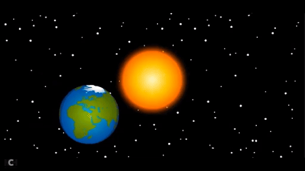
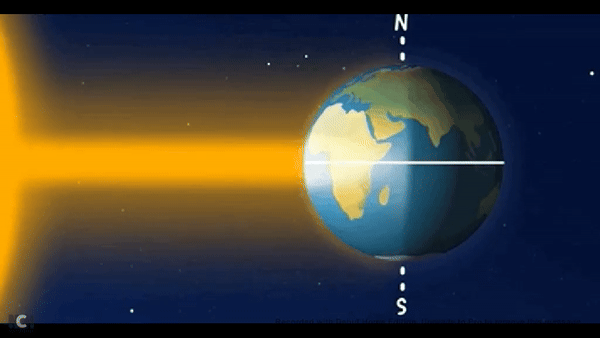
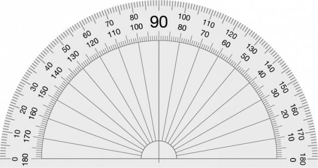
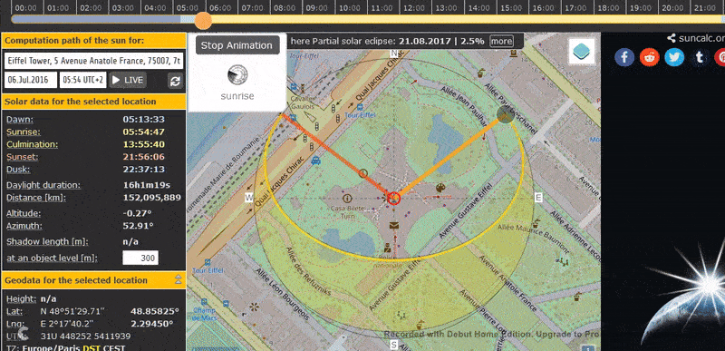
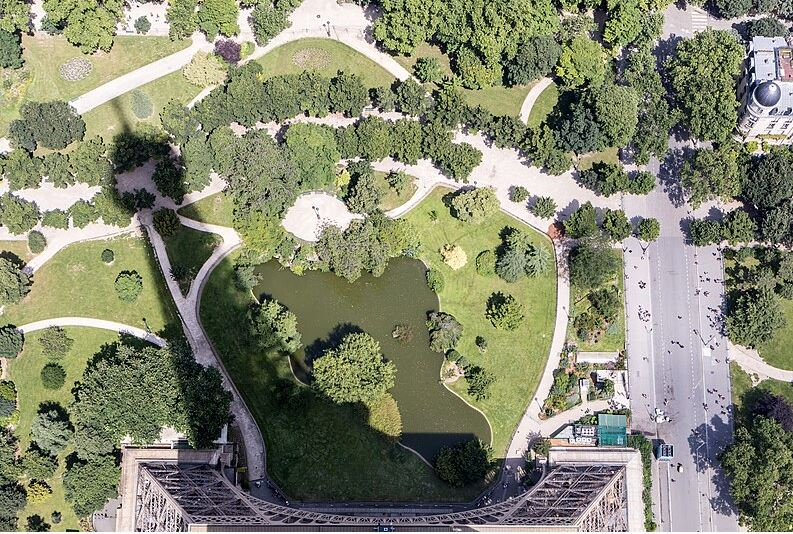
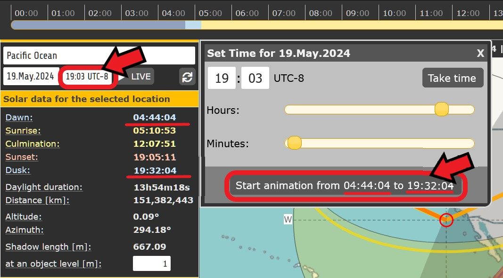

# SunCalc

## URL

[https://www.suncalc.org](https://www.suncalc.org/)

## Description

<figure><figcaption>
<strong>USING SUNCALC TO MEASURE THE POSITION OF THE SUN OVER TIME BY DRAGGING THE TIME SLIDER</strong> <strong>ACROSS THE TOP OF THE SCREEN WITH LEFT MOUSE DOWN</strong>
</figcaption></figure>

Suncalc works around the interplay of date, time of day, geographic location and sun height and direction. It shows the movement of the sun and sunlight phase for a certain day at a certain place. This relationship is so complex because... (Click for more detail)

* Suncalc is modelling the relative motion of two celestial bodies (sun and earth) in space , as seen from the viewpoint of a chosen spot on the surface of the earth.
* SunCalc's viewpoint is complicated by the fact that the chosen spot on earth is (a) spinning around the earth's axis and (b) rotating around the sun on an eliptical orbit. The sun's motion from that chosen spot is seen only as relative motion, since the the observer perceives their location to be stationary.

So the perceived trajectory of the sun is the result of the superposition of three different effects: Rotation, Orbit and Tilt:

1. <mark style="color:green;">**Internal Rotation:**</mark> The earth rotates daily around its internal axis.

_(Image from Giphy , author Dyanapyehchek @dianapietrzyk)_

The position of the sun along its daily trajectory in the sky (measured as changing elevation and azimuth angles) varies with the time of day.

2. <mark style="color:green;">**Orbit:**</mark> The earth rotates annually around the sun in an eliptical orbit...

_(Image from Giphy, author BrainPOP @brainpop)_

3. <mark style="color:green;">**Tilt:**</mark> ...at 23.5 degrees to its internal axis of rotation, with the North Pole constantly pointing at the North Star.

_(Image from Giphy, author European Space Agency)_

The length of the daytime (difference between time of sunset and time of sunrise) and the sun's trajectory in the sky vary according to season throughout the year, i.e. with the date. Latitudes tilted closer to the sun experience a warmer seasonal climate and longer days, those tilted further from the sun experience cooler seasons and shorter days.


**REVIEWING THE RELATIONSHIP OF SUN, MOON, SEASONS AND TIME WITH ENCYCLOPAEDIA BRITANNICA**\
**Copyright Encyclopedia Britannica, Inc.**


SunCalc can be used for geolocation and chronolocation in various ways:

### SunCalc for Open Source Research: Use Cases, Data Input, SunCalc Outputs, How to Enter Data... (Click each of the four tabs for more detail)



* Location of a chosen point on the earth's surface
* Date
* Time of Day
* Height of an object at the chosen point (for shadow calculation)



<mark style="color:green;">**Major Solar Data**</mark> (for selected location and time) including

* the times of dawn, sunrise, culmination, sunset, dusk
* duration of daylight (length of day)
* distance of the location from the sun in km
* angles of altitude (height of sun in sky) and azimuth (angle of sun direction on a compass)
* length of a shadow cast by an object of given height in m.

<mark style="color:green;">**Geodata**</mark> (for selected location) including:

* Height of location (altitude) in m
* Latitude in degrees
* Lontigude in degrees
* UTM ([Universal Transverse Mercator](https://www.usgs.gov/faqs/how-are-utm-coordinates-measured-usgs-topographic-maps)) co-ordinates
* Time Zone

<mark style="color:green;">**Minor Solar Data**</mark> (for selected location and time) including

* Julian date ([JDE](https://aa.usno.navy.mil/data/JulianDate)), [DeltaT ](https://www.oxfordreference.com/display/10.1093/acref/9780191851193.001.0001/acref-9780191851193-e-952)(Difference between Terrestrial Time and Universal Time), Greenwish Mean Sidereal Time ([GMST](https://www2.mps.mpg.de/homes/fraenz/systems/systems3art/node10.html)), Greenwich Hour Angle ([GHA](https://my.vanderbilt.edu/astronav/overview/3-completing-a-worksheet/section-iii/gha/)), Solar [Declination Angle](https://www.sciencedirect.com/topics/engineering/solar-declination), [Right Ascension Time](https://science.nasa.gov/learn/basics-of-space-flight/chapter2-2/) (celestial equivalent of longitude), Date and Time of March, June, September and December [Solstice/Equinoxes](https://www.britannica.com/video/217727/Demystified-what-is-the-difference-between-solstice-and-equinox)

<mark style="color:green;">**Photovolatic Data**</mark> including

* [Solar constant](https://en.wikipedia.org/wiki/Solar_constant), [air mass](https://www.nationalgeographic.org/encyclopedia/air-mass/) and [irradiance](https://www.merriam-webster.com/dictionary/irradiance)



There are very many use cases for SunCalc in Open Source research because there are so many variables involved: latitude, longitude, date, time, azimuth angle, elevation angle and many different combinations of these variables can be known in different research/investigative scenarios.

<mark style="color:green;">**Confirmation and Elimination:**</mark> SunCalc is strongly suited to use in tandem with other tools to establish a geolocation. It can often be valuable in confirming or rejecting a candidate location found with other tools and methods. It can deliver ranges of possible and impossible values for this purpose, e.g. the yellow shaded crescent area on the map which represents coverage of all possible sun trajectories for the year.

<mark style="color:green;">**Sun Angles in Source Imagery:**</mark> The sun's position is defined by two angles: azimuth and elevation. In a research source image where orientation is not known, but the sun can be seen, elevation angle could be known but azimuth angle unavailable. Conversely, where a shadow is visible on the ground in an image containing a reference point, but the sun is not directly visible, elevation angle could be unknown, but azimuth angle available.

<mark style="color:green;">**Three Variables Defining a Sun Trajectory:**</mark> The sun's trajectory specifies its changing position (specified by azimuth and elevation angles) over time. This trajectory is calculated by Suncalc for a given date and location, so if two variables from the set {azimuth angle, elevation angle, time} are known, the third can be calculated.

<mark style="color:green;">**Locations Only Confirmed by Trial and Error:**</mark> SunCalc is configured to set location as the primary input, then change time and date and observe the effects on azimuth, altitude and shadow length. Therefore, in practice, where all variables apart from location are known, SunCalc can only be used to test the sun's trajectory at different locations on the earth, not to return the possible locations and dates on the earth corresponding to a given defined trajectory of the sun, i.e. 'guess' locations can only be tested by trial and error.



<figure><figcaption></figcaption></figure>




**Establishing the Time/Timeframe of Source Imagery:** When dealing with research imagery sourced from social media, remember that the time at which an image was taken is not necessarily the time at which it was posted on social media, which could be any time after it was created. Sometimes regional internet blackouts are imposed where the authorities wish to prevent publication of current affairs, and this makes reconstruction of event timing particularly difficult. Many social media platforms strip metadata like the time the image was taken before publishing. This metadata is less likely to be deleted if images are sent using a platform's file transfer service, rather than being "posted".


### Sun Trajectory: Azimuth and Elevation Angles

The trajectory of the sun is its path through space. This is defined by the variation in two angles applied to the sun seen in the sky from earth: azimuth angle and elevation angle... (Click for more detail)

**THE AZIMUTH ANGLE OF THE SUN (HORIZONTAL COMPASS BEARING)**

**THE ELEVATION ANGLE OF THE SUN (VERTICAL SEXTANT ANGLE)**

### The SunCalc Interface

<figure><figcaption>
<strong>THE SUNCALC INTERFACE MAIN WINDOW WITH EXPLANATORY LABELS</strong>
</figcaption></figure>

* The red centre circle shows the selected location over the map, with horizontal and vertical crosswires for accuracy.
* The sun is shown over the earth as an orange disc.
* The thin yellow curve is the trajectory of the sun for the chosen location and date
* The shaded yellow arc (crescent moon shape) shows all the sun's trajectories superimposed for the entire year, i.e. the variation of the sun's path over the year.
* The two coloured radial lines are the position of the sun at sunrise (lighter yellow in the East) and the position of the sun at sunset (darker orange in the West).
* Where a solar eclipse is to take place, this is tracked on the map as a thick purple line with its date. [See screenshot here](./#description)

#### Configuring the Interface Display

<figure><figcaption>
<strong>USERS SELECT THE UNDERLAY MAP FOR SUNCALC FROM THE MENU UNDER THE TOP RIGHT MAP ICON</strong>
</figcaption></figure> <figure><figcaption>
<strong>USERS CONFIGURE THE INTERFACE FROM THE MENU UNDER THE TOP LEFT MENU ICON</strong>
</figcaption></figure>

Menu buttons top left and top right of the map display show menus to toggle overlays for night, eclipse, and date and for distance measurement (Top Left Option Icon) and to set the source of the base map from 4 options (Top Right Layer Icon). See menus above.

### Objects and Their Shadows: SunCalc Shadow Length Feature

<figure><figcaption></figcaption></figure>

Open Source Imagery often contains shadows in the same image as the object which cast them. Trigonometry can be used to relate the height of the object, the length of the shadow and the angle of elevation of the sun. It is the elevation angle of the sun which determines the ratio of the height of an object to the height of the shadow it casts.


Beware: For accurate results, the object in a source image and the shadow it casts must be at right angles (i.e. orthogonal) to the camera. A useful tool for dealing with angles in imagery is a transparent digital protractor. The example below can be copied and pasted for personal use and is provided under a creative commons licence by pngall.com at [https://www.pngall.com/protractor-png/download/13598](https://www.pngall.com/protractor-png/download/135986)

These transparent protractor images can also be found online and be transformed in 3D by graphics programs to rotate to an angle which compensates for non-orthogonal shadow images, but some accuracy is lost. Above is a digital protractor in \*.png format to preserve transparency so that measurements can be made whilst the image beneath is visible.


**SunCalc Shadow Length Function** allows the user to input the height of an object at the chosen location, and then displays the length of the shadow of that object for the given location, date and time. This shadow length is displayed above the input window for object height.

<figure><figcaption>
<strong>SETTING OBJECT HEIGHT FOR SHADOW LENGTH CALCULATION</strong>
</figcaption></figure>

To open the input window for shadow length, click on the Object Level text input window in the sidebar, then enter text or use the buttons to set the object height - see above.

### The Animation Feature

This animated graphic is generated by SunCalc for location Eiffel Tower, Paris, France. A still photograph taken from that exact location at a known date and time is shown below for comparison. The last graphic shows how to generate the animated graphic in SunCalc.

<figure><figcaption>
<strong>RUNNING SUNCALC'S SHADOW ANIMATION FOR THE 300M EIFFEL TOWER FOR COMPARISON WITH A DOCUMENTED PHOTOGRAPH ON SHADOW DIRECTION AND LENGTH</strong>
</figcaption></figure>

<figure><figcaption>
<strong>EIFFEL TOWER SHADOW PHOTOGRAPH BY STEVE FROM TEXAS</strong> <a href="https://www.flickr.com/people/8666640@N06"><strong>https://www.flickr.com/people/8666640@N06</strong></a> <strong>FROM WIKIMEDIA WEBSITE</strong> <a href="https://commons.wikimedia.org/wiki/File:Shadow_of_the_Eiffel_Tower,_Paris_6_July_2016.jpg"><strong>https://commons.wikimedia.org/wiki/File:Shadow_of_the_Eiffel_Tower,_Paris_6_July_2016.jpg</strong></a> <strong>LOCATION = EIFFEL TOWER, PARIS, FRANCE. DATE = 3/7/16, TIME = 07:35 (TEXAS TIME, I.E. 14:35 PARIS TIME)</strong> <strong>NOTE THAT THE SHADOW DIRECTION MATCHES AT 14:35 PARIS TIME BECAUSE THE MOBILE CAMERA IS ON TEXAS TIME</strong>
</figcaption></figure>

<figure><figcaption>
<strong>CLICK THE TIME INPUT BUTTON ON THE INTERFACE, THEN THE START ANIMATION BUTTON ON THE "SET TIME" WINDOW</strong>
</figcaption></figure>

SunCalc can run an animation showing the sun's daylight trajectory over time from dawn to dusk for the day and location chosen in the sidebar. This is activated from the Time Input Window as shown above.

## Cost

* [x] Free
* [ ] Partially Free
* [ ] Paid For

## Level of difficulty

<table><thead><tr><th data-type="rating" data-max="5"></th></tr></thead><tbody><tr><td>3</td></tr></tbody></table>

Some technical knowledge and practice is required to use Suncalc efficiently. The interface is not always immediately intuitive. For Open Source research, the calculation of shadow lengths and the relationship with the elevation angle can be error-prone.

## Requirements

None. No account is needed.

## Limitations

**Accuracy:** The main limitation in the use of SunCalc for Open Source investigation is variable accuracy of the results. SunCalc itself is a very accurate tool, but the accuracy of the SunCalc input values obtained in Open Source research is often questionable. For example, taking measurements from imagery is often inexact, e.g. azimuth and elevation sun angles, shadow and object lengths which aren't at 90 degrees to the photographer.

**Graphical Interface:** Many users find it counterintuitive that the background map in Suncalc can be moved by the user, but the geographic location point cannot. There is good design justification for this, it simply doesn't align with other tools on this point and so requires adjustment from the user.

## Ethical Considerations

Personal Privacy of, and Risk To, SunCalc Users ...(Click for more detail)

SunCalc does not require a login and does not store source information, and thus poses negligible risk to users' privacy

## Guide

SunCalc general tutorial (not specifically Open Source research) [https://www.youtube.com/watch?v=Mouw\_0oACs8](https://www.youtube.com/watch?v=Mouw_0oACs8)

The effects of the earth's orbit around the sun at [https://www.britannica.com/video/152185/role-orbit-axis-Earth-seasons](https://www.britannica.com/video/152185/role-orbit-axis-Earth-seasons)

Real time sun and moon tracking at [https://www.suncalc.org/sunmoontrack/](https://www.suncalc.org/sunmoontrack/)

Moon calculations at [https://mooncalc.org](https://mooncalc.org)

Planet calculations at [https://planetscalc.org](https://planetscalc.org)

Satellite orbit tracking at [https://www.orbtrack.org/](https://www.orbtrack.org/)

## Tool provider

Torsten Hoffmann, Germany

## Advertising Trackers

* [ ] This tool has not been checked for advertising trackers yet.
* [ ] This tool uses tracking cookies. Use with caution.
* [x] This tool does not appear to use tracking cookies.

***

| Page maintainer:- |
| ----------------- |
| Sophie Tedling:   |
|                   |
