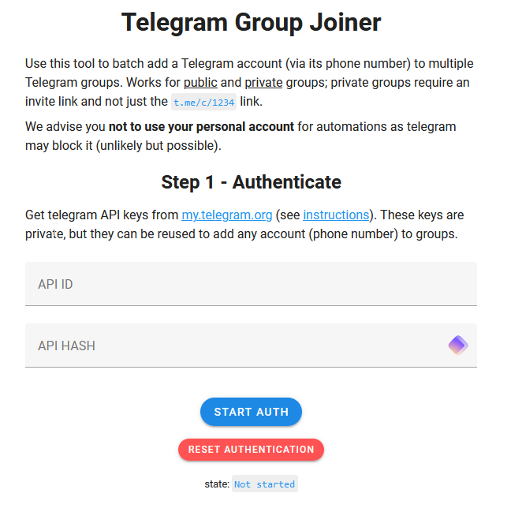

# Telegram Group Joiner

## URL

[https://bellingcat.github.io/telegram-group-joiner/](https://bellingcat.github.io/telegram-group-joiner/)\
(latest commit on **2023‑12‑18,** last checked Oct. 31, 2025)

## Description

A small, browser‑based helper that adds a Telegram **user account** to multiple groups or channels in one go. It works with both public t.me links and private invites, and you can preload a session by passing several links in a single `?links=` query string (semicolon‑separated). The app runs fully client‑side using **TDLib**, and the project is auto‑deployed as a static site on GitHub Pages. [GitHub](https://github.com/bellingcat/telegram-group-joiner)

* **Supported features**:\
  – Batch‑join multiple groups/channels from pasted URLs. [GitHub](https://github.com/bellingcat/telegram-group-joiner)\
  – Accepts **private invite** links. [GitHub](https://github.com/bellingcat/telegram-group-joiner)\
  – Preload links via `?links=` (semicolon‑separated). [GitHub](https://github.com/bellingcat/telegram-group-joiner)
* **Optional**: Self‑hosting (Node/Yarn) if you prefer to run locally. [GitHub](https://github.com/bellingcat/telegram-group-joiner)

<figure><figcaption></figcaption></figure>

The tool allows preloading of group URLs by appending them to a base URL, separated by semicolons. This automation is executed fully client-side using tdlib for a robust Telegram API experience. It is worth mentioning that the tool only operates client-side, ensuring no data retention on servers.

Github Project: [https://github.com/bellingcat/telegram-group-joiner](https://github.com/bellingcat/telegram-group-joiner)\\

## Cost

* [x] Free
* [ ] Partially Free
* [ ] Paid

**Free** (open‑source, MIT‑licensed).

## Level of difficulty

<table><thead><tr><th data-type="rating" data-max="5"></th></tr></thead><tbody><tr><td>3</td></tr></tbody></table>

Beginner–intermediate. No command line is needed if you use the hosted page, but you must create Telegram developer credentials (**api\_id**/**api\_hash**) at my.telegram.org and complete the normal login (which may include a 2‑step verification password and occasionally email verification). Familiarity with Telegram’s developer docs helps.

## Requirements

**Telegram API Keys:** [Obtain your API ID and API Hash](https://core.telegram.org/api/obtaining_api_id) from [my.telegram.org](https://my.telegram.org). This involves registering an application to receive these credentials. After entering the API ID and Hash, the tool will ask for your phone number and the 5-digit login code that Telegram sends you. If 2‑step verification is enabled, you’ll be prompted for the password; Telegram may also ask to set/verify a login email in some cases.

Use a modern desktop browser such as Chrome, Firefox, or Edge. (The page relies on WebAssembly; very old browsers (and some locked-down corporate ones) won’t load it. Safari older than v15 may fail to load the page.)

## Limitations

**Account Blocking Risk:** There is a risk that Telegram may block the automated account used for group additions. To mitigate this:

* Use a non-personal Telegram account dedicated to research purposes.
* Consider using a dedicated phone number ("burner number") when setting up the account.
* Utilize a VPN to enhance privacy and avoid potential geo-restrictions.
* Accounts created or [logged in via TDLib can be flagged and suspended without warning](https://github.com/tdlib/td/issues/2920); use a spare account.
* Telegram caps one account at roughly 500 groups/channels; after that, you’ll see ‘Limit reached’ errors.
* **Join‑cap**: Telegram enforces an account‑level cap on the number of joined **channels/supergroups**; the values are exposed in the API config (`channels_limit_default` / `channels_limit_premium`) and widely tracked as \~**500** for free accounts and up to **1000** for Premium (numbers can change). [core.telegram.org](https://core.telegram.org/api/config?utm_source=chatgpt.com)
* **Rate limits / flood control**: Rapid joins can trigger temporary errors; the project includes logic to handle rate limits (see “rate limits handling” commits). Pace additions. [GitHub](https://github.com/bellingcat/telegram-group-joiner/commits/main)
* **Account risk with TDLib logins**: Some developers report temporary or permanent suspensions after authenticating via TDLib (e.g., `PHONE_NUMBER_BANNED`, `EMAIL_NOT_ALLOWED`). Use a research‑only account and follow Telegram’s rules. [GitHub](https://github.com/tdlib/td/issues/2920)
* **Releases / maintenance**: No tagged releases; the latest repo change was **2023‑12‑18**. Treat the hosted page as the current build. [GitHub](https://github.com/bellingcat/telegram-group-joiner/tags)
* **Legal/ToS**: Use must comply with Telegram’s Terms and API Terms; avoid spammy or abusive behavior. [Telegram](https://telegram.org/tos?utm_source=chatgpt.com)

## Ethical Considerations

* Use only on accounts and groups you are authorized to access, for lawful research, and add only the minimum necessary groups for your purpose. Follow recognized guidance on handling digital open‑source information (e.g., the **Berkeley Protocol on Digital Open Source Investigations**) and the Toolkit’s own emphasis on neutral, well‑sourced descriptions.

## Guide

#### **General Usage**

1.  **Access the Tool:**

    Visit the [Telegram Group Joiner](https://bellingcat.github.io/telegram-group-joiner/) webpage.
2.  **Authenticate:**

    Enter your API ID, API Hash, **and then the 5-digit code Telegram texts you**.
3.  **Prepare Group Links:**

    * You can preload group or channel links by using the `links` parameter in the URL.
    * Separate multiple links with a semicolon (`;`).

    **Example:**

    *   **Links:**

        ```
        https://t.me/bellingcat
        https://t.me/+privateInvite123id
        ```
    * Combined Links:\
      `https://t.me/bellingcat;https://t.me/+privateInvite,123id`
    * Resulting URL:\
      `https://bellingcat.github.io/telegram-group-joiner/?links=https://t.me/bellingcat;https://t.me/+privateInvite,123id`
4. **Join Groups:**
   * Use the tool interface to automatically join the specified groups or channels.

#### Helpful Links

**GitHub README** (usage, `?links=` examples, TDLib note). [GitHub](https://github.com/bellingcat/telegram-group-joiner)

**Live tool page** (for quick use/testing). [bellingcat.github.io](https://bellingcat.github.io/telegram-group-joiner/?utm_source=chatgpt.com)

**Telegram: Creating an application** (how to obtain **api\_id**/**api\_hash**). [core.telegram.org](https://core.telegram.org/api/obtaining_api_id?utm_source=chatgpt.com)

**TDLib documentation** – **Web** (WASM/JS build overview). [core.telegram.org](https://core.telegram.org/tdlib?utm_source=chatgpt.com)

## Self-Hosting

```
# Installation (self-hosted dev)
git clone https://github.com/bellingcat/telegram-group-joiner
cd telegram-group-joiner
yarn && yarn dev  # or: yarn build
```

## Tool provider

* **Developed by:** [Bellingcat](https://www.bellingcat.com/)
* **Repository:** [GitHub - telegram-group-joiner](https://github.com/bellingcat/telegram-group-joiner)

## Advertising Trackers

* [ ] This tool has not been checked for advertising trackers yet.
* [ ] This tool uses tracking cookies. Use with caution.
* [x] This tool does not appear to use tracking cookies.

| Page maintainer |
| --------------- |
| Martin Sona     |
