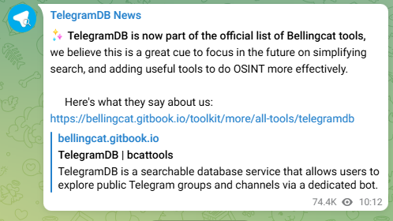

# TelegramDB

## URL

[https://telegramdb.org](https://telegramdb.org)

## Description

TelegramDB is a comprehensive search service for Telegram, enabling users to explore and analyze public Telegram groups, channels, and user information. Through its dedicated bot (**@tgdb\_bot**), researchers and casual users can:

1. **Search Public Chats:** Find public chats (groups, channels, or bots) by keyword or name.
2. **User Presence Lookup:** Obtain information about a user’s public presence (e.g., see which public groups they have joined), a (premium-tier) query that can list the groups a user has been in​.
3. **Data Exports for Analysis:** Generate CSV files of group members, cross-group overlaps, or “nearby” users based on shared group activity for advanced network analysis. These (premium-tier) features help map community networks and interactions.
4. **Telegram Statistics:** Access up-to-date statistics on TelegramDB’s indexed Telegram network (e.g., total chats, users, membership counts) via the bot or website.

_Recent updates:_ TelegramDB introduced a redesigned interface with an interactive menu (triggered by the `/search` command) and an improved search algorithm for more relevant results​

The database allegedly comprises[ hundreds of millions of chats](https://t.me/s/tgdatabase), and the service continues to refine features for better OSINT results​. _(Launched in 2022, TelegramDB has grown rapidly; by late 2023, it reported over 1.1 million monthly active users.)_

### Commands

The TelegramDB bot (@tgdb\_bot) offers a comprehensive set of commands to help users navigate and utilize Telegram data efficiently. Below is a detailed description of these commands and their functionalities:

Full Command Overview 

**Free Commands**

* **`/search`** – Opens an interactive menu to search by title, user, group, channel, or bot. (The legacy keyword search functionality is now under `/title`)
* **`/title [name]`** – Search for public groups and channels by title or keyword (text-based search).
* **`/info [id or @username]`** – Show basic profile information for a given user, group, or channel. (With premium credits, this includes historical details and alerts like scam/fake account flags​.)
* **`/resolve [id or @username]`** – Convert a user, group, or channel ID to its username (and vice versa) and display additional information such as past usernames, Telegram Premium status, verification badge, or scam flags.
* **`/group [name]`** / **`/channel [name]`** – Find public groups or channels by name. (Free mode returns limited results.)
* **`/bot [name]`** – Search for public bot accounts by name.
* **`/add [id or @username]`** – Add a user, group, or channel to TelegramDB’s index (useful for newly created or previously unindexed entities).
* **`/help`**, **`/faq`**, **`/terms`**, **`/support`**, **`/language`** – Access help and info: usage instructions, FAQs, terms and conditions, a link to the support chat, and language settings (English, Italian, etc.).
* **`/stats`** – Show live database statistics (total chats, groups, users, bots, etc.) indexed by TelegramDB​.
* **`/cancel`** – Cancel the current operation or menu.

#### Premium Commands (Credits Required)

* **`/where [id or @username]`** – Reveal the public groups in which a user has been a member. (Requires credits for a full list; without credits it will only report the count of groups, up to 5 uses per day​.)
* **`/members [id or @username]`** – Retrieve a CSV list of members of a specified group, including hidden or historical members (useful for archival member lists).
* **`/network [id or @username]`** – Identify related chats (groups, channels, or forums) that share a significant number of members with the target, returned as a CSV ranked by overlap relevance.
* **`/near [id or @username]`** – Find “nearest” users to a given user based on shared group memberships, outputting a CSV of users who have the most groups in common (with usernames and overlap counts)​.
* **`/credits`** – Check your credit balance and purchase additional credits through the bot’s payment interface​.

## Cost

TelegramDB uses a credit-based model for advanced searches and data extraction:

* **Free:** Basic searches (returns \~20 results max) and limited info queries are free​. This includes commands like `/search`/`/title` for keywords and basic `/info` lookups.
* **Paid:** Expanded searches and premium data commands (e.g. `/where`, `/members`, `/network`, `/near`) require spending credits. These allow larger result sets and detailed data exports beyond the free limits.

**Pricing:** Credits can be purchased in-app via the bot (Telegram’s built-in payment system)​. Example pricing tiers are approximately: 20 credits for €1.99, 50 credits for €4.99, 100 credits for €9.99, etc. Prices may vary by region and over time – the bot will show current offers via the `/credits` command. In practice, common searches might cost on the order of tens of credits; one informal sample showed query costs ranging from 10–27 credits, with a median of around 14 credits for typical extended searches.

Specific premium command [costs scale](https://www.telegramdb.org/article/introduction) with the size of the result: for example, the `/where` command charges 3 credits base + 1 credit per 40 results returned​.  The `/search` command in premium mode has no base cost (0 credits for the first \~20 results) and then similarly charges 1 credit per \~40 additional results beyond the free threshold​. The`/members` command cost uses a custom formula (approximately `3 + 0.6 * x^0.8` for _x_ results) to account for very large member lists. _(Use `/credits` in the bot to preview the exact cost of a query before confirming – the bot always displays the credit price and number of results you will get upfront​_[_telegramdb.org_](https://telegramdb.org/article/introduction)_.)_

**Payment methods:** Purchases are handled through Telegram’s payment platform integrated into the bot. Supported methods include standard options like credit/debit card; depending on the provider, services such as PayPal or cryptocurrency may be available​

[telegramdb.org](https://telegramdb.org/article/introduction). (The bot will guide you through payment, and was reported to accept crypto and other methods in addition to bank cards. No separate website signup is required.)

#### Free

Basic keyword searches (/search, /title)

* Limited results (up to \~20)
* Basic info from `/info`

#### Paid

* Premium commands: `/where`, `/members`, `/network`, `/near`
* Larger result sets (beyond the free limit)
* Historical data, CSV exports, user overlap analytics


Specific pricing for premium credits is not provided directly but operates on a credit-based payment system, including support for cryptocurrencies. (If you have used the pay functionality or know more, please do let me know)


* [ ] Free
* [x] Partially Free
* [ ] Paid

## Level of difficulty

<table><thead><tr><th data-type="rating" data-max="5"></th></tr></thead><tbody><tr><td>2</td></tr></tbody></table>

* **Beginner**: Basic searches are straightforward via simple commands.
* **Intermediate to Advanced**: Premium features (CSV exports, group network mapping) can be used for deeper OSINT investigations or data analytics.

## Requirements

* **Telegram Account**: You must have Telegram to interact with the bot [@tgdb\_bot](https://t.me/tgdb_bot).
* **Credits**: Needed for premium features (purchased in-bot)
* **Data Analysis Skills**: Helpful for interpreting CSV files, especially if you plan to load them into visualization tools (e.g., Maltego).

## Limitations

* **Public Content Only:** TelegramDB only indexes data from public or open Telegram chats. Private, invite-only, or deleted chats are not accessible via this tool. (All data is obtained by crawling public groups/channels visible to anyone, and TelegramDB is _not_ affiliated with Telegram itself​.
* **Unfiltered Data:** TelegramDB does not moderate or filter collected content, so search results may include pornography, hate speech, graphic violence, or other illegal or offensive material on Telegram. Users should exercise caution; content takedown requests can be made to remove personal data (see `/terms`)​.
* **API Constraints:** The service relies on Telegram’s infrastructure (APIs and network). Data may be subject to Telegram’s rate limits or outages, and information might not instantly reflect edits or deletions. For example, if a user leaves a group or a message is removed, it may still appear in TelegramDB’s cache until the next update or a removal request​.
* **Search Costs:** Extensive querying can become costly in credits. High-volume searches or bulk member exports may consume credits quickly, which can be a practical limitation for some users (though result previews and incremental costs are provided).
* **Data Accuracy:** Information retrieved might not reflect very recent changes on Telegram. There can be lag in indexing new groups or updating member lists, and some data (like historical usernames or group membership) may be incomplete if the crawler didn’t capture it in time. Always double-check critical information on Telegram itself if possible.

### Terms & Conditions (Key Points Summary)

* **Age Requirement:** You must be at least 18 years old (or the legal age in your jurisdiction) to use TelegramDB services and the @tgdb\_bot.
* **User Obligations:** Users must not use automated scripts or bots to scrape TelegramDB’s data without permission. All usage must comply with applicable laws – you may not use TelegramDB to harass, stalk, or inflict harm on others or for any unlawful purposes.
* **Prohibited Activities:** Unauthorized mass collection or resale of TelegramDB’s data is forbidden, as is any attempt to commercially exploit the service’s data or to post abusive content via the bot. Attempts to circumvent the bot’s security or access controls are strictly prohibited.
* **Governing Law & Disputes:** Use of TelegramDB is governed by the laws of Italy. In the event of disputes, the Terms specify resolution via arbitration in Milan, Italy, conducted in English (unless otherwise required by law).
* **Account Termination:** TelegramDB reserves the right to suspend or terminate your access for violations of the Terms of Use. If an account is terminated, creating substitute accounts to bypass the ban is not allowed without explicit permission.

_(Refer to the full Terms of Service via the `/terms` command in the bot for complete details. TelegramDB’s policies also outline GDPR compliance – personal data removal requests can be sent to the admins if content has been removed from Telegram but remains on TelegramDB​_

## Ethical Considerations

* **Data Privacy:** Even though TelegramDB only uses publicly available data, be mindful of privacy implications. Avoid using the tool to expose private individuals unnecessarily, and remember that public membership in a group does not always imply endorsement.
* **Compliance:** Ensure your use of TelegramDB aligns with data protection laws (e.g. GDPR) and ethical OSINT guidelines. If you retrieve personal data (like lists of users), handle it responsibly and respect any deletion requests.
* **Content Verification:** Results from TelegramDB might include misinformation, extremist propaganda, or spam accounts. Always verify content and identities through additional sources. Treat data as leads or clues rather than absolute facts until confirmed.
* **Responsible Usage:** Use TelegramDB in the spirit of research and investigation. Do not misuse the data for doxxing, harassment, or other unethical behavior. You are accountable for how you leverage information from the tool – always consider the potential impact on individuals’ privacy and safety.

## Guide

TelegramDB. (2024). _TelegramDB/TelegramDB_ \[Computer software]. [https://github.com/TelegramDB/TelegramDB](https://github.com/TelegramDB/TelegramDB) (Original work published 2022)

## Tool provider

[TelegramDB.org](https://telegramdb.org) maintains the service and its infrastructure (the developers have not publicly disclosed organizational details). The service operates[ servers in Europe​](https://telegramdb.org/article/introduction).

But they're listening to the community:\

## Advertising Trackers

* [ ] This tool has not yet been checked for advertising trackers.
* [x] This tool uses tracking cookies. Use with caution.
* [ ] This tool does not appear to use tracking cookies.

| Page maintainer |
| --------------- |
| Martin Sona     |
|                 |

