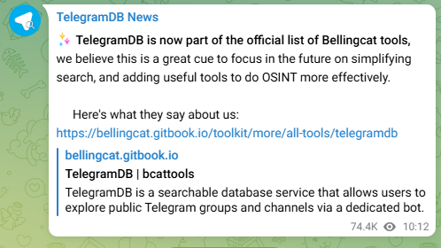

# TelegramDB

## URL

[https://www.telegramdb.org/](https://www.telegramdb.org/)\
(June 2025, [github](https://github.com/TelegramDB/TelegramDB))

## Description

TelegramDB (“TgDB”) is a searchable index of public Telegram spaces exposed through two products: **TgDB Search Lite** (a free bot at `@tgdb_search_bot`) and **TgDB Search Plus** (a web bot/webchat at tgdb.org for advanced/credit‑based queries). Core functions include keyword discovery of public channels, groups and bots, resolving IDs/usernames, and footprinting a user’s public group/channel history. Recent additions include network/affinity discovery (similar users or “near” users; groups with similar communities) and expanded result volumes for paid searches.

\
The bot lets you:

1. **Look up public chats** by keyword, name or username.
2. **Check a user’s public footprint** (`/where`) and see which groups they’ve joined.
3. **Export data** (CSV) such as full member lists, overlapping users or “near” users for network analysis tools.
4. **See live stats** on the TelegramDB index (`/stats`).

As of 2026-06-26, Telegram’s public bot page lists 658,148 monthly users for TgDB Search Lite (@tgdb\_search\_bot).&#x20;

Recent[ TgDB Search Plus updates](https://t.me/s/tgdatabase) include multilingual website/web bot support, profile pictures in search results, chat badges, and a right-click or long-press context menu for result actions. Channel and group searches currently prioritize exact “Precise Match” results; the broader fuzzy search mode was disabled after user feedback, with a selectable broad mode announced as a future plan.

### Commands

As of 2025, TelegramDB straddles a freemium model: a free “Search Lite” bot for basic discovery and a “Search Plus” web bot for premium features and heavy usage. Telegram’s bot info page shows a public monthly-user count for TgDB Search Lite (@tgdb\_search\_bot); treat this as a rough indicator that changes over time.

Full Command Overview

**Free Commands**

* **`/search`** – Search for public channels and groups (first 20 results free; more via credits). (The legacy keyword search functionality is now under `/title`)
* **`/title [name]`** – Search for public groups and channels by title or keyword (text-based search).
* **`/resolve [id or @username]`** – Convert a user, group, or channel ID to its username (and vice versa) and display additional information such as past usernames, Telegram Premium status, verification badge, or scam flags.
* **`/group [name]`** / **`/channel [name]`** – Find public groups or channels by name. (Free mode returns limited results.)
* **`/bot [name]`** – Search for public bot accounts by name.
* **`/help`**, **`/faq`**, **`/terms`**, **`/support`**, **`/language`** – Access help and info: usage instructions, FAQs, terms and conditions, a link to the support chat, and language settings (English, Italian, etc.).
* **`/cancel`** – Cancel the current operation or menu.

**Premium Commands (Credits Required)**

* **`/where [id or @username]`** – Reveal the public groups in which a user has been a member. (Requires credits for a full list; without credits, it will only report the count of groups, up to 5 uses per day​.)
* **`/members [id or @username]`** – Export a CSV list of members of a specified group.
* **`/network [chat]`** – Identify related chats (groups/channels) and export results to CSV.
* **`/near [id or @username]`** – Find ‘nearest’ users to a given user and export results to CSV.
* **`/credits`** – Check your credit balance and purchase additional credits through the bot’s payment interface​.

## Cost

* [ ] Free
* [x] Partially Free
* [ ] Paid

**Partially Free**

* **Free tier** (Search Lite): /search and /resolve are available without credits; /search returns 20 free results before paid expansion.
* **Paid tier** (Search Plus): premium functions use credits. The official news channel says the web interface is the place to purchase credits and access the full premium feature set, including /where, /members, /near and /network.

Search costs scale with result volume. Example (from [TelegramDB’s GitHub README](https://raw.githubusercontent.com/TelegramDB/TelegramDB/master/README.md)): /search as 20 free results plus 1 credit per additional 40 results, and /where as a 3-credit base price plus 1 credit per additional 40 results after the free count-only allowance. Always check the in-app cost preview before spending credits.

#### Free

Basic keyword searches (/search, /title)

* Limited results (up to \~20)
* Basic info from `/info`

#### Paid

* Premium commands: `/where`, `/members`, `/network`, `/near`
* Larger result sets (beyond the free limit)
* Historical data, CSV exports, user overlap analytics


The live credit-bundle price table was not reachable in this audit. Check the web/app payment flow and the command preview for the current cost before purchasing credits or running paid commands


## Level of difficulty

<table><thead><tr><th data-type="rating" data-max="5"></th></tr></thead><tbody><tr><td>2</td></tr></tbody></table>

* For most workflows this is **easy**: you interact with a Telegram bot or a simple web UI—no CLI, coding, or API keys. Investigators should be comfortable with Telegram usernames/IDs and basic search/refinement. Advanced outputs (CSV exports, larger result sets, user/network analysis) require using the web bot and credit management.
* Premium features (CSV exports, group network mapping) can be used for deeper OSINT investigations or data analytics.

## Requirements

* **Platform/runtime:** Any modern browser (tgdb.org web bot) or Telegram app (bot). [tgdb.org](https://www.tgdb.org/bot?utm_source=chatgpt.com)
* **Access & install:** No local install. Start the bot at @tgdb\_search\_bot (Lite) or use TgDB Search Plus via the web bot (tgdb.org/bot; some announcements also reference tgdb.org/page/bot). [Telegram](https://t.me/tgdb_search_bot)
* **Auth / tokens:** TgDB Search Lite requires a Telegram account. TgDB Search Plus uses a TgDB website account; credits are purchased via /credits and availability of payment methods can vary over time. [GitHub](https://github.com/TelegramDB/TelegramDB)
* **Telegram Account**: Telegram account: Required for TgDB Search Lite at @tgdb\_search\_bot. TgDB Search Plus is accessed via the TgDB webchat and may require a TgDB website account.
* **Credits**: Needed for premium features (purchased in-bot)
* **Data Analysis Skills**: Helpful for interpreting CSV files, especially if you plan to load them into visualization tools (e.g. Maltego).

## Limitations

* Public Content Only: TelegramDB indexes only publicly accessible Telegram groups/channels. It cannot search private chats or hidden groups. (All data is obtained by crawling public groups/channels visible to anyone, and TelegramDB is not affiliated with Telegram itself.)
  * Availability/maintenance: TgDB Search Plus has periodic maintenance windows and occasional outages; if results look inconsistent, check the TgDB News channel for service announcements.
  * Search behavior changes: Recent updates reverted channel/group search to “precise match” results only; a broader search mode is planned, so search behavior may change again.
* **Unfiltered Data:** TelegramDB does not moderate or filter collected content, so search results may include pornography, hate speech, graphic violence, or other illegal or offensive material on Telegram. Users should exercise caution; content takedown requests can be made to remove personal data (see `/terms`)​.
* **API Constraints:** The service relies on Telegram’s infrastructure (APIs and network). Data may be subject to Telegram’s rate limits or outages, and information might not instantly reflect edits or deletions. For example, if a user leaves a group or a message is removed, it may still appear in TelegramDB’s cache until the next update or a removal request​.
* **Search Costs:** Extensive querying can become costly in credits. High-volume searches or bulk member exports may consume credits quickly, which can be a practical limitation for some users (though result previews and incremental costs are provided).
* **Data Accuracy:** Information retrieved might not reflect very recent changes on Telegram. There can be lag in indexing new groups or updating member lists, and some data (like historical usernames or group membership) may be incomplete if the crawler didn’t capture it in time. Always double-check critical information on Telegram itself if possible.

### Terms & Conditions (Key Points Summary)

* **Age Requirement:** You must be at least 18 years old (or the legal age in your jurisdiction) to use TelegramDB services and the @tgdb\_bot.
* **User Obligations:** Users must not use automated scripts or bots to scrape TelegramDB’s data without permission. All usage must comply with applicable laws – you may not use TelegramDB to harass, stalk, or inflict harm on others or for any unlawful purposes.
* **Prohibited Activities:** Unauthorized mass collection or resale of TelegramDB’s data is forbidden, as is any attempt to commercially exploit the service’s data or to post abusive content via the bot. Attempts to circumvent the bot’s security or access controls are strictly prohibited.
* **Governing Law & Disputes:** Use of TelegramDB is governed by the laws of Italy. In the event of disputes, the Terms specify resolution via arbitration in Milan, Italy, conducted in English (unless otherwise required by law).
* **Account Termination:** TelegramDB reserves the right to suspend or terminate your access for violations of the Terms of Use. If an account is terminated, creating substitute accounts to bypass the ban is not allowed without explicit permission.

(Refer to the full Terms of Service via the /terms command in the bot for complete details. TelegramDB’s GitHub README also describes GDPR/data-removal requests: check whether the content remains on Telegram first, then email TelegramDB with the chat ID or username and the reason for removal.)

## Ethical Considerations

* **Data Privacy:** Even though TelegramDB only uses publicly available data, be mindful of privacy implications. Avoid using the tool to expose private individuals unnecessarily, and remember that public membership in a group does not always imply endorsement.
* **Compliance:** Ensure your use of TelegramDB aligns with data protection laws (e.g. GDPR) and ethical OSINT guidelines. If you retrieve personal data (like lists of users), handle it responsibly and respect any deletion requests.
* **Content Verification:** Results from TelegramDB might include misinformation, extremist propaganda, or spam accounts. Always verify content and identities through additional sources. Treat data as leads or clues rather than absolute facts until confirmed.
* **Responsible Usage:** Use TelegramDB for **lawful, proportionate and necessary** OSINT only. Minimize collection of personal data, preserve context, and document methods. For methodology and evidentiary handling, see the **Berkeley Protocol on Digital Open Source Investigations** (OHCHR) and related guidance. Toolkit volunteers should also follow Bellingcat’s internal standards on neutrality and updates.

## Guide

* TelegramDB – **README / product overview** (commands, credits, policies). [GitHub](https://github.com/TelegramDB/TelegramDB)
* TgDB News (@tgdatabase) – official announcements about access changes, outages, search behavior and feature updates: [https://t.me/s/tgdatabase](https://t.me/s/tgdatabase?utm_source=chatgpt.com)
* TgDB Search Lite – **Bot page** (`@tgdb_search_bot`). [Telegram](https://t.me/tgdb_search_bot)
* TelegramDB – Content policies, GDPR/data-removal process and contact email in the official README: [https://github.com/TelegramDB/TelegramDB](https://github.com/TelegramDB/TelegramDB?utm_source=chatgpt.com)
* Authentic8 – **Understanding Telegram for OSINT research** (contextual how‑to, 2025‑06‑05). [https://authentic8.com/telegram-osint-research](https://authentic8.com/telegram-osint-research)

## Tool provider

TelegramDB.org / TgDB Team maintains the service. Public organizational details are limited; the official [GitHub README](https://raw.githubusercontent.com/TelegramDB/TelegramDB/master/README.md) identifies the project’s public endpoints, support group and support account, and says the service is not affiliated with Telegram. The README also says its servers are located on European territory.

But they're listening to the community:\

## Advertising Trackers

* [ ] This tool has not yet been checked for advertising trackers.
* [x] This tool uses tracking cookies. Use with caution.
* [ ] This tool does not appear to use tracking cookies.

| Page maintainer |
| --------------- |
| Martin Sona     |
|                 |
