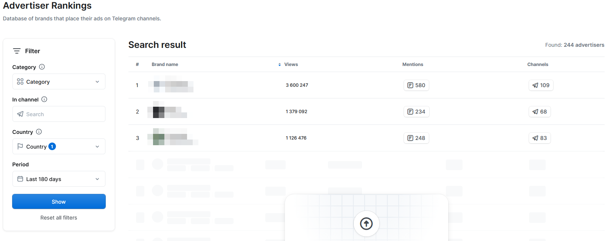

# Telemetrio

## URL

[https://telemetr.io/](https://telemetr.io/)\
(as of August 2025)

## Description

Telemetr.io is a Telegram analytics suite aimed at journalists and researchers. It now tracks **more than 9.7 million public channels and groups** (May 2025) and stores historical data on posts, ads and audience metrics. Key features:

* **Channel & Post Search** – keyword or ID look-ups with comment, reaction and share stats.
* **Rankings & Collections** – leader-boards by country, category and “channel network”.
* **Cheater Tag & Ads Index** – fraud score plus advertising intensity for every channel.
* **Mini-App analytics** – metrics for over 4 000 Telegram Mini Apps.
* **Event tracking & alerts** – real-time keyword or channel monitoring with Telegram bot notifications.


**Exports:** _Advanced_ and _Enterprise_ plans allow full CSV/Excel export of every metric shown on the site. _Basic_ and _Pro_ can only export the public channel catalogue. Check the pricing page or message **@telemetrio\_contact** for a custom quota.


Features:

* Global Channel Search and Ranking
* Channel Advertising Effectiveness metrics
* Channel Quoting analysis
* Channel Publication Analysis
* Channel Audience Overview
* Channel descriptions history
* Event Tracking / Alerts
* Advertising Post Search
* Advertiser Rankings
* Posts Search
* Mini Apps Catalog _(new)_ – analytics for Telegram Mini Apps
* API

The examples show the results of a free-tier user account logged in and searching for the term Bellingcat. This result page shows Bellingcat's Telegram channel with several analytical data points, including subscriber counts across time, post views, engagement rate, category, etc.

<figure><figcaption>
Telemtrio example search result depicting the Bellingcat channel.
</figcaption></figure>

## Functions

### Ranking Options on Telemetr.io

The Primary Catalog includes an extensive database that provides a broad overview of available channels. It helps researchers identify channels of interest and understand the overall scope of Telegram's ecosystem. The catalog is useful for initial exploration and broad searches.

Catalog Ranking options

**Country Ranking**

Country Ranking organizes Telegram channels based on their popularity and influence within 83 countries. This allows the identification of the most prominent channels in specific regions, which can be helpful for geographic-specific investigations and understanding regional variations in channel popularity.

**Ratings by Category**

Ratings by Category rank Telegram channels within 41 categories based on topics or industries. This categorization enables focused analysis of channel performance within specific sectors, which can be useful for industry-specific research and identifying key players in particular fields.

**Rating of Channel Networks**

The ranking option evaluates Telegram channels that belong to specific networks. Understanding these rankings can help analyze the influence and reach of groups of channels, potentially providing insights into coordinated efforts or campaigns within the Telegram ecosystem.

**Recommended Collections**

Recommended Collections group channels by topic, helping researchers discover new channels related to specific interests. This feature is helpful for thematic research and identifying channels that discuss particular issues or topics, broadening the scope of investigations.

**Add Channel to Catalog**

This feature allows users to add channels not listed in the catalog. It ensures that new or previously unlisted channels can be included and analyzed, keeping the database comprehensive and up-to-date. This can be useful for expanding the scope of research to include emerging or niche channels.

### Individual Channel metrics

#### Overview

When viewing the landing pages of individual channels, several metrics are presented that can help you quickly judge a Telegram channel's size, influence, engagement, and activity.

<figure><figcaption>
The results page of the Bellingcat channel showing several basic metrics. (see details below)
</figcaption></figure>

Landing page metric details

**Subscribers:** This metric indicates the total number of people subscribed to the channel. A higher subscriber count reflects a larger audience, suggesting the channel's potential influence and reach within the Telegram ecosystem.

**Subscriber Growth:** This measures the change in the number of subscribers over specific periods, such as the last 24 hours, 7 days, or 30 days. Monitoring subscriber growth helps understand the channel's popularity trends and how its audience is evolving over time.

**Post Views:** This represents the total number of views for posts made on the channel. It shows how often the content has been seen by users, highlighting the channel's reach and the popularity of its posts.

**Views Over Time:** This metric breaks down post views over specific periods, like the last 24 or 48 hours. It helps identify when the channel's content is most viewed, indicating peak engagement times and the effectiveness of posting schedules.

**Engagement Rate (ER):** The engagement rate measures the percentage of subscribers interacting with the content through likes, comments, and shares relative to the total number of subscribers. A higher engagement rate suggests that the followers are more active and involved with the channel's content.


Some example use-cases:

* **Assessing Influence:** Looking at subscriber numbers, growth trends, and engagement rates is useful if you want to gauge the channel's influence and reach quickly.
* **Monitoring Activity:** Understanding the frequency of posts and the level of engagement helps identify active channels and the effectiveness of their content strategies.
* **Analyzing Engagement:** Detailed metrics on views, reactions, comments, and reposts offer insights into how the audience interacts with the content, which can reveal the effectiveness of disinformation campaigns or propaganda efforts.
* **Tracking Visibility:** Mentions and their trends over time provide information on the channel's visibility and impact within the Telegram community and beyond.


***

#### The Overview Tab

<figure><figcaption>
This section provides a visual representation of the channel's subscriber growth over time. The graph shows the number of subscribers on a daily basis, while the right column lists recent posts.
</figcaption></figure>

The "Overview" tab provides critical insights into the channel's growth, engagement, and recent activity. A line graph shows the total number of subscribers over a selected period, highlighting trends in subscriber growth, and a table lists the exact number of subscribers, daily growth, mentions, reposts, and posts according to the selected granularity.

Overview Tab Metrics details (Graph)

* **ER Over Time**: This tool tracks the engagement rate over different periods, providing insight into when and how followers engage with the content. Monitoring ER trends can reveal patterns and help optimize content strategy to maximize engagement.
* **Mentions:** Counts the number of times other channels or users mention this channel within a given timeframe. A high mention count indicates the channel’s content is being discussed widely, reflecting its visibility in the broader Telegram community.
* **Mentions Over Time:** This shows mention frequency over specific periods, helping to understand the channel’s prominence and when it spikes in conversations. Spikes in mentions often correlate with specific events or notable posts.
* **Posts per Day:** The average number of posts the channel publishes daily. This indicates how active the channel is in terms of content output and can influence how the audience engages (too many or too few posts).
* **Reactions:** The number of reactions (such as likes or other emoji responses) the channel’s posts receive. This metric gauges immediate audience sentiment and interest in the content.
* **Comments:** The number of comments on the channel’s posts, reflecting the level of discussion or debate generated by the content. More comments often mean a highly engaged community.
* **Reposts:** How many times the channel’s posts have been shared or forwarded by others. Reposts indicate that followers find the content valuable enough to share with their own audiences, thereby extending the channel’s reach.


Some use-cases:

* **Tracking Popularity and Reach:** The subscriber growth graph and table help monitor the channel's popularity and reach over time. Researchers can identify periods of rapid growth and investigate the causes, such as specific events or viral content.
* **Monitoring Engagement:** Engagement metrics provide insights into how actively the audience interacts with the channel's content. High engagement suggests that the channel is successful in addressing its followers through its posts.
* **Correlating Events and Content:** Correlating spikes in subscriber growth or engagement with specific posts or external events can help to understand the impact of particular messages.
* **Emerging Trends:** Regularly reviewing the "Overview" tabs of one or several channels can help to stay updated on emerging trends and shifts in strategy or focus.


#### Advertising effectiveness

<figure><figcaption>
Advertising effectiveness tab of an "alternative news" channel.
</figcaption></figure>

The **Advertising Effectiveness tab** provides metrics for understanding a channel's advertising strategies and their impact. Investigating advertising can help trace funding sources or reveal connections between obfuscated networks of channels. Advertising is an aspect of research often worth looking into and a strength of the platform (compared to free or CLI tools).

Advertizing tab metrics in detail

* **Growth (24h):** The number of new subscribers the channel gained in the last 24 hours. This can measure the immediate impact of advertising campaigns or promotions. A significant spike here could indicate a successful ad or a surge of interest due to an event.
* **Views (24h):** The average number of views per advertising post over the last 30 days. This is calculated by summing the 24-hour view counts of each ad post in the last 30 days and dividing by the number of ad posts. It reflects how many views, on average, an ad post gets in a day, giving a sense of reach for advertisements.
* **Advertisements per Day:** How frequently ads are posted on the channel (ad frequency). A lower frequency often indicates less ad clutter and potentially higher impact for each advertisement. A very high frequency might annoy subscribers or dilute the effectiveness of each ad.
* **Average TOP (Time On Page):** The average time an advertisement remains at the top of the channel (i.e. until a new post is made). A longer TOP means the ad stays visible longer, which can indicate its effectiveness in holding attention (often well-funded or strategic ads remain visible longer).
* **Advertised Channels:** The number of other Telegram channels that this channel has promoted in the last 90 days. This metric shows how often the channel is advertising _other_ channels. It can reveal connections between channels – for example, if Channel A frequently advertises Channel B, they might be part of the same network or support each other’s growth. A high number of advertised channels may indicate a broad network of cross-promotion.
* **Other Resources:** The number of external links or resources the channel has shared (e.g. links to websites, documents, or other platforms). Sharing many external resources might indicate attempts to drive traffic outside Telegram, possibly revealing additional platforms or funding sources connected to the channel.
* **1-hour Growth:** When this channel posts an advertisement for another channel, this metric shows how many new subscribers the advertised channel gains within one hour of the ad. It’s a measure of how quickly the audience responds to the ad. Rapid growth in one hour can signify an effective advertisement or a particularly receptive audience at that time.
* **24-hour Growth:** Similarly, this measures the number of new subscribers gained by the advertised channel within 24 hours of the ad post. It shows the advertisement’s longer-term effect on drawing in subscribers beyond the immediate burst, indicating sustained interest.
* **Mentions in Other Channels:** How many times the advertised channel (the one being promoted) is mentioned in other channels. This gauges the broader impact of the advertisement across Telegram. If an advertised channel is getting mentioned a lot elsewhere, it suggests the promotion resonated beyond its initial audience and may have sparked wider discussion or further sharing.
* **Advertising Post:** Details of the ad post itself, including its content and performance (views and the average time users spent viewing that post—another “Time On Page” metric specific to the ad). High view counts and a long view duration (TOP) suggest the ad post effectively captured users’ interes&#x74;**.**


**Use cases:**

* **Tracing Funding Sources:** Analyzing advertising frequency and subscriber growth can infer a channel's financial backing, helping to estimate how much money has been spent to drive the channel.
* **Identifying Network Connections:** Metrics like advertised channels can reveal relationships between different disinformation networks, showing how they support and promote each other.
* **Understanding Audience Engagement:** Average time on the page indicates how engaging the content is, suggesting the effectiveness of a channel's advertising.
* **Tracking Resource Sharing:** Monitoring additional resources shared by the channel helps identify efforts to drive traffic to external sites, providing clues about broader connections and potentially additional funding sources.
* **Analyzing Responses to Events:** Spikes in advertising and subscriber growth often correlate with specific political or social events. These metrics can reveal political channels or disinformation campaigns that capitalize on such events to promote particular messages and narratives.
* **Measuring Broader Influence:** Tracking mentions in other channels helps gauge the advertisement's broader impact and dissemination across the Telegram network. This can reveal how widely the advertisement is shared and discussed, indicating its influence.
* **Understanding Advertising Strategies:** By analyzing the performance of various advertisements, researchers can identify effective strategies and tactics used in promotional activities. This is particularly important for tracing the dissemination patterns of disinformation and understanding the methods used to amplify specific messages


***

#### Quoting Tab

The Quoting tab details how often a channel is mentioned or reposted by others, detailing both incoming and outgoing mentions. It includes the top channels mentioning the analyzed channel, the categories and geographic locations of these mentions, and visual representations of repost and mention activity over time. This information is useful when studying Telegram channels' network dynamics, reciprocity, and influence.

_Quoting Tab: In/Outgoing Mentions:_

<figure><figcaption>
Incoming and Outgoing Messages of an "alternative news" channel.
</figcaption></figure>

Quoting Tab metrics details (In/Outgoing Mentions)

* **TOP Incoming Mentions:** This shows which channels mention the analyzed channel most frequently. For each of these channels, it provides the number of mentions, the percentage of the analyzed channel’s total mentions that this represents, and the engagement rate of the mentioning channel. This helps identify which other channels are amplifying the analyzed channel’s content and how engaged those channels’ audiences are (a mention from a highly engaged channel could be more impactful).
* **Mentions (Total):** The total number of times other channels mention the analyzed channel. This gives a direct sense of how visible or talked-about the channel is within the Telegram ecosystem.
* **Percentage of Total Mentions:** For each channel that mentions the analyzed channel, this figure shows what fraction of all mentions that channel accounts for. It highlights if the attention is coming primarily from a few sources or if it’s more distributed. (For example, one channel might contribute 50% of all mentions of your channel, indicating a close or significant relationship.)
* **Engagement Rate (ER) of Mentioning Channels:** The engagement rate of each channel that mentions the analyzed channel indicates how interactive its audiences are. If channels with high ER mention the analyzed channel, those mentions likely carry more weight (their audiences might follow up or check out the mentioned channel).
* **TOP Outgoing Mentions:** Lists the channels that the **analyzed channel** itself mentions most frequently. For each mentioned channel, it similarly provides the number of times they are mentioned, what percentage of the analyzed channel’s outgoing mentions each constitutes, and the engagement rate of those mentioned channels. This helps analyze the channel’s promotion or networking strategy — which channels it is regularly pushing or referencing.

These metrics allow insights into key questions about the channel's interactions, such as which channels most frequently mention it and the proportion of total mentions contributed by each channel. Additionally, they can identify which channels the analyzed channel mentions most frequently and assess their engagement level.

_Quoting Tab: Repost Graphs and Graphs by Category & GEO_

<figure><figcaption>
Reposts and channel mentions of an "alternative news" channel.
</figcaption></figure>

Channel mentions graph details

The **"Reposts and channel mentions"** graph shows the daily number of times the channel's content is reposted and the frequency with which others mention the channel. This data can help identify patterns in content dissemination and engagement; spikes in mentions or reposts can correlate with specific events or campaigns.

The **"Mentions by Category"** chart categorizes the context in which the channel is mentioned, with categories such as "Politics", "News & Media", "Religion & Spirituality", and "Other". This helps identify the primary thematic areas where the channel is gaining attention.

The **"Mentions by GEO"** chart breaks down the geographical distribution of the mentions, indicating the countries where the channel is most frequently referenced. This geographical analysis is vital for understanding the channel's regional influence and reach. For example, a high percentage of mentions in Germany suggests that the channel significantly impacts that region, which can be relevant for regional-specific studies or investigations into localized disinformation efforts.

Together, these metrics help track a channel's visibility and influence, understand the context and themes of its mentions, and identify the geographical regions where it is most influential.

_Quoting Tab: Reposts and mentions table_

<figure><figcaption>
Bellingcat's incoming reposts and mentions.
</figcaption></figure>

The "Reposts and Mentions of the Channel" section provides a detailed view of how the analyzed channel interacts with and is referenced by other channels. This is divided into incoming and outgoing mentions.

**Incoming Mentions** lists the channels that mention the analyzed channel, the category they belong to, the date and time of the mention, the number of views the mention received, and the total quoting statistics. Detailed engagement metrics are also included, such as the number of mentions and the engagement rate (ER) of the mentioned channels.

**Outgoing Mentions** (not visible in the image) lists the analyzed channel mentions. They include similar metrics like categories, reposts and mentions, views, and total quoting statistics.


**Some example use-cases**

* **Visibility and Influence:** By examining the incoming mentions, one may identify which channels amplify the analyzed channel's content and gauge the channel's visibility and influence within the Telegram network.
* **Network Connections:** Understanding incoming and outgoing mentions helps map the network of interaction between channels. This can reveal patterns of coordination, influence, and potentially coordinated campaigns.
* **Content Strategy:** Analyzing the types of channels that mention or are mentioned by the analyzed channel helps understand the thematic focus and content strategy, providing clues about the channel's objectives and target audience.


***

#### Publication Tab

The Publication Analysis tab offers detailed insights into a channel's average daily posting activity distribution, the performance of its individual posts, and the source distribution of post views.

_Publication Tab: posting time distributions_

<figure><figcaption>
A: Posting time distribution of an "alternative news" channel.
</figcaption></figure>

<figure><figcaption>
B: Posting time distribution of Bellingcat's channel
</figcaption></figure>

Publication Tab (posting time &#x26; sources) details

The Publication tab also provides a **publication analysis table** of recent posts and their performance. This includes, for each recent post:

* **Posts:** The title or a snippet of the post (or an identifier if no title) along with its publication time.
* **Views:** The total number of views that post has received.
* **Shares:** How many times the post has been forwarded or shared.
* **Views Dynamics:** A small graph or indicator of how the views accumulated over time after the post was published (for example, showing if it got most of its views in the first hour or steadily over a day, etc.)


Analyzing posting times can help identify inauthentic behavior in several ways. Regular posting patterns may indicate automated activity. Suppose posting usually happens during time zones inconsistent with the channel's alleged identity or is restricted to office hours. In that case, it may suggest that the posting is part of a professional operation rather than driven by genuine political conviction.


_Publication Tab: publication analysis_

<figure><figcaption>
<strong>Publication Analysis metrics table</strong> includes recent posts, publication times, total views, the number of shares, and a graphical representation of how views accumulate over time.
</figcaption></figure>

Publication Analysis metrics details

* **Posts:** A list of recent posts with their titles and publication times.
* **Views:** The total number of views each post has received.
* **Shares:** The number of times each post has been shared.
* **Views Dynamics:** A graphical representation of how views accumulate over time for each post.


Example use cases:

* **Analyze Content Impact:** Identify which posts have the most views and shares to understand what content resonates most. This can indicate topics of high interest or importance to the audience.
* **Analyze the posting time distributions** to identify peak times for posting, helping to allocate monitoring resources effectively during high-activity periods.
* Use the sources of views chart to **trace the primary channels through which information spreads**, whether through direct followers, group shares, or external links.
* Identify the most successful posts regarding views and shares to understand the themes or issues of significant interest, guiding further research or reporting focus.


***

#### Audience Tab

The Audience tab on Telemetr.io provides essential metrics on the demographics, engagement, and behavior of a channel's subscribers.


This area is only accessible to channel owners who have subscribed to the service. The values in this tab are example values and will be the same for each channel.


<figure><figcaption>
Example demographic metrics.
</figcaption></figure>

Audience Tab metrics details

* **Subscribers’ Gender:** The gender distribution of the channel’s subscribers (e.g., what percentage are male vs. female) helps understand the demographic makeup of the audience and can hint at the channel’s appeal or target demographic.
* **Audience Language:** The primary languages spoken by the subscribers can indicate which geographic or linguistic communities are most influenced by the channel. For instance, a majority of Russian-language followers vs. English-language followers can indicate regional reach.
* **User Lifetime on the Channel:** How long have subscribers been following the channel (e.g., what portion joined in the last month vs. long-time subscribers)? This shows audience loyalty and turnover, whether the channel keeps a stable core of followers or relies on constantly attracting new ones.
* **Subscriber Profile Details:** Stats such as how many subscribers have premium Telegram accounts, how many have usernames, how many have profile photos (avatars), and how many have unmuted the channel’s notifications. These metrics help profile how engaged or reachable the audience is. For example, a high number of premium users or users who haven’t muted the channel might indicate a very engaged or attentive audience, whereas a lot of anonymous accounts might signal something else about the follower base.

***

#### About the channel

<figure><figcaption>
Bellingcat's historical changes to their channel descriptions.
</figcaption></figure>

The **About the Channel tab** provides details about the history of changes in the channel names, descriptions, and external links.

About the Channel field details

* **Channel Names:** Lists all names the channel has used, along with timestamps for when each name was in effect or when it was changed. This creates a timeline for any rebranding or name changes. Such information can provide insights into the channel’s history and whether it has tried to reinvent itself. It also helps verify authenticity – if a channel’s name history shows it was previously something unrelated, it might raise questions about whether it’s the same entity or if control changed hands.
* **Descriptions:** Shows the channel’s self-description texts over time, including any external links mentioned in those descriptions. Changes in the channel’s description can reveal shifts in messaging or focus. For example, a channel might update its description to promote a new website or to change its stated purpose. Frequent description changes could indicate strategic shifts or attempts at rebranding. Additionally, seeing links to other platforms (YouTube, Odysee, BitChute, etc.) in descriptions helps trace the channel’s presence across different platforms and can point to where else the channel’s content or community lives.
* **Public Links:** Lists any external links or social media accounts associated with the channel that are publicly provided (apart from description text). This could include links to a website, other social media profiles, or related project pages. These links are invaluable for network analysis: they help map out the broader network of online entities connected to the channel and can lead investigators to the channel’s presence outside of Telegram or to affiliated groups.


**Example Use Cases:**

* **Channel Evolution:** Examining the timeline of changes in channel names and descriptions helps to learn about the channel’s evolution, noting any significant shifts in focus or strategy.
* **Verification of Authenticity:** Identifying the official channels and their associated platforms helps distinguish authentic sources from potential imposters.
* **Network Mapping:** Use public links to create a network map of associated channels and projects to visualize the entity’s digital footprint and influence outside of Telegram


***

### Tools

Telemetr.io offers several tools for monitoring and analyzing Telegram channels:

* **Event Tracking:** Follows real-time events on Telegram by monitoring keywords or specific channels, allowing users to track mentions and other activities and even detect if mentions are deleted (which could indicate censorship). It can send notifications for significant developments.
* **Advertising Posts:** Analyzes advertisement posts across Telegram channels, providing insights into the content and effectiveness of ads posted on channels.
* **Advertiser Rankings:** Displays a database of brands and advertisers on Telegram (across all channels), ranked by various metrics. This helps users understand the advertising landscape on Telegram and identify major advertisers. _(Initially launched as beta; now a standard feature.)_
* **Posts Search (New):** Enables searching for specific words or phrases in Telegram posts across channels. This is useful for tracking discussions, finding references to a topic across many channels, or researching how information spreads on Telegram.
* **TgCleaner:** Helps channel admins identify and remove bot or fake subscribers from their channel, thereby maintaining the quality of the channel’s audience. _(This feature is available for **free** to verified channel owners​.)_
* **Joinio:** A bot assistant for managing join requests to a Telegram channel, facilitating member recruitment and moderation (for example, handling applications to join if a channel is private or approval-based).

#### Event tracking

The event tracking tool provides the functionality to focus on relevant channels or keywords, track deleted mentions to identify potential censorship or narrative manipulation and receive real-time notifications to stay updated on significant developments.

<figure><figcaption>
Word and phrase event tracking dialogue
</figcaption></figure>

The **word tracking tool** allows users to monitor specific words or phrases within Telegram channels and chats to track discussions on particular topics, events, or individuals.

Word Tracking Tool input fields

* **Words or Phrases:** You input the keywords you want to monitor. The tool will track these across public channels (and chats, if selected) to help you follow the spread of information or the prevalence of a topic.
* **Where to Look?:** You can choose to search within **channels** (public broadcasts) or **chats** (group or private conversations). Searching in channels captures public discourse, while searching in chats (where accessible) can give insight into more private or community discussions. Often, selecting both gives a comprehensive picture.
* **Minus Word:** If there are common but irrelevant contexts for your keywords, you can exclude certain terms. This filters out noise. For example, if you're tracking the word "mercury" but want info on the element and not the planet, you might exclude "planet" as a minus word.
* **Search Scope:** You have three options to refine scope:
  1. _In Any Channels or Chats_ – a broad search everywhere on Telegram (within public scope or accessible chats).
  2. _Search in Specific Channels or Chats_ – limit the search to particular channels/chats that you suspect are relevant (for targeted investigations, e.g. only within known extremist channels).
  3. _Exclude Specific Channels or Chats_ – search everywhere except some places you specify (useful if certain high-traffic channels create lots of irrelevant hits).
* **Notification Bot:** You can activate Telemetr.io’s notification bot to receive an immediate alert on Telegram whenever your tracking criteria are met (for instance, if your keyword appears or your watched channel gets mentioned). This provides real-time monitoring without needing to constantly check the site, making it convenient and ensuring you don't miss timely information.

<figure><figcaption>
Channel and chat tracking dialogue
</figcaption></figure>

Channels and Chats tracking input fields

* **Channel to Track:** Specify the name/ID of a Telegram channel you want to monitor.
* **What Events to Report:** Choose what kind of events you want alerts on for that channel. For example:
  * **Mentions of the Channel:** Get notified whenever this channel is mentioned in other channels or chats. This helps you see when the channel becomes a subject of discussion elsewhere, indicating its content might be spreading or causing reactions.
  * **Deleted Mentions:** Get an alert if a post that mentioned this channel is later deleted. Such deletions could suggest someone tried to retract information or cover up an association. Monitoring these can be important for investigative leads (e.g., if a channel gets mentioned in a controversial context and that mention disappears).
* **Where to Look?:** Similar to keyword tracking, you can monitor mentions in channels vs. chats (or both).
  1. Monitoring in **Channels** will focus on public mentions in other channels (which is great for capturing public discourse around the channel).
  2. Monitoring in **Chats** will look at mentions in group or private chats (capturing more private community discussions)​
* **Search Scope:** The same trio of scope options (anywhere, specific, exclude specific) applies here as well, allowing you to broaden or narrow where you want to monitor mentions of the channel.


**Info:** Example use cases for the Event Tracking tool:

* **Comprehensive Monitoring:** Keep track of a developing story or rumor by monitoring keywords across Telegram. For example, during breaking news, monitor a key term to see how information spreads.
* **Focused Investigation:** If you're researching a specific group, you might track their channel name (to see who talks about them) and exclude unrelated groups to avoid noise.
* **Detecting Emerging Trends:** Real-time alerts for certain phrases can tip you off when a narrative is starting to go viral or when a new hashtag or slogan emerges in chats/channels you watch.
* **Contextual Understanding:** By monitoring both public channels and private chats for a keyword, you can gauge differences in public messaging vs. grassroots discussion on that topic.
* **Real-Time Alerts:** Get immediate notifications for critical keywords (e.g., a sudden mention of a planned protest or a key figure’s name) so you can respond or investigate quickly.


***

#### Advertising Tool

<figure><figcaption>
Comparing Advertisements for "Visa"
</figcaption></figure>

The advertising search tool allows users to filter and analyze advertisement posts on Telegram, unrelated to individual channels. This tool may be used to understand advertising trends, find actors who advertise items or services of interest to your investigation, and track specific ad campaigns.

Filter Options and Result metrics

The filter options on the left side of the screen refine the search based on various criteria:

* **Period:** Select a time range (e.g., last 7 days, last 30 days, etc.) to only see ads posted in that interval. This helps focus on recent ads or a specific timeframe of interest.
* **In Text:** Search for specific words or phrases within the text of ads. This is useful if you’re looking for ads about a particular topic or campaign (for example, ads mentioning "VPN service" or a brand name).
* **Mentioned Channel:** Find ads that mention a specific Telegram channel. This could reveal partnerships or influencer marketing (e.g., a brand’s ad that mentions a channel it’s collaborating with).
* **By Channel:** Filter by the channel that posted the ad. If you want to analyze the advertising behavior of a specific channel (like a news channel that also posts ads), you can see all ads from that channel.
* **Category:** Filter ads by their topic or industry category (if categorized). This allows an industry-specific analysis, such as looking at ads related to cryptocurrency, fashion, politics, etc.
* **Country:** Filter ads based on the country of origin (likely inferred from the channel or content). This is useful for geographic analysis — for instance, see ads coming from Russian channels versus U.S. channels.
* **Views:** Set a minimum and/or maximum range of views. This lets you find either very popular ads (high views) or perhaps niche ads (low views). It helps in identifying which ad campaigns gained significant attention.

After applying filters, the results section will list advertisement posts that match your criteria, with key details for each:

1. **Channel Information:** The channel that posted the ad, including its name and avatar. This gives context on who is advertising — e.g., an ad might come from a channel dedicated to ads or from a normal channel occasionally posting an ad.
2. **Engagement Metrics:** For each ad post, you’ll see metrics like how many mentions it got, how many views it received, and possibly an engagement rate (ER). These help evaluate the ad’s performance or virality (mentions could indicate other channels or users are talking about the ad).
3. **Ad Content:** The text or media of the ad itself (what is being advertised and how). Reviewing the content can help you understand the messaging and possibly identify common patterns or tactics used in Telegram ads.
4. **Post Time:** The date and time when the ad was posted. This can be important for correlating with events (was it posted during a major product launch? on a weekend? etc.) and for sorting ads chronologically.
5. **Analytics Link:** A link to further analytics for that ad post. Clicking this would typically take you to a more detailed analysis page for that specific advertisement, where you might see its full performance over time or related analytics.


**Info:** Use-case examples for the Advertising search tool:

1. **Tracking Ad Campaigns:** If you know of an ongoing campaign (say a political campaign advertising on Telegram), you can filter by a keyword or channel to see all the related ads and analyze their reach and frequency.
2. **Identifying Influencers:** By filtering ads by certain categories or searching in ad text, you might see certain channels repeatedly. For example, you might discover that a few channels frequently appear posting ads for tech products, indicating they are key influencers in that niche.
3. **Regional Analysis:** Using the country filter, you could compare how advertising differs between regions. For instance, what products are commonly advertised in Eastern Europe Telegram channels vs. Western Europe.
4. **Content Analysis:** By reading through the content of ads in a category, you can identify messaging strategies. E.g., ads for financial services might commonly use certain phrases or offers — understanding this can be useful if you’re investigating scams or propaganda in ads.


***

#### Advertiser Rankings Tool

The advertiser rankings tool allows users to analyze advertising activities on Telegram by ranking advertisers based on various criteria. Users can filter their search by category, specific channels, country, and time period to focus on industry-specific trends, targeted advertising efforts, and geographic-specific strategies. The search results provide detailed metrics for each advertiser, including brand name, total views, mentions, and the number of channels where ads are placed.

<figure><figcaption>
Advertizer ranking showing the top advertizers in Germany. (Free version is limited to 3 results)
</figcaption></figure>

Filter Criteria &#x26; Results details

The filter options on the left side of the screen allow users to refine their search for advertiser rankings based on various criteria.

**Filter Criteria:**

* **Category:** Select an industry or content category to narrow down advertisers. For example, you can choose “Cryptocurrencies” to see only crypto-related advertisers, or “News & Media” for media brands.
* **In Channel:** Specify a particular channel to see which advertisers have placed ads in that channel. This is useful if you want to see who is sponsoring a specific channel.
* **Country:** Filter advertisers based on country of origin, which helps to analyze advertising markets by region.
* **Period:** Choose a time range (e.g., last 180 days) to consider ads placed in that timeframe. This focuses the ranking on recent activity or a particular period of interest.

The search results section lists advertisers based on the selected filters. Each advertiser entry includes various metrics and details.

**Metrics and Details:**

* **Brand Name:** The name of the advertiser (often a brand or product name) and possibly a logo. Recognizing the brand can immediately tell you who is spending on Telegram ads.
* **Views:** The total number of views garnered by that advertiser’s ads (summing across all their ads in the selected scope). High view counts indicate that the advertiser’s messages are reaching a large audience.
* **Mentions:** How many times the advertiser is mentioned (perhaps in contexts outside their own ads). Many mentions could suggest the advertiser is creating buzz or being discussed by channels/users, not just seen.
* **Channels:** The number of different channels where the advertiser has placed ads. A broad presence (ads in many channels) indicates a wide campaign or multiple partnerships, whereas ads concentrated in a few channels might indicate a targeted strategy.


**Use-cases:**

* **Identifying Coordinated Campaigns:** Researchers can identify patterns suggesting coordinated disinformation efforts by filtering advertisers within specific categories and channels. Frequent advertising in certain categories can reveal orchestrated campaigns to manipulate public opinion.
* **Tracing Financial Backing:** Identify and analyze advertisers with high view counts and frequent mentions to provide insights into their financial backing.
* **Mapping Networks:** Investigating advertiser activity across numerous channels helps understand their reach and influence. This can reveal the structure of larger collaborating channel networks and how they disseminate information across different channels.
* **Evaluating Impact:** Tracking changes in advertising activity over time allows researchers to correlate spikes with significant events. This can reveal how disinformation campaigns are timed and adjusted to maximize impact, potentially providing a strategic understanding of these operations.


***

### API

Telemetr.io offers a REST API (OpenAPI v3). Recent additions include the fields **`ads_index_grade`** (ad saturation) and **`err24_percent`** (24-hour error ratio).

Tariffs: **Free, S, M, L, XL** – €0 / 25 / 65 / 199 / 499 per month, covering 5 to 10 000 verified channels and 1 000 to 2 000 000 calls. API keys are issued by @telemetrio\_api\_bot.

The API follows the OpenAPI v3 specification for compatibility with various programming environments. It currently supports operations such as: searching for channels by name/keywords, retrieving basic information about a channel (ID, name, description, etc.), accessing channel statistics (subscriber counts, growth, engagement metrics), viewing recent channel messages, tracking changes in subscribers, and getting the history of message reach (views over time for messages). It also provides reference data like lists of supported languages, countries, and categories for channels (to interpret codes or filter data).

## Cost

* [ ] Free
* [x] Partially Free
* [ ] Paid


- The free tier may suffice for basic orientation and initial exploration, but its limitations (on a number of channels tracked, search functions, event tracking, and data export) make it inadequate for most in-depth investigations.
- The Pro tier offers some improvements (more ad post tracking and limited audience analytics), serving as a starting point for research, but it remains significantly limited in scope.
- The Advanced tier provides extensive search capabilities and some data export, but even here, the export functionality is minimal (mostly just channel list data).
- The Enterprise tier includes fully customizable options and is ideal for large-scale or institutional research needs, offering the most comprehensive access.
- **API access** is available to export a larger set of channel metrics, but this is priced separately from the main subscriptions and has its own tiers and limits.


| Plan           | Monthly price\* | Key allowances                                      |
| -------------- | --------------- | --------------------------------------------------- |
| **Basic**      | free            | analyse 5 channels and 5 post searches per day      |
| **Pro**        | €69             | 40 channels, ads search, limited event tracking     |
| **Advanced**   | €149            | unlimited channels, full exports, multi-seat access |
| **Enterprise** | from €265       | custom limits, SLA support, white-label API         |

\*Prices published April 2025. Payments are made in the web dashboard with card, PayPal or cryptocurrency after signing in with a **Telegram or Google account**.

## Level of difficulty

<table><thead><tr><th data-type="rating" data-max="5"></th></tr></thead><tbody><tr><td>2</td></tr></tbody></table>

## Requirements

* Modern web browser.
* **Telegram or Google account for single-sign-on**.
* Spreadsheet or graphing tool (Excel, LibreOffice, Python, etc.) to open CSV exports.

## Limitations

* **Access thresholds** – The **free** tier lets you analyse up to **5 channels per day** and run **5 post-search queries per day**; Event Tracking is limited to one keyword or one channel. [telemetr.io](https://telemetr.io/en/channels/2166657568-official77menang?utm_source=chatgpt.com)
* **Historical data** – Free users see roughly the **last 30 days** of metrics. _Pro_ extends this to 90 days; _Advanced_ and higher tiers unlock **up to 12 months** of history.
* **Real-time delay** – Updates are not instantaneous; stats refresh every **10–15 minutes**, which can miss very short-lived posts or rapid edits.
* **API restrictions** – The free API plan allows **1 000 calls per month, 5 verified channels and 7 days of history**; paid plans (S → XL) raise those limits to 10 000 channels and 2 million calls, with history up to 365 days. [api.telemetr.io](https://api.telemetr.io/docs/intro/overview?utm_source=chatgpt.com)
* **Geographical coverage** – Certain languages and smaller regions may have patchy or delayed coverage, so local trends can be under-represented.
* **Miscategorisation** – Automatic topic tagging can be wrong (the “Facts” category is especially noisy); always review a channel manually if precision matters.

Researchers should keep these limitations in mind when deciding if Telemetr.io meets their needs and when interpreting the data it provides.

## Ethical Considerations

When using telemetr.io for research or analysis, ethical considerations should include:

* **Privacy and Consent:** Ensure that data use respects the privacy of individuals and groups. While Telegram channels and bots are public, it's crucial to consider the implications of using or sharing this data without explicit consent.
* **Data Misuse:** Be cautious of how the data collected is used, avoiding any actions that could harm individuals, groups, or entities.
* **Transparency:** When presenting research or analysis findings, clearly disclose the source of your data and the methodologies used to collect and analyze it.
* **Bias and Fairness:** Acknowledge any potential biases in the data or its collection method that could affect the research outcomes.
* **Compliance with Laws:** Ensure that your use of telemetr.io and its data complies with applicable laws and regulations, including those about data protection and privacy in your country.

Adhering to these ethical guidelines helps maintain integrity and respect for privacy in research and analysis efforts.

## Guide

To effectively use Telemetr.io, especially for beginners or those looking to refine their skills, the following resources are recommended:

**Official Wiki**

* [https://medium.com/@telemetrio](https://medium.com/@telemetrio)

**Tutorials and Articles**

* Team, I.T. (2022) _How to Archive Telegram Content to Document Russia’s Invasion of Ukraine_, _bellingcat_. Available at: [https://www.bellingcat.com/resources/how-tos/2022/03/08/how-to-archive-telegram-content-to-document-russias-invasion-of-ukraine/](https://www.bellingcat.com/resources/how-tos/2022/03/08/how-to-archive-telegram-content-to-document-russias-invasion-of-ukraine/) (Accessed: 15 April 2024).
* _Tipsheet: Latest Tools for Investigating with Telegram_ (no date). Available at: [https://gijn.org/resource/tipsheet/tipsheet-latest-tools-investigating-with-telegram/](https://gijn.org/resource/tipsheet/tipsheet-latest-tools-investigating-with-telegram/) (Accessed: 19 April 2024).

#### Developer Resources

* [https://api.telemetr.io/](https://api.telemetr.io/)

**Community and Support**

* [**Available on Telegram**](https://t.me/+aRqqqRdHIr1mMmZi)

## Tool provider

Telemetr.io [https://telemetr.io/en/terms-of-use](https://telemetr.io/en/terms-of-use) - Estonia

## Advertising Trackers

* [ ] This tool has not been checked for advertising trackers yet.
* [x] This tool uses tracking cookies. Use with caution.
* [ ] This tool does not appear to use tracking cookies.

**Tracking and Cookies:** Telemetr.io uses advertising trackers and cookies on its website. A scan with Privacy Badger reported the presence of a Google AdSense advertising tracker and a Cloudflare analytics beacon​, indicating that user activity on the site may be tracked for advertising or analytical purposes. Use the site with appropriate caution (e.g., browser extensions or settings to block trackers if desired).

**Data Collection:** According to Telemetr.io’s[ terms of use](https://telemetr.io/en/use-of-cookies), the platform may collect certain personal data via cookies, including the date and time of visits, a masked IP address, and approximate location (country, region, city, and latitude/longitude) of users. Users should be aware that by logging in through Google or Telegram and using the service, some of their data (albeit limited and anonymized) is being recorded.

| Page maintainer |
| --------------- |
| Martin Sona     |
