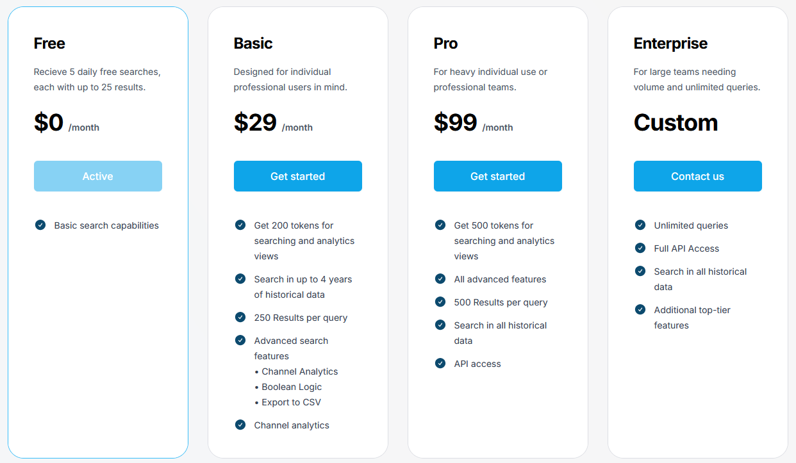

# Telemetry

## URL

[https://www.telemetryapp.io/](https://www.telemetryapp.io/)

## Description

Telemetry supports boolean search queries and returns results of 2.4b+ messages and 1m+ channels, allowing for analysis of group and individual activity on the platform. It also offers an API "to search, monitor and utilize Telegram data at scale."

## Cost

* [ ] Free
* [x] Partially Free
* [ ] Paid

Telemetry allows 5 free searches per day (providing up to 25 results) per account. For further access, pricing is as follows in USD:

<figure><figcaption></figcaption></figure>

API access is also available [here](https://api.telemetryapp.io/docs/).

## Level of difficulty

<table><thead><tr><th data-type="rating" data-max="5"></th></tr></thead><tbody><tr><td>1</td></tr></tbody></table>

## Requirements

Account creation is necessary to use the free search, and an understanding of basic boolean strings is recommended to use the tool most successfully.

## Limitations

The free version's searches only provide 25 results.

Swapping the results of a single search between "Messages" and "Channels" uses one allotted token.

## Ethical Considerations

When using Telemetry for research purposes, it's imperative to consider the following ethical aspects:

* **Privacy and Consent**: Although Telemetry archives public posts, researchers should be mindful of the privacy expectations of individuals who made those posts. Not all users understand or anticipate their contributions being analysed or quoted in research.
* **Bias and Representativeness**: Acknowledge that the data collected from Open Measures may not be representative of broader populations or viewpoints. Research findings should be contextualised within the scope and limitations of the data source.
* **The Oxygen of Amplification**_**:**_ Think carefully about what you publish so as not to unwittingly amplify some of the messaging present on fringe platforms. (_See_ [_The Oxygen of Amplification: Better Practices for Reporting on Extremists, Antagonists, and Manipulators Online_](https://datasociety.net/library/oxygen-of-amplification/) _by Whitney Phillips)._

Telemetry's Privacy Policy can be found [here.](https://www.telemetryapp.io/policies/privacy-policy)

## Guides and articles

[Telemetry: Best Practices](https://www.telemetryapp.io/blog/post/telegram-best-practices)

## Tool provider

Telemetry Data Labs, based in Tel Aviv, Israel. The tool was co-founded by Ari Ben Am, author of the [_Memetic Warfare_](https://www.memeticwarfare.io/p/memetic-warfare-weekly-tasteful-binary) weekly newsletter (which occasionally features Telemetry's use in its investigations and analysis.)

## Advertising Trackers

* [x] This tool has not been checked for advertising trackers yet.
* [ ] This tool uses tracking cookies. Use with caution.
* [ ] This tool does not appear to use tracking cookies.

| Page maintainer           |
| ------------------------- |
| Bellingcat Volunteer Team |
