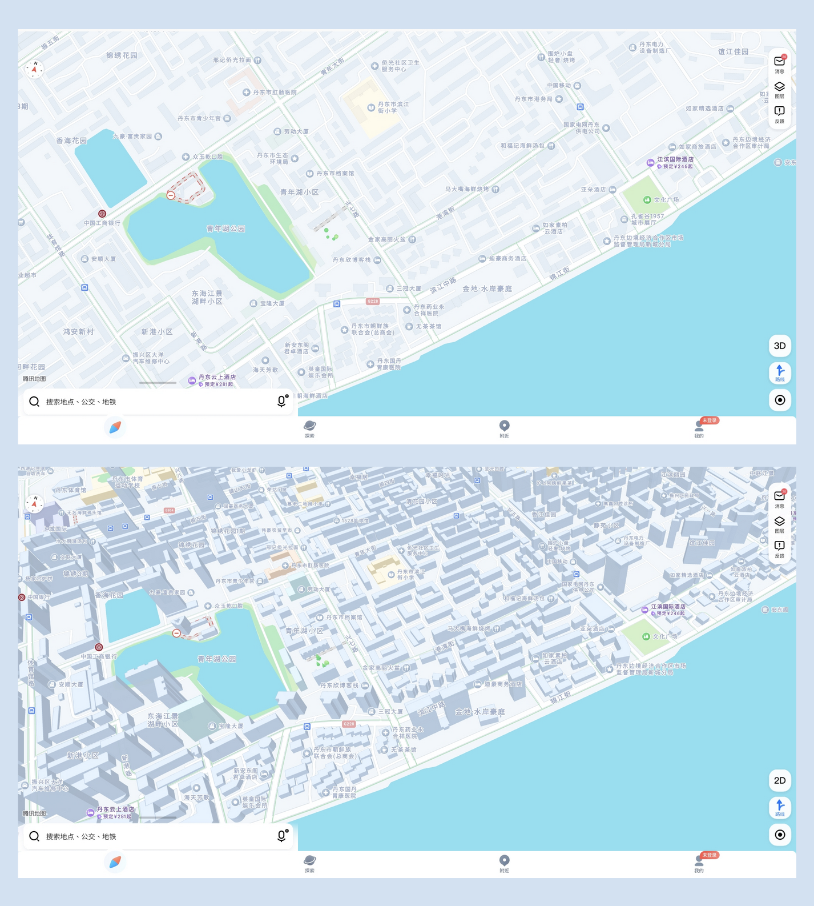

# Tencent Maps

## URL

Main site, [http://map.qq.com/](http://map.qq.com/)\
\
API documentation, [https://lbs.qq.com/service/webService/webServiceGuide/webServiceOverview](https://lbs.qq.com/service/webService/webServiceGuide/webServiceOverview)

## Description

Tencent Maps provides detailed maps, satellite imagery, street view, directions for driving, public transport and walking, and real-time traffic conditions. In Q1 2025, a Deepseek AI assistant was [piloted in the mobile app](https://www.thestandard.com.hk/market/article/70227/Tencent-shares-surge-as-DeepSeek-joins-WeChat) for users to ask for recommendations and real-time information.&#x20;

In Tencent Maps, user-generated reviews and photos are integrated with [Dianping](https://www.dianping.com/), the Chinese equivalent of Yelp which also offers food and daily products delivery.&#x20;

### Basic search: Map and satellite imagery

Search for the location and select the layer (e.g., satellite imagery) or function (e.g., ruler).&#x20;

<figure><figcaption>
Web browser view: The example shows the area of Shanghai South Railway Station. Click the buttons on the top-left corner of the map to switch between map and satellite view. 
</figcaption></figure>

Annotated menu - mobile

<figure><figcaption>
Basic mobile app menu. You may be seeing more or fewer options depending on your settings and location.
</figcaption></figure>

Information on how to access street views can be found further below.&#x20;

2D / 3D modes (mobile app) 

When sufficiently zoomed in, a 2D / 3D selection button will become available in the lower right side of the screen.&#x20;

<figure><figcaption>
2D (top) and 3D (bottom) maps of the same area in Dandong City. 
</figcaption></figure>

Tencent Maps has API documentation available for [switching between 2D/3D models](https://lbs.qq.com/webDemoCenter/glAPI/glMap/map3d) and for [showing 3D buildings](./#url).&#x20;

### Getting coordinates

Search on this page in the web browser: [https://lbs.qq.com/getPoint/](https://lbs.qq.com/getPoint/)

For background: China uses a coordinate system called [GCJ-02](https://en.wikipedia.org/wiki/Restrictions_on_geographic_data_in_China#GCJ-02) (colloquially known as Mars coordinates), whereas the rest of the world uses [WGS-84](https://en.wikipedia.org/wiki/World_Geodetic_System) (Earth coordinates). GCJ-02 uses an encryption algorithm to apply random offsets to the latitude and longitude of locations. Obfuscating the geographic data is for [national security purposes](https://en.wikipedia.org/wiki/Restrictions_on_geographic_data_in_China).&#x20;

### Street View - available in mobile app only

Steps: &#x20;

1. Select **Layers > Street View** (see [**Annotated Menu - mobile app**](./#annotated-menu-mobile)). The blue lines along the roads indicate that street view is available.

<figure><figcaption>
(English annotation added) The blue lines indicate where street views should be available. Notice that the pin is always in the middle. Move the map, not the pin. 
</figcaption></figure>

2. Move the map to where you want to see the street view. Please note: **To see the street view of another location,&#x20;**_**move the map, not the pin**_**.**&#x20;
3. A location description is shown. Click the rectangle to enter street view.&#x20;

<figure><figcaption>
Example of Tencent Maps street view
</figcaption></figure>

Two limitations to be aware of:&#x20;

1. Be aware that street views may be outdated, restricted or unavailable. In such cases, there may be glitches.&#x20;
2. Metadata such as the date of image capture or the approval reference are not available.&#x20;

Due to a [2021 merger between Tencent and Sogou](https://www.techinasia.com/tencent-completes-merger-chinese-search-engine-sogou), older street view imagery captured by SOSO Maps was integrated into Tencent Maps. (SOSO Maps, now defunct, was formerly a subsidiary of Sogou.) Tencent Maps users still often see SOSO Maps' vehicles in the street view imagery (as shown above), indicating that the image was taken some time before the merger.&#x20;

### Lite version in WeChat

If the researcher is an existing user of WeChat (international version) or Weixin (China-only version), a lite version of Tencent Maps is available as a [mini program](https://walkthechat.com/wechat-mini-programs-simple-introduction/). For general consumers, the mini program offers conveniences in navigation, ride sharing, and location sharing. However, for the purpose of research it has limited functionality: the mini program does not support extracting coordinates and does not show street view.&#x20;

## Similar tools

Researchers can compare results across the 3 Chinese mapping tools: Tencent Maps, Gaode Maps, and Baidu Maps. For researchers based outside of China, Tencent Maps might be the most challenging to use as street view is only available on the mobile app.&#x20;

If researching business establishments or user perceptions of popular locations (e.g., transport hubs), the user-generated reviews in Tencent Maps and Gaode Maps tend to include many photos and long comments. Researchers should be aware that these may be heavily curated (e.g., [users are incentivized by marketing campaigns](https://www.theworldofchinese.com/2023/03/the-shady-world-of-chinese-online-reviews/) to generate content). Nonetheless, such user-generated content may be useful, for example where street view imagery is unavailable or outdated.&#x20;

## Cost

* [x] Free
* [ ] Partially Free
* [ ] Paid

## Level of difficulty

<table><thead><tr><th data-type="rating" data-max="5"></th></tr></thead><tbody><tr><td>1</td></tr></tbody></table>

## Requirements

* **Web:** web browser.
* **Mobile:** iOS, Android, or HarmonyOS (Huawei's operating system). For researchers outside China, the mobile app is not available in the app store. Instead, install by APK.&#x20;

More about APK

APK, or Android Package Kit, refers to the core format which Android uses to distribute and install apps. The easiest way is simply to do a Google search for Tencent Maps apk. Please apply the usual security precautions when downloading software online.&#x20;

## Limitations

* **Geographical restrictions to account registration and API access**: A QQ account is required for registering for API access. In order to register a QQ account, a Chinese phone number is needed. Given this, international users will find it difficult to create an account by which they can obtain API access keys. \
  \
  (QQ is the consumer-interfacing brand name for Tencent's services. Similar to a Google users having a single sign-in for various Google services, in the Chinese internet, users have an overarching QQ account for accessing Tencent's online games, music, movies, microblogging, movies and other services.)&#x20;
* **Maps only available for China**: Other countries appear blank.&#x20;
* **Geoblock and access speeds**: [VPNs are banned in China](https://www.bbc.com/news/technology-30982198), and VPNs are blocked from loading Tencent Maps' web version. Also, due to [limited gateways for international internet traffic to interact with Chinese websites](https://www.thousandeyes.com/blog/deconstructing-great-firewall-china), overseas users may experience slower speeds and more frequent prompts to login — on both web and mobile.&#x20;
* **Limited functionalities on web browser**: The app's more extensive features, including street view, are only available on the mobile app.&#x20;
* **Language barrier**: The app, including documentation and support are only available in Chinese.&#x20;
* **API Rate Limits**: API calls are capped at a concurrency limit: 5 times/second/interface/Key Daily and calls: 10,000 times/interface/Key. For researchers requiring high-frequency data access, this might pose a limitation ([documentation](https://lbs-qq-com.translate.goog/faq/accountQuota/faqKey?_x_tr_sl=auto&_x_tr_tl=en&_x_tr_hl=en&_x_tr_hist=true), in English via Google Translate).&#x20;

## Ethical Considerations

* **Privacy Concerns**: Like many mapping services, Tencent Maps gathers user data, which raises questions about data privacy and protection. (An [April 2021 notice from the Cyberspace Administration of China](https://www.cac.gov.cn/2021-04/30/c_1621370239178608.htm) named all leading Chinese mapping tools among 33 apps which extensively collect user data, going beyond what is relevant to their service provision.)
* **Censorship and Content Control**: Under the government censorship laws, Tencent Maps' content and functions will be omitted or geofenced for users outside of China. For a general discussion on content control, please see the [About Maps and Satellites](https://bellingcat.gitbook.io/toolkit/more/all-tools/about-maps-and-satellites) page.&#x20;

## Guides and articles

**Official Wiki**, [https://map.qq.com/help/index.html](https://map.qq.com/help/index.html) ([English translation](https://map-qq-com.translate.goog/help/index.html?_x_tr_sl=auto&_x_tr_tl=en&_x_tr_hl=en))

**Developer Resources**, [https://lbs.qq.com/](https://lbs.qq.com/) ([English translation](https://lbs-qq-com.translate.goog/?_x_tr_sl=auto&_x_tr_tl=en&_x_tr_hl=en))

## Tool provider

Tencent Holdings Ltd. [https://www.tencent.com/](https://www.tencent.com/) - China

## Advertising Trackers

* [x] This tool has not been checked for advertising trackers yet.
* [ ] This tool uses tracking cookies. Use with caution.
* [ ] This tool does not appear to use tracking cookies.

| Page maintainer           |
| ------------------------- |
| Bellingcat Volunteer Team |
|                           |
