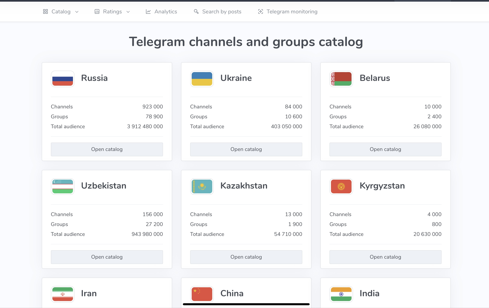
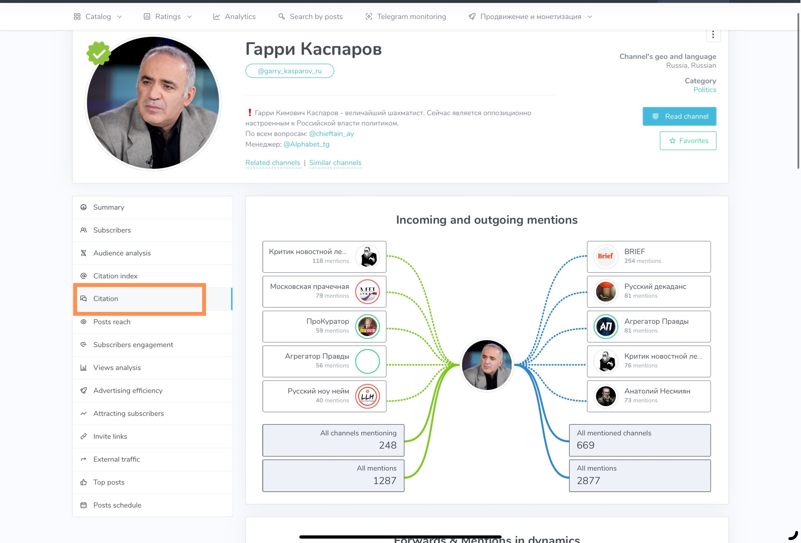
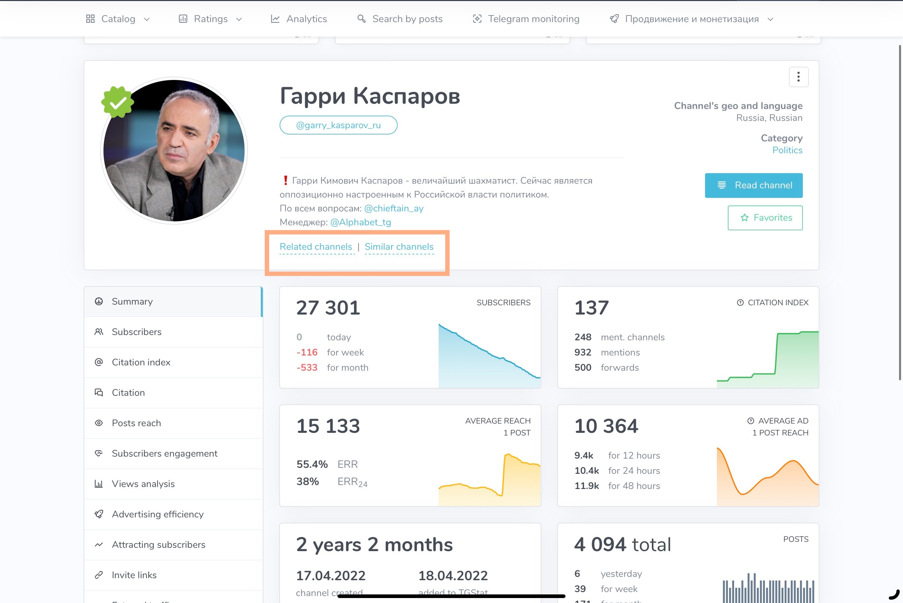

# TGStat

## URL

[https://tgstat.com/](https://tgstat.com/)&#x20;

[https://tgstat.ru/ ](https://tgstat.ru/)&#x20;

## Description

TGStat is a Russia-based social media analytics platform that offers comprehensive statistics and insights for Telegram channels and groups. In other words, it is a tool that gathers publicly available Telegram data in real time to show how well channels are performing.&#x20;


Use a research account if using TGStat, since[ it is unclear what data it gathers from its users.](https://gijn.org/resource/tipsheet/tipsheet-latest-tools-investigating-with-telegram)


According to its website, it provides detailed information on popular Telegram channels and members, including engagement metrics, growth trends, and audience demographics.&#x20;

For Telegram channels, TGStat covers statistics for:

* Number of subscribers
* Average post reach
* Daily views &#x20;
* Share count
* Mentions
* Posting frequency

For Telegram groups, TGStat also provides analytics focusing on various aspects such as:

* Member Growth
* Engagement Metrics
* User Activity
* Member Demographics
* Content Analysis
* Administrator Insights

TGStat is helpful for discovery, especially for those monitoring events in Russian-speaking countries, post-Soviet regions, or far-right groups. It analyzes a diverse set of channels and groups. The statistics are constantly being refreshed and updated in [real-time](https://databar.ai/explore/tgstat).

_**What problem does it solve?**_

TGStat solves a discovery and time management issue. Telegram’s search function lacks advanced features and filters, making it difficult for unfamiliar users to find specific information. Success often relies on knowing local terminology and search nuances. However, TGStat can assist with this problem through advanced search filters, comparison, and analytics.

### **Advanced Search Features**

It helps researchers find relevant channels to follow on specific topics. Some features are:

1. _Filter by country:_  Users can filter channels by country. The list of countries available in the search filters are: Russia, Ukraine, Belarus, Uzbekistan, Kazakhstan, Kyrgyzstan, Iran, China, India, and Ethiopia.

<figure><figcaption>
This shows a catalog of public Telegram channels and open groups categorzed by country. The user can navigate to this feature by clicking “Catalog” in the upper left, then clicking “channels and groups catalog”. 
</figcaption></figure>

However, users can also find other public channels or open groups not covered by the countries listed in the catalog.&#x20;

<figure><figcaption>
This is a public news channel with a Telegram account. The screenshot shows the TGStat analytics for the channel. In the upper right corner, the "channel's geo and language" is displayed. The channel is primarily in Arabic, and the specific country is not mentioned. This means that users may not be able to find this channel by browsing the catalog grouped by country. Instead, they can search for the channel's username using the site's search bar. This demonstrates that TGStat provides information for public channels on Telegram, irrespective of their country and language.
</figcaption></figure>

2. _Filter by theme/region:_ When researching Telegram channels in Russia, channels are grouped by region and by theme/topics. For the other countries, channels can be filtered by theme but not by region.

<figure><figcaption>
For Russia-based channels, users can filter by region as shown in the image. You can navigate through this by clicking "Catalog" in the upper left corner, and then by clicking on "regional compilations."
</figcaption></figure>

<figure><figcaption>
For Russia-based channels, users can filter by themes/subject as shown in the image. You can navigate through this by clicking "Catalog" in the upper left corner, and then by clicking on "thematic compilations."
</figcaption></figure>

3. _Filter by rating:_ TGStat also has a rating system for channels, groups, and posts. This in turn, is a valuable indicator of channel popularity and audience engagement.&#x20;

_Channels rating (Global):_ According to the tool website, the top 100 Telegram channels (both public and private) are rated by the most number of subscribers, by growth, by reach, and by citation. Users can filter the growth metrics by daily growth, growth the previous day, weekly growth, and monthly growth. It also rates public channels by reach and citations. (how many times, a particular channel is mentioned by other channels). Users can filter channels by country or view global rankings. TGStat also rates the top 100 channels according to the topic and similarly rates them according to the most number of subscribers, growth, reach, and citation.

_Groups rating (Global):_ Groups (public and private) are rated according to the most number of participants, by growth, by messages (number of messages in a group in the last 7 days), and by active participants (“MAU’s”- Monthly Active Users - which TGStat describes as “the number of unique users who have written at least one message in a group in the last 30 days”).  &#x20;

_Posts rating (Global)_: Posts are rated by the most number of [views, by shares, including through personal messages, by the most number of comments, by forwards to channels, and by reactions](https://tgstat.ru/en/ratings/posts).

_"Brands and People" rating (Russian-language channel only):_ TGSTAT also rates the top 30 [“brands and people” ](https://tgstat.ru/en/ratings)based on their number of views and mentions per month.  According to the tool, “brands” are companies such as banks, airlines, and media sites. “People,” according to the sites, are categorized as journalists, businessmen, and politicians. However, it seems this ranking is based solely on the posts from Russian-language Telegram channels.

<strong>Other Filtering Options (CLICK TO EXPAND)</strong>

There are other ways to filter search results on TGSTAT.&#x20;

* language
* channel type (private or public)
* engagement rate&#x20;
* audience by gender
* average post reach and average post reach (in the past 24 hours)
* Citation Index
* Verified channels&#x20;
* Channels with a  ["red mark"](#user-content-fn-1)[^1]
* Channels without "Scame/Fake marks"&#x20;

To get to the advanced search feature, users can click "Catalog" in the upper left, then click on "Search for channels." A filtering panel with the above parameters will appear on the right side.&#x20;

### **Comparison**

This tool also solves the problem of visualizing posts' reach and their relationship with other user accounts, channels, and content. TGstat can pull up a specific channel's analytics and show the relationship between accounts through the “citation” section. This section shows who cites whom.&#x20;

<figure><figcaption>
This image displays "incoming mentions" on the left and "outgoing mentions" on the right. "Incoming mentions" are channels or groups that mention this channel, while "outgoing mentions" are accounts this channel mentions. To access this feature, go to the main page of the channel you are researching, click on the blue bar labeled "Channel Statistics" on the right side of the page, then select "Citation" from the left-hand menu.
</figcaption></figure>

Users can use this feature during the preplanning stage to find other channels that might give them more information for their research. It can also show users what the channel tries to achieve and why.&#x20;


NOTE: This feature is only available for Telegram channels and not for groups.&#x20;


Another way to see the relationship between channels is through the "Similar channels" and “Related channels” sections of the profile in question.

\
In addition, users can see a channel or group's popularity over time.

<figure><figcaption>
When trying to look for more information on a research topic, or to figure out which other channels may be discussing a particular incident under investigation, TGStat users can navigate the “similar channels” or “related channels”. This can be found on the main page of the user’s TGStat profile.  
</figcaption></figure>

### **Analytics**

TGStat helps analyze content and reach. It provides insight into the channel or group’s performance, such as subscriber numbers, subscribers acquired over time, or those acquired based on the popularity of posts, reach, views per post, and engagement metrics (likes, comments, shares) per individual posts. This enables the user to understand what content resonates with a particular audience.

<figure><figcaption>
This screenshot shows a TGStat feature called “Views Analysis”. This feature allows users to check a post’s popularity by date and by hour after it's been published. This feature can be accessed through the menu on the left of the page.
</figcaption></figure>

## Cost

* [ ] Free
* [x] Partially Free
* [ ] Paid

TGStat has both free and paid versions. However, the most important features of the tool are available for free.

The versions are: Free, Premium Analytics, Premium Search (see website for pricing)

**Free vs. Premium Analytics**

Below are some of the different features available in a free account vis a vis a Premium Analytics subscription. (List is not exhaustive but focuses on main features that may be helpful for open source researchers)

|                                     | **Free**                                        | **Premium Analytics**                                                             |
| ----------------------------------- | ----------------------------------------------- | --------------------------------------------------------------------------------- |
| “View Analysis” section             | Last 5 posts available for analysis             | Unlimited                                                                         |
| “Advertising Effectiveness” section | Latest 5 activities available for analysis      | Unlimited                                                                         |
| “Attracting Subscribers” section    | Last 6 months available for analysis            | Unlimited                                                                         |
| “Invitation Links” section          | Last 10 invitation links available for analysis | Unlimited                                                                         |
| “Top Posts” section                 | Not available                                   | Unlimited time period, customized view, and available for export of data to Excel |
| Citation                            | Not available                                   | Available                                                                         |
| Similar Channels/ Related Channels  | Not available                                   | Available                                                                         |

**Free v. Premium Search**

Below are some of the different features available in a free account vis a vis a Premium Search subscription. The number of channels users can search, and the number of requests for advanced search is limited. (List is not exhaustive but focuses on main features that may be helpful for open source researchers)

|                                                      |               |                    |
| ---------------------------------------------------- | ------------- | ------------------ |
|                                                      | **Free**      | **Premium Search** |
| Number of channels per day                           | 10            | Unlimited          |
| Number of channels per month                         | 200           | Unlimited          |
| Number of channel search requests per day            | 30            | Unlimited          |
| Number of channel search requests per month          | 500           | Unlimited          |
| Search through full catalog of posts                 | Limited       | Available          |
| Filter by time period                                | Limited       | Available          |
| Filter by language, country, subject and source type |               | Available          |
| Filter by channel and group mentions                 | Not available | Available          |
| Export of search results to Excel                    | Not Available | Available          |

Other paid features are: Access to Stat API (fee comparison here: [https://tgstat.ru/en/api/stat](https://tgstat.ru/en/api/stat)), Access to Search API ([https://tgstat.ru/en/api/search](https://tgstat.ru/en/api/search)), Access to Callback API ([https://tgstat.ru/en/api/callback](https://tgstat.ru/en/api/callback))

### Level of Difficulty

<table><thead><tr><th data-type="rating" data-max="5"></th></tr></thead><tbody><tr><td>2</td></tr></tbody></table>

### Requirements

The free version of the tool requires:

1\. Internet and laptop/mobile device

2\. Telegram account

The paid version of the tool requires:

1\. Internet and laptop/mobile device

2\. Telegram account

3\. Paid subscription (Note that bank cards from other countries, such as those from the US, may no longer be accepted due to changes in the paywall).

### Limitations

The tool has a few limitations.

1. Log in is required to access important features.

If not logged in, users can see the channel’s “Summary” analytics.

<figure><figcaption>
This shows a summary of the analytics available to users who are not logged in. This can be accessed by searching for a Telegram username on the search bar on the top of the page. Once on the channel or group’s page, click on “Statistics” to the right. Then, click on “Summary” on the menu bar to the left.
</figcaption></figure>

If not logged in, users cannot access the following features: subscribers, citation index, citation, average post reach, subscriber engagement, post views analysis, attracting subscribers, external traffic, and top posts.

2. There are not a lot of "How-to" guides in English.&#x20;
3. This tool can only search through the channels it covers but does not seem able to search through everything in Telegram.&#x20;

If you're considering using TGStat, weigh these potential limitations against your needs.&#x20;

### Ethical Consideration

**Be mindful of data accuracy/specify data provenance**&#x20;

TGStat relies on data provided by Telegram, so the accuracy of the information it presents depends on Telegram's data. It is advisable to specify data provenance by citing TGstat.

**Privacy Concerns**

Personal data of its users are collected automatically. According to Section 3.6 of its Privacy Policy ([https://tgstat.ru/en/privacy-policy](https://tgstat.ru/en/privacy-policy)), TGStat complies with “the requirements of current legislation in the field of personal data protection.“ It also states on Section 3.8 that the tool provider retains personal data “for as long as necessary to fulfill the purpose for which it was collected or to comply with legal and regulatory requirements.”&#x20;

Section 5.2 of the Privacy Policy also specifies that user personal data can be transferred to government bodies of Russia “only on the grounds and in the manner established by the legislation of the Russian Federation.”&#x20;

In this [Wired article](https://web.archive.org/web/20240501205306/https://www.wired.com/story/the-kremlin-has-entered-the-chat/), concerns about the users' personal data on TGStat were raised.  “In its privacy policy, TGStat states clearly that it is obliged by law to hand over data to the “state authorities of the Russian Federation.” Because the company has been archiving publicly available data for years \[…] security forces could hypothetically go directly to TGStat to obtain a striking amount of information about a user without any direct assistance from Telegram.”, Wired wrote.&#x20;

TGStat founder addressed privacy concerns about the tool in the same Wired article, saying: “The situation in Russia and the world has no influence on the activities of TGStat.” He confirmed that data can be transferred to Russian authorities but said that “all companies operating in Russia have a similar clause in their policies” and that TGStat had not received any requests from authorities or law enforcement agencies.”

### Guide

This is a guide in Russian provided by TGStat.ru: [https://tgstat.com/blog/video-course-1024](https://tgstat.com/blog/video-course-1024) (Turning on the Auto Translate feature on YouTube gives a usable translation of the guide).  This page will be updated if guides in other languages become available.&#x20;

The tool provider has also launched [TGStat Academy, ](https://academy.tgstat.ru/)a paid course on using TGStat for various use cases (primarily marketing). However,  the courses are only available in the Russian language. &#x20;

_**Use cases**_

TGStat has been particularly used in content verification, especially in tracking the spread of disinformation/ misinformation. (See: DFRLab’s lists of research involving misinformation. A good example is the following article from DFRLab: [https://dfrlab.org/2024/02/08/russian-milbloggers-falsely-accuse-kazakhstan-of-opening-a-nato-military-facility/](https://dfrlab.org/2024/02/08/russian-milbloggers-falsely-accuse-kazakhstan-of-opening-a-nato-military-facility/)

TGStat was also used to analyze the far reaching influence of Telegram communities on Russian media outlets in the country’s war against Ukraine: [https://dfrlab.org/2024/06/10/another-battlefield-russian-telegram/](https://dfrlab.org/2024/06/10/another-battlefield-russian-telegram/).

### Similar Tools

| TGStat                                                                         | Web-based analytics; easy dashboard                    | 
Analytics focused on public Telegram channels/groups, tracking metrics such as subscriber growth, reach, mentions, posting frequency, engagement trends, and citation (ingoing and outgoing mentions).

Filtering by country,  category, langauge and real-time updates

API
 | 
 

The country filter useful mostly on post-Soviet regions; other regions lacks country filter

 

Paid version required for detailed data, and cards from the US and other countries can’t be used for subscription. 

 

(see limitations section <a href="https://bellingcat.gitbook.io/toolkit/more/all-tools/tgstat#limitations">above</a>)
 |
| ------------------------------------------------------------------------------ | ------------------------------------------------------ | --------------------------------------------------------------------------------------------------------------------------------------------------------------------------------------------------------------------------------------------------------------------------------------------- | ----------------------------------------------------------------------------------------------------------------------------------------------------------------------------------------------------------------------------------------------------------------------------------------------------------------------------------------------------------------------------------------- |
| [Telemetr.io](https://bellingcat.gitbook.io/toolkit/more/all-tools/telemetrio) | Web based analytics; robust interface                  | 
Tracking metrics such as subscriber growth, reach, mentions, posting frequency, engagement trends, and citation/ quoting.

Fraud detection, real time alerts

Search by post or by ad

 

API

visualization

API

 
                          | 
 

Advanced features require a subscriptions

 

(see more <a href="https://bellingcat.gitbook.io/toolkit/more/all-tools/telemetrio#limitations">here</a>)
                                                                                                                                                                                                    |
| [TelegramDB](https://bellingcat.gitbook.io/toolkit/more/all-tools/telegramdb)  | Telegram bot interface; minimal text-based commands    | 
Directory of public entities (groups, channels, users)

 

Keyword, user and username search

 

Groups joined by users

 

Live stats 
                                                                                                         | 
Public content only

 

API constraints

 

Search Costs

 

User -specific searches require paid vredits

 

(See more <a href="https://bellingcat.gitbook.io/toolkit/more/all-tools/telegramdb#limitations">here</a>)
                                                                                                        |
| [Telepathy](https://bellingcat.gitbook.io/toolkit/more/all-tools/telepathy)    | Scraping via command line interface; targeted datasets | 
Extracts chat metadata

 

Archiving of messages

 

User and location search

 

Export CSV

 

Chat Exports
                                                                                                                      | 
Requires technical expertise; command line familiarity, python

 

Windows compatibility issues

 

(See more <a href="https://bellingcat.gitbook.io/toolkit/more/all-tools/telepathy#limitations">here</a>)
                                                                                                                                             |

### Tool Provider

According to[ TGStat’s website](https://tgstat.ru/agreement), these are the administrator’s details:

Name: Individual entrepreneur Kizhikin Yuriy Aleksandrovich, Russia. \
e-mail: ceo@tgstat.ru

### Advertising Trackers

<table><thead><tr><th width="49" data-type="checkbox"></th><th></th></tr></thead><tbody><tr><td>false</td><td>This tool has not been checked for advertising trackers yet.</td></tr><tr><td>true</td><td>This tool uses tracking cookies. Use with caution.</td></tr><tr><td>false</td><td>This tool does not appear to use tracking cookies.</td></tr></tbody></table>

### Page Maintainer

Afton

[^1]: According to the source below: A "red mark" indicates that the channel was inspected and found to contain fake audience.&#x20;

    ([https://elama.ru/blog/kak-proverit-telegram-kanal-na-nakrutku-besplatno-bez-registracii-i-sms/](https://elama.ru/blog/kak-proverit-telegram-kanal-na-nakrutku-besplatno-bez-registracii-i-sms/))
