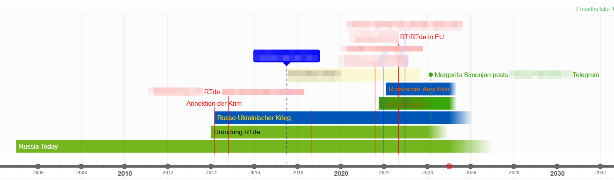

# Time.Graphics

## URL

[https://time.graphics](https://time.graphics)

## Description

Time.Graphics is an online tool for creating interactive timelines, useful for organizing and visualizing events chronologically. Designed for educators, businesses, and individuals, it allows users to structure events with multimedia elements and integrate data from Google Calendar, Google Maps, and spreadsheets. The tool provides an interface that enables researchers to map out events, analyze historical data, or manage project timelines, which can be useful in investigative and open-source research contexts. A unique feature is the option to manage team accounts, making it suitable for collaborative settings, such as educational institutions and research teams.

<figure><figcaption>
A timeline of the history of Russia Today, created by the author, some information redacted.
</figcaption></figure>

## Feature Breakdown

**1. Event Types**

* **Standard Events**: Basic events with customizable names, dates, descriptions, and multimedia options (e.g., images, YouTube videos, documents).
* **Time Periods**: Used to represent spans of time, ideal for tracking project phases or historical periods. Time periods can be open-ended if end dates are uncertain.
* **All Countries Data**: A feature allowing users to add country-specific statistics from the World Bank database, covering various indicators like GDP, population, and more.

**2. Data Visualization and Comparison**

* **Multi-Statistics Tool**: Combines multiple datasets into a single event for easy comparison. For instance, users can plot GDP or COVID-19 recovery rates of different countries side-by-side.
* **Geolocation Maps**: Users can add locations to events using map coordinates, suitable for highlighting the geographical context of events.
* **Customizable Graphs and Charts**: Data visualizations can be tailored with colors, line widths, and heights, making it easy to differentiate datasets visually.

**3. Data Import and Export**

* **Google Integration**: Import events directly from Google Calendar, integrate locations with Google Maps, and pull data from Google Sheets.
* **JSON Data Import**: Add real-time data from JSON files hosted on platforms like Pastebin. This allows researchers to pull in continuously updated information, such as stock prices or live statistics.
* **World Bank Data Access**: Retrieve and plot various economic, health, and social indicators by country, powered by the World Bank's open database.
* **Export Options**: Users can download their timelines in multiple formats for offline viewing or further analysis.

**4. Embedding and Sharing**

* **Embed Timelines on Websites**: Generate HTML code to embed interactive timelines into external websites or articles. This feature is particularly valuable for presenting research findings or timelines to a wider audience.
* **Public and Private Timelines**: Timelines can be set to public, private, or link-access only (premium feature), allowing users to manage who can view and interact with the content.

**5. Collaboration and Team Management**

* **Education Accounts**: Time.Graphics provides educational accounts with options to manage student and teacher access, assign tasks, and oversee collaborative projects within a classroom or group setting.
* **Customizable Permissions**: Users can control access to timelines within teams, allowing only authorized members to edit, view, or comment on shared timelines.

**6. Customization and Styling**

* **Themes and Colors**: Customize timeline elements with various themes and colors to align with specific visual preferences or presentation standards.
* **Tags and Labels**: Add tags to categorize events, making it easier to filter and locate related data on complex timelines.
* **Interactive Elements**: Each timeline event can include interactive elements like links to external resources, images, and videos, enhancing the depth and engagement of the timeline.

## Cost

* [ ] Free
* [x] Partially Free
* [ ] Paid

The free version allows basic public timelines. Premium accounts (starting from a 1-day subscription) unlock additional features like private timelines, multimedia support, and exporting options. Educational discounts are available for students and institutions​​.

## Level of difficulty

<table><thead><tr><th data-type="rating" data-max="5"></th></tr></thead><tbody><tr><td>2</td></tr></tbody></table>

## Requirements

Requires a registered account. Premium features necessitate a paid subscription.

## Limitations

The free version lacks private timelines and extensive media integration. Some premium-only features, such as downloading high-resolution files and Google Calendar integration, limit functionality for free users. Timelines are stored on the platform, so users without an internet connection must download timelines for offline access.

## Ethical Considerations

For effective privacy management on Time.Graphics, users should carefully consider the privacy settings for each timeline, especially when handling sensitive or confidential data. By default, timelines created in the free version are set to public, meaning they are accessible to anyone online. For users requiring privacy or limited access, the **premium version** provides essential options, including the ability to set timelines to private or restrict access to those with a direct link. This link-restricted access is beneficial for sharing information with a controlled audience without making it publicly visible. Users should regularly review and update privacy settings, particularly when working in collaborative settings, to prevent accidental public sharing. For highly sensitive content, it’s advisable to enable premium features that allow complete control over who can view and interact with each timeline, ensuring data is kept secure and accessible only to authorized individuals.

## Guides and articles

Timeline Maker. (2019, July 17). _How to add “Geo locations” to events_ \[Video recording]. [https://www.youtube.com/watch?v=02IwGTSOyNQ](https://www.youtube.com/watch?v=02IwGTSOyNQ)

Timeline Maker. (2019, July 15). _How to embed timelines into your website or blog_ \[Video recording]. [https://www.youtube.com/watch?v=mojWqdii1XY](https://www.youtube.com/watch?v=mojWqdii1XY)

## Tool provider

Time.Graphics, is a service recognized by the American Association of School Librarians for online learning resources. Provided by Selected Technologies LLC, Morgan Hill, CA (authors note: are you kidding, I spent a couple of weeks in Morgan Hill, honk if you hate going north on the 101 during rush hour)

## Advertising Trackers

* [ ] This tool has not been checked for advertising trackers yet.
* [x] This tool uses tracking cookies. Use with caution.
* [ ] This tool does not appear to use tracking cookies.

| Page maintainer |
| --------------- |
| Martin Sona     |
|                 |
