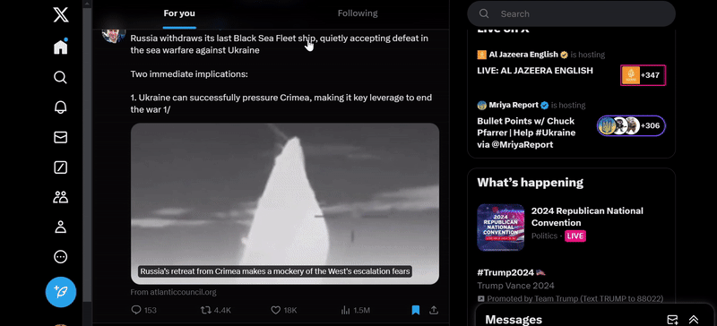

# Twitter/X Advanced Search

## URL

[https://x.com/search-advanced](https://x.com/search-advanced)

## Description

Twitter/X's built-in advanced search supports filtering by keywords, hashtags, language, author, receiver, mentions, replies, links, minimum number of replies/likes/reposts, and dates. Open the link above or navigate to this feature from the user account’s homepage, as shown in the image below.   &#x20;


TIP: Bookmark the link above to have immediate access to the tool.


<figure><figcaption>
In addition to clicking the link above, another way to navigate to the Advanced Search feature is shown here. First, input a search term on the search bar from your homepage. Once the results are shown, hover over "Search Filters" to the right, and click "Advanced Search".
</figcaption></figure>

### _**Advanced Search (Desktop)**_

Twitter/X’s Advanced Search helps open source researchers refine search queries and produces more subject matter-specific results. While the search interface is mostly self-explanatory, below is a description of each search field, and some useful tips.

#### **WORDS**

**“All of these words”:** You can search for posts containing specific words, phrases, or hashtags.

Example: Amsterdam canals

This will show posts that mention “Amsterdam” and “canals”

**“This exact phrase”:** is similar to using quotation marks on search engines. It pulls up results for an exact match for a specific sequence of words.

Example: best of both worlds

It will generate results with this exact phrase.


It is okay not to use quotation marks for this search parameter. If you do, they will generate the same results as without quotation marks.


**“Any of these words”:** A user can use this field to filter terms that contain one search term or another.

Example: Amsterdam canals

This will search for posts with either “Amsterdam” or “canals”


Users can add OR between the search terms, and it will generate the same results.


**“Hashtags”:** Advanced search allows users to filter their search further using hashtags. This is particularly useful for monitoring events in real-time.

Example: If I want to search for content related to Myanmar but only want to focus on what [Twitter users wrote](https://medium.com/dfrlab/how-pro-democracy-activists-in-myanmar-keep-their-movement-alive-with-hashtags-34ff2d3eddf2) about events in June 2021, I can enter “Myanmar” on the top field and “June3Coup” in the hashtag field.


Users do not have to use the hash (#) symbol in the field, but the tool generates the same search if they choose to (i.e. June3Coup or #June3Coup will generate the same results).


**“Language”:** Advanced Search allows users to zero in on posts in a specific language, refining their search for better results.


TIP:

_Language and Search Terms_

Twitter Advanced Search prioritizes your exact keywords during the search. This means:

* If you search for an English term but want results in Dutch, tweets containing the English word and Dutch text might appear.

_Finding Local Content with Translation_

To focus on local content in a specific language:

1. Translate your keywords using tools like [Google Translate](https://translate.google.com/) or [DeepL](https://www.deepl.com/).
2. Use the translated keywords in your Twitter Advanced Search.


Example: If I am interested in learning about the farmers' protest in the EU, but only want to get results in Dutch, the parameters may look like this:

<figure><figcaption>
Here is an example of a search using the language function, with the keyword being in English, but the language output being in Dutch.
</figcaption></figure>

<figure><figcaption>
This image is the sample result of the search with the language filter. As you can see, the keyword is in English but the rest of the content is still in the selected language filter, in this case, Dutch.
</figcaption></figure>

#### **ACCOUNTS**

Find posts from specific accounts to specific accounts or that mention specific accounts. This enables users to see interactions or exchanges. It is particularly useful for tracking disinformation/misinformation to see who has interacted with which content and the reputation of the accounts.

These are the subfilters:

**“From these accounts”** Searching for posts from `@Iamsterdam` will show posts posted by this account.

**“To these accounts”** Searching for posts sent to @Iamsterdam will show posts in which other users replied to @Iamsterdam.

**“Mentioning these accounts”** Searching for posts mentioning @Iamsterdam will show posts from other users that include and mention the @Iamsterdam handle. It does not seem to show replies to that handle.


TIP: You can input more than one account


\
&#xNAN;**“Filters”:** Refine your search using this section. Advanced Search lets you choose whether to include replies, ensuring you see the full conversation or focus solely on original posts.

To see only original posts, deselect the "Replies" checkbox under "Account Filters" in Twitter Advanced Search.

<figure><figcaption>
Keep scrolling down in the Advanced Search window to find the "Filters" section. Here, you can choose whether to include replies in your search results. There are two options: (1) <strong>Both replies and original posts:</strong> This will include tweets where users are replying to others, along with regular tweets. (2) <strong>Only replies:</strong> This will focus solely on tweets where users are replying to other accounts.
</figcaption></figure>

**“Replies”:** One targeted feature is the ability to focus solely on replies. By excluding original posts, you can gain an understanding of the ongoing discussion surrounding a particular topic.

This ability to isolate replies proves especially valuable in numerous areas. For instance:

* Sentiment Analysis: By analyzing replies, you can gauge the public's emotional response to an event.
* Tracking Opinions: Focusing on replies allows you to see what people are saying about a specific topic, revealing trends.

**“Links”:** Advanced Search lets you refine your results even further. You can choose to see only posts containing links. This can be useful for finding content that references external sources.


TIP: This filter does not allow you to specify a specific website or URL. The search will simply include posts with any link, regardless of the domain.&#x20;

Instead, use "this exact phrase" to type  the specific link you are looking for.&#x20;


#### **ENGAGEMENTS**


NOTE: If you want to cut through the noise and discover the most popular posts on a topic, Twitter's "Top posts" tab might seem like the answer, but it doesn't always show the absolute most engaging content. [The "Top posts" algorithm considers various factors, making it unpredictable.](https://blog.x.com/engineering/en_us/topics/open-source/2023/twitter-recommendation-algorithm) Use Advanced Search instead.


In Advanced Search, users can define their criteria for engagement. Want to see posts with at least 1,000 likes or replies? Advanced Search lets users set precise thresholds for minimum likes, reposts, replies, or even a combination of these metrics. This way, you'll get a clear picture of the most engaging posts that meet specific requirements.

You can set your parameters for the following subfields:

**“Minimum replies”**

**“Minimum likes”**

**“Minimum reposts”**

This granular control ensures the retrieval of posts that demonstrably resonate with a significant number of users.

#### **DATES**

For highly focused searches, Advanced Search offers date range filtering.

To filter tweets by date, use the calendar dropdown menus in Twitter Advanced Search. Simply select:

**"From" date:** This will return tweets sent on or after that date.

**"To" date:** This will return tweets sent on or before that date.

**Both "From" and "To" dates:** This will return tweets sent _**within**_ that specific date range.


TIP #1:

**Before a specific date:** Perfect for exploring historical trends or past events.

**After a specific date:** Ideal for catching up on recent discussions or tracking breaking news.

**Within a defined date range:** Ideal for isolating tweets from a specific timeframe, like a conference, incident in a conflict region or a campaign.

TIP #2:

Add a few days on the "before" and "after" fields, to make sure you have wide coverage of results.


#### “SAVE THIS SEARCH” FUNCTION

This feature is ideal for monitoring or tracking breaking news and accounts that are experts in your research topic.

Saving searches is simple:

1. Enter your search parameters in the Advanced Search (e.g., #WhatisHappinginMyanmar, “Mandalay”), and click Enter.
2. Click the three dots next to the bar.
3. Select "Save this search" (up to 25 searches allowed).

<figure><figcaption>
This image shows you the steps on how to save your searches. This is especially convenient if monitoring and revisiting the same issue for an investigation.
</figcaption></figure>

### _**Advanced Search (Mobile App)**_


If doing Advanced Search on a mobile device, it may be preferable to go to the mobile device’s web browser and perform the steps outlined above with the Advanced Search interface, instead of the the app.&#x20;


However, if you must do a granular search on the X app, you can do so in the search box, using operators or boolean, just as one would when searching various search engines like Google.

X’s website provides [a list](https://developer.x.com/en/docs/twitter-api/v1/rules-and-filtering/search-operators) of helpful operators that users can use or memorize to perform the functions outlined above. However, [use this page](https://github.com/igorbrigadir/twitter-advanced-search) for a more exhaustive list of operators for the App search bar.

A sample search done on mobile can be seen in the image below.

<figure><figcaption>
Advanced search on the app or on the search bar requires knowing which operators to use to take advantage of the feature. In this example, we input the following search query: Paris -Olympics -Olympic -medal -Olympique -athlete -athlète. The goal is to try to find posts about Paris but without too many references to the Olympics (the search was conducted in July 2024, shortly before the start of the Olympic Games). Instead of using the "All these words" field, we just input our keywords directly, which is Paris. Instead of using the "none of these words" field, we use the minus sign (-) before other words we want to exclude.
</figcaption></figure>

<figure><figcaption>
After performing the search as shown above, the results appear. They include the keyword "Paris" but none of the words "Olympics" "Olympic" "medal" and "Olympique", etc.  (NOTE: the search was conducted in July 2024, shortly before the start of the Olympic Games)
</figcaption></figure>

### _**What problem does it solve?**_

There is a sea of content constantly flowing around real-time events and trending topics. Twitter Advanced Search addresses the challenge to navigate this vast ocean of information by providing filtering options and the ability to search across a wider range of criteria for relevant results.&#x20;

The research process of open-source researchers is often iterative. We often start broad, using search terms like "protest" and "Syria" in the discovery phase. As we sift through the initial results, we might encounter posts mentioning a specific location like "Daraa" or a prominent group named "Syrian Revolutionary Forces." These findings become stepping stones. We then refine our search terms, incorporating these new details or harvesting new search terms. This might involve searching for posts containing "Daraa protest" or "Syrian Revolutionary Forces leader." The search might also expand to Arabic hashtags related to the protest or the group.

Using different combinations of parameters such as locations, languages, and hashtags in Advanced Search is beneficial during this evolving process. It allows investigators to continuously refine their search queries throughout the research process.

### Radar

As of Oct 18 2024, [X launche](https://x.com/premium/status/1847338164412960802?ref_src=twsrc%5Etfw%7Ctwcamp%5Etweetembed%7Ctwterm%5E1847338164412960802%7Ctwgr%5Ef5e8ad612c44f76b06a5eb49d841c99bd0e3b8b1%7Ctwcon%5Es1_\&ref_url=https%3A%2F%2Ftechcrunch.com%2F2024%2F10%2F21%2Fx-rolls-out-its-real-time-search-tool-radar-to-premium-subscribers%2F)[d](https://x.com/premium/status/1847338164412960802?ref_src=twsrc%5Etfw%7Ctwcamp%5Etweetembed%7Ctwterm%5E1847338164412960802%7Ctwgr%5Ef5e8ad612c44f76b06a5eb49d841c99bd0e3b8b1%7Ctwcon%5Es1_\&ref_url=https%3A%2F%2Ftechcrunch.com%2F2024%2F10%2F21%2Fx-rolls-out-its-real-time-search-tool-radar-to-premium-subscribers%2F) a real-time search and analysis tool called "Radar". However, this is only available to Premium+ subscribers, and this is so far an early version. It is a feature that used only to be available for businesses and was previously called "Insights." [It claims to allow account holders to track topics and trends in real-time.](https://web.swipeinsight.app/posts/x-expands-radar-access-real-time-trend-analysis-tool-for-premium-users-11939) According to [TechCrunch](https://techcrunch.com/2024/10/21/x-rolls-out-its-real-time-search-tool-radar-to-premium-subscribers/?guccounter=1\&guce_referrer=aHR0cHM6Ly93d3cuZ29vZ2xlLmNvbS8\&guce_referrer_sig=AQAAAHGYJM6G7eP7gNxD5RPmmGqFmcTuiKDJaUCDUeihLCuq_1HXhEoG897iZ3OZGqQHXuHe7vwZWKdDljXzXkiJjJPGXFjACfjbS_Up7YW37YR7581V3BZI-N64ou8laovrZAIQGkhTy-kP6DAOvpx8_Qk2jgwgm1ARWBKhPnN7zqqo), this could "perform keyword analyses, visualize trend activity, and filter conversations in real-time". According to this source, one of its "Core Features" is to track conversation volume over time and conversation velocity.

We are unable to test this paid feature at the moment, but a short demo is available here: https://x.com/premium/status/1847338164412960802 and here: https://x.com/premium/status/1848510511916494970

Based on this[ user's testing](https://x.com/VijarKohli/status/1848133497602322676), Radar cannot search beyond 3 days at the moment and cannot subfilter using keywords or using accounts.

## Cost

* [x] Free

## Level of difficulty

<table><thead><tr><th data-type="rating" data-max="5"></th></tr></thead><tbody><tr><td>2</td></tr></tbody></table>

## Requirements

1. Internet connection
2. Desktop/Laptop/Mobile Device (for mobile, use the web browser instead of the App)
3. Creating a user account

## Limitations

The following limitations were found by testing the tool.

1. **Handle Changes and Search Scope:**

If a user changes their handle, the Advanced Search tool won't return posts under the new handle that were posted under the user's previous handle, but searching for posts under the old handle still works.

2. **Missing Misspellings and Variations:**

The advanced search tool works on exact matches. The limitation of exact-match searching means that this can miss tweets with spelling errors or variations of your keywords.&#x20;

The fix is to cast a wider net. You can improve your search results by considering misspelled variations. Simply take those misspellings and alternative spellings you discover and use them as new search terms related to the research topic. Add these variations to your existing list of keyword combinations.

By including these additional spellings, you'll be conducting a more comprehensive search and ensure you capture more relevant tweets, even if they contain typos.

3. **Keyword Specificity and Irrelevant Results:**

After testing the tool, if the keyword is common or used in different contexts, it might retrieve irrelevant mentions. Let's say you're searching for information about the recent developments in "electric cars." This is a common term, used in many different contexts.

The search might return tweets about a toy car commercial featuring electric vehicles, a news report on a power outage affecting electric car charging stations, etc., and might not be relevant to the research question.

4. **Account Requirement for Advanced Search:**

After testing the Advanced Search tool in both Incognito Mode and regular browsing mode, in both cases, using the tool required signing into an account. This means users cannot access Advanced Search features on X.com without logging in. For some, requiring an account restricts access to these crucial functionalities for investigators who prefer anonymity.

5. **Inconsistent "None of These Words" Function:**

It sometimes does not catch all the search parameters. Testing both in the web browser and the mobile App, the “None of these words” field sometimes does not perform as well. It does not remove all the keywords you wish to eliminate. It will sometimes still show results that contain those words you want excluded.

6. **The “Links” Filter Cannot Specify a Domain**

As mentioned above, users can search for posts containing links however one cannot specify which domain. Users can circumvent this limitation by using "this exact phrase" instead, or using search operators directly on the search bar. [For example: ](https://medium.com/@prajwalshivareddy/unlocking-the-power-of-x-formerly-twitter-unveiling-effective-search-methods-and-syntax-69974a27d12)**url:example.com**

7. **Limits to Available History of Posts**

Twitter's Advanced Search boasts an impressive range, allowing you to delve into tweets [dating back to the platform's launch and first public post in 2006](https://help.x.com/en/using-x/x-advanced-search). However, keep in mind that private accounts and deleted tweets may be absent from your search results.

8. **Inability to Filter For Media**

Open-source investigators are constantly looking for and collecting media during research, whether images or videos. The Advanced Search does not have a search filter for this. To do so, investigators may prefer to use boolean or search operators on the search bar to find what they need. An example would be to input “Amsterdam” as a keyword and add [filter:native\_video (or filter:media or filter:videos, etc)](https://github.com/igorbrigadir/twitter-advanced-search)

One can also use the search bar using keywords, and click on the Media tab under the results.

## Ethical Considerations

## Guide

Guide for journalists from The Fix:

[https://thefix.media/2022/11/16/social-advanced-search-is-something-that-you-can-do-on-twitter-too](https://thefix.media/2022/11/16/social-advanced-search-is-something-that-you-can-do-on-twitter-too)

Guides provided by X.com:

[https://help.x.com/en/using-x/x-advanced-search](https://help.x.com/en/using-x/x-advanced-search)

[https://developer.x.com/en/docs/twitter-api/v1/rules-and-filtering/search-operators](https://developer.x.com/en/docs/twitter-api/v1/rules-and-filtering/search-operators)

### _**Use cases**_

The links below show research that _lends itself to_ using Twitter's Advanced Search feature. But please note that the authors do not explicitly mention using the Advanced Search for their research.

1. Using Twitter Advanced Search, especially its hashtag search, is helpful for monitoring events surrounding a protest or movement. [According to the Atlantic Council's DFRLab](https://medium.com/dfrlab/how-pro-democracy-activists-in-myanmar-keep-their-movement-alive-with-hashtags-34ff2d3eddf2), hashtags are a crucial tool for protest movements. By strategically coordinating hashtags, protesters can amplify their message and draw attention to potential injustices.

Link: [https://medium.com/dfrlab/how-pro-democracy-activists-in-myanmar-keep-their-movement-alive-with-hashtags-34ff2d3eddf2](https://medium.com/dfrlab/how-pro-democracy-activists-in-myanmar-keep-their-movement-alive-with-hashtags-34ff2d3eddf2)

2. Bellingcat’s investigation of the rapid escalation of COVID-19 in India demonstrates the use of advanced keyword combinations and other strategies on the Twitter platform.

Link: [https://www.bellingcat.com/news/2021/04/23/indias-latest-covid-wave-spills-on-to-social-media-amidst-critical-shortages/](https://www.bellingcat.com/news/2021/04/23/indias-latest-covid-wave-spills-on-to-social-media-amidst-critical-shortages/)

## Tool provider

X.com, US

## Advertising Trackers

* [x] This tool has not been checked for advertising trackers yet.
* [ ] This tool uses tracking cookies. Use with caution.
* [ ] This tool does not appear to use tracking cookies.

| Page Maintainers |
| ---------------- |
| Afton            |
|                  |
