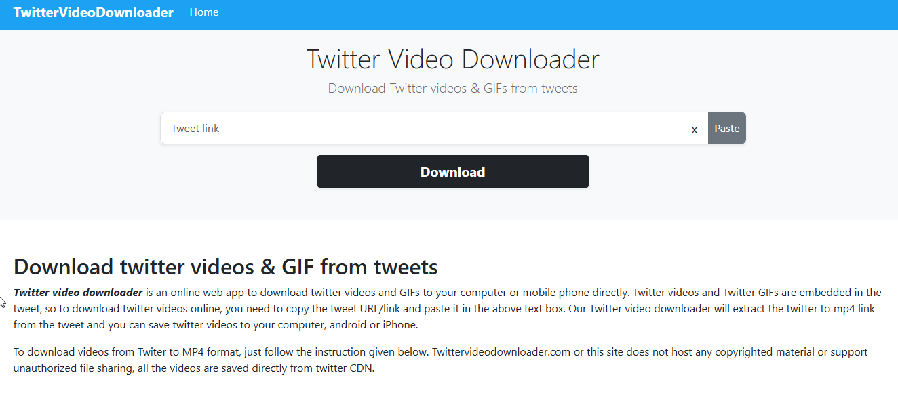

# Twitter Video Downloader

## URL

[https://twittervideodownloader.com/](https://twittervideodownloader.com/)\
(August 2025)

## Description

Twitter Video Downloader is a web-based tool that allows users to download videos from X (formerly Twitter) by pasting the URL of a tweet containing a video. The tool generates downloadable links in different resolutions, making it easy to save videos for offline viewing or further analysis.

1. Copy the URL of the tweet containing the video.
2. Paste the URL into the input field on the Twitter Video Downloader website.
3. Click the **Download** button.
4. Choose the video resolution you prefer (high, medium, or low quality).
5. The selected video will open in a new browser tab.
6. Right-click (or control-click on Mac) on the video and select **Save Video As**.
7. Rename the file if needed and save it to your desired location.

<figure><figcaption></figcaption></figure>

## Cost

* [x] Free

## Level of difficulty

<table><thead><tr><th data-type="rating" data-max="5"></th></tr></thead><tbody><tr><td>1</td></tr></tbody></table>

This tool is easy to use and requires no technical knowledge.

## Requirements

Internet, web browser

## Limitations

* **No Batch Downloads**: Users must download videos individually.
* **Limited to Public Tweets**: Videos from private or protected accounts cannot be downloaded.
* **Possible Website Downtime**: Please note that this is a third-party tool, and its availability may be inconsistent.
* **Potential for URL Changes**: If X (Twitter) modifies its media hosting structure, the tool may stop functioning until an update is made.
* **No Audio Extraction**: This tool does not allow users to extract audio from videos.

## Ethical Considerations

* **Respect Copyright**: Ensure that downloaded content is used in compliance with copyright laws and platform policies.
* **Avoid Misuse**: This tool should not be used to collect or distribute videos without obtaining the necessary permissions, where applicable.
* **Verify Sources**: When using downloaded videos for research, verify their authenticity and context to prevent the spread of misinformation.

## Similar Tools

| Tool                                                                | Platform     | Key Features                                              | Pricing         | Last Updated | Pros                                                 | Cons                                                       |
| ------------------------------------------------------------------- | ------------ | --------------------------------------------------------- | --------------- | ------------ | ---------------------------------------------------- | ---------------------------------------------------------- |
| [twittervideodownloader.com](https://twittervideodownloader.com/)   | Web-based    | • Paste tweet URL → direct MP4/GIF link• No ads or signup | Free            | May 2025     | • Fast, no-frills interface• No account required     | • No preview of file size/format• Occasional rate limits   |
| [SSSTwitter](https://ssstwitter.com/)                               | Web-based    | • One-step download• Supports HD exports                  | Free; donations | Feb 2025     | • Reliable for high-res videos• Minimal UI           | • Can hit rate limits• Some redirections/shortened links   |
| [SaveTweetVid](https://savetweetvid.com/)                           | Web-based    | • Preview gallery (size, format)• Select MP4, WEBM or GIF | Free            | Feb 2025     | • Preview before download• Format choices            | • Extra click to view previews• UI ads                     |
| [SnapSave](https://snapsave.app/)                                   | Web-based    | • Batch downloads• Folder organization• API access        | Free tier; paid | Jan 2025     | • Ideal for multiple downloads• Organize projects    | • Requires free account• API limits on free plan           |
| Twitter Video Downloader (v1.0.7)                                   | Browser ext. | • Adds “Download” button under videos• Auto-detect URLs   | Free            | Apr 20 2025  | • Seamless in-page integration• No copy-paste needed | • Must trust extension• Chrome/Firefox only                |
| [X Saver](https://play.google.com/store/apps/details?id=com.xsaver) | Android app  | • Queue downloads• Background processing• Share to folder | Free; ads       | Apr 25 2025  | • Mobile-friendly• Batch queue on the go             | • Broad storage & network permissions• Ads in free version |

### Guides and Articles

* Bellingcat Guide to Social Media Archiving
* How to Download and Archive Social Media Videos
* Internet Archive’s Guide on Media Preservation

## Tool provider

The website does not provide detailed information on ownership. The only contact available is an email address: vssmartniceman97@gmail.com

## Advertising Trackers

* [ ] This tool has not been checked for advertising trackers yet.
* [x] This tool uses tracking cookies. Use with caution.
* [ ] This tool does not appear to use tracking cookies.

| Page Maintainer |
| --------------- |
| Martin Sona     |
|                 |
