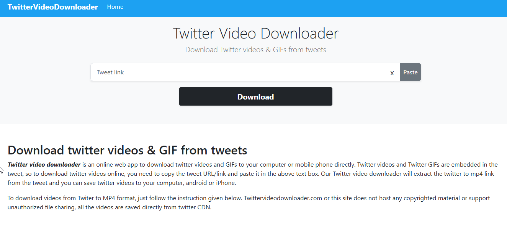

# Twitter Video Downloader

## URL

[https://twittervideodownloader.com/](https://twittervideodownloader.com/)\
(May 2026)

## Description

Twitter Video Downloader is a free website that converts a public X (formerly Twitter) post URL containing a video or animated GIF into a direct MP4 download link. Paste the full post URL into a single input box and download the returned media directly in your browser. The service does not require an account or API access and does not support protected/private posts.

1. Copy the URL of the tweet containing the video.
2. Paste the URL into the input field on the Twitter Video Downloader website.
3. Click the **Download** button.
4. Choose the video resolution you prefer (high, medium, or low quality).
5. The selected video will open in a new browser tab.
6. Right-click (or control-click on Mac) on the video and select **Save Video As**.
7. Rename the file if needed and save it to your desired location.

<figure><figcaption></figcaption></figure>

## Cost

* [x] Free

## Level of difficulty

<table><thead><tr><th data-type="rating" data-max="5"></th></tr></thead><tbody><tr><td>1</td></tr></tbody></table>

This tool is easy to use and requires no technical knowledge.

## Requirements

* A modern web browser with JavaScript enabled.
* A public X/Twitter post URL that contains an embedded video or GIF. The tool does not require an X account login, an API key, or cookies from a logged-in X session.
* On desktop, the returned MP4 may open in a new browser tab before you save it manually. On mobile, the saved file location depends on the browser and operating system; check Downloads, Files, Gallery, or Photos.

## Limitations

* **No Batch Downloads**: Users must download videos individually.
* **Limited to Public Tweets**: Videos from private or protected accounts cannot be downloaded.
* **Possible Website Downtime**: Please note that this is a third-party tool, and its availability may be inconsistent.
* **Potential for URL Changes**: If X (Twitter) modifies its media hosting structure, the tool may stop functioning until an update is made.
* **No Audio Extraction**: This tool does not allow users to extract audio from videos.
* **Legal/ToS:** Using third‑party downloaders can conflict with [X’s Terms](https://cdn.cms-twdigitalassets.com/content/dam/legal-twitter/site-assets/terms-of-service-2025-05-08/en/x-terms-of-service-2025-05-08.pdf) (updated **2025‑05‑08**), which restrict scraping/using non‑published interfaces; consider when downloading/redistributing.

## Ethical Considerations

* Use this only for public posts you are allowed to preserve or report on. X’s Terms restrict scraping and prohibit access through non-published interfaces, so third-party downloaders can create Terms of Service and account-risk issues.
* Downloaded videos and GIFs may still be copyrighted or contain personal data. Keep attribution to the original post and creator where safe, and avoid republishing more than needed.
* Treat the site as an anonymous third-party processor of every URL you paste. Use a separate browser profile or research VM for sensitive work, and do not paste links that reveal private sources, unpublished leads, or protected accounts.
* For evidentiary workflows, save the original post URL, capture the visible post context, record the download time, hash the downloaded file, and keep an untouched evidence copy separate from working copies.
* If the media is graphic or harmful, apply data minimization: collect only what is needed, label it clearly, and store it securely.

## Similar Tools

| Tool                                                                                                                                                              | Platform     | Key Features                                                                       | Pricing   | Last Updated       | Pros                                                       | Cons                                                                                           |
| ----------------------------------------------------------------------------------------------------------------------------------------------------------------- | ------------ | ---------------------------------------------------------------------------------- | --------- | ------------------ | ---------------------------------------------------------- | ---------------------------------------------------------------------------------------------- |
| [SSSTwitter](https://ssstwitter.com/)                                                                                                                             | Web-based    | • One-step download• Supports HD exports                                           | Free      | Checked 2026-06-26 | • Reliable for high-res videos• Minimal UI                 | • Can hit rate limits• Some redirections/shortened links                                       |
| [SnapSave](https://twitterdownloader.snapsave.app/)                                                                                                               | Web-based    | Paste public X/Twitter post URL → MP4/GIF/image download Browser-based, no account | Free      | Checked 2026-06-26 | • Ideal for multiple downloads• Organize projects          | • Public posts only• Still depends on X/Twitter availability                                   |
| [Twitter Video Downloader - x video downloader - VidSaver.io](https://chromewebstore.google.com/detail/twitter-video-downloader/giallgikapfggjdeagapilcaiigofkoe) | Browser ext. | • Adds “Download” button under videos• Auto-detect URLs                            | Free      | Apr 20 2025        | • Seamless in-page integration• No copy-paste needed       | • Must trust extension• Chrome/Firefox only                                                    |
| [X/Twitter Video GIF Saver](https://play.google.com/store/apps/details?id=com.xsaver.app)                                                                         | Android app  | Share post into Android app or paste URL• Preview media and choose quality         | Free; ads | Updated 2026-05-24 | • Android share-sheet workflow• Saves to Android Downloads | • Contains ads• Protected, private, unavailable, or non-embeddable media may not be accessible |

### Guides and Articles

* Aric Toler, Bellingcat: How to Archive Open Source Materials - covers why to preserve source material, how common archive services handle social posts, and why embedded media often needs separate preservation. [https://www.bellingcat.com/resources/how-tos/2018/02/22/archive-open-source-materials/](https://www.bellingcat.com/resources/how-tos/2018/02/22/archive-open-source-materials/?utm_source=chatgpt.com)
* Miguel Ramalho, Bellingcat: Preserve Vital Online Content With Bellingcat's Auto Archiver - explains link-based archiving of social posts and media attachments, including Twitter support, screenshots, metadata, and hashes. [https://www.bellingcat.com/resources/2022/09/22/preserve-vital-online-content-with-bellingcats-auto-archiver-tool/](https://www.bellingcat.com/resources/2022/09/22/preserve-vital-online-content-with-bellingcats-auto-archiver-tool/?utm_source=chatgpt.com)
* Tristan Lee, Kolina Koltai and Giancarlo Fiorella, Bellingcat: OSHIT - Seven Deadly Sins of Bad Open Source Research - useful companion guidance on keeping original sources, avoiding overclaiming, and documenting uncertainty around social-media footage. [https://www.bellingcat.com/resources/2024/04/25/oshit-seven-deadly-sins-of-bad-open-source-research/](https://www.bellingcat.com/resources/2024/04/25/oshit-seven-deadly-sins-of-bad-open-source-research/)
* WITNESS: Video as Evidence Field Guide - practical guidance on capturing, storing, sharing, and verifying video for human rights and accountability work. [https://vae.witness.org/video-as-evidence-field-guide/](https://vae.witness.org/video-as-evidence-field-guide/)

## Tool provider

**Developer/org:** **Unknown** — site and policy pages do not disclose a legal entity (footer refers only to “Team TwitterVideoDownloader.com”; contact link is obfuscated).

## Advertising Trackers

* [ ] This tool has not been checked for advertising trackers yet.
* [x] This tool uses tracking cookies. Use with caution.
* [ ] This tool does not appear to use tracking cookies.

The privacy policy names Google Analytics and browser cookies; no advertising placements were visible on the homepage, About page, Error page, or Privacy Policy page when checked on 2026-06-26.

| Page Maintainer |
| --------------- |
| Martin Sona     |
|                 |
