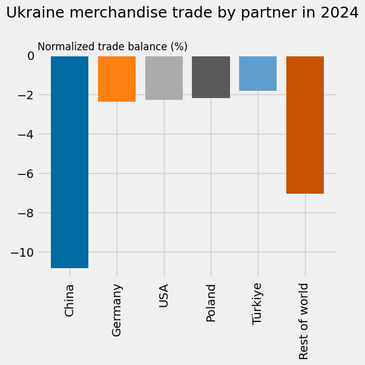

# UN Comtrade Database

## URL

[https://comtradeplus.un.org/](https://comtradeplus.un.org/)

## Description

This database contains import and export data for goods and services for about 200 countries/zones since 1962. In the [Trade section](https://comtradeplus.un.org/TradeFlow), you can search for monthly or annual trade data using all HS codes or specific HS codes (a commodity classification system, you can easily find the one you need by doing a google search like “commodity name + HS code”, or go ahead and type a keyword in the specific HS bar within the tool) and the countries involved in the trade. There is an advanced search tool that allows you to drill down, adding transport patterns, customs codes, trade flows, among other fields of investigation.&#x20;

You will get the total trade value and quantity of the countries you are researching considering the year or month you have selected. This might be useful if you are looking for an estimate of official data on the quantity imported/exported from a country on a product.&#x20;

<figure><figcaption>
Here's a preview of the default search
</figcaption></figure>

You can save your searches by clicking on the save button and giving each search a name to recognize it later.

In the [Tariffline section](https://comtradeplus.un.org/Tariffline) you will be able to find more specific trade transactions between the countries you are looking for and their trading partners.

For example, if you search for coffee exports from Colombia to Argentina in 2023 in the Tariffline section, you will find 31 shipments with information on mode of transport, value, net weight and gross weight. But if you look in the Trade section, you will get the total trade value ($9,521,444 in the same example).

The site has a [visualization dashboard ](https://comtrade.un.org/labs/data-explorer/)that works with the same values (import/export, country, commodity, year). There is also a experimental data section of estimates of [world seaborne trade](https://comtradeplus.un.org/AISData) in real time, but the data is really scarce and the results not very easy to read. Trade yearbooks until 2022 are available in the tool website.

## Cost

* [x] Free
* [ ] Partially Free
* [ ] Paid

The service is free but you can access a premium service that allows you to perform bulk downloads and gives you priority access to preview unstructured data (when available).&#x20;

There is a trial subscription for 15 days. You can [request](https://uncomtrade.org/docs/premium-trial-subscription/) it after 15 days of creating the account. You will need to fill out a [form](https://forms.office.com/pages/responsepage.aspx?id=2zWeD09UYE-9zF6kFubccOSF7wPR3FtJq4X0eSEBpHpUMTFMQTRJMjcxTkcxU0Y4M0lESjUyOFc1TSQlQCN0PWcu\&route=shorturl) and wait 3-5 business days. After the trial starts, you will get access to a new section called Bulk Files, where you can download the data you searched for. Be aware that trial subscriptions have access to a limited number of files to download.&#x20;

The only difference between the premium service and the free one is the option to  download bulk files.&#x20;

<figure><figcaption>
Options before trial
</figcaption></figure>

<figure><figcaption>
Options after trial activation
</figcaption></figure>

There are two types of downloads: classic and plus. In both you will get a document (.gz) that you will have to convert to XLS or CSV for analysis. I used this [tool](https://products.groupdocs.app/conversion/gz-to-xls). With the plus version you will get more detailed info such as customs code, mode of transport, among others. You can also use the [API](https://comtradedeveloper.un.org/signin?returnUrl=%2F) version to download the data. Here the README [file](https://github.com/uncomtrade/comtradeapicall?tab=readme-ov-file). For this API version, they will send your account information to your registered email so you can log in. It can take a couple of days.

Through the official account of the Trade Statistics Branch on X, the UN [informs](https://x.com/UNTradeStats) about new information available on the platform and released datasets. It also shares statistics and trends.

<figure><figcaption>
Here an analytics of Ukraine in UN Comtrade <a href="https://x.com/UNTradeStats/status/1915073286586708420/photo/1">posted</a> by the Trade Statistics Branch on X.
</figcaption></figure>

## Level of difficulty

<table><thead><tr><th data-type="rating" data-max="5"></th></tr></thead><tbody><tr><td>2</td></tr></tbody></table>

## Requirements

You will have to complete a captcha each time you perform a search, unless you choose to activate a free account using your e-mail address or a Google account.

## Limitations

The tool does not provide specific trade information, only general values.

## Ethical Considerations

None

## Guides and articles

User guides:

[Getting Started Guide](https://uncomtrade.org/docs-category/getting-started/)

[UN Comtrade Docs](https://uncomtrade.org/docs/)

[UN Comtrade Docs User Guide](https://uncomtrade.org/docs-category/user-guide/)

[UN Comtrade Analytics User Guide](https://comtrade.un.org/labs/data-explorer/UserGuide%20UN%20Comtrade%20Analytics.pdf)

Projects and articles that used the tool:

[Is the US-China trade war spoiling international trade statistics? By Vali Stan, Lukas Linsi and Daniel Mügge](https://www.globalpolicyjournal.com/blog/29/01/2024/us-china-trade-war-spoiling-international-trade-statistics)

[Red Flags in Trade Data by Conflict Armament Research](http://storymaps.arcgis.com/stories/5090228a1cd04ca7ae8c11cedd8d78fb)

[Key statistics and trends in international trade 2024](https://unctad.org/system/files/official-document/ditctab2025d2_en.pdf)

## Tool provider

United Nations, based in New York City. Maintained by DESA/UN Statistics Division.

## Advertising Trackers

* [x] This tool has not been checked for advertising trackers yet.
* [ ] This tool uses tracking cookies. Use with caution.
* [ ] This tool does not appear to use tracking cookies.

| Page maintainer |
| --------------- |
| Lieth Carrillo  |
|                 |
