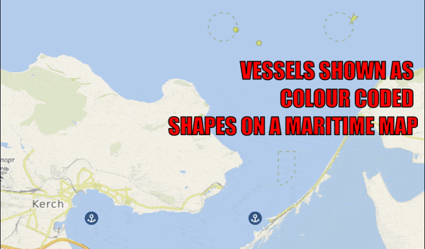
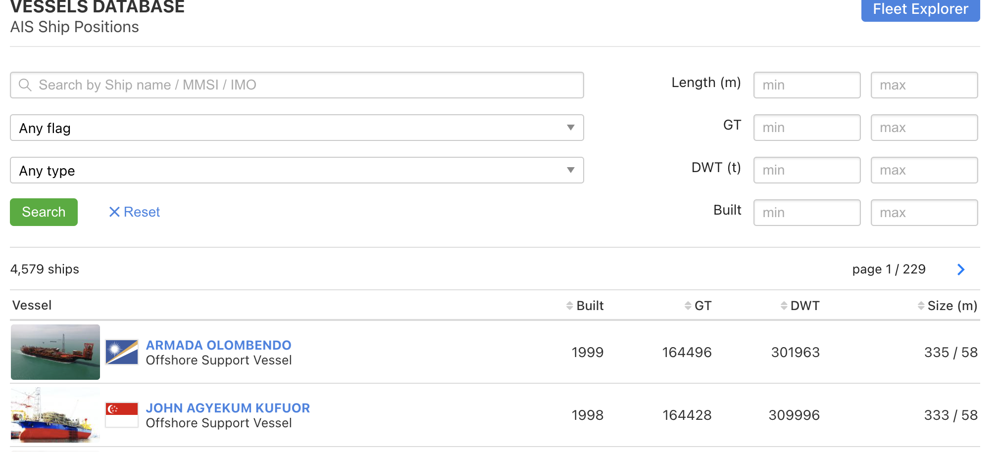
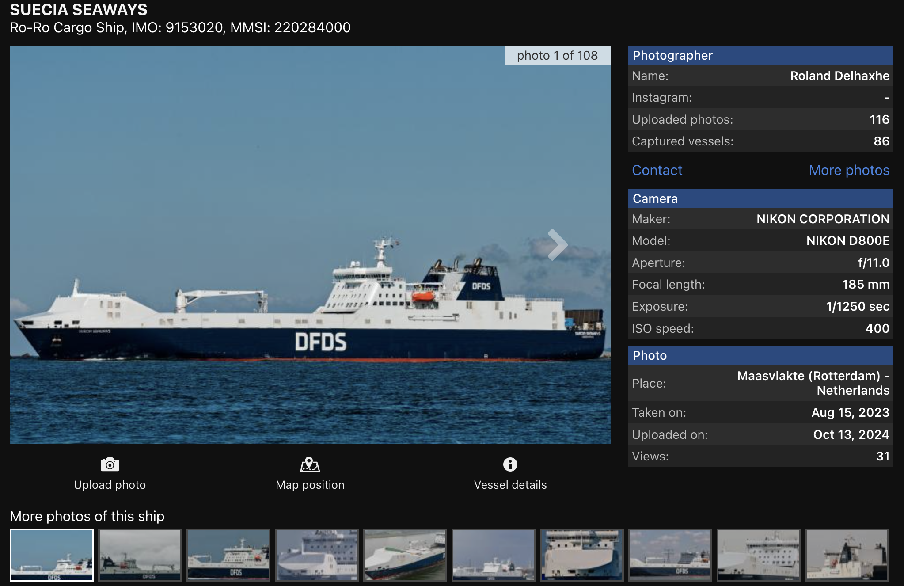
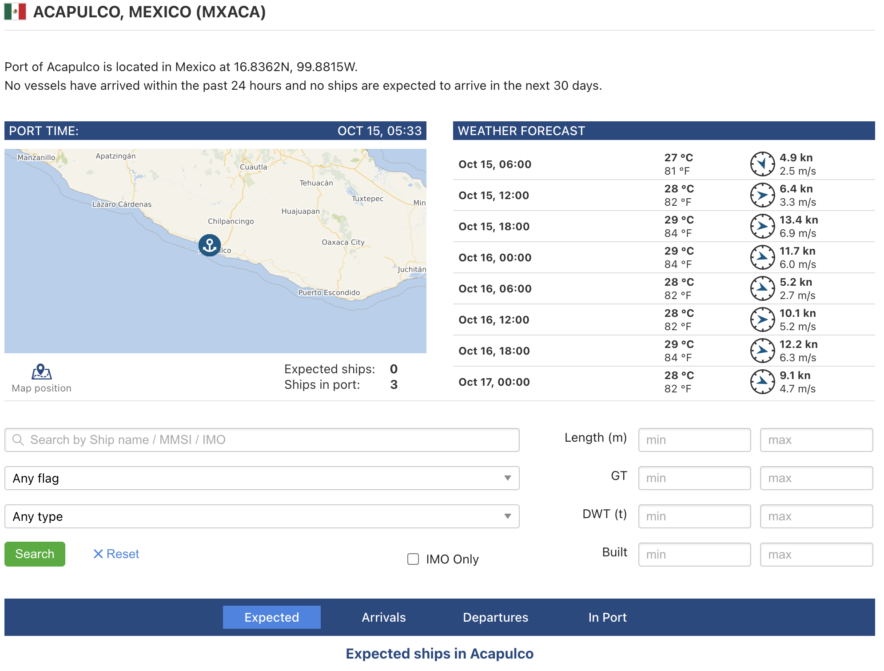
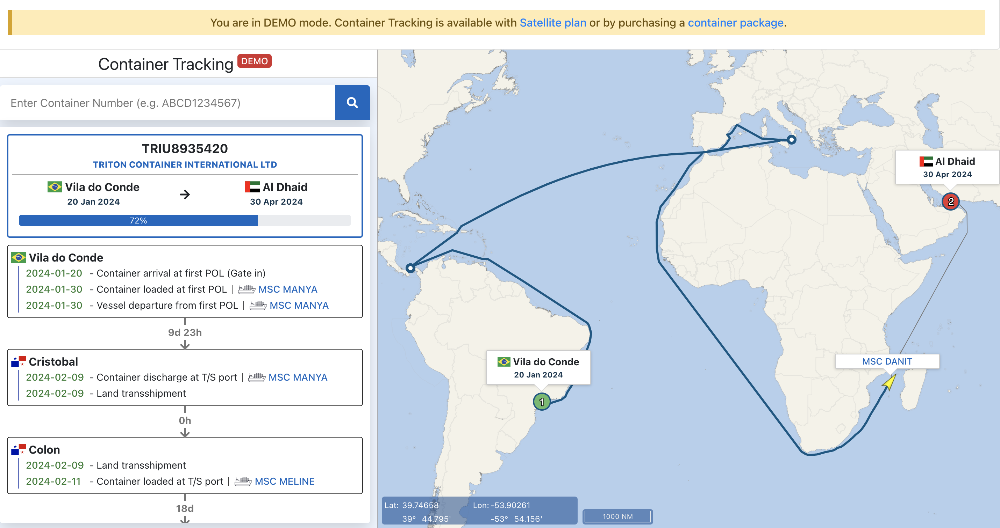
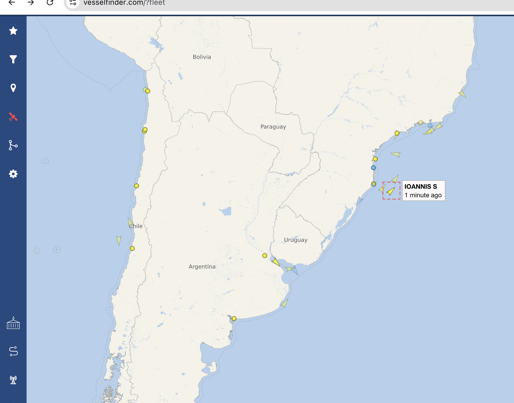

# VesselFinder

## URL

[https://vesselfinder.com/](https://www.vesselfinder.com/)

## Description

<figure><figcaption>
VesselFinder Global Location Coverage, Vessel Details, Tracking and Filtering
</figcaption></figure>

VesselFinder is a maritime tracking application and an online desktop tool that provides real-time data on vessel movements globally. Its offers detailed insights into maritime activities, shipping patterns, and vessel operations. The tool also features a [news section](https://www.vesselfinder.com/news) with selected maritime-related information.

After creating an account, users can access a search portal to look up vessels by name, IMO or MMSI number, tonnage, flag, dimensions, etc., which can help to identify a vessel for which only some identifying information is known.


IMO numbers are unique, seven-digit tracking numbers assigned to ships and shipping companies by S\&P Global Market Intelligence on behalf of the International Maritime Organization. Unlike ship names and company names which can change, IMO numbers remain constant. More information about IMO numbers can be found on the [International Maritime Organization's website](https://www.imo.org/en/OurWork/IIIS/Pages/IMO-Identification-Number-Schemes.aspx).

MMSI (Maritime Mobile Service Identities) numbers are nine-digit numbers used to uniquely identify ships in radio and AIS (Automatic Identification System) broadcasts. MMSI numbers are issued by the country a ship is flagged to and managed by the International Telecommunications Union. More information about MMSI numbers can be found on the [International Telecommunications Union's website](https://www.itu.int/en/ITU-R/terrestrial/Pages/by-categories-faq.aspx?categorizedby=17).


#### Main desktop & in-app menus

VesselFinder offers several features that are particularly beneficial for research purposes:

Real-Time Vessel Tracking: The core feature of VesselFinder is its real-time tracking capability. Researchers can monitor live movements of vessels, viewing their current positions, speeds, courses, and destinations. This feature is crucial for studies that require up-to-the-minute data.

Detailed Vessel Information: The app provides comprehensive data on each vessel, including specifications, voyage history, ownership details, and photos. This extensive information is valuable for researchers conducting detailed analyses of specific ships or types of vessels.

[Historical Data](https://www.vesselfinder.com/historical-ais-data) and Playback: VesselFinder offers access to historical data, allowing researchers to analyze past vessel movements and shipping patterns. The playback feature enables users to visualize and study historical maritime traffic, which is essential for longitudinal studies and trend analyses.

Customizable Alerts: Set up alerts for specific vessels, ports, or maritime areas. This feature will send notifications about significant events or changes, such as a vessel's arrival or departure, route deviations, or unusual activities.

[Data Export and API Access](https://www.vesselfinder.com/realtime-ais-data#live-ais-api): For in-depth research, VesselFinder provides options to export data and offers API access. Researchers can integrate VesselFinder’s data into their own analytical tools and databases, facilitating more complex analyses and custom research projects.

Weather Data Integration: The app includes weather data overlays, providing insights into how sea conditions might affect vessel movements. This feature can be valuable for studies examining the impact of weather on maritime operations.

Below quick overview of the different capabilities and menus available:

* [Vessels database](https://www.vesselfinder.com/vessels) - search for a specific vessel based on the following parameters: ship name, MMSI, IMO number, the flag the ship sails under (e.g. Austria), the type of vessel (cargo, passenger, tanker, military, fishing) and the dimensions of the ship (length, gross tonnage, deadweight tonnage, and the year it was built).

<figure><figcaption>
Vessels database with search fields
</figcaption></figure>

* [Photos](https://www.vesselfinder.com/gallery?page=2) - This area has thousands of user-contributed photos of vessels. It is a good way to see how a particular vessel looks like, the paint job on the hull, whether the vessel has any distinct features (technical equipment like satellite dishes, how the main mast looks, etc.). This view also allows searching by ship name, MMSI and IMO number. The photos include additional information about a vessel - its name, where and when the photo was taken, and also provides shortcuts with the current map position of said vessel and a link to its own profile on the website/app. And finally, more often than not there are multiple photos of the same vessel from different angles.

<figure><figcaption>
Photo of a vessel from the Photos menu
</figcaption></figure>

* [Ports](https://www.vesselfinder.com/ports) - A list of over 6,000 ports across the globe, including description of the port and its position on the map. When a port is selected, all vessels nearby are also visible on the map. The ports are searchable by country and by United Nations Code for Trade and Transport Locations - LOCODE (a geographic coding scheme developed and maintained by United Nations Economic Commission for Europe, the code consists of five letters with the first two designating the country, e.g. ESADR is the LOCODE for Port of Adra in Spain). The profile of each port shows information on how many ships are in port, how many are expected and how many have visited the port in the past month.

<figure><figcaption>
Profile of the Port of Acapulco
</figcaption></figure>

Full list of LOCODEs by country

The full list can be found on the [United Nations Economic Commission for Europe (UNECE) website](https://unece.org/trade/cefact/unlocode-code-list-country-and-territory). By selecting a country, the system displays the entire UN/LOCODE list of subdivisions, i.e. the country, the port names and their coordinates.

The list allows obtaining the UN/LOCODE Code List 2024-1 for each country or territory. The latest version was published in July 2024.

* [Containers](https://www.vesselfinder.com/containers) - A paid service both in the app and on the website. It offers real-time online track & trace service as well as Container Tracking API for monitoring of container shipments. This service comes with a dashboard, port activities (origin and destination port, transshipment ports also known as entrepôts, land transshipment, arrival and departure times and real-time position of the container ships). It is usually used by businesses to track the location and status of container shipments as they travel along the supply chain. This feature can also be useful for tracking suspected illicit trade.

<figure><figcaption>
Demo view of container tracking
</figcaption></figure>

#### Free desktop and in-app services

* Map view - this is the most versatile view of the tool. Here you can save a particular map view that you need for future use, adjust the density of the map, turn on and off Satellite AIS (please note that when density is selected, the map will show much more vessels in an area; however clicking on most of them located via satellite will not provide information on the vessels), adjust what you want to see on the map, select the vessels based on their type, find a particular vessel in the search bar, or just select one from the map to view its profile.

<figure><figcaption>
VesselFinder map view with vessels near the shore of Florianopolis and Rio de Janeiro
</figcaption></figure>

* Embedding a map on a website - VesselFinder allows map embedding on websites by inserting HTML codes. Here is a [list of the codes](https://www.vesselfinder.com/embed) that can be used.
* [Planning a route](https://route.vesselfinder.com/) - Enter a port of origin and destination port (or even mid-way ports) to see the route, estimated travel times depending on speed, distance between ports and which crossings the vessel has to pass through.
* [Fleets](https://www.vesselfinder.com/?fleet) and [Fleet Explorer](https://www.vesselfinder.com/fleet-explorer)- These two give the option to create a group of vessels you want to monitor continuously (or it can be just one ship, depending on your needs). To add a vessel to your fleet, first find it in the map view and then click "add to fleet" or find it in the vessel finder menu, open the vessel profile and again select "add to fleet" (the icon for this is a small blue star). To access your fleets, go to the top right corner of the page, open your profile and select "My fleets". In the map view you can select fleet mode to be either on or off. When turned on, the map will only show the location of the vessels in your fleet, making it easier to view and track.
* [Automatic identification systems (AIS) transponders](https://stations.vesselfinder.com/) - VesselFinder offers a list of AIS transponders worldwide. AIS is a [short-range coastal tracking system](https://connectivity.esa.int/satellite-%E2%80%93-automatic-identification-system-satais-overview) that provides identification and positioning information to both vessels and shore stations. You can select an AIS station from the list to view its profile, statistics and also information on how many vessels (and what type) are currently in range.

## Cost

* [ ] Free
* [x] Partially Free
* [ ] Paid

The free version includes 1 day of track history, 10 ships tracked, 1 port call check and 100 route planners.

The _Satellite_ package offers unlimited global coverage, access to undelayed satellite position data for any ship in the world, unlimited number of tracked ships, no limits оn the number of tracked ships via satellite and terrestrial AIS network. **This is the only package that offers container tracking**. Pricing is available at [this page](https://www.vesselfinder.com/satellite-ais).

The Premium package offer includes 7 days of track history, 500 ships tracked, 5 port call checks and 500 route planners. Pricing is available [here](https://www.vesselfinder.com/get-premium).

Container tracking data and dashboards are available for [purchase separately](https://www.vesselfinder.com/container-tracking) if needed, prices are based on the number of containers tracked with the lowest being 1 container.

The overview of all plans is [here.](https://www.vesselfinder.com/get-premium)

## Level of difficulty

<table><thead><tr><th data-type="rating" data-max="5"></th></tr></thead><tbody><tr><td>3</td></tr></tbody></table>

## Requirements

Does not require an account to browse, but creating a free one will unlock some additional features such as creating a fleet. .

## Limitations

VesselFinder's [terms of use](https://www.vesselfinder.com/terms) can be read in full here.

Some additional features are paid. Refer above to the cost section for detailed information on prices.

## Ethical Considerations

Almost all vessels are privately-owned, so there should be considerations if this information is used as part of research meant for the wider public. Additional research in vessel ownership is advisable.

Some of the vessels are government-owned and a small part of those are intended for military use. This can pose hurdles if in-depth research is needed as it may require obtaining additional information from official sources to present a balanced picture, especially if the research or parts of it are meant to be read by a wide audience.

## Guides and articles

[Identifying the Mystery Vessel at the Site of Trinidad & Tobago’s National Emergency Oil Spill](https://www.bellingcat.com/news/2024/02/14/identifying-the-mystery-vessel-at-the-site-of-trinidad-tobagos-national-emergency-oil-spill/) - Logan Williams, Bellingcat

[How to set the coordinates format on VesselFinder?](https://www.youtube.com/watch?v=AGDS6g8OEWM) - Just Ask Me YouTube channel

[How to select the type of the map on VesselFinder?](https://www.youtube.com/watch?v=W8_LNHZcfuQ) - Just Ask Me YouTube channel

[Identificar y localizar barcos y ver sus características con vesselfinder.com](https://www.youtube.com/watch?v=2hIVHohek9I) - El Maestro del Tecno YouTube channel (video in Spanish)

[VesselFinder – the Live Vessel Tracking App](https://ship-tracking.net/vesselfinder/) - Ship-Tracking.net

## Tool provider

[Astra Paging Ltd.](https://www.astrapaging.com/about), based in Sliven, Bulgaria for the desktop version. [VT Explorer Ltd.](https://www.vtexplorer.com/) in Polegate, East Sussex, UK developed the application version.

## Advertising Trackers

* [ ] This tool has not been checked for advertising trackers yet.
* [x] This tool uses tracking cookies. Use with caution.
* [ ] This tool does not appear to use tracking cookies.

| Page maintainer:-            |
| ---------------------------- |
| LPetrova and Sophie Tedling: |
