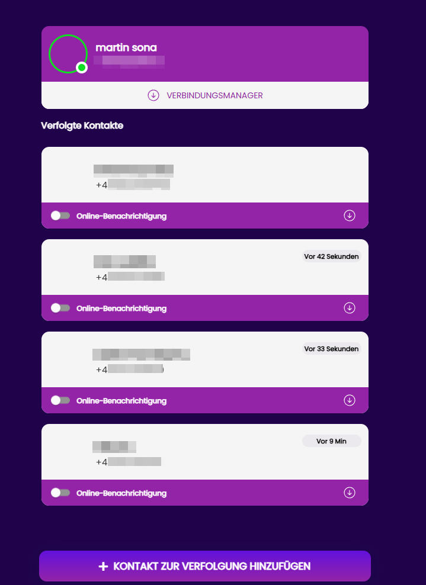

# WaTools

## URL

[https://www.watools.io](./#url) aka [https://www.chatwatch.net](./#url)

## Description

**Chatwatch** is a controversial WhatsApp-monitoring service that launched in early 2018. Its original mobile apps were **taken down** from Apple’s App Store and Google Play Store shortly after [launch due to privacy and policy violations](https://www.business-standard.com/article/technology/this-app-uses-whatsapp-data-to-let-users-know-when-someone-goes-to-sleep-118033000345_1.html). **Today, Chatwatch continues to exist as a web-based service** (with an optional Android APK for sideloading) accessible through its official website. The site is online as of 2025, offering a free trial and subscription plans; however, no official app is available via the **iOS or Google Play app stores**. Users must sign up on the website and link their WhatsApp account (e.g. via WhatsApp Web) to use Chatwatch’s tools.\
Chatwatch’s website in 2023 advertised a refreshed interface and continues to offer features like **real-time online/offline notifications, daily usage graphs, and PDF/CSV reports** of WhatsApp activity.

• **Check online status** – enter a phone number (and choose a country prefix) to see if that number is currently online in WhatsApp. No installation or login is required; simply paste the number and click the button. It works even if the person is not in your contacts, providing a quick way to verify that someone is connected.&#x20;

• **Download profile picture** – by selecting the country and entering the local number, you can save someone’s current WhatsApp profile photo. This feature only works when the profile picture is public; private or hidden images cannot be downloaded

• **WA Watcher** – the flagship tracker advertises “online history,” “push notifications when online,” and “full insights of activity” across web, Android, and iOS. After you provide a number, WA Watcher logs every time that person appears online, shows patterns such as sleep times or chat probability between two numbers, and can send real‑time notifications via web push (desktop/Android) or a Telegram bot (iOS).  The basic functions are accessible through a browser, and mobile apps are available for both Android and iOS. WA Watcher offers a short trial (three days or eight hours) and then requires a paid subscription.

As of now, Chatwatch still operates from its website for those determined to use it, but its functionality is diminished wherever WhatsApp’s new privacy settings are in effect. In global legal terms, any tool that allows **covert monitoring of someone’s online behavior** without their consent raises serious concerns – potentially violating not only a messaging app’s terms of service but also personal privacy rights and anti-stalking laws.



<figure><figcaption>
For demonstration purposes, the author used his own alternative numbers, or asked third parties for consent. Data collection was ceased immediately after the article was written.
</figcaption></figure>



<figure><figcaption></figcaption></figure>



## Cost

* [ ] Free
* [x] Partially Free
* [ ] Paid

Checking online status and downloading profile pictures are free. WA Watcher offers a three-day free trial; after that, you can automatically change to a subscription plan on a monthly or annual basis. The monthly plan costs US$11.99 per month, and the annual plan costs US$89.99 per year. Each plan allows you to track up to 10 contacts and includes online history, contact insights, an AI-trained chat probability feature, and access to an email support team. Prices are listed in U.S. dollars and may vary by region.

## Level of difficulty

<table><thead><tr><th data-type="rating" data-max="5"></th></tr></thead><tbody><tr><td>1</td></tr></tbody></table>

The web tools use simple forms and don’t require technical knowledge.&#x20;

## Requirements

* No account or API key is needed for the basic tools.
* To use WA Watcher’s push notifications, you must allow browser notifications on desktop or Android; iOS users will receive notifications via a Telegram bot.
* Works in a modern browser; WA Watcher also has apps for Android and iOS. The service offers a limited free trial; a subscription is required for ongoing tracking.

## Limitations

* Profile picture downloads work only when the target’s image is public.
* Online status checks are manual and may be limited by WhatsApp’s privacy settings.
* WA Watcher must remain active (in a browser tab or app) to record changes; notifications rely on third‑party push services and may not always arrive promptly.
* The site has minimal documentation and support; some pages (e.g., blog or terms) return errors.
* Use of these tools may violate WhatsApp’s terms of service or local laws; accuracy is not guaranteed.

## Ethical Considerations

* **Privacy and consent**\
  Tracking someone’s WhatsApp activity without permission is intrusive and may violate privacy or data‑protection laws. From a **data protection law** standpoint, Chatwatch’s activities likely run afoul of regulations like the EU’s **GDPR**, which require a lawful basis (such as user consent) to process personal data. A person’s WhatsApp online/offline log constitutes personal behavioral data. Since Chatwatch collects such data about individuals **without their knowledge or consent**, it would likely be deemed an unlawful processing of personal data under GDPR (and similarly under laws like Brazil’s LGPD or California’s CCPA, if applicable).
* **Data use**\
  The WA Watcher privacy policy notes that personal information may be collected to provide the service and that third‑party services (Google Play Services, Google Analytics for Firebase) are used.
* **Potential misuse**\
  Real‑time tracking and anonymous messaging could be used for stalking, harassment, or abusive control; consider the risks versus any legitimate use.
* **Legal compliance**\
  Always check local laws and [WhatsApp’s terms of service](https://www.whatsapp.com/legal/terms-of-service-eea) (EEA version, [Global version](https://www.whatsapp.com/legal/terms-of-service)) before using these tools; avoid targeting minors or vulnerable individuals.

WhatsApp[ spokesperson confirmed](https://www.businessinsider.com/whatsapp-tracking-apps-online-activity-sleep-interactions-2020-9) that these monitoring apps **violate WhatsApp’s terms of service** and that WhatsApp employs anti-abuse systems to detect and block such misuse. In fact, **Meta (Facebook)** – WhatsApp’s parent company – has taken a strong stance against data-scraping tools.

## Comparable Tools

Examples, features, and availability move constantly, but you’ll encounter:

* [**WhenLog** ](https://play.google.com/store/apps/details?hl=en_US\&id=com.whatlogapp)**/ WaLog /** [**W-Track**](https://wastat-whatsapp-tracker.de.softonic.com/) **/ WaLogin / WaStat** – “last seen” trackers with charts and notifications; some are still in App Store or Play in certain regions; others appear [only via APK sites](https://apkpure.net/walog-online-last-seen-tracker/com.whatlogapp/download/1.2.2). Expect frequent removals or geoblocking.&#x20;
* **WACheck.online** and similar “enter a number to check online status” sites; availability fluctuates; claims are often stronger than what privacy controls now allow. [wacheck.online](https://wacheck.online/?utm_source=chatgpt.com)

**Important caveat**: even when a download page exists, functionality may be degraded, intermittent, or require you to be in the target’s contacts to observe presence; privacy settings can nullify tracking. [WhatsApp Help Center](https://faq.whatsapp.com/419827870318306?utm_source=chatgpt.com)

#### Are there open-source options or general-purpose alternatives?

There is no official API for this. However, several **general-purpose WhatsApp Web automation libraries** are open source and can be repurposed to observe presence signals in your own session:

* [**open-wa/wa-automate-nodejs**](https://docs.openwa.dev/docs/concepts/how-it-works) – headless Chrome automation that injects code into WhatsApp Web; can listen to events and state; presence monitoring logic can be built on top.
* [**WPPConnect / wa-js**](https://wppconnect.io/wa-js/) – exposes WhatsApp Web functions; includes presence-related helpers; dev docs show presence controls and state checks. [wppconnect.io+1](https://wppconnect.io/wa-js/?utm_source=chatgpt.com)
* [**whatsapp-web.js**](https://wwebjs.dev/) – community lib; presence events have been [discussed ](https://github.com/pedroslopez/whatsapp-web.js/issues/82)and implemented over time. [GitHub](https://github.com/pedroslopez/whatsapp-web.js/issues/82?utm_source=chatgpt.com)

Using these to collect presence on other accounts **can breach WhatsApp’s Terms** and trigger bans or legal action; the libraries are general automation tools, not sanctioned trackers. This risk is real, even if you run the code yourself. [WhatsApp Help Center](https://faq.whatsapp.com/5957850900902049?utm_source=chatgpt.com)

#### Are there other “WAtools” that are not trackers?

Yes; the name is overloaded. Examples:

* **watools.io** – the tracker suite discussed above. [watools.io](https://watools.io/)
* **watools.app / watools.im / watoolbox.com** – utility or marketing toolkits; things like “send without saving contact,” link or QR generators, bulk sending tools; not presence trackers. Many of these also risk violating WhatsApp terms if used for spam or automation. [watools.im](https://watools.im/?utm_source=chatgpt.com) [watoolbox.com](https://watoolbox.com/)
* Legacy [**watools.es** pages show up in old WhatsAPI](https://github.com/eduardocruz/WhatsApp-Tools) tutorials; largely historical.

## Guides and articles

No official guides or how‑to videos were found at the time of writing. [WA Watcher privacy policy](https://watools.io/wa-watcher-privacy-policy?utm_source=chatgpt.com) provides basic information.

## Tool provider

**WATools.IO (Chatwatch)** – According to [corporate information](https://tracxn.com/d/companies/watools.io/), WATools.IO is an unfunded developer based in the United States, founded in 2021. WATools.IO is a 2021 U.S. startup and noted the alignment with Chatwatch. This section now explicitly states that chatwatch.net advertises the same features and pricing, indicating the services are effectively the same

Updated the description and provider sections to explain that WAtools appears to have merged with or rebranded as Chatwatch. This is based on the WA Watcher privacy policy listing a contact email at support@chatwatch.net and stating that the policy has been effective since [2021-08-08](https://watools.io/wa-watcher-privacy-policy), and on WHOIS records showing the watools.io domain last updated on 2023‑07‑03.

## Advertising Trackers

* [ ] This tool has not been checked for advertising trackers yet.
* [x] This tool uses tracking cookies. Use with caution.
* [ ] This tool does not appear to use tracking cookies.

| Page maintainer |
| --------------- |
| Martin Sona     |
|                 |
