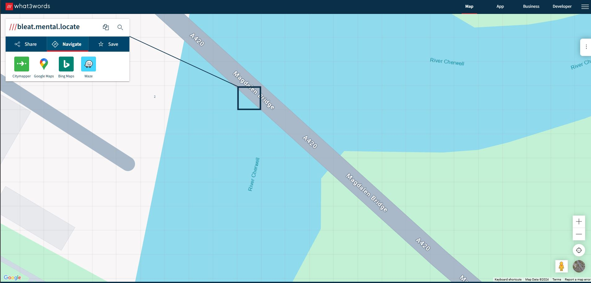
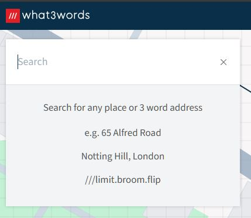
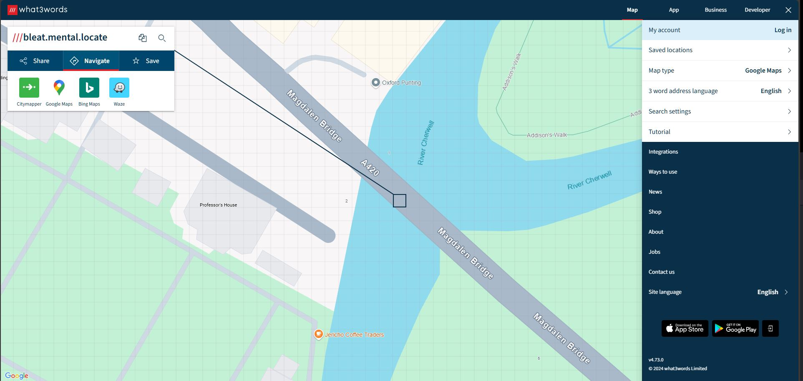
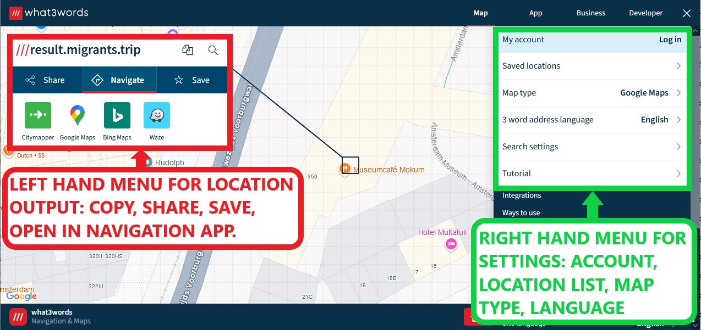
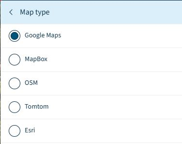
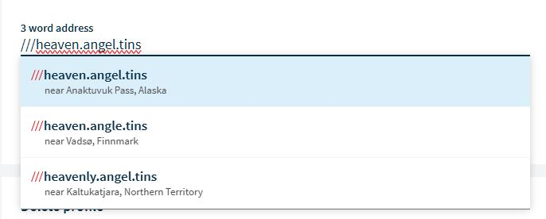

# what3words

## URL

[http://what3words.com/](http://what3words.com/)

## Description

<figure><figcaption>
THE <strong>WHAT3WORDS INTERFACE, SHOWING THE 3M X 3M SQUARE ON MAGDALEN BRIDGE IN OXFORD, UK, WHICH CORRESPONDS TO THE EXAMPLE 3-WORD PHRASE </strong><em><strong>BLEAT.MENTAL.LOCATE</strong></em><strong>.</strong>
</figcaption></figure>

what3words is a simple, clear and rapid way to communicate locations on earth. The world has been divided into 3m x 3m squares (around 57 trillion of them), and an unique identifier combining three words is assigned to each one. The app is available for mobile phones and PC browsers and an API  ([Application Programming Interface](https://en.wikipedia.org/wiki/API)) is available to automate the conversion between what3word addresses and geographic co-ordinates.

what3words can be used to communicate locations without numeric format geographic co-ordinates, which is particularly helpful when communication channels are poor quality, or unreliable. It is usable in many countries to summon the emergency services, e.g. Mountain Rescue, pinpoint meeting places, specify accurate deliveries, e.g. [Hermes](https://ti-insight.com/hermes-partners-with-what3words-in-the-uk/) and [Ikea](https://www.reuters.com/article/technology/ikea-invests-in-mapping-technology-startup-what3words-idUSKBN2BG2IB/) use it, and advertise accurate locations. Its use in Open Source research can cover any of these applications for the technology, as part of an investigation, or simply as a device to share locations between researchers.


**LANGUAGE:** It is possible to use what3words in a large range of languages. The 3-word phrase assignment across the grid squares is entirely different and unrelated in each language. Therefore there is no relationship between the 3-word phrases in different languages for the same grid square. They are **not** translations of word meanings between languages. When a user sets up a Second Language in the mobile app, two sets of 3-word phrases are displayed simultaneously, with the Second Language phrase below the First Language phrase. \[However the what3words features where a 3 word address can be input by speaking it or scanning it are not available in the second language].


## The Interface


There is considerable variation between the app version of what3words and the PC browser version and some functions only exist in one version of the app, e.g. the compass function only exists in the mobile app version.


### Use Cases for what3words with Input Data, Output Data and Data Input Options...(Click each tab to see further information) 



* A tile square geographic location on the map (map options are [Google Maps](https://bellingcat.gitbook.io/toolkit/more/all-tools/google-maps), MapBox, OSM, Tomtom and Esri)
* A what3words location phrase
* A text address
* A pair of numeric location co-ordinates



* A tile square geographic location on a map (map options for output apps are [Google Maps](https://bellingcat.gitbook.io/toolkit/more/all-tools/google-maps), [Bing Maps](https://bellingcat.gitbook.io/toolkit/more/all-tools/bing-maps), Waze, City Mapper)
* A what3words location phrase



* Input a location and convert it to another format (co-ordinates, map pin, postal address or phrase)
* Input a location and share it via a selection of media
* Input a location and see the Street View there
* Save a location to a user account
* Navigate a journey using a location
* Copy a location



* Type into the Search box

<figure><figcaption>
<strong>FORMAT OPTIONS ARE PROVIDED IN THE SEARCH BOX, WITH AUTOCOMPLETE CHOICES DISPLAYED BELOW</strong>
</figcaption></figure>

* a pair of numerical geographic co-ordinates
* a 3 word phrase with the prefix ' ///'

<figure><figcaption>
<strong>LEFT MOUSE CLICK ON THE MAP SELECTS THE 3M X 3M SQUARE AT THE LOCATION UNDER THE CURSOR.</strong>
</figcaption></figure>

* A tile square geographic location on the map



The interface comprises two main menus on the left and right hand sides of the screen.

<figure><figcaption>
<strong>TWO MENUS AND THEIR FUNCTIONS IN THE WHAT3WORDS INTERFACE</strong>
</figcaption></figure>

The user can select the source of the background map of the earth in the Map type option in the right hand menu.

<figure><figcaption>
<strong>THE USER CAN TOGGLE BETWEEN DIFFERENT SOURCES FOR THE BACKGROUND MAP</strong>
</figcaption></figure>

Dragging and dropping the yellow pin man icon on the map displays any Google Maps imagery relating to the location selected.


The app will not draw the 3m square within the StreetView imagery, only on aerial map or satellite views.


<figure><figcaption>
<strong>THE WHAT3WORDS LOCATION EXAMPLE </strong><em><strong>BLEAT.MENTAL.LOCATE</strong></em><strong> BEING SHOW ON GOOGLE MPAS BY DROPPING THE YELLOW PIN MAN ICON ONTO THE STREET MAP IN THE APPROPRIATE SQUAR</strong>E.
</figcaption></figure>

## Cost

* [x] Free
* [ ] Partially Free
* [ ] Paid

## Level of difficulty

<table><thead><tr><th data-type="rating" data-max="5"></th></tr></thead><tbody><tr><td>1</td></tr></tbody></table>

## Requirements

* Users wishing to use the facility to save locations will need an account, which is free to set up.
* Apps and browsers need permissions to detect the user's current location for certain functionality to be available.

## Limitations

* Very similar phrases for proximate squares could cause error/confusion: At the time of writing 11/11/24, recent [research on what3words reported by the BBC](https://www.bbc.co.uk/news/technology-56901363) has revealed some flaws in the system regarding its aim not to assign similar 3 word phrases to nearby areas. This similarity also includes homophones, i.e. words which sound similar, rather than look similar. This is because what3words is used to communicate over voice channels, particularly for the emergency services, so similar-sounding or similar-looking phrases at proximate squares is likely to lead to errors in location. The BBC reported that a researcher had found 'thousands' of 3 word phrases which were either very similar looking, or similar sounding, had been assigned to locations less than 1km  apart. On entering a 3 word address in the Account Setup page, for example, the 3 word address of the user's own home, the locations of other similar addresses are displayed to allow checking of their proximity.

<figure><figcaption>
 <strong>WHAT3WORDS INTERFACE SHOWING AUTO-COMPLETED OPTIONS FOR A USER-INPUT, 3-WORD LOCATION PHRASE WITH THEIR DIFFERING GEOGRAPHICAL DETAILS</strong>
</figcaption></figure>

* The accuracy of what3words is restricted to a 3m square, whereas  geographical grid co-ordinates theoretically references a single point and can offer greater accuracy. In practice, the 3m square level of accuracy is satisfactory for very many purposes.
* what3words help is structured around a set number of use cases and [FAQ](https://support.what3words.com/en/categories/328642), which, understandably, are not focused on Open Source research. Its natural language help interface often returns that nothing is found in response to queries which correspond to tutorial material available online.

## Guide

what3words provides a [How to Use](https://what3words.com/how-to-use-the-what3words-app) guide for the mobile app.

## Tool Provider

[what3words Limited](https://what3words.com/contact-us), based in London, UK.&#x20;

## Advertising Trackers

* [ ] This tool has not been checked for advertising trackers yet.
* [x] This tool uses tracking cookies. Use with caution.
* [ ] This tool does not appear to use tracking cookies.

| Page maintainer:- |
| ----------------- |
| Sophie Tedling.   |
|                   |
