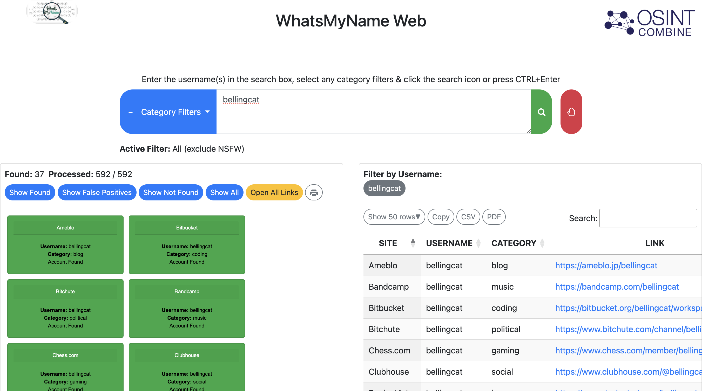

# WhatsMyName

## URL

https://whatsmyname.app/

## Description

WhatsMyName Web checks if a particular username exists on different platforms and websites and if it does, it links to it. It is a quick way to find where else a person of interest might have accounts. &#x20;

By searching Bellingcat on WhatsMyName web, we get 37 places where this username is used. The green boxes are clickable and will take you to the user page.&#x20;

By clicking on the "category filter" it is possible to narrow down the results to specifc categories of results, for example "business", "dating", or "shopping".

<figure><figcaption>
Results for the username "bellingcat"
</figcaption></figure>

Beware that different people can use the same username.&#x20;

False positives are also present: you get a result for a platform, but when you click it, it might return "This page does not exist" page or some variation of it.  &#x20;

There are several alternative username tools, including [Sherlock](https://bellingcat.gitbook.io/toolkit/more/all-tools/sherlock) and [Blackbird](https://bellingcat.gitbook.io/toolkit/more/all-tools/blackbird).&#x20;

## Cost

* [x] Free
* [ ] Partially Free
* [ ] Paid

## Level of difficulty

<table><thead><tr><th data-type="rating" data-max="5"></th></tr></thead><tbody><tr><td>1</td></tr></tbody></table>

## Requirements

\-

## Limitations

You have to allow cookies to use the tool. A CAPTCHA test pops up after clicking the search button. The tool runs searches in 500+ platforms, not "everywhere in the internet". For example, results do not show Facebook and Instagram links. To see all the platforms searched in click "Show All" button.&#x20;

Be aware that the fact that WhatsMyName has found a specific username on various platforms does not necessarily mean that this username belongs to a specific person or organisation.&#x20;

## Ethical Considerations

\-

## Guide

The Github repository can be found [here](https://github.com/WebBreacher/WhatsMyName).

## Tool provider

From the website:&#x20;

"Website version of WhatsMyName proudly developed by OSINT Combine (https://www.osintcombine.com) in collaboration with Micah Hoffman.&#x20;

Authors: Micah 'WebBreacher' Hoffman, C3n7ral051nt4g3ncy, balestek, fres621, Paradoxxs, Itsoon, K2SOsint, Lucas 'P1ngul1n0' Antoniaci"

## Advertising Trackers

* [x] This tool has not been checked for advertising trackers yet.
* [ ] This tool uses tracking cookies. Use with caution.
* [ ] This tool does not appear to use tracking cookies.

| Page maintainer      |
| -------------------- |
| Aiganysh Aidarbekova |
|                      |
