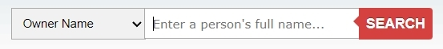
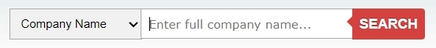

# Whoxy

## URL

[https://www.whoxy.com/](https://www.whoxy.com/)

## Description

With Whoxy there are several options to find information on domain names. It is free to sign up for an account but that is not a requirement for 1 or a few of searches.

There are 6 options to query information.

* Enter a domain name for general whois:

<figure><figcaption></figcaption></figure>

Results will show the domain name itself, the registrar, the registered date, the date of when the registry was updated, the expiry date. Also the domain status, name servers and contact details.

* Enter a domain name to retrieve historical information:

<figure><figcaption></figcaption></figure>

Results will show the same information as for a regular whois query, and further down on the page who owned that domain in the past.

* Enter a owner name for reverse whois results on which domain names are linked to that owner:

<figure><figcaption></figcaption></figure>

The results will show domain names which are linked to that particular name. If the amount of results is substantial, a subset will be shown with the remark to use the Reverse Whois API.

* Enter a company name for reverse whois results on which domain names are linked with that company:

<figure><figcaption></figcaption></figure>

The results will show a list of domain names. If the amount of results is substantial, a subset will be shown with the remark to use the Reverse Whois API.

* Enter a valid e-mail address for reversed whois results on which domain names are linked with that e-mail address:

<figure><figcaption></figcaption></figure>

* Enter a domain keyword (for instance "iPhone") for reversed whois results on which domain names include that specific keyword:

<figure><figcaption></figcaption></figure>

The results will show a list of domain names with that keyword. If the amount of results is substantial, a subset will be shown with the remark to use the Reverse Whois API.

\*\*\*

The information shown for a regular whois query and a whois history query are available in whois format, but also as RAW, JSON and XML.

When using the API, output is offered as JSON schema, XML schema, JSON live results and XML live results for easy incorporation into your research tools.

\*\*\*

To the right of the basic information when using the regular whois lookup, there is a smaller pane listing similar domains. There is a button to view all. The listed similar-named domains can sometimes lead to the discovery of pivot points, for instance the use of [typosquatting](https://en.wikipedia.org/wiki/Typosquatting) .

The complete range of services can be found on the homepage under the button "Our Services".

## Cost

* [ ] Free
* [x] Partially Free
* [ ] Paid

Single searches are free and do not require an account. Whoxy does not require a monthly fee, and has a "pay as you go" policy if an API is used. Pricing information for API access can be found [here](https://www.whoxy.com/pricing.php).

## Level of difficulty

<table><thead><tr><th data-type="rating" data-max="5"></th></tr></thead><tbody><tr><td>2</td></tr></tbody></table>

## Requirements

You will need to create an account if you require an API key. A key can be obtained through the Account Manager page (login needed), from there look for API Settings.

## Limitations

There are no limitations found while writing this description.

## Ethical Considerations

\[\[The ethical considerations of each tool should be described.]]

## Guides and articles

\[\[Link to guides on this tool and to articles on research that was done with the help of this tool]]

## Tool provider

The tool provider is Whoxy.com, powered by [Autowhois.com](https://www.autowhois.com/) and [Bigdomaindata.com](https://www.bigdomaindata.com/) according to the statement at the bottom of the website pages.

## Advertising Trackers

* [x] This tool has not been checked for advertising trackers yet.
* [ ] This tool uses tracking cookies. Use with caution.
* [ ] This tool does not appear to use tracking cookies.

| Page maintainer           |
| ------------------------- |
| Bellingcat volunteer team |
|                           |
