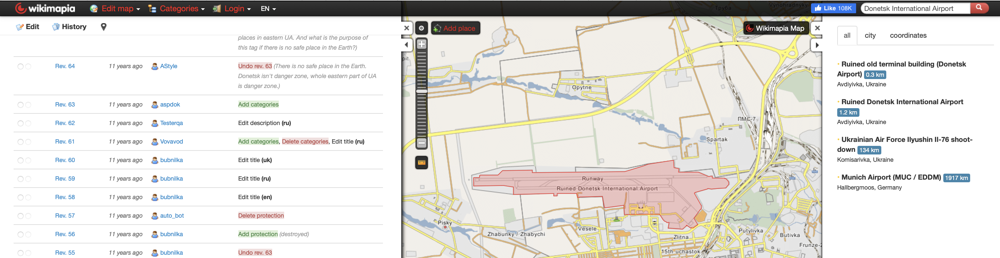

# Wikimapia

## URL

[https://wikimapia.org/](https://wikimapia.org/)

## Description

Wikimapia is a collaborative mapping project that combines an interactive map with a wiki system. While it aims to describe every location on Earth, researchers must understand that the tool is a historical archive, not a current map. The platform is [no longer actively maintained](https://en.wikipedia.org/wiki/Wikimapia#Decline_and_current_status), a fact supported by several key observations.

Firstly, many of the site’s secondary features—such as the official Wikimapia Statistics pages—are still reachable but no longer functional. The interface loads, but the underlying data have not updated for years, leaving the charts empty. Archived versions (for example, [this 2023 Wayback capture showing historical user counts](https://web.archive.org/web/20231115072150/http://wikimapia.org/stats/action_stats/?fstat=6\&period=3\&year=2009\&month=6)) confirm that these pages once displayed detailed metrics such as total users and added places, but the feature itself has long since gone dormant.

Secondly, while a live Countries Watchlist feed indicates that a small number of users continue to make minor edits, the rate of adding new, significant places remains very low—around 100–150 per week according to the New Places feed. This minimal level of ongoing activity means that the vast majority of Wikimapia’s data are several years old and can no longer be considered an accurate reflection of current ground conditions.

Despite its age, Wikimapia's historical dataset can be a valuable source for open-source researchers in specific contexts:

* **Historical Geolocation:** The platform is useful for investigating past events. For instance, "user tags" from 2014—crowdsourced labels that people created by drawing a shape around a location and adding a name or description—can help identify buildings or military positions in Ukraine that have since been altered or destroyed.
* **Regional Focus:** The data on Wikimapia is most comprehensive in regions where it had a large user base, particularly in Russia, Ukraine, and other Eastern European countries. For research focused on this area in the 2007-2015 timeframe, it may contain labels and details not found on other maps from that period. We do not consider it the _best_ data source available for any region today, but it can be a unique source for historical context.

The screenshot below with the view of [Donetsk International Airport](https://www.theatlantic.com/photo/2015/02/a-year-of-war-completely-destroyed-the-donetsk-airport/386204/) demonstrates its value as a historical record. The main airport area is labeled "Ruined" on Wikimapia, a title updated by users following its destruction in 2014. The map is covered in detailed, user-added polygons that pinpoint specific locations, including historical events like the nearby "Il-76 shoot-down."

<figure><figcaption>
A screenshot of the Wikimapia interface displays the map of Donetsk International Airport in Ukraine. The tag "Ruined Donetsk International Airport" is an example of how the platform was used by Wikimapia users to try to document the real-world impact of conflict.
</figcaption></figure>

The log shows user activity from the year 2014, specifically highlighting two key changes in response to the battle for the airport. First, at Revision 56, a user adds a protection status of "(destroyed)"; this is immediately followed by Revision 58, where the same user performs an "Edit title \[en]", adding the word "Ruined" to the official name. This sequence demonstrates how Wikimapia was updated in near real-time by its users to try to document the consequences of a major conflict.

<figure><figcaption>
This screenshot captures the edit history for the Donetsk International Airport entry on Wikimapia, providing a clear example of user efforts to use it as a historical ledger.
</figcaption></figure>

### Features:

* **Search & Categories:** Search for locations by name or filter the map by dozens of pre-set categories (e.g., military, hospital, factory).
* **Multiple Map Layers:** Switch between various base map providers, including [Google Maps](https://bellingcat.gitbook.io/toolkit/more/all-tools/google-maps), [Bing Maps](https://bellingcat.gitbook.io/toolkit/more/all-tools/bing-maps), and OpenStreetMap.
* **Measurement Tool:** Includes a tool for measuring distances between points on the map.
* **Measure distance:** measure distance between points in feet and metres.
* **Multilingual Interface:** The user interface is available in multiple languages.

<figure><figcaption>
This screenshot illustrates two of Wikimapia's features working together. The main map view shows the result of a category filter, displaying only locations tagged as a "hospital" in the Berlin area. By selecting one of these hospitals, the information panel on the left opens, revealing details about that specific place, including the "last modified" date located at the very bottom of the panel.
</figcaption></figure>

### Use Case examples for Open Source Researchers

1. **Corroborating Old Evidence:** Use the map's historical annotations to find supplementary information on claims or events mentioned in old news reports, videos, or documents from the 2007-2015 period.
2. **Discovering Informal Place Names:** Identify local, unofficial, or historical names for locations that do not appear on official maps, which can be crucial for keyword searching in local languages.
3. **Analyzing Historical Site Layouts:** Examine the detailed, user-drawn layouts of industrial sites, military bases, or critical infrastructure as they existed before being altered, expanded, or destroyed.
4. **Cultural and Historical Context:** Gain insights into the significance of local landmarks or historical sites based on what users were documenting and describing during the platform's most active years.

## Similar Tools: Wikimapia vs. OpenStreetMap

For nearly all modern mapping needs, OpenStreetMap (OSM) is the recommended alternative to Wikimapia. In our point of view, it is the tool that has effectively replaced Wikimapia as the leading global, collaborative mapping project.

While both are crowdsourced, they are fundamentally different in their purpose and current state.

| Feature            | Wikimapia                                                                                     | OpenStreetMap(OSM)                                                                                                          |
| ------------------ | --------------------------------------------------------------------------------------------- | --------------------------------------------------------------------------------------------------------------------------- |
| **Primary Use**    | A historical archive for viewing past, user-generated labels.                                 | A live, current, and detailed global map for present-day use.                                                               |
| **Data Freshness** | Stale (mostly pre-2016 data).                                                                 | Continuously updated by active contributors.                                                                                |
| **Data Type**      | Simple polygons with informal text descriptions.                                              | Highly structured geospatial data (points, lines, relations) with standardized tags.                                        |
| **Community**      | Low activity. A small forum presence but no widespread map updates.                           | Active global community with established editing rules and quality control efforts.                                         |
| **License**        | [Restrictive](https://wikimapia.org/terms_reference.html), with unclear terms for data reuse. | [Open Database License (ODbL)](https://www.openstreetmap.org/copyright), allowing data to be freely used and redistributed. |

#### Who Should Use Which Tool?

* **Use Wikimapia if**: You are an open source researcher needing historical context for a specific time period (pre-2016) in specific regions (e.g., Eastern Europe), especially for finding informally labeled sites.
* **Use OpenStreetMap if:** You need more current crowdsourced, and reusable map data for any other purpose, including analysis, visualization, navigation, or as a base layer for your own research. OSM is the standard for up-to-date, open-source geospatial information.

## Cost

* [x] Free
* [ ] Partially Free
* [ ] Paid

## Level of difficulty

<table><thead><tr><th data-type="rating" data-max="5"></th></tr></thead><tbody><tr><td>1</td></tr></tbody></table>

## Requirements

* **Web**: any modern web browser.
* **Account:** requires email address.

## Limitations

Researchers must be aware of Wikimapia's significant limitations. The data should never be used as a standalone source and must be treated with extreme caution.

* **Data Accuracy**: Wikimapia’s content is user-generated, leading to potential inaccuracies. In addition, there is no standardized validation process for user-submitted data, which means errors or assumptions may persist without correction.
* **Outdated information:** This is the most critical limitation. The overwhelming majority of the data may not reflect the current reality of a location and must be verified using contemporary sources.
* **Inconsistent Coverage:** Data density varies dramatically. While areas like Eastern Europe are heavily detailed with historical data, many other regions have sparse or non-existent information.
* **API Rate Limiting**: There might be limitations on the number of API requests that can be made in a certain timeframe, impacting extensive data retrieval tasks. The actual [rate limits](https://api.wikimedia.org/wiki/Rate_limits) are not clearly documented at this time.

## Ethical Considerations

When using Wikimapia, ethical considerations include:

* **Responsibility for Verification:** Given that the platform contains unverified, outdated, and potentially false information, researchers have an ethical responsibility to rigorously verify any claims before using them in publications or reports. Publishing unverified data from Wikimapia risks spreading misinformation.
* **Handling Sensitive and Private Information:** The map's archive may contain labels for private homes or other sensitive locations added without consent. Researchers must be cautious not to amplify or republish information that could infringe on the privacy and security of individuals.
* **Contextual use and attribution:** When Wikimapia data is referenced in analysis or reporting, researchers should clearly indicate that the information originates from a crowdsourced platform and does not represent an official or authoritative mapping source. Presenting such data without context or attribution may mislead audiences even when individual claims have been verified.

## Guide

The following resources are recommended for understanding how Wikimapia has been used in an open source research context. Note that most of these guides are several years old and should be viewed as examples of methodology rather than tutorials for a modern tool.

* Open Source Research Case Studies (Highly Recommended):
  * Seitz, J. (2015) [_Automating Photo Retrieval for Geolocating - Part 2:Wikimapia_](https://www.bellingcat.com/resources/2015/05/13/automating-photo-retrieval-for-geolocating-part-2-wikimapia/), Bellingcat. This article is an excellent example of how the tool's data was used in geolocating workflows at its peak.
  * Sheldon, M. (2022) [_Meet the Irregular Troops Backing up Russia’s Army in the Kharkiv Region_, Bellingcat](https://www.bellingcat.com/news/2022/06/17/meet-the-irregular-troops-backing-up-russias-army-in-the-donbas). This article shows the tool being used to identify the location of a Russian military base, demonstrating its value in conflict analysis.
* Historical Guides:
  * [_Wikimapia Quick Start Tutorial.MP4_](https://www.youtube.com/watch?v=MbN36OxmX9A) (2014). This official video shows the basic functionality of the Wikimapia interface as it was during its most active period.
  * [_Wikimapia Forum_](http://wikimapia.org/forum/index.php). The official forum, while having very low activity, is a place to see historical discussions about the tool.
* Developer and User Resources (Advanced/Historical):
  * Disclaimer: The Wikimapia API is not actively maintained and may be unreliable. These resources are for archival purposes.
  * [Official Wiki](https://wiki.openstreetmap.org/wiki/Wikimapia).
  * [Getting Started with wikimapia\_api (Python)](https://wikimapia-api-py.readthedocs.io/en/latest/).
  * [GIS StackExchange](https://gis.stackexchange.com/questions/tagged/wikimapia): (Archive of technical questions).

## Tool provider

Wikimapia Ltd. [https://wikimapia.org/](https://wikimapia.org/)

Wikimapia was created by the Russian software company Wikimapia Ltd., founded in 2006 by Alexander Koryakin and Eugen Saveliev.

## Advertising Trackers

* [ ] This tool has not been checked for advertising trackers yet.
* [x] This tool uses tracking cookies. Use with caution.
* [ ] This tool does not appear to use tracking cookies.

| Page maintainer                                      |
| ---------------------------------------------------- |
| Bellingcat Volunteer Team. Reviewed: Sophie Tedling: |
|                                                      |
