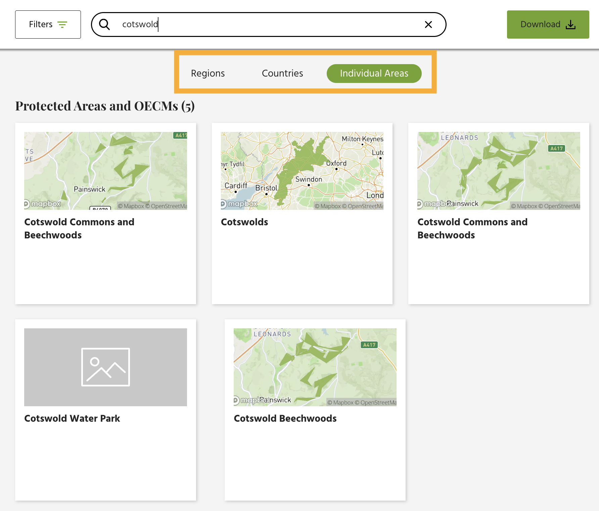
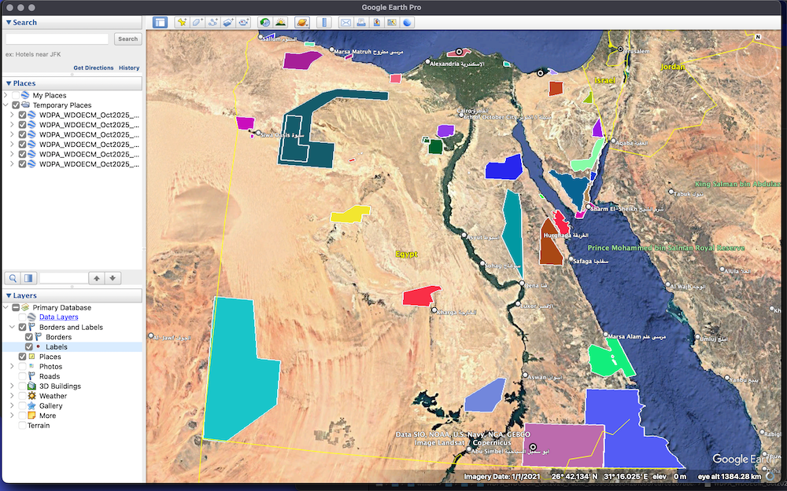
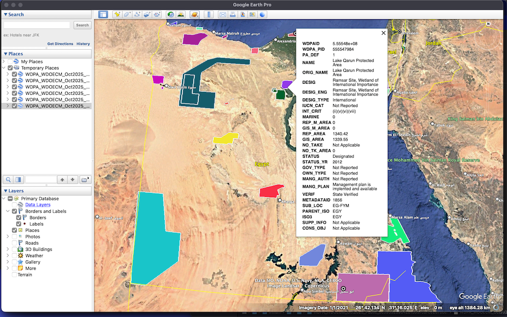

# World Database on Protected and Conserved Areas

## URL

[https://www.protectedplanet.net/en/search-areas?geo\_type=site](https://www.protectedplanet.net/en/search-areas?geo_type=site)

## Description

The World Database on Protected and Conserved Areas (WDPCA) is a comprehensive global database of marine and terrestrial protected areas, with information on over 303,000 protected areas and over 6,500 conserved areas (Other Effective Area-based Conservation Measure, OECM).

The database is used for several reporting mechanisms, including:

* Reporting to the UN on progress towards the 2030 Sustainable Development Goals
* Measuring progress towards [Target 3 of the Kunming-Montreal Global Biodiversity Framework](https://www.cbd.int/gbf/targets/3) (KMGBF), a goal adopted in December 2022 at the 15th Conference of the Parties (COP15) of the Convention on Biological Diversity (CBD).

**Target 3** aims to expand the global network of protected areas and OECMs to 30% coverage, in a way that is “[effectively conserved and managed](https://www.cbd.int/gbf/targets/3)” and “[equitably governed](https://www.cbd.int/gbf/targets/3)”. Effective conservation refers to selecting and managing these areas so that they are well-connected systems, in places that are most important for biodiversity and ecosystems. Equitable governance refers to respecting the rights of indigeous peoples and local communities.

The database is produced and maintained by [Protected Planet](https://www.protectedplanet.net/en), an initiative of the UN Environment Programme's World Conservation Monitoring Centre (UNEP-WCMC) and the International Union for Conservation of Nature ([IUCN](https://iucn.org/)).

#### **What are 'protected areas' and 'conserved areas'?**

A **protected area** is a clearly defined area of land and/or sea especially dedicated to the protection and maintenance of biological diversity, and of natural and associated cultural resources, and managed through legal or other effective means. ([IUCN](https://portals.iucn.org/library/sites/library/files/documents/2008-106.pdf) conference summary 2007, p.9)

A **conserved area** is a geographical area that is not an official protected area, and where conservation of biodiversity is achieved as a by-product of other management. Military reserves (e.g., [Canadian Forces Base Shilo in Manitoba, Canada](https://panorama.solutions/en/solution/natural-areas-canadian-forces-base-shilo-recognized-oecm)) or shipwrecks (e.g., the [Scapa Flow Wreck](https://www.bbc.com/news/articles/c776ng7xe02o) in Scotland, and the [SS Yongala](https://statements.qld.gov.au/statements/103195) in Queensland, Australia) have been defined as conserved areas.

(Conserved areas are formally known as Other Effective Area-based Conservation Measure, OECM, [defined in 2018 at CBD COP14](https://www.cbd.int/doc/decisions/cop-14/cop-14-dec-08-en.pdf). In this guide, we will use "conserved areas" for readability.)

#### Types of data available

WDPCA provides basic facts and geospatial data about the world's protected areas and conserved areas.

The database is known for its comprehensiveness. Note that protected or conserved areas can receive several designations under international conventions and national programmes — the WDPCA lists all of them.

Data are reported at any time by national governments, international convention secretariats, intergovernmental organizations and nonprofits that are responsible for designating areas for protection or conservation.

The following data are available for each area with a unique ID:

* Name
* WDPA ID
* Coverage area in km2
* Designation, IUCN Management category, designation type, designation name, year
* Governance type and management authority (e.g., a government ministry name)
* Management Plan - reported or not, implemented or not. Provides link to management plan if available.
* International criteria

> **💡Recent and announced changes**
>
> Two databases from this website have been newly combined since [October 2025](https://www.protectedplanet.net/en/news-and-stories/introducing-the-wdpca). One of these databases focused on protected areas, and the other on Other Effective Area-based Conservation Measures (OECMs).
>
> A related database (not covered on this page) which focuses on the effectiveness of protection and conservation measures is undergoing redesign and there is [a plan to merge it next year](https://www.protectedplanet.net/en/news-and-stories/launch-of-new-guidance-for-reporting-effectiveness-data-to-protected-planet). (See the effectiveness-focused database at: [Global Database on Protected Area Management Effectiveness, GD-PAME](https://www.protectedplanet.net/en/thematic-areas/protected-areas-management-effectiveness-pame?tab=Data).)

### How to search

By default, using the search bar toward the top of the page would perform a keyword search for Individual Areas (i.e., a protected or conserved area).\
\
If you are seeking information for a continent or country level, select Regions or Country options respectively. These options are shown in the orange rectangle in the screenshot below.

 Example of searching WDPCA for 'Cotswold'

* **Regions** refer to different continents or regional groupings: Asia & Pacific, Africa, Europe, Latin America & Caribbean, Polar, North America, and West Asia
* **Countries**: Data are available for 247 countries and jurisdictions.
* **Individual Areas**: Enter the name of a specific protected or conserved area.

Data are updated every month, with changelogs available on the website's [Update Tracker](https://www.protectedplanet.net/en/monthly-release-news) page.

### Tips for searching for a specific area

#### **1. Understanding multiple entries**

As the same geographical area can receive more than one designation for protection or conservation, each designation will show up as a different entry in the WDPCA database, with different names, IDs and geographical coverage sizes. This could become a source of confusion.

For example, if we enter the keyword "Cotswold" — referring to the protected landscape in England known for a limestone grassland habitat and ancient beechwood — we will see five results. (See the screenshot in the above section.) This is because the area received four national-level designations and a European one.

Of these five entries, two of them have an identical name, "Cotswold Commons and Beechwoods". However, their WDPA IDs (140047 and 10966) and land areas (6.91km2 and 4.13km2) refer to overlapping but different geographic areas. The former is a Site of Special Scientific Interest designated in 1987 and the latter is a National Nature Reserve designated in 1981. (Each designation have different definitions about the land area to be protected.)

**If you are trying to determine whether a plot of land falls within the perimeters of a protected area, these finer details can make a difference.**

#### **2. The keyword search is restrictive**

Note that the search functionality in the WDPCA database is relatively unimaginative. It is recommended that you search for the full name and also make sure to search for variations of the name. For example, there is a marine area in the US commonly known as Pacific Islands Heritage Marine National Monument. Within the WDPCA database, this area appears in two different names (i.e. 2 entries), neither of which includes the word "heritage". If we were to search for the full name that includes the word "heritage", no results will appear at all.\
\
(In case this is of interest, you can find the area in the database as "Pacific Remote Islands Marine National Monument" and "Pacific Remote Islands Marine".)

#### **3. Select 'Regions', 'Countries', 'Individual Areas' appropriately to get the correct information**

For example, if you are looking for protected areas in Egypt, make sure to select 'Countries' before typing your search into the search bar. If you search for Egypt under "Individual Areas", you will get no relevant results. (Instead, you will find 3 American locations whose names include the word "Egypt", and that is not helpful.)

### Downloading the data

After finding the data you need, click the "Download" button on the top-right corner and choose your preferred format: CSV for tabular data, SHP for shapefiles, or file geodatabase.

The download will be in a zip file. When you unzip it, you will find that apart from the data files, a data dictionary and the user manual are included. (The user manual is automatically downloaded in 5 languages / 5 files: English, Spanish, French, Arabic, and Russian.)\
\
• See below on a quick way to view and visualize shapefiles.\
• File geodatabase can be opened in ArcGIS or QGIS. (Bellingcat Toolkit entry on QGIS [here](https://bellingcat.gitbook.io/toolkit/more/all-tools/qgis).)

How to view and visualize shapefiles?

The easiest way would be to use Google Earth Pro. (For those unfamiliar with Google Earth Pro, see the Bellingcat Toolkit entry [here](./#url).)\
\
Assuming that you have the Google Earth Pro software installed, open it, and drag the .shp file onto the globe. Remember to go to the Places panel on the left, and check the box for the .shp files that you just loaded. The areas will now appear on the map.

For example, we downloaded the shapefiles for all protected and conserved areas in Egypt. Due to file size, the download was split into 3 zip files which contain 6 sets of shapefiles. We dragged the 6 .shp files onto Google Earth Pro.

<figure><figcaption></figcaption></figure>

Now you can click on an area to see the data available.

\\

:information\_source: If needed, **you can change the color scheme** within Google Earth Pro. Right-click on the shapefile layer in the Places panel and select "Properties". If you wish to change the color for an individual polygon, click "Get Info". This will open a properties window. Select the "Style, Color" tab to change the colors.

⚠️ **Do not delete the other shapefiles.** The .shp file works with the other files (.shx, .dbf, .prj and others) to form a complete Geographical Information System (GIS) dataset.

## Cost

* [x] Free
* [ ] Partially Free
* [ ] Paid

## Level of difficulty

<table><thead><tr><th data-type="rating" data-max="5"></th></tr></thead><tbody><tr><td>1</td></tr></tbody></table>

## Requirements

* Any modern web browser (e.g., Google Chrome, Microsoft Edge, Mozilla Firefox).
* A basic GIS tool (e.g., Google Earth Pro, or a browser-based tool such as shapefile.io) if working with shapefiles.

## Limitations

#### Lag time

There may be some lag time before newly protected or conserved areas appear on the database. This can be due to delays in reporting from national governments, or time taken for compiling and processing the data, according to the [user manual](https://doi.org/10.34892/CF8P-8D35).

#### **Historical data can be lost**

The database currently does not support seeing changes of protection status over time. If some protected areas are degazetted by national governments, those areas are simply removed from the database.\
\
Legal changes that downgrade, downsize or degazette protected areas are referred to as PADDD events. Examples include:

* In 2007, Oman downsized its Arabian Oryx Sanctuary by 90% to allow for oil prospecting and construction. This downsizing resulted in the sanctuary [losing its Unesco World Heritage List designation](https://whc.unesco.org/en/news/362).
* Between 2010 and 2022, the Democratic Republic of the Congo (DRC) government made [several attempts](https://news.mongabay.com/2025/04/through-colonization-conflicts-and-conservation-100-years-of-virunga-national-park/) to [downgrade](https://www.nationalgeographic.com/science/article/140612-virunga-warden-shooting-congo-gorillas-soco-oil) and [downsize](https://www.bbc.com/news/world-africa-31876577) the Virunga National Park to allow for oil drilling.

In an [Oct 2025 update](https://www.protectedplanet.net/en/news-and-stories/introducing-the-wdpca), Protected Planet stated that it is working towards making historical data available and searchable, a move that would facilitate the tracking and public awareness of PADDD events.

#### Data interpretation would require local context and domain knowledge

The WDPCA is best used for answering _what_ and _where_ questions about protected and conserved areas. However, other inquiries might be out of scope.

* To understand _why_ an area was designated, or which valuable species or ecosystems are within those areas, researchers need to look elsewhere. For example, if an area is designated under the Ramsar Convention on Wetlands, the researcher may need to seek further information on the [Ramsar Convention website](https://www.ramsar.org/).
* Researchers seeking to understand future implications of current policies would need to leverage their understanding of local contexts. For example, once a researcher has seen the information about Pacific Remote Islands Marine National Monument in the WDPCA, this is a starting point for their understanding about recent [policy changes](https://naturalresources.house.gov/news/documentsingle.aspx?DocumentID=417050), [court cases](https://www.theguardian.com/us-news/2025/aug/10/pacific-islands-heritage-monument-trump-administration), or indigenous community perspectives on whether commercial fishing should be allowed there.

## Ethical Considerations

* **Invest time to understand local contexts:** Issues related to protected areas and conserved areas can involve frictions or conflicting interests among indigenous communities, prospective or current commercial entities, and governments at different levels. Researchers would need to invest time to understand local contexts and narratives, in order to ensure that they are interpreting their data in valid and relevant ways. This [brief article from the Global Investigative Journalism Network (GIJN)](https://gijn.org/stories/10-common-mistakes-data-journalism/) gives some pointers on do's and don'ts in data journalism.
* **Understand what the metrics mean:** If using the WDPCA with other datasets that evaluate the effectiveness of measures taken to manage protected and conserved areas (e.g., from the [Global Database on Protected Area Management Effectiveness, GD-PAME](https://www.protectedplanet.net/en/thematic-areas/protected-areas-management-effectiveness-pame?tab=Data)), make sure to understand what the metrics mean, and whether and how data should be appropriately compared across years or geographies.

## Similar Tools

Researchers can use WDPCA data in conjunction with several other free data sources.

The following data sources provide detailed maps or satellite data:

* ArcGIS [Living Atlas of the World](https://livingatlas.arcgis.com/en/home/), provided by Esri
* [Global Forest Watch](https://www.globalforestwatch.org/map/) (see Bellingcat Toolkit guide [here](https://bellingcat.gitbook.io/toolkit/more/all-tools/global-forest-watch))

Key Biodiversity Areas (KBAs) are sites of global significance for biodiversity, based on scientific criteria. KBAs are designated by IUCN, and may or may not be protected areas.

* [World Database of Key Biodiversity Areas](https://www.keybiodiversityareas.org/) (WDKBA), managed by BirdLife International

For information about species and where they are, please see:

* [IUCN Red List of Threatened Species](https://www.iucnredlist.org/)
* Rarity-weighted richness map (IUCN [dataset ](./#url)[download page](https://www.iucnredlist.org/resources/other-spatial-downloads))

## Articles

How Much Can Forests Fight Climate Change? A Sensor in Space Has Answers. _New York Times._ (Dec 8, 2023) [https://www.nytimes.com/2023/12/08/climate/forests-trees-climate-change.html](https://web.archive.org/web/20231210082509/https://www.nytimes.com/2023/12/08/climate/forests-trees-climate-change.html). (Archive link: [https://web.archive.org/web/20231210082509/https://www.nytimes.com/2023/12/08/climate/forests-trees-climate-change.html](https://web.archive.org/web/20231210082509/https://www.nytimes.com/2023/12/08/climate/forests-trees-climate-change.html))

Countries fall short of U.N. pledge to protect 10% of the ocean by 2020. _Mongabay._ (2 Dec 2020). [https://news.mongabay.com/2020/12/countries-fall-short-of-u-n-pledge-to-protect-10-of-the-ocean-by-2020/](https://news.mongabay.com/2020/12/countries-fall-short-of-u-n-pledge-to-protect-10-of-the-ocean-by-2020/)

## Guides

#### Understanding the world's progress towards the 2030 goal 'Target 3'

Protected Planet Report 2024. Protected Planet. [https://digitalreport.protectedplanet.net/](https://digitalreport.protectedplanet.net/)

#### Resources with a Regional Focus

IUCN - Asia - Protected and Conserved Areas. [https://iucn.org/our-work/region/asia/our-work/protected-and-conserved-areas](https://iucn.org/our-work/region/asia/our-work/protected-and-conserved-areas)

The Latin America and Caribbean Protected Planet Report 2020. (28 April 2021) [https://iucn.org/news/protected-areas/202104/latin-america-and-caribbean-protected-planet-report-2020](https://iucn.org/news/protected-areas/202104/latin-america-and-caribbean-protected-planet-report-2020)

#### User Manual for the World Database on Protected and Conserved Areas

User Manual for the World Database on Protected Areas and World Database on Other Effective Area-based Conservation Measures. 1.6. United Nations Environment Programme World Conservation Monitoring Centre (2019) . [https://doi.org/10.34892/CF8P-8D35](https://doi.org/10.34892/CF8P-8D35)

(Two previous databases were merged and relaunched in late 2025. A new user manual has not yet been made available.)

## Tool provider

Protected Planet, a joint initiative from:

* UN Environment Programme — World Conservation Monitoring Centre (UNEP-WCMC), in Cambridge, UK, [https://www.unep-wcmc.org/en](https://www.unep-wcmc.org/en);
* International Union for Conservation of Nature (IUCN), headquartered in Gland, Switzerland, [https://iucn.org/](https://iucn.org/)

## Advertising Trackers

* [ ] This tool has not been checked for advertising trackers yet.
* [x] This tool has implemented optional tracking cookies, which users can choose to disable.
* [ ] This tool does not appear to use tracking cookies.

| Page maintainer           |
| ------------------------- |
| Bellingcat Volunteer Team |
|                           |
