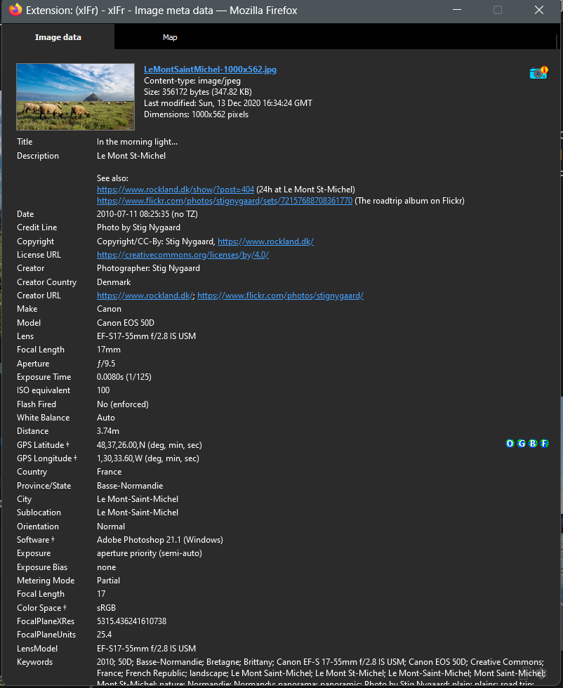

# xIFr

## URL

[https://addons.mozilla.org/en-US/firefox/addon/xifr/](https://addons.mozilla.org/en-US/firefox/addon/xifr/) | [https://github.com/StigNygaard/xIFr](https://github.com/StigNygaard/xIFr)

## Description

xlfr is a Firefox extension designed to extract and display EXIF, IPTC, and XMP metadata from an image. These metadata can provide valuable insights on camera settings, timestamps, location (GPS data), copyright information, and editing history. If available, metadata can be useful for verifying the authenticity of images, understanding their origins, and analyzing their context.

xIfr comes with a "Deep Search" feature that allows to access metadata from images embedded in layers, set as backgrounds, or otherwise blurred or obscured.&#x20;

Geotagged images can be viewed on OpenStreetMap, [Google Maps](https://bellingcat.gitbook.io/toolkit/more/all-tools/google-maps), [Bing Maps](https://bellingcat.gitbook.io/toolkit/more/all-tools/bing-maps), and Flickr.

**EXIF, IPTC, XMP**

* [**EXIF (Exchangeable Image File Format)**](https://en.wikipedia.org/wiki/Exif)**:** Includes technical details about the image, such as camera model, exposure settings, and GPS coordinates (if available).
* [**IPTC (International Press Telecommunications Council)**](https://en.wikipedia.org/wiki/IPTC_Information_Interchange_Model)**:** Contains information added by users or software, such as titles, captions, copyright details, and keywords.
* [**XMP (Extensible Metadata Platform)**](https://en.wikipedia.org/wiki/Extensible_Metadata_Platform)**:** An Adobe format used for embedding metadata about the image's editing history, licensing, and other descriptive information.

## How to Use

Right click an image and select "View EXIF data" next to the icon with a camera and a hint bubble:

<figure><figcaption></figcaption></figure>

A window will open containing the metadata:

<figure><figcaption>
A window will open containing the metadata.
</figcaption></figure>

<figure><figcaption>
The Map tab will display the image coordinates if available.
</figcaption></figure>

**Tip:** Some websites override the browser's default right-click context menu. You can bypass this by holding down the Shift key while right-clicking to access the browser's native context menu.

## Cost

* [x] Free
* [ ] Partially Free
* [ ] Paid

The extension is free and open source.

## Level of difficulty

<table><thead><tr><th data-type="rating" data-max="5"></th></tr></thead><tbody><tr><td>1</td></tr></tbody></table>

## Requirements

* Firefox browser

## Limitations

* The add-on is only available in Firefox.
* xIFr primarily supports extracting metadata from JPEG images. When webpages provide multiple image formats (e.g., AVIF, WebP, and JPEG), modern browsers often display non-JPEG formats. However, xIFr attempts to detect and parse metadata from an available JPEG variant of the image when possible.

## Ethical Considerations

Metadata can expose sensitive information such as location data or device details. Make sure to respect privacy rights.

## Guides and articles

Stig Nygaard (tool developer): XIFr -[ Getting started](https://www.rockland.dk/xIFr/start/)

## Tool provider

Developed and maintained by Stig Nygaard ([Mastodon](https://mastodon.world/@stignygaard)), a developer and photographer from Denmark.

## Advertising Trackers

* [ ] This tool has not been checked for advertising trackers yet.
* [ ] This tool uses tracking cookies. Use with caution.
* [x] This tool does not appear to use tracking cookies.

| Page maintainer           |
| ------------------------- |
| Bellingcat Volunteer Team |
