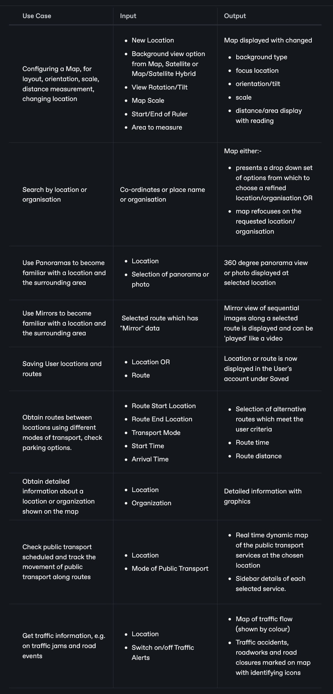
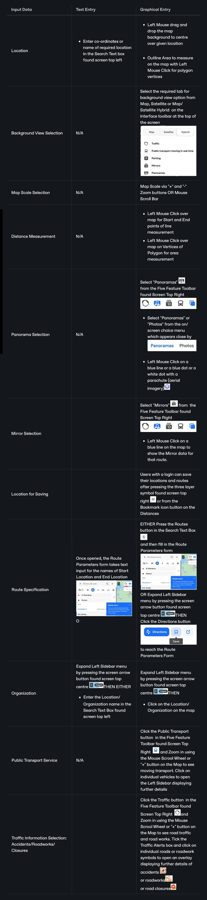
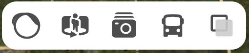
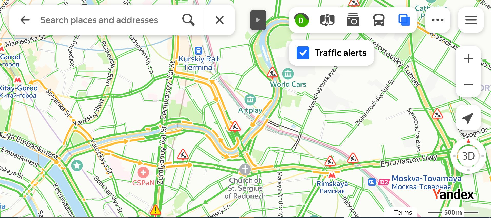
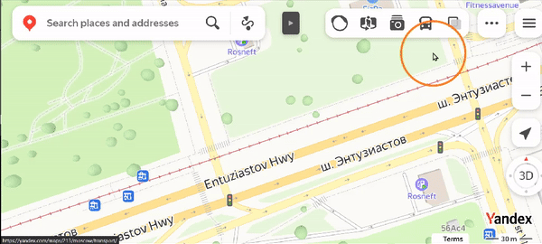

# Yandex Maps

## URL

[https://yandex.com/maps/](https://yandex.com/maps/)

## Description

<figure><figcaption>
"<strong>MIRRORS" FEATURE IN YANDEX MAPS, SHOWING SERIES OF IMAGES TAGGED TO LOCATIONS UPLOADED BY A PEDESTRIAN &#x26; THE ABILITY TO 'PLAY' THEM IN SEQUENCE AS A JERKY VIDEO</strong>
</figcaption></figure>

Yandex Maps is a mapping service provided on the Russian-owned integrated Yandex platform, which also offers services on Image Search, Video Search, Translation/Interpretation, Weather,... Its stated focus is primarily on cities (but remote areas seem covered to a good standard also), and also organisations. Its global data is generally stronger and more detailed around Russia, Eastern Europe and Asia, in contrast with Google's mapping tools, which are stronger in Western Europe and North America. Yandex Maps has a different interface from Google mapping tools, most noticeably:

<table><thead><tr><th width="190">Google Feature</th><th>Yandex Maps Feature</th></tr></thead><tbody><tr><td><strong>No Google "Yellow Man" to fix a StreetView location:</strong></td><td>The absence of the Google 'yellow man' figure to drag and drop into a location as a means of viewing "Streetview" imagery stored there.</td></tr><tr><td><strong>Satellite Sources:</strong></td><td>Some Yandex Maps imagery clearly differs from that provided by platforms like Google, though Yandex does not publicly disclose its satellite providers.</td></tr><tr><td><strong>"StreetView" Type Route "Videos"</strong>:</td><td>The presence of "Mirrors" in Yandex Maps, i.e. sequences of Street level images which can be run like a video of a journey along a route. These are posted by users, and are generally more like the <a href="https://bellingcat.gitbook.io/toolkit/more/all-tools/mapillary">Mapillary</a> app, i.e. taken with a small field of view, usually from either a car dashcam showing only the road ahead in the direction of travel or a mobile phone moving with a pedestrian on a footpath. Yandex Maps allows filtering between Car and Pedestrian "Mirrors".</td></tr><tr><td><strong>Geographic Orientation on Imagery:</strong></td><td>The presence of Street Panoramas and Photos in Yandex Maps, which are similar to Google mapping tools functionality. HOWEVER, Yandex Maps includes graphic indicators on the direction and field of view of the imagery posted, which is not available for Google photospheres in Google Earth, and can be helpful for geolocation research.</td></tr><tr><td><strong>Links and Embed Code for Panoramas:</strong></td><td>Yandex Maps provides links and embed code to allow easy reference to a given panorama.</td></tr><tr><td><strong>Restricted Historical Imagery:</strong></td><td>Historical image data is available, as in Google tools, and it can be filtered by year, BUT it is generally restricted to one undated image per year without information which would pinpoint the season.</td></tr><tr><td><strong>Categorised Aerial Views:</strong></td><td>Yandex distinguishes surface photography from airborne photography, e.g. drones, hot air balloons, aircraft through the use of separate icons for each.</td></tr><tr><td><strong>User Storage re Calendar and Business:</strong></td><td>Yandex promotes user interaction, where users can store and open online appointments and bookings, promote their businesses, post advertisements, create custom maps, post reviews, upload photos and even edit the map.</td></tr><tr><td><strong>Supported User Map Edit:</strong></td><td>Registered Yandex Users are also provided with a mobile phone app and a training video on how to create and upload photos of cities or streets which don't yet have local imagery on Yandex. These are moderated after uploading, then added to Yandex Maps (see <a href="https://www.yandex.com/support/mapeditor/start_moder.html">https://www.yandex.com/support/mapeditor/start_moder.html</a> for details).</td></tr><tr><td><strong>Moving Transport:</strong></td><td>Yandex includes Real Time Public Transport simulation.</td></tr></tbody></table>


Some map data is unavailable in Yandex Maps, e.g. some contemporary data on Ukraine, such that much of the only available data is dated around 2011 and no later on Yandex Maps.


### Open Source Research with Yandex Maps: Use Cases, Data Input, Yandex Map Outputs, How to Enter Data... (Click Each Tab for More Information)



<figure><figcaption>
<strong>YANDEX MAPS USE CASES WITH CORRESPONDING DATA INPUT AND OUTPUT</strong>
</figcaption></figure>



* New Location
* Background view option from Map, Satellite or Map/Satellite Hybrid
* View Rotation/Tilt
* Map Scale
* Start/End of Ruler
* Area to measure
* Co-ordinates or place name or organisation
* Selection of panorama or photo
* Selected route which has "Mirror" data
* Route Start Location and Route End Location, Polygon route vertices
* Transport Mode
* Start Time
* Arrival Time
* Mode of Public Transport
* Switch on/off Traffic Alerts



* Map displayed with changed background type, focus location, orientation/tilt, scale, distance/area display with reading
* 360 degree panorama view or photo displayed at selected location
* Mirror view of sequential images along a selected route is displayed and can be 'played' like a video
* Selection of alternative routes which meet the user criteria
* Route time
* Route distance
* Real time dynamic map of the public transport services at the chosen location
* Sidebar details of each selected service.
* Map of traffic flow (shown by colour)
* Traffic accidents, roadworks and road closures marked on map with identifying icons



<figure><figcaption>
<strong>DATA ENTRY INPUT OPTIONS FOR YANDEX MAPS</strong>
</figcaption></figure>



### Yandex Maps Interface


Many Toolbar Items and Features are only available at certain levels of map Zoom settings. e.g. Mirrors feature is only invoked upon zooming in on the map.


Yandex Maps offers FIVE VIEWS from the five feature icon toolbar at screen top right:

<figure><figcaption>
5 FEATURE TOOLBAR AT SCREEN TOP RIGHT
</figcaption></figure>



<figure><figcaption>
<strong>TRAFFIC FLOW IS INDICATED BY COLOUR (GREEN IS FREE-FLOWING, AMBER IS SLOW, RED IS A JAM)</strong> <strong>ROADWORKS ARE SHOWN WITH THE RED TRIANGLE WITH WORKMAN SIGN</strong>
</figcaption></figure>



Street panoramas and photos (rotating person icon):

<figure><figcaption>
<strong>PANORAMAS SHOW AS BLUE DOTS AND LINES. AIRBORNE PANORAMAS ARE MARKED WITH THE BALLOON ICON</strong>
</figcaption></figure>



<figure><figcaption>
"<strong>MIRRORS" FEATURE IN YANDEX MAPS, SHOWING SERIES OF IMAGES TAGGED TO LOCATIONS UPLOADED BY A PEDESTRIAN &#x26; THE ABILITY TO 'PLAY' THEM IN SEQUENCE AS A JERKY VIDEO</strong>
</figcaption></figure>

"Mirrors" = Uploaded image sequences



Public Transport (vehicle icon):

<figure><figcaption>
<strong>EACH MOVING VEHICLE'S ROUTE CAN BE ACCESSED WITH LEFT MOUSE CLICK</strong>
</figcaption></figure>



<figure><figcaption>
USE TABS TO SELECT ONE OF 3 BACKGROUND VIEWS: MAP, SATELLITE OR HYBRID
</figcaption></figure>



## Cost

* [ ] Free
* [x] Partially Free
* [ ] Paid

Basic Yandex Maps functionality can be used for free, but there is a Yandex Plus service which is a subscription service which will block users who are accessing it through a VPN. Yandex service offerings can be accessed here: [https://yandex.com/support/id/subscriptions.html](https://yandex.com/support/id/subscriptions.html)

## Level of difficulty

<table><thead><tr><th data-type="rating" data-max="5"></th></tr></thead><tbody><tr><td>2</td></tr></tbody></table>

Yandex Maps is relatively easy to use. It can be confusing that many features only appear at certain levels of Zoom magnification, rather than being shown a feature 'greyed out' as available but not in the current interface mode. Yandex features compare well with Google Earth tools, so only those users who are accustomed to the Google interfaces may have initial difficulty switching to Yandex Maps. The Help documentation provided for users of Yandex Maps explains concepts very clearly and provides case studies and examples.

## Requirements


Yandex Maps tracks users, according to tests carried out by the author, and should therefore be used with a VPN when conducting Open Source research for reasons of Operational Security.


Yandex Maps can be used without an account, but some functionality relating to writing reviews, editing the map, uploading imagery, etc. is only available upon login.

## Limitations

Limited current photographic content is available in Yandex Maps in Ukraine, where the most recent of many (if not all) of the panoramas available are dated around 2011. By contrast, other countries in the region often have a range of dates available on some panorama content, and much of the content is less than 5 years old.

## Ethical Considerations

The ethical considerations in using Yandex Maps are those of any other mapping service. It is potentially more intrusive than similar tools because of its emphasis on personal appointments, advertising, etc.

## Guide


English language tutorials on using Yandex Maps for Open Source Research applications are not readily available, and much material focuses on smartphone navigational use.


Brief Guide: [https://www.youtube.com/watch?v=6dSJO4zqO8g](https://www.youtube.com/watch?v=6dSJO4zqO8g)

Yandex Maps API: [https://yandex.com/maps-api/docs](https://yandex.com/maps-api/docs)

## Tool provider

Yandex LLC. Headquarters in Russia

NB Yandex was sold in 2024, so observers are checking to see if this affects data availability going forward. See [https://www.reuters.com/technology/yandex-nv-agrees-52-bln-sale-russian-assets-investor-consortium-2024-02-05/](https://www.reuters.com/technology/yandex-nv-agrees-52-bln-sale-russian-assets-investor-consortium-2024-02-05/)

## Advertising Trackers

* [ ] This tool has not been checked for advertising trackers yet.
* [x] This tool uses tracking cookies. Use with caution.
* [ ] This tool does not appear to use tracking cookies.

The author's own checks in March 2026 showed Yandex using trackers.

| Page maintainer:- |
| ----------------- |
| Sophie Tedling:   |
|                   |
