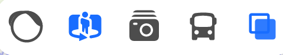
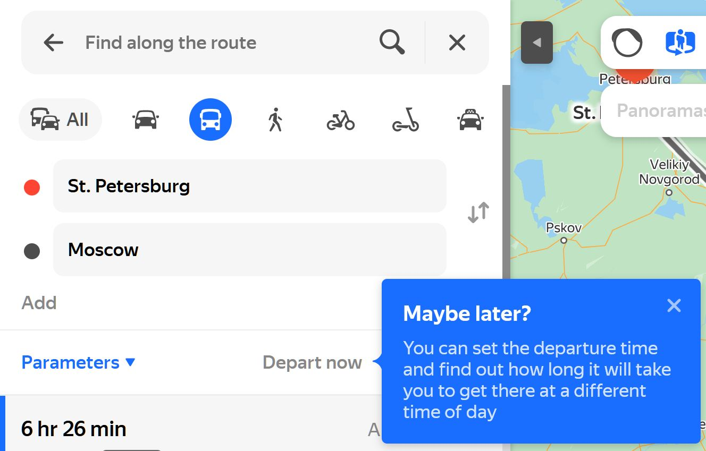
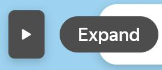

# Yandex Maps Supplementary Material

| Use Case                                                                                   | Input                                                                                                                                                                                                         | Output                                                                                                                                                                                         |
| ------------------------------------------------------------------------------------------ | ------------------------------------------------------------------------------------------------------------------------------------------------------------------------------------------------------------- | ---------------------------------------------------------------------------------------------------------------------------------------------------------------------------------------------- |
| Configuring a Map, for layout, orientation, scale, distance measurement, changing location | <ul><li>New Location </li><li>Background view option from Map, Satellite or Map/Satellite Hybrid </li><li>View Rotation/Tilt </li><li>Map Scale </li><li>Start/End of Ruler</li><li>Area to measure</li></ul> | 
Map displayed with changed
<ul><li>background type</li><li>focus location</li><li>orientation/tilt</li><li>scale</li><li>distance/area display with reading</li></ul>                    |
| Search by location or organisation                                                         | Co-ordinates or place name or organisation                                                                                                                                                                    | 
Map either:-
<ul><li>presents a drop down set of options from which to choose a refined location/organisation OR</li><li>map refocuses on the requested location/organisation </li></ul> |
| Use Panoramas to become familiar with a location and the surrounding area                  | <ul><li>Location</li><li>Selection of panorama or photo</li></ul>                                                                                                                                             | 360 degree panorama view or photo displayed at selected location                                                                                                                               |
| Use Mirrors to become familiar with a location and the surrounding area                    |  Selected route which has "Mirror" data                                                                                                                                                                       | Mirror view of sequential images along a selected route is displayed and can be 'played' like a video                                                                                          |
| Saving User locations and routes                                                           | <ul><li>Location OR</li><li>Route</li></ul>                                                                                                                                                                   | Location or route is now displayed in the User's account under Saved                                                                                                                           |
| Obtain routes between locations using different modes of transport, check parking options. | <ul><li>Route Start Location</li><li>Route End Location</li><li>Transport Mode</li><li>Start Time</li><li>Arrival Time</li></ul>                                                                              | <ul><li>Selection of alternative routes which meet the user criteria</li><li>Route time</li><li>Route distance</li></ul>                                                                       |
| Obtain detailed information about a location or organization shown on the map              | <ul><li>Location</li><li>Organization</li></ul>                                                                                                                                                               | Detailed information with graphics                                                                                                                                                             |
| Check public transport scheduled and track the movement of public transport along routes   | <ul><li>Location</li><li>Mode of Public Transport</li></ul>                                                                                                                                                   | <ul><li>Real time dynamic map of the public transport services at the chosen location</li><li>Sidebar details of each selected service.</li></ul>                                              |
| Get traffic information, e.g. on traffic jams and road events                              | <ul><li>Location</li><li>Switch on/off Traffic Alerts</li></ul>                                                                                                                                               | <ul><li>Map of traffic flow (shown by colour)</li><li>Traffic accidents, roadworks and road closures marked on map with identifying icons</li></ul>                                            |

| Input Data                                                  | Text Entry                                                                                                                                                                                                                                                                   | Graphical Entry                                                                                                                                                                                                                                                                                                                                                                                                                                                                                                                                                                                                                                          |
| ----------------------------------------------------------- | ---------------------------------------------------------------------------------------------------------------------------------------------------------------------------------------------------------------------------------------------------------------------------- | -------------------------------------------------------------------------------------------------------------------------------------------------------------------------------------------------------------------------------------------------------------------------------------------------------------------------------------------------------------------------------------------------------------------------------------------------------------------------------------------------------------------------------------------------------------------------------------------------------------------------------------------------------- |
| Location                                                    | 

<ul><li>Enter co-ordinates or name of required location in the Search Text box found screen top left</li></ul>

                                                                                                                                                 | <ul><li>Left Mouse drag and drop the map background to centre over given location</li></ul><ul><li>Outline Area to measure on the map with Left Mouse Click for polygon vertices</li></ul>                                                                                                                                                                                                                                                                                                                                                                                                                                                               |
| Background View Selection                                   | N/A                                                                                                                                                                                                                                                                          | Select the required tab for background view option from Map, Satellite or Map/Satellite Hybrid  on the interface toolbar at the top of the screen                                                                                                                                                                                                                                                                                                                                                                                                                                                     |
| Map Scale Selection                                         | N/A                                                                                                                                                                                                                                                                          | Map Scale via "+" and "-" Zoom buttons OR Mouse Scroll Bar                                                                                                                                                                                                                                                                                                                                                                                                                                                                                                                                                                                               |
| Distance Measurement                                        | N/A                                                                                                                                                                                                                                                                          | <ul><li>Left Mouse Click over map for Start and End points of line measurement</li><li>Left Mouse Click over map on Vertices of Polygon for area measurement</li></ul>                                                                                                                                                                                                                                                                                                                                                                                                                                                                                   |
| Panorama Selection                                          | N/A                                                                                                                                                                                                                                                                          | 

Select "Panoramas" 

from the Five Feature Toolbar found Screen Top Right  
<ul><li>Select "Panoramas" or "Photos" from the on/screen choice menu which appears close by</li></ul><ul><li>Left Mouse Click on a blue line or a blue dot or a white dot with a parachute (aerial imagery)</li></ul>                                                                                                       |
| Mirror Selection                                            | 

                                                                                                                                                                                                                                                               | 
Select "Mirrors"  from  the Five Feature Toolbar found Screen Top Right
<ul><li>Left Mouse Click on a blue line on the map to show the Mirror data for that route.</li></ul>                                                                                                                                                                                                                                                                                                                                                  |
| Location for Saving                                         |                                                                                                                                                                                                                                                                              | Users with a login can save their locations and routes after pressing the three layer symbol found screen top right  or from the Bookmark icon button on the Distances                                                                                                                                                                                                                                                                                                                                                                                                                  |
| Route Specification                                         | 
Once opened, the Route Parameters form takes text input for the names of Start Location and End Location

O
                                                                        | 
EITHER Press the Routes button in the Search Text Box 

and then fill in the Route Parameters formOR Expand Left Sidebar menu by pressing the screen arrow button found screen top centre THEN

Click the Directions button 

to reach the Route Parameters Form
                                              |
| Organization                                                | 
Expand Left Sidebar menu by pressing the screen arrow button found screen top centre THEN EITHER
<ul><li>Enter the Location/Organization name in the Search Text Box found screen top left </li></ul> | 
Expand Left Sidebar menu by pressing the screen arrow button found screen top centre THEN
<ul><li>Click on the Location/Organization on the map</li></ul>                                                                                                                                                                                                                                                                                                                                                                                                                         |
| Public Transport Service                                    | N/A                                                                                                                                                                                                                                                                          | Click the Public Transport button  in the Five Feature Toolbar found Screen Top Right   and Zoom in using the Mouse Scrool Wheel or "+" button on the Map to see moving transport. Click on individual vehicles to open the Left Sidebar displaying further details                                                                                                                                                                                                                                                                                                                    |
| Traffic Information Selection: Accidents/Roadworks/Closures |                                                                                                                                                                                                                                                                              | 
Click the Traffic button  in the Five Feature Toolbar found Screen Top Right  and Zoom in using the Mouse Scrool Wheel or "+" button on the Map to see road traffic and road works. Tick the Traffic Alerts box and click on individual roads or roadwork symbols to open an overlay displaying further details of accidents  

or roadworks 

or road closures
 |

<table><thead><tr><th width="129">Feature</th><th width="191">Google Mapping Tools</th><th>Yandex Maps</th></tr></thead><tbody><tr><td>Fixing Street View Location</td><td>User drops 'Yellow Man' icon at the required location</td><td>User zooms in on required location</td></tr><tr><td>Satellite Imagery</td><td>Mix of sources, not predominantly Eastern</td><td>Unique Russian sources</td></tr><tr><td>"Street View" Format</td><td>Still imagery, mix of panoramas and photos, without orientation information</td><td>"Mirrors" are a street view in Yandex Maps, i.e. sequences of Street level images which can be run like a video of a journey along a route. These are posted by users, and are generally more like the <a href="https://www.mapillary.com/app/?lat=20&#x26;lng=0&#x26;z=1.5">Mapillary app</a>, i.e. taken with a small field of view, usually from either a car dashcam showing only the road ahead in the direction of travel or a mobile phone moving with a pedestrian on a footpath. Yandex Maps allows filtering between Car and Pedestrian "Mirrors".</td></tr><tr><td><strong>Geographic Orientation on Imagery</strong></td><td>N/A</td><td>The presence of Street Panoramas and Photos in Yandex Maps, which are similar to Google mapping tools functionality HOWEVER Yandex Maps includes graphic indicators on the direction and field of view of the imagery posted, which is not available for Google photospheres in Google Earth, and helps greatly with geolocation research.</td></tr><tr><td><strong>Links and Embed Code for Panoramas:</strong></td><td>Google's support for users wanting links and embed code to use there maps is less user friendly</td><td>Yandex Maps provides links and embed code to allow easy reference to a given panorama.</td></tr><tr><td><strong>Restricted Historical Imagery</strong></td><td>Google presents historical image data, often more than one image per year</td><td>Historical image data is available, as in Google tools, and it can be filtered by year, BUT it is generally restricted to one undated image per year without information which would pinpoint the season.</td></tr><tr><td><strong>Categorised Aerial Views</strong></td><td>Google does not distinguish surface photography from airborne photography</td><td>Yandex distinguishes surface photography from airborne photography, e.g. drones, hot air balloons, aircraft through the use of separate icons for each.</td></tr><tr><td><strong>User Storage re Calendar and Business</strong></td><td>Google  does not store appointments, but can promote businesses</td><td>Yandex promotes user interaction, where users can store and open online appointments and bookings, promote their businesses, post advertisements, create custom maps, post reviews, upload photos and even edit the map.</td></tr><tr><td><strong>Supported User Map Edit</strong></td><td>Google users can add information to its maps, but support is not particularly user friendly and 'mirror' information is not included.</td><td>Registered Yandex Users are also provided with a mobile phone app and a training video on how to create and upload photos of cities or streets which don't yet have local imagery on Yandex. These are moderated after uploading, then added to Yandex Maps.</td></tr><tr><td><strong>Moving Transport</strong></td><td>N/A</td><td>Yandex includes Real Time Public Transport route simulation with timetables</td></tr></tbody></table>

<figure><figcaption>
"<strong>MIRRORS" FEATURE IN YANDEX MAPS, SHOWING SERIES OF IMAGES TAGGED TO LOCATIONS UPLOADED BY A PEDESTRIAN &#x26; THE ABILITY TO 'PLAY' THEM IN SEQUENCE AS A JERKY VIDEO</strong>
</figcaption></figure>

Yandex Maps is a mapping service provided on the Russian-owned integrated Yandex platform, which also offers services on Image Search, Video Search, Translation/Interpretation, Weather,... Its stated focus is primarily on cities (but remote areas seem covered to a good standard also), and also organisations. Its global data is generally stronger and more detailed around Russia, Eastern Europe and Asia, in contrast with Google's mapping tools, which are stronger in Western Europe and North America. Yandex Maps has a different interface from Google mapping tools, most noticeably:

* **No Google "Yellow Man" to fix a StreetView location:** the absence of the Google 'yellow man' figure to drag and drop into a location as a means of viewing "Streetview" imagery stored there.
* **Satellite Sources:** Some Yandex Maps imagery clearly differs from that provided by platforms like Google, though Yandex does not publicly disclose the satellite proviers.&#x20;
* **"StreetView" Type Route "Videos"**: the presence of "Mirrors" in Yandex Maps, i.e. sequences of Street level images which can be run like a video of a journey along a route. These are posted by users, and are generally more like the [Mapillary app](https://www.mapillary.com/app/?lat=20\&lng=0\&z=1.5), i.e. taken with a small field of view, usually from either a car dashcam showing only the road ahead in the direction of travel or a mobile phone moving with a pedestrian on a footpath. Yandex Maps allows filtering between Car and Pedestrian "Mirrors".
* **Geographic Orientation on Imagery:** the presence of Street Panoramas and Photos in Yandex Maps, which are similar to Google mapping tools functionality. HOWEVER, Yandex Maps includes graphic indicators on the direction and field of view of the imagery posted, which is not available for Google photospheres in Google Earth, and helps greatly with geolocation research.
* **Links and Embed Code for Panoramas:** Yandex Maps provides links and embed code to allow easy reference to a given panorama.
* **Restricted Historical Imagery:** historical image data is available, as in Google tools, and it can be filtered by year, BUT it is generally restricted to one undated image per year without information which would pinpoint the season.
* **Categorised Aerial Views:** Yandex distinguishes surface photography from airborne photography, e.g. drones, hot air balloons, aircraft through the use of separate icons for each.
* **User Storage re Calendar and Business:** Yandex promotes user interaction, where users can store and open online appointments and bookings, promote their businesses, post advertisements, create custom maps, post reviews, upload photos and even edit the map.
* **Supported User Map Edit:** Registered Yandex Users are also provided with a mobile phone app and a training video on how to create and upload photos of cities or streets which don't yet have local imagery on Yandex. These are moderated after uploading, then added to Yandex Maps.
* **Moving Transport:** Yandex includes Real Time Public Transport simulation.
