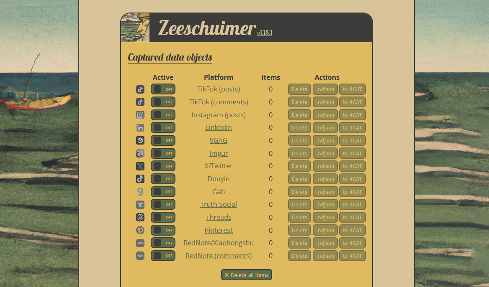

# Zeeschuimer

## URL

**GitHub:** [https://github.com/digitalmethodsinitiative/zeeschuimer](https://github.com/digitalmethodsinitiative/zeeschuimer) – (Firefox extension download and source code)\
**Tool page:** [Digital Methods Initiative – Zeeschuimer](https://medialab.sciencespo.fr/en/tools/zeeschuimer/)\
(Reviewed Version: 1.13.1 on 06. Aug 2025)

## Description

Zeeschuimer (Dutch for “sea foamer”) is a browser extension that **captures data from social media platforms as you browse them**, storing the posts you see for later analysis It was developed for researchers and journalists who need to study content on platforms that lack accessible data export tools or APIs – for example, TikTok or certain parts of Instagram where traditional scraping is difficult.&#x20;

By **logging the posts and other items that load in your browser feed**, Zeeschuimer lets you build a dataset of exactly what was shown to you during a browsing session.

### What problem does it solve?

Major social‑media platforms have closed or severely limited their public APIs, making it difficult to obtain data for research and journalism. Web‑scraping libraries often struggle with constantly changing front‑end code or risk violating terms of service. Zeeschuimer addresses this challenge by **recording** rather than scraping – it captures the requests and responses your browser makes as you scroll through a platform and extracts the relevant post or comment information.     &#x20;

The developers [describe](https://github.com/digitalmethodsinitiative/zeeschuimer) that _“the extension does not interfere with normal browsing and never uploads data automatically; it uses the browser’s WebRequest API to locally intercept and parse the data that these platforms send to your browser”._ In other words, it behaves like a passive observer: recording network calls for posts as you scroll, without modifying what you see or alerting the platform.&#x20;

\
This approach allows researchers to collect data from platforms that have no [public API,](https://www.techtarget.com/searchapparchitecture/definition/open-API-public-API) such as TikTok and Instagram, while keeping control over what is collected and when it is exported. Because the extension stores data locally and only uploads when explicitly instructed, it also helps researchers respect privacy and [institutional data‑protection rules](https://gdprhub.eu/Data_Protection_in_the_European_Union).

#### How does it work?

1. **Installation** – Signed `.xpi` files are provided on [Zeeschuimer’s GitHub releases page](https://github.com/digitalmethodsinitiative/zeeschuimer/releases/). According to the[ Digital Methods Initiative](https://www.digitalmethods.net/Dmi/ToolZeeschuimer), these files can be installed in any Firefox‑based browser. Researchers who need the very latest version can clone the repository and run it from the Firefox debugging console.
2. **Monitoring and recording** – Once installed, the extension runs in the background while you browse a supported social‑media site. Zeeschuimer monitors all traffic between the browser and the platform and extracts the content you encounter – posts, comments, account information, etc. NodeXL’s blog explains that the extension uses the browser’s record feature to write all traffic to a local file, making this method distinct from web scraping.
3. **Manual data collection** – Data collection is manual. When you open a page on TikTok, Instagram or another supported platform, you simply scroll through the feed or search results; Zeeschuimer captures the content that is loaded. The [NodeXL tutorial](https://www.smrfoundation.org/nodexl/tutorials/instagram-post-networks/) notes that users can perform multiple scrolls to gather larger samples – for example, retrieving roughly 1,000 posts by repeatedly scrolling down a profile or hashtag feed.
4. **Exporting data** – When you are finished collecting, open Zeeschuimer’s pop‑up and export the session. The extension can output a [newline‑delimited JSON (ndjson) file](https://ndjson.org/). You can either upload this file directly into a 4CAT instance for analysis or convert it to CSV via a companion tool such as [**Zeehaven**](https://github.com/PublicDataLab/zeehaven), which provides a drag‑and‑drop conversion service. Tools like [NodeXL](https://www.smrfoundation.org/2025/04/25/social-media-data-collection-via-zeeschuimer-data-analysis-via-nodexl-pro-data-import-import-from-file/) include importers that recognise Zeeschuimer files and automatically configure the fields.
5. **Analysis** – Once the data is in CSV or JSON format, you can analyse it using 4CAT, NodeXL, or other software. The [NodeXL tutorial](https://www.smrfoundation.org/2025/04/25/social-media-data-collection-via-zeeschuimer-data-analysis-via-nodexl-pro-data-import-import-from-file/) demonstrates how to import a Zeeschuimer file into NodeXL, construct network edges (for example, post‑author to mentioned user), and then run automated analyses

In practical terms, this means a journalist could **capture a personalized feed or search results,** preserving not just URLs but metadata like timestamps, captions, and comments, and then analyze that collection for patterns (such as which accounts or themes dominated the feed).

**Supported Platforms:** As of 2025, Zeeschuimer works with a range of social networks and content-sharing platforms, including:

* **TikTok** (videos/posts and comments)
* **Instagram** (posts only)
* **X (Twitter)**
* **LinkedIn**
* **9gag**
* **Imgur**
* **Douyin** (Chinese TikTok)
* **Gab**
* **Truth Social**
* **Pinterest**
* **RedNote** [(Xiaohongshu)](https://medialab.sciencespo.fr/en/tools/zeeschuimer/)

This list is actively maintained and may expand. The extension’s code must be updated for each platform as their website structures change, so support can occasionally break when a site is redesigned. &#x20;

### In short

Installing and using Zeeschuimer does **not** require any programming knowledge. Once the extension is installed, an icon appears in your browser toolbar. Clicking it opens the Zeeschuimer interface, where you can select which sites to capture data from. You then simply browse those sites normally. The extension will show a running count of how many posts/items have been detected for each platform as you scroll. When you’re finished, you can save the collected data. **Export options** include downloading an `.ndjson` data file to your computer or sending the data directly to a 4CAT server to create a ready-to-analyze dataset. ([4CAT](https://4cat.nl/), short for _Capture and Analysis Toolkit_, is an open-source platform for analyzing social media data – Zeeschuimer was designed to feed into it, though using 4CAT is optional.)

<figure><figcaption></figcaption></figure>

_Figure: The Zeeschuimer extension’s interface allows you to enable/disable capturing on each supported platform and shows the number of items collected in real time (e.g. “LinkedIn – 12 items”). After browsing, you can export the captured posts as a file or upload them directly to a 4CAT instance for analysis. The interface also provides fields (at the top) to connect to 4CAT and buttons to send the data._

**Use Case Example:** A journalist investigating misinformation on TikTok might use Zeeschuimer to collect all videos appearing under a certain hashtag or on their For You page over a period of time. By scrolling through TikTok with Zeeschuimer on, they can gather dozens or hundreds of TikTok posts exactly as the algorithm served them. Later, by exporting this data, the journalist could examine patterns, for example, whether a certain type of content or creator was consistently promoted. This approach captures content that is often elusive to traditional tools: TikTok’s web interface doesn’t offer an easy way to get a list of videos for a hashtag or trend, and the official API is limited. Zeeschuimer bridges that gap by letting the researcher **harvest the content feed directly through the act of browsing**, which is especially useful for platforms where automated collection is restricted or where what _appears_ (due to algorithms or personalization) is itself a subject of study.

## Cost

* [x] Free
* [ ] Partially Free
* [ ] Paid

Zeeschuimer is completely free to use. It is an open-source project released under the[ Mozilla Public License 2.0](https://www.mozilla.org/en-US/MPL/2.0/). There are no usage fees. You can download the extension from the official GitHub page and use it as needed. (If you choose to integrate with 4CAT or other analysis tools. However, analysis tools such as NodeXL Pro or a hosted 4CAT server may require separate licences or institutional access.)

## Level of difficulty

<table><thead><tr><th data-type="rating" data-max="5"></th></tr></thead><tbody><tr><td>2</td></tr></tbody></table>

**Easy for most users.** If you’re comfortable [installing a browser add-on](https://support.mozilla.org/en-US/kb/find-and-install-add-ons-add-features-to-firefox), you can use Zeeschuimer. There’s no coding involved – all interaction is through a simple point-and-click interface in the browser. The slightly technical aspects are: you must use a compatible browser (Firefox or a Firefox-based browser) and you may need to install the extension from a file. The workflow (browsing and clicking “export”) is straightforward, but **be prepared to spend time manually scrolling** through your feed or results to gather the data you need.

## Requirements

* **Web Browser:** Mozilla Firefox (or another Firefox-based browser). _Zeeschuimer is not available in the Chrome Web Store due to technical limitations; it’s distributed as a signed `.xpi` file for Firefox._ The extension can be installed on any Firefox-based browser by downloading the file from the [releases page](https://github.com/digitalmethodsinitiative/zeeschuimer). Ensure you have a relatively recent version of Firefox for compatibility.
* **Platform Accounts:** Depending on the platform you want to collect from, you might need to be logged in. Zeeschuimer captures what _you_ can see. For example, to capture an Instagram feed or TikTok personalized feed, you’ll need to log in to those services (since much content on those platforms isn’t fully accessible to non-logged-in users). The tool does not provide any special access to data beyond your account’s privileges.
* **Stable Internet Connection:** Because data collection requires you to load potentially hundreds of posts by scrolling, a reliable internet connection is important. Slow or spotty connections could result in missing some content if pages don’t load fully.
* **4CAT (optional):** If you plan to use the one-click upload to 4CAT, you will need access to a 4CAT server (for instance, an account on an existing public 4CAT instance, or your own installation). This is not required for using Zeeschuimer itself, but it’s a complementary tool for analysis. If you don’t use 4CAT, you can simply export the data file and use Excel, Python, or other analysis methods.

No API keys or developer credentials are required – one of Zeeschuimer’s advantages is that it works without the official APIs. Essentially, if you have a Firefox browser and an account on the target platform (when needed), you meet the requirements to use Zeeschuimer.

## Limitations

Like any tool that relies on web interfaces, Zeeschuimer has some important limitations and caveats:

* **Incomplete Capture of Certain Content:** There are known gaps in what Zeeschuimer can collect from specific platforms. For example, on **Instagram**, the extension cannot capture ephemeral or secondary content such as Stories, nor posts in certain tabs like the “Reels” or “Tagged” sections of a profile, or sponsored posts and suggestions in your main feed. On **TikTok**, it cannot grab live-stream videos at all. These are technical limitations due to how those content types are delivered (often differently or more securely by the platform).
* **Metadata Gaps:** For some platforms, **contextual data might be missing** unless you take extra steps. For instance, **Pinterest** posts might come without a timestamp unless you click each post to load its detail page (the timestamp is only fetched on the individual post page). Similarly, on **Xiaohongshu (RedNote)**, details like the post description, exact timestamp, or video URL often aren’t captured unless you open each post individually. In short, capturing content from overview pages may yield incomplete data for certain fields, and you may need to click through to get everything.
* **Platform Changes and Breakage:** Zeeschuimer’s functionality can break when a social media site changes its front-end design or data delivery mechanisms. The tool relies on recognizing patterns in network calls; a site overhaul can stop it from detecting posts. The developers try to update support, but there might be downtime for some platforms after updates. **Always cross-verify the data you got with what you actually saw on screen,** if something seems missing, it could be due to such changes.
* **Manual Effort and Scope:** Unlike using an official API, where you might retrieve thousands of results with a query, Zeeschuimer requires manual scrolling. **It’s not suited for pulling millions of posts in one go**. If you need very large datasets, this tool might be too labor-intensive (or you’d script some automation like a scrolling plugin). The developers even suggest using an auto-scroll extension (such as “[FoxScroller](https://addons.mozilla.org/en-US/firefox/addon/foxscroller/)”) if you have to scroll a lot. Keep in mind that you can only capture what you have the patience (or automation) to scroll through.
* **Browser and Device Performance:** Capturing a large number of posts in one session can consume a lot of browser memory and might slow down your machine, especially if the content includes videos (like TikTok) or heavy images. It’s wise to capture in batches (resetting the extension between sessions) and not leave it running for an extremely long, continuous scroll.

Finally, remember that **Zeeschuimer only captures what is loaded in the browser via normal requests**. It won’t magically obtain content that requires interaction beyond scrolling (for example, it won’t click “See more comments” automatically, or bypass a login wall you yourself can’t bypass). It’s a powerful aid, but not a replacement for thoughtful data collection planning. Always double-check that the number of items collected matches your expectations from your viewing session.

## Ethical Considerations

Using Zeeschuimer for research or journalism raises a few ethical and legal points to consider:

* **Terms of Service Compliance:** Capturing data by simulating normal browsing likely violates the _spirit_ (if not letter) of some platforms’ terms of service. While you are only recording what you can already see, some platforms forbid any automated data collection. There is a gray area here: Zeeschuimer isn’t a bot scraping hundreds of pages per minute – it’s you scrolling – but you should still be mindful that using the data outside the platform (especially for publication) might contravene platform policies. Journalists should weigh the public interest of the investigation against these terms and possibly seek guidance if unsure.
* **Privacy of Content:** **Consider the privacy implications for the people whose posts you collect.** Even if content is “public” on a social media platform, individuals might not expect their posts to be aggregated and analyzed by third parties. If you plan to publish any data or findings, think about anonymizing personal data (usernames, etc.) or focusing on aggregate insights. For example, collecting posts from private groups or accounts (which you have access to) is especially sensitive – you have the right to see it as a member, but sharing that data further could invade privacy.
* **Bias and Algorithmic Personalization:** Zeeschuimer captures a **personalized view** of social media. This means the dataset you collect is influenced by your account’s history, your social graph, or other personalization factors (especially on platforms like TikTok, where the For You feed varies by user). Ethically, you should acknowledge this if you use the data in analysis: it’s _your_ algorithmic bubble. One way to mitigate this is to use fresh or burner accounts with minimal personalization, or multiple accounts from different perspectives, to collect comparative data. Be transparent in your reporting about how the data was collected and its potential biases.
* **Data Security:** The extension stores data locally in your browser until you export it. Ensure that once you export data (particularly if it contains sensitive or personal content), you handle it securely. If you upload to 4CAT or any cloud service, be aware of that service’s security measures: you wouldn’t want a leaked dataset to expose individuals in ways that could cause harm. Also, if working on sensitive investigations, consider the operational security of using your own account or device to browse (you might use a sock-puppet account or a separate browser profile to avoid linking research activity to your personal identity).
* **Use in Reporting:** When publishing stories based on this data, think about **how to attribute and present the evidence**. A screenshot of a post you captured is fine (it’s exactly what a user saw), but if you aggregate hundreds of posts to draw conclusions (like “TikTok’s algorithm promotes X type of content”), you should describe your methodology for transparency. Ethical journalism requires clarity on how information was obtained; readers should know that the findings came from an open-source collection via a browser extension, not an official dataset.

In summary, Zeeschuimer empowers you to gather data in situations where the platforms themselves don’t provide easy access. Use that power responsibly: respect user privacy as much as possible, be aware of biases in the data, and operate within legal/ethical bounds for your jurisdiction and profession. When in doubt, consult with an editor or a legal advisor, especially if dealing with large-scale personal data.

## Guides and articles

* **Official 4CAT & Zeeschuimer Guide (2024):** _“_[_Capturing social media data with Zeeschuimer and 4CAT._](https://zeeschuimer.4cat.nl)_”_ – Step-by-step worksheet by the tool’s developer on how to use Zeeschuimer in tandem with the 4CAT analysis toolkit. **Available at:** zeeschuimer.4cat.nl (accessed 2025-08-06).
* **Public Data Lab (Dec 18, 2023):** _“_[_zeehaven – a tiny tool to convert data for social media research_](https://publicdatalab.org/2023/12/18/zeehaven-social-media-data/)_.”_ – Blog post introducing **Zeehaven**, a companion tool that converts Zeeschuimer’s JSON exports into CSV format for easier analysis. This article also summarizes what Zeeschuimer does and why tools like it are useful for researchers.
* **Social Media Research Foundation (Apr 25, 2025):** [_“Social Media Data collection via Zeeschuimer, data analysis via NodeXL Pro.”_](https://www.smrfoundation.org/2025/04/25/social-media-data-collection-via-zeeschuimer-data-analysis-via-nodexl-pro-data-import-import-from-file/) – Tutorial on the NodeXL blog demonstrating how to import data gathered with Zeeschuimer (from TikTok, Instagram, X, etc.) into NodeXL Pro for network analysis. It’s a practical example of using Zeeschuimer’s output in another investigative workflow.

_(Additional resources: The_ [_Digital Methods Initiative’s own tool page_](https://medialab.sciencespo.fr/en/tools/zeeschuimer/) _for Zeeschuimer provides a description and usage notes. Academic studies, such as a_[ _2024 JMIR paper on TikTok vaping content_](https://www.jmir.org/2024/1/e55591/)_, have used Zeeschuimer to collect data, indicating growing adoption of the tool in research.)_

## Tool provider

[Digital Methods Initiative (University of Amsterdam)](https://digitalmethods.net/)\
The Digital Methods Initiative (DMI) is one of Europe’s leading Internet Studies research groups at UvA, focused on researching the “natively digital” by designing methods and tools to repurpose platforms like Twitter, Facebook, Instagram, YouTube, Reddit, and Google for social and political inquiry.

## Similar tools

| Tool / Method                                                                                                                                                                                       | Platforms Covered                                                                                                  | Data Collection Approach                                                                                                                                                                                                                                                                             | Strengths                                                                                                                                                                                                                                                                                                                                                | Limitations                                                                                                                                                                                                                                                                                                                                                                                                                                                                                                                       |
| --------------------------------------------------------------------------------------------------------------------------------------------------------------------------------------------------- | ------------------------------------------------------------------------------------------------------------------ | ---------------------------------------------------------------------------------------------------------------------------------------------------------------------------------------------------------------------------------------------------------------------------------------------------- | -------------------------------------------------------------------------------------------------------------------------------------------------------------------------------------------------------------------------------------------------------------------------------------------------------------------------------------------------------- | --------------------------------------------------------------------------------------------------------------------------------------------------------------------------------------------------------------------------------------------------------------------------------------------------------------------------------------------------------------------------------------------------------------------------------------------------------------------------------------------------------------------------------- |
| **Zeeschuimer**                                                                                                                                                                                     | TikTok, Instagram, Twitter (X), LinkedIn, 9gag, Imgur, Douyin, Gab, Truth Social, Pinterest, Xiaohongshu (RedNote) | Browser extension (Firefox) that **records what a user sees** by intercepting web traffic during normal browsing. No API keys needed.                                                                                                                                                                | 
- Easy, no coding required. - Works even when no official API is available or when scraping is blocked (captures personalized content). - Supports multiple platforms with one tool.
                                                                                                                                                        | 
- Manual scrolling required (can be time-consuming for large data needs). - Limited to content accessible in the browser (cannot fetch data beyond what a user account can see). - Must use Firefox. - Needs updates to keep up with site changes.
                                                                                                                                                                                                                                                                |
| 
<strong>Official APIs &#x26; Platform Tools</strong> (e.g. <strong>Twitter API</strong>, <strong>Instagram Graph API</strong>, <strong>CrowdTangle</strong> for FB/IG)
                    | Varies by platform (Twitter, Facebook/Instagram, etc. – each has its own API or tool).                             | **Platform-provided APIs** or data access tools. Typically require developer registration or special access (e.g. CrowdTangle for partners). Queries the platform’s backend for data.                                                                                                                | 
- Can retrieve large datasets systematically (e.g. all tweets matching a query, historical data). - Data often rich in metadata and more complete (since it’s direct from the source). - Follows official methods (less risk of breaking unexpectedly if used within terms).
                                                                | 
- <strong>Gatekeeping &#x26; cost:</strong> May require approval or paid tiers (Twitter’s API, for instance, now has high costs for full access). - APIs often have strict rate limits or limitations on data fields (e.g. Instagram’s API won’t give personal feed content, only your own or business accounts, etc.). - Some platforms have <em>no</em> public API for certain content (TikTok’s API is very limited, etc.). - Learning curve: need to know API usage or use coding/third-party tools to query.
 |
| 
<strong>Unofficial Scrapers &#x26; Libraries</strong> (e.g. <strong>Twint</strong> for Twitter, <strong>Instaloader</strong> for Instagram, <strong>snscrape</strong> for multiple sites)
 | Platform-specific (Twint: Twitter; Instaloader: Instagram; snscrape: Twitter, Reddit, etc.)                        | [**Web scraping via scripts**](https://osintteam.blog/mastering-twitter-osint-the-ultimate-guide-82bf0c0ab890?gi=72b8f99d70ba) – they simulate browser requests or scrape HTML to collect data, often without needing official API keys. These are run via Python or other programming environments. | 
- Can automate collection without API credentials (useful if API access is restricted) - Some can retrieve content that the official API might not provide (e.g. Twint could get tweets without API, including historical tweets). - Useful for coders who want customization and automation.
                                               | 
- <strong>Technical expertise required:</strong> command-line or coding knowledge needed, no user-friendly GUI. - Fragile: frequently break when sites change their HTML or anti-scraping measures. Maintenance depends on open-source community. - Risk of IP blocking or triggering security (especially if scraping aggressively). - Typically platform-specific – you might need a different tool for each site.
                                                                                              |
| [**Facepager**](https://github.com/strohne/Facepager)                                                                                                                                               | Multiple (Facebook, Instagram, Twitter, YouTube, etc., via API or web requests)                                    | **Desktop application** that uses APIs & web scraping. You configure queries or use presets to fetch data (e.g. Facebook Graph API for pages, or using your auth token to get Instagram data). Provides a GUI to set parameters and stores results in a table.                                       | 
- No coding needed, GUI-based. - Supports many platforms in one program (with modules for each), flexible in what you can fetch (if you have access credentials) - Saves data to a database and allows export to CSV. - Good for structured data retrieval (e.g. all posts from a Facebook page, all tweets from a user timeline, etc.).
 | 
- Setup can be complex: often requires obtaining API keys or authentication tokens for each platform. - Many platforms (like Facebook/IG) now heavily restrict data even with API—Facepager relies on those official channels or HTML scraping, which might not circumvent login requirements. - Not ideal for capturing <em>personalized feeds</em> (it’s better for public data queries). - Software needs to be updated for API changes; steep learning curve to use advanced features.
                        |

**Comparison in brief:** Zeeschuimer’s unique strength is capturing the _exact content seen by a user_, across several platforms, with minimal setup. Unlike official APIs, it doesn’t need permission and can grab algorithmic feeds (e.g. your TikTok FYP or Instagram home feed) which APIs cannot access. Compared to code-based scrapers like Twint, it’s more user-friendly and less likely to get blocked (since it works at human browsing speed). However, it’s not meant for heavy-duty bulk data mining – it shines in scenarios where you need _moderate amounts of data with high fidelity to the user experience._ If your investigation requires tens of thousands of posts and the platform offers an API, an official or coding approach might be more efficient. On the other hand, if the platform is a walled garden with no API (or you need to see _exactly what is recommended to a user_ by the algorithm), Zeeschuimer is a one-of-a-kind solution in the open-source toolset.

## Advertising Trackers

* [ ] This tool has not been checked for advertising trackers yet.
* [ ] This tool uses tracking cookies. Use with caution.
* [x] This tool does not appear to use tracking cookies.

| Page maintainer |
| --------------- |
| Martin Sona     |
|                 |
