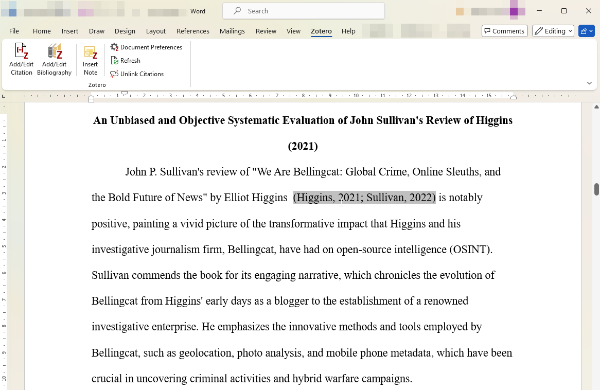

# Zotero

## URL

[https://www.zotero.org](https://www.zotero.org)

Current version: Zotero **7.0.29** (2025‑10‑28) **(Oct. 31, 2025)**

## Description

Zotero is a free, open‑source reference manager for **Windows, macOS, Linux, iOS, and Android** that helps you collect, organize, annotate, cite, and share research materials. A desktop app works with browser “Connectors” (Chrome, Firefox, Edge, Safari) to save sources and snapshots; a built‑in reader supports **PDF/EPUB/HTML** annotation with notes that can be cited into Word, LibreOffice, and Google Docs. Libraries sync across devices via a Zotero account; attachments can sync via Zotero Storage or **WebDAV**. Group libraries support collaborative OSINT workflows and shared source curation.


**These examples assume you have created a free account and installed Zotero, as well as the browser plugin, on your system.**


### Phase A - Research

* **Collecting Items**
  * When you visit a web page with recognized bibliographic information (e.g., a journal article), Zotero displays an icon (paper, folder, or book) in your browser’s toolbar. Clicking it **captures** metadata and (if available) a full-text PDF automatically.
  * Supports collecting a wide range of sources, including academic papers, newspaper articles, websites, YouTube videos, and code repositories.
* **Organizing Your Research**
  * Add **tags** or create **collections** to group related items (e.g., by project or topic).
  * Bulk-edit metadata or manually correct fields if Zotero’s automatic capture is incomplete.

<figure><figcaption>
Search results at scholar.google.nl using the search term "Bellingcat"
</figcaption></figure>

This is a review article of Elltio Higgins' book. We click on it.

<figure><figcaption></figcaption></figure>

We want to save the review for later referencing. If someone asks for our opinion about the book, we now have evidence to back it up. (The review says it's good.)

### Phase B - Archiving

* **Snapshots & Attachments**
  * **Snapshots** – Save a local **HTML snapshot** of any webpage (static copy of source & assets)
  * **Attachments** – Drag‑and‑drop or auto‑download PDFs, images, and other files.
* **Adding Full-Text PDFs**
  * Zotero can auto-download PDFs if it detects open-access links. Otherwise, you can attach PDFs manually.
  * Annotations can be made directly on the PDF within Zotero’s built-in reader (available in Zotero 7+).

<figure><figcaption>
My browser during the search results.
</figcaption></figure>

<figure><figcaption>
My browser on the page containing the review.
</figcaption></figure>

Sleuths among you may have noticed that one icon in particular has undergone a change. The Zotero icon has been changed from a folder to a paper. This means that Zotero has identified this as, you guessed it, a paper.

<figure><figcaption>
Upon clicking the 'paper' icon, this box appears, indicating that the paper was sucessfully retrieved and archived.
</figcaption></figure>

When you click the icon, you'll see identified metadata, and you can select a folder to archive your paper in. You'll also notice that a full-text PDF is available and has been conveniently attached to your entry.

<figure><figcaption>
A screenshot of my Zotero window where you can find the review we just archived for future reference.
</figcaption></figure>

Huzzah! Prolific researchers like us can't write about a review of the book without reading the book, though, can we? DEFINITELY good that we installed the browser plugin. It's totally possible to fill out these fields by hand.

### **Phase C - Capturing Book or Review Metadata**

* Zotero recognizes many publisher pages and library catalogs (Google Books, Amazon, etc.).
* Fields such as Author, Title, Publication Date, and Publisher are automatically populated.
* For OSINT, this can extend to recognized metadata from news sites, specialized databases, or blog platforms.

<figure><figcaption></figcaption></figure>

Oh, it was right there? Wait, but these lead to Google Books...

<figure><figcaption></figcaption></figure>

Noticed something? Correct, Zotero knows we're looking at a page that contains book metadata.

<figure><figcaption></figcaption></figure>

And, obviously, we also grabbed the other one. Notice the Item Type change?

### Phase D - Citing

* Use “**Create Bibliography from Item**” to quickly generate citations or reference lists in styles like APA, MLA, Harvard, etc.
* Install Zotero’s **Word Processor Plugin** (for Word, LibreOffice, or Google Docs) to insert citations as you write.
* Multiple items can be selected to create a unified bibliography in one go.

**In-Text Citations and Bibliographies**\
OK, we're now at the point where we're starting to build an archive of books like Higgins (2021) or...

Higgins, E. (2021). _We Are Bellingcat: Global Crime, Online Sleuths, and the Bold Future of News_. Bloomsbury Publishing USA.

How to cite neatly and without effort? "Create Bibliography from Item" is one way.

<figure><figcaption></figcaption></figure>

<figure><figcaption></figcaption></figure>

Depending on your field, preference, or journal, you pick a Citation Style. The above will create an in-text citation like (Higgins, 2021).

<figure><figcaption></figcaption></figure>

While this creates, you guessed it:

\
Sullivan, J. P. (2022). \[Review of _Review of We Are Bellingcat: Global Crime, Online Sleuths, and the Bold Future of News_, by E. Higgins]. _Journal of Strategic Security_, _15_(3), 138–141.

Now, you're ready to write your paper. A Word plugin exists:\\

<figure><figcaption></figcaption></figure>

### Examples 2 ... n

**Also works on news articles.**

<figure><figcaption></figcaption></figure>

Mind, though, that if you want an excellent screen capture to accompany your reference, you'll need to scroll down after clicking the icon or wait a couple of seconds, depending on whether or not the content is dynamically generated. Just wait or scroll until the "Snapshot" is not greyed out anymore.

<figure><figcaption></figcaption></figure>

<figure><figcaption></figcaption></figure>

Oh, and if you select multiple entries, the bibliography will also contain multiple references:

\
&#xNAN;_&#x42;ellingcat-Analyst Nick Waters: Kriegsverbrechen in der Ukraine: „Unsere Beweise müssen vor Gericht halten“_. (2024, March 22). [https://www.kleinezeitung.at/politik/aussenpolitik/18296327/kriegsverbrechen-in-der-ukraine-unsere-beweise-muessen-vor-gericht](https://www.kleinezeitung.at/politik/aussenpolitik/18296327/kriegsverbrechen-in-der-ukraine-unsere-beweise-muessen-vor-gericht)

_Gefälschter BBC-Bericht: Bellingcat berichtete nicht über Waffenschmuggel der Ukraine an Hamas_. (n.d.). Retrieved August 2, 2024, from [https://correctiv.org/faktencheck/2023/10/23/ukraine-hamas-gefaelschter-bbc-bericht-bellingcat-bestaetigte-keinen-waffenschmuggel/](https://correctiv.org/faktencheck/2023/10/23/ukraine-hamas-gefaelschter-bbc-bericht-bellingcat-bestaetigte-keinen-waffenschmuggel/)

Here, you also see that it sometimes doesn't work correctly. You can easily go back to the software and make manual changes.

<figure><figcaption></figcaption></figure>

Knes, D. (2024, March 22). _Bellingcat-Analyst Nick Waters: Kriegsverbrechen in der Ukraine: „Unsere Beweise müssen vor Gericht halten“_. [https://www.kleinezeitung.at/politik/aussenpolitik/18296327/kriegsverbrechen-in-der-ukraine-unsere-beweise-muessen-vor-gericht](https://www.kleinezeitung.at/politik/aussenpolitik/18296327/kriegsverbrechen-in-der-ukraine-unsere-beweise-muessen-vor-gericht)

Max, B. (2023, October 23). _Gefälschter BBC-Bericht: Bellingcat berichtete nicht über Waffenschmuggel der Ukraine an Hamas_. [https://correctiv.org/faktencheck/2023/10/23/ukraine-hamas-gefaelschter-bbc-bericht-bellingcat-bestaetigte-keinen-waffenschmuggel/](https://correctiv.org/faktencheck/2023/10/23/ukraine-hamas-gefaelschter-bbc-bericht-bellingcat-bestaetigte-keinen-waffenschmuggel/)

### **It also works on Videos.**

<figure><figcaption></figcaption></figure>

Bellingcat. (2024, February 9). _Command Line Fundamentals: Bellingcat Tech Series_ \[Video recording]. [https://www.youtube.com/watch?v=B3gm-ud91v0](https://www.youtube.com/watch?v=B3gm-ud91v0)

**Find out what else it can archive!**

### Zotero as an archive tool & the Berkeley Protocol

Proper documentation is essential if the material is used in legal, academic, or policy advocacy contexts. [The Berkeley Protocol ](https://www.ohchr.org/sites/default/files/2024-01/OHCHR_BerkeleyProtocol.pdf)outlines how OSINT data should be handled to be admissible in court (at least in the context of international proceedings).

* **Berkeley Protocol Alignment**: Properly stored OSINT data improves evidentiary value in legal and policy contexts. Zotero’s ability to capture full snapshots, along with timestamps, aids transparency and reproducibility.
* **Local & Cloud Sync** – Data stays local unless you enable sync. When you do, traffic is encrypted in transi,t and files in new accounts are **AES‑256 encrypted at rest on Zotero’s AWS servers** (not end‑to‑end)
* **Limitations**:
  1. No native encryption of local files.
  2. No automatic hashing of archived material.
  3. No password protection built in to the Zotero desktop app.

#### Recommended Best Practices

* **Hashing**: Immediately calculate cryptographic hashes (e.g., SHA-256) of downloaded files and store them as part of each Zotero entry’s notes or attachments. This helps verify data integrity if later questioned.
* **Encrypted Backups**: Periodically back up your Zotero library to an encrypted disk or location.
* **Export Regularly**: Keep dated exports (e.g., JSON or Zotero RDF) that can be re-imported elsewhere if needed.

## Cost

* [x] Free
* [ ] Partially Free
* [ ] Paid

Free core software with **300 MB** of free cloud attachment storage. Paid tiers: **2 GB $20/year**, **6 GB $60/year**, **Unlimited $120/year**; group libraries draw from the owner’s storage; institutional/lab plans available.

## Level of difficulty

<table><thead><tr><th data-type="rating" data-max="5"></th></tr></thead><tbody><tr><td>2</td></tr></tbody></table>

GUI‑first and beginner‑friendly. Most users only install the desktop app and a browser connector; citing requires a supported word processor. Optional features (custom translators, API use, WebDAV) benefit from intermediate technical comfort.

## Requirements

* Account creation (optional; for cloud storage and syncing)
* Browser plugin for web capture (optional but strongly recommended by the author)

### Strengths & Limitations

#### Strengths

* **Versatility**: Suited for both academic citations and OSINT archiving.
* **Automation**: Automatically captures metadata, attaches PDFs, and organizes items for quick retrieval.
* **Citation Management**: Word processor integration simplifies referencing in papers or reports.
* **Open Source & Free**: Broad community support, frequent updates, and no subscription fee.

#### Limitations

* **No Local Encryption**: Data stored locally on your device is **not** encrypted by default.
* **No Native Hashing**: Zotero doesn’t generate or manage hashes for file integrity.
* **Manual Cleanup**: Some websites’ metadata extraction can be incomplete or inaccurate, requiring manual edits.
* **Sync Privacy**: Relying on Zotero’s servers for sync, while encrypted, may not suffice for highly sensitive investigations.

### Additional Tips

* **Waiting for Snapshot**: If saving a dynamically generated page, wait until Zotero’s connector icon indicates that a full snapshot is available. Scrolling or a short pause may be necessary.
* **Group Libraries**: Collaborate with team members by creating a shared project library.
* **Custom Citation Styles**: Install or modify CSL (Citation Style Language) files for specialized formatting.

## Ethical Considerations

Ensure proper citation of sources to avoid plagiarism. Be cautious with sensitive data and respect copyright laws when sharing materials.

## Guide

* **Quick Start Guide** (official). [zotero.org](https://www.zotero.org/support/quick_start_guide?utm_source=chatgpt.com)
* **System requirements & plugin support** (official). [zotero.org](https://www.zotero.org/support/system_requirements)
* **Connectors: how saving works** (official doc). [zotero.org](https://www.zotero.org/support/connector?utm_source=chatgpt.com)
* **Zotero 7 release overview** (official blog). [zotero.org](https://www.zotero.org/blog/zotero-7/?utm_source=chatgpt.com)
* **Zotero for Android** announcement (official blog, 2025‑06‑05). [zotero.org](https://www.zotero.org/blog/zotero-for-android/?utm_source=chatgpt.com)

Quinn, T. (2024). _Research Guides: Zotero: A Beginner’s Guide: About Zotero_. [https://libguides.unm.edu/Zotero/About](https://libguides.unm.edu/Zotero/About)

## Tool provider

**Developer/Org:**[ Digital Scholar](https://digitalscholar.org/) (formerly [Corporation for Digital Scholarship](https://digitalscholar.org/)), Vienna, Virginia-based nonprofit technology organization that is committed to the development of open-source software for cultural heritage institutions and researchers.

**License:** **AGPL‑3.0** — see license text in the Zotero repository; Zotero site states source is AGPLv3

## Advertising Trackers

* [ ] This tool has not been checked for advertising trackers yet.
* [x] This tool uses tracking cookies. Use with caution.
* [ ] This tool does not appear to use tracking cookies.

Zotero uses cookies primarily to facilitate core functionality, such as user authentication (e.g., via reCAPTCHA when creating an account) and server-side logging to ensure service stability, security, and to diagnose technical issues. If you opt to sync your library with the Zotero servers, additional data (including IP addresses and usage logs) may be gathered for account management and fraud prevention. Zotero stores these logs for up to 90 days, after which they are anonymized or deleted. While cookies are employed to maintain certain features, like checking for translator updates or managing payment services via Stripe or PayPal. Zotero’s privacy policy emphasizes that it does not monetize user information, and you can minimize sharing by disabling or restricting syncing and update checks in the application’s preferences.

| Page maintainer |
| --------------- |
| Martin Sona     |
|                 |
